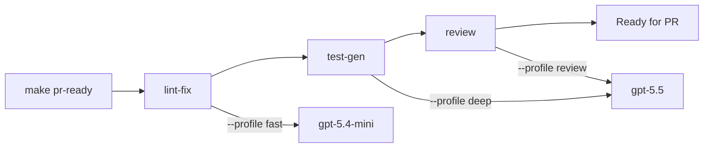

# Makefile-Driven Codex CLI: Wrapping Agent Tasks in Reproducible Build Targets


---

Every senior developer has a muscle-memory repertoire of `codex exec` invocations: review this diff, fix that lint, generate those tests. The invocations grow flags — `--profile ci`, `--sandbox workspace-write`, `--output-schema ./schemas/review.json` — and eventually become too long to type reliably. The solution is older than most of us: wrap them in Make targets.

This article maps the practical patterns for embedding Codex CLI into Makefiles (and their modern equivalents — Taskfile, Just, and Mise) so that agent-assisted tasks become reproducible, shareable, and CI-ready.

## Why Make?

Makefiles solve three problems that shell aliases and ad-hoc scripts do not:

1. **Dependency graphs.** A `make pr-ready` target can depend on `lint-fix`, `test-gen`, and `review`, running them in the correct order.
2. **Idempotency.** File-based targets skip work that has already been done.
3. **Portability.** Every Unix-like CI runner has `make` installed. No runtime to bootstrap, no package to install beyond Codex CLI itself.

The `codex exec` subcommand is purpose-built for non-interactive automation: it streams progress to stderr, prints the final agent message to stdout, and exits non-zero on failure [^1]. That makes it a first-class citizen in any Makefile recipe.

## Foundational Patterns

### Pattern 1: The Review Target

```makefile
.PHONY: review
review:
	@echo "--- Agent Review ---"
	git diff --cached | codex exec \
		--profile review \
		--sandbox workspace-write \
		"Review this staged diff. Flag P0 and P1 issues only."
```

This pipes the staged diff into `codex exec` as stdin context [^2]. The `--profile review` flag loads a dedicated profile from `~/.codex/review.config.toml` (or a `[profiles.review]` section in your main config) with tuned model and reasoning effort settings [^3].

### Pattern 2: Lint Fix with Structured Output

```makefile
LINT_SCHEMA := .codex/schemas/lint-fix.json

.PHONY: lint-fix
lint-fix:
	npm run lint 2>&1 | codex exec \
		--profile fast \
		--sandbox workspace-write \
		--output-schema $(LINT_SCHEMA) \
		-o .codex/reports/lint-fix.json \
		"Fix every lint error in the piped output. Return a JSON report."
```

The `--output-schema` flag enforces that the agent's response conforms to a JSON Schema [^4], giving downstream tooling a parseable contract. The `-o` flag writes the final message to a file rather than stdout [^1].

### Pattern 3: Test Generation with Dependency

```makefile
.PHONY: test-gen
test-gen: lint-fix
	codex exec \
		--profile deep \
		--sandbox workspace-write \
		"Write unit tests for any untested public functions in src/. \
		 Use the existing test conventions. Run the tests to confirm they pass."
```

Here `test-gen` depends on `lint-fix`, ensuring a clean codebase before the agent generates tests. The `deep` profile might specify `model = "gpt-5.5"` with `model_reasoning_effort = "high"` for thorough coverage [^3].

## Profile Configuration for Make Targets

Each Make target maps naturally to a Codex CLI profile. A typical team configuration:

```toml
# ~/.codex/config.toml

[profiles.fast]
model = "gpt-5.4-mini"
model_reasoning_effort = "low"

[profiles.review]
model = "gpt-5.5"
model_reasoning_effort = "medium"
approval_policy = "on-failure"

[profiles.deep]
model = "gpt-5.5"
model_reasoning_effort = "high"

[profiles.ci]
model = "gpt-5.4-mini"
model_reasoning_effort = "low"
sandbox_mode = "read-only"
```

Invoke any profile with `codex -p <name>` or `codex --profile <name>` [^3]. The profile merges with your base configuration, with profile settings taking precedence [^5].

## The Composite Target: `make pr-ready`

Combine individual targets into a single pre-PR checklist:

```makefile
.PHONY: pr-ready
pr-ready: lint-fix test-gen review
	@echo "All checks passed. Ready for PR."
```



Running `make pr-ready` chains all three targets in dependency order. Each target uses a different profile optimised for its task — fast models for mechanical lint fixes, deep models for test generation and review.

## Handling Exit Codes and Failures

`codex exec` returns meaningful exit codes: zero on success, non-zero on failure [^1]. Make's default behaviour is to abort on non-zero exit, which is exactly what you want for a quality gate. If you need to capture failures without aborting:

```makefile
.PHONY: review-report
review-report:
	-git diff HEAD~1 | codex exec \
		--profile review \
		--json \
		-o .codex/reports/review.jsonl \
		"Review this diff" 2>.codex/reports/review.log
	@echo "Review complete. Report at .codex/reports/review.jsonl"
```

The `-` prefix tells Make to continue even if the command fails. The `--json` flag emits a JSONL event stream capturing every agent event [^1].

## Environment Variables and CI Integration

For CI runners, set `CODEX_API_KEY` as a secret and use the `--ignore-user-config` flag to prevent local configuration from leaking into the build:

```makefile
.PHONY: ci-review
ci-review:
	codex exec \
		--profile ci \
		--ignore-user-config \
		--skip-git-repo-check \
		--ephemeral \
		"Review the diff in GITHUB_EVENT_PATH and post findings as PR comments."
```

The `--ephemeral` flag prevents session files from persisting to disc [^1], keeping CI runners clean. The `--skip-git-repo-check` flag overrides the Git repository requirement for environments where the working directory may not be a full clone [^1].

## Beyond Make: Taskfile and Just

If your team prefers a more modern task runner, the patterns translate directly.

**Taskfile (task):**

```yaml
# Taskfile.yml
version: '3'

tasks:
  review:
    cmds:
      - git diff --cached | codex exec --profile review
        "Review this staged diff. Flag P0 and P1 issues only."

  lint-fix:
    cmds:
      - npm run lint 2>&1 | codex exec --profile fast
        --sandbox workspace-write "Fix every lint error."

  pr-ready:
    deps: [lint-fix]
    cmds:
      - task: review
```

**Just (justfile):**

```just
# justfile

review:
    git diff --cached | codex exec --profile review \
        "Review this staged diff. Flag P0 and P1 issues only."

lint-fix:
    npm run lint 2>&1 | codex exec --profile fast \
        --sandbox workspace-write "Fix every lint error."

pr-ready: lint-fix review
```

The core principle remains: each target wraps a single `codex exec` invocation with a fixed profile, sandbox mode, and instruction.

## Schema Files as Build Artefacts

Store your `--output-schema` JSON Schema files alongside your Makefile:

```
.codex/
  schemas/
    lint-fix.json
    review.json
    test-report.json
  reports/
    lint-fix.json
    review.jsonl
Makefile
```

Check schemas into version control; add `.codex/reports/` to `.gitignore`. This gives your team a versioned contract for every agent task, making output predictable across machines and CI runs [^4].

## Token Cost Awareness

Each Make target consumes tokens. Add a cost-estimation target that uses the `ci` profile to preview token usage before running expensive operations:

```makefile
.PHONY: estimate
estimate:
	@echo "Estimating token cost for pr-ready..."
	codex exec --profile ci --json --ephemeral \
		"Estimate the token cost of reviewing, linting, and testing this repo." \
		2>/dev/null | jq -r '.usage // empty'
```

For teams on API billing, output tokens cost 6-10x more than input tokens [^6]. Profile selection matters: a `fast` profile with `gpt-5.4-mini` at low reasoning effort can be an order of magnitude cheaper than a `deep` profile with `gpt-5.5` at high effort [^7].

## Anti-Patterns to Avoid

1. **Monolithic targets.** A single `make codex` that does everything defeats the purpose. Keep targets atomic — one agent task per target.
2. **Missing `--sandbox`.** Omitting the sandbox flag defaults to read-only mode [^1], which silently prevents the agent from applying fixes. Always specify `workspace-write` for targets that modify files.
3. **Hardcoded models.** Use profiles rather than `--model` flags in Makefile recipes. When models are deprecated — and they are, regularly [^8] — you update one profile file rather than every Makefile in every repository.
4. **Ignoring exit codes.** If `codex exec` returns non-zero and your Makefile swallows it with `-`, you lose the quality gate. Reserve `-` for reporting targets, never for enforcement targets.

## Conclusion

Makefiles and task runners turn ad-hoc Codex CLI invocations into a reproducible, dependency-aware, CI-portable workflow. The pattern is straightforward: one target per agent task, one profile per target, structured output schemas for machine-readable results. The investment is small — a handful of Make targets and a few TOML profile sections — and the return is an agent workflow that any team member can run with a single command.

---

## Citations

[^1]: OpenAI, "Non-interactive mode — Codex CLI," OpenAI Developers, 2026. [https://developers.openai.com/codex/noninteractive](https://developers.openai.com/codex/noninteractive)

[^2]: OpenAI, "Codex CLI as a Unix Citizen: Prompt-Plus-Stdin, Shell Pipelines, and Composable Agent Workflows," OpenAI Developers, 2026. [https://developers.openai.com/codex/noninteractive](https://developers.openai.com/codex/noninteractive)

[^3]: OpenAI, "Config basics — Codex CLI," OpenAI Developers, 2026. [https://developers.openai.com/codex/config-basic](https://developers.openai.com/codex/config-basic)

[^4]: OpenAI, "Command line options — Codex CLI," OpenAI Developers, 2026. [https://developers.openai.com/codex/cli/reference](https://developers.openai.com/codex/cli/reference)

[^5]: OpenAI, "Advanced Configuration — Codex CLI," OpenAI Developers, 2026. [https://developers.openai.com/codex/config-advanced](https://developers.openai.com/codex/config-advanced)

[^6]: OpenAI, "Pricing," OpenAI, 2026. [https://openai.com/api/pricing/](https://openai.com/api/pricing/)

[^7]: D. Vaughan, "Codex CLI After the Pro Boost: Rate Limit Reality, Token Economics, and Cost Optimisation for June 2026," Codex Knowledge Base, 2 June 2026. [https://codex.danielvaughan.com/2026/06/02/codex-cli-post-promotion-rate-limits-token-economics-cost-optimisation-june-2026/](https://codex.danielvaughan.com/2026/06/02/codex-cli-post-promotion-rate-limits-token-economics-cost-optimisation-june-2026/)

[^8]: D. Vaughan, "Codex Model Sunset June-July 2026: Deprecation Timeline, Migration Paths, and Config Recipes," Codex Knowledge Base, 2 June 2026. [https://codex.danielvaughan.com/2026/06/02/codex-model-sunset-june-july-2026-deprecation-timeline-migration-paths-config-recipes/](https://codex.danielvaughan.com/2026/06/02/codex-model-sunset-june-july-2026-deprecation-timeline-migration-paths-config-recipes/)
