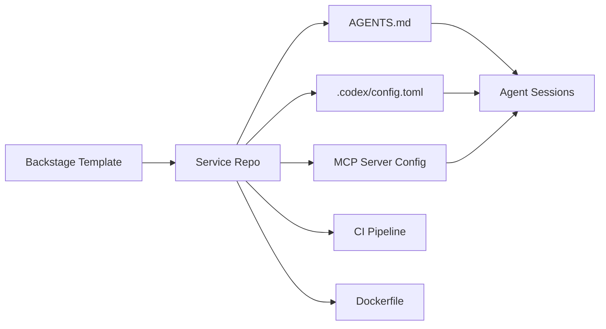
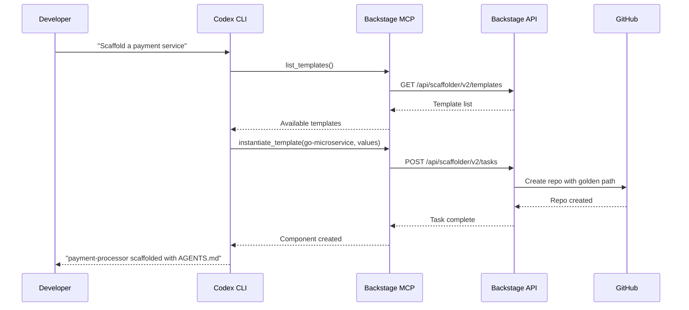
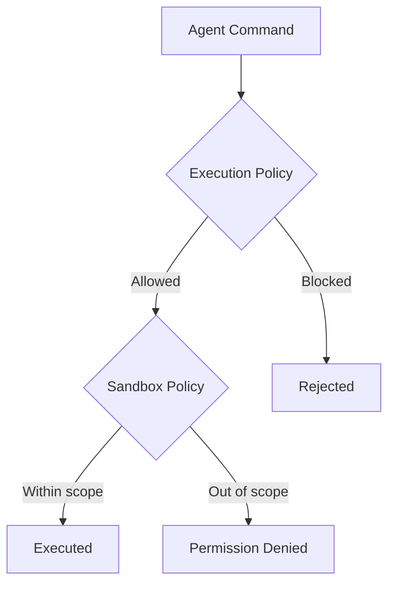

# Codex CLI for Platform Engineering Teams: Golden Paths, Internal Developer Platforms, and Agent-Ready Templates


---

Platform engineering has spent the last three years building self-service golden paths for human developers. Now those paths need to accommodate a second class of consumer: autonomous coding agents. This article maps the intersection of Internal Developer Platforms (IDPs) — Backstage, Port, Humanitec — with Codex CLI's configuration surface, showing how platform teams can build golden paths that include agent configuration from day one.

## Why Platform Engineering Matters for Agents

Tyson Singer from Spotify put it plainly at KubeCon EU 2026: "Agents amplify what's good in your ecosystem and they amplify what's bad" [^1]. A well-structured IDP gives agents the structured information they need — service ownership, API contracts, deployment targets, security policies. A poorly structured one produces agents that hallucinate infrastructure and ignore organisational standards.

Chris Aniszczyk, CNCF CTO, reinforced this at the same event: "Agents need to feed off generally structured information" [^1]. The catalogues, templates, and scorecards that platform teams already maintain are precisely the structured information coding agents require. The challenge is exposing it through the right interfaces.

Spotify's own AI Knowledge Assistant, built on Backstage's structured catalogue data, reduced developer "goalie workload" by approximately 47% [^1]. That figure demonstrates what happens when agents can query a well-maintained platform rather than guessing from scattered documentation.

## The Golden Path Problem

A golden path is a pre-paved, opinionated route through your platform: `scaffold service → configure CI → provision database → deploy to staging`. Backstage implements these as Software Templates powered by its internal Scaffolder engine [^2]. Humanitec achieves similar outcomes through Score workload specifications and its Platform Orchestrator [^3].

The problem: traditional golden paths produce a repository with a `Dockerfile`, a CI pipeline, and perhaps a Helm chart. They do not produce an `AGENTS.md`, a `.codex/config.toml`, or an MCP server registration. The new service is immediately ready for human developers but invisible to coding agents.

### What an Agent-Ready Golden Path Adds

An agent-ready golden path extends the scaffold with three additional artefacts:



1. **`AGENTS.md`** — project-level instructions scoped to this service's stack, conventions, and constraints
2. **`.codex/config.toml`** — profile-based configuration with sandbox policies, model selection, and MCP server registrations
3. **MCP server references** — connections to platform services (catalogue queries, secret vaults, deployment triggers)

## AGENTS.md as a Platform Primitive

Codex CLI builds its instruction chain by concatenating `AGENTS.md` files from `~/.codex/` (global) through every directory from git root to the current working directory [^4]. The chain is capped at 32 KiB by default, configurable via `project_doc_max_bytes` [^4]. This hierarchy maps naturally to platform engineering's layered governance model:

| Level | File | Content |
|-------|------|---------|
| Organisation | `~/.codex/AGENTS.md` | Cross-cutting policies: commit conventions, security baselines, approved languages |
| Repository root | `AGENTS.md` | Service-specific: stack, testing strategy, deployment targets |
| Sub-package | `packages/api/AGENTS.md` | Module-specific: API design rules, schema conventions |
| Developer override | `.codex/AGENTS.override.md` | Personal preferences (gitignored) |

At every level, `AGENTS.override.md` takes precedence over `AGENTS.md`, enabling team standards in version control with personal escape hatches outside it [^4].

### Platform-Managed AGENTS.md Template

A platform team's Backstage template should generate a root `AGENTS.md` that encodes the golden path's conventions. Here is a minimal template for a Go microservice:


```markdown
# Service: {{ serviceName }}
Owner: {{ teamName }}

## Stack
- Go 1.24, Chi router, sqlc for database access
- PostgreSQL via platform-managed RDS
- Deployed to EKS via Humanitec Score

## Conventions
- All HTTP handlers in `internal/handler/`
- Database migrations in `migrations/` using goose
- Tests: `go test ./...` must pass before any commit
- No direct AWS SDK calls — use platform abstractions in `pkg/platform/`

## Security
- No secrets in code — use `CODEX_SANDBOX_NETWORK_DISABLED=true` for offline runs
- Sandbox policy: `workspace-write` minimum; `danger-full-access` requires team lead approval
- All dependencies must be in the approved list at `go.sum`

## Deployment
- PR merges trigger deployment to staging via Score
- Production requires manual approval in Humanitec
```


This file costs roughly 700 bytes — well within budget even in a deep monorepo hierarchy [^4].

## Configuring Codex CLI Profiles for Platform Tiers

Codex CLI's profile system layers additional configuration files using `-p/--profile NAME`, loading `$CODEX_HOME/NAME.config.toml` on top of base settings [^5]. Platform teams can distribute standard profiles alongside their golden path templates.

### Example: Three Platform Profiles

```toml
# ~/.codex/platform-standard.config.toml
# Standard platform profile — safe defaults for all services
model = "o3"
model_reasoning_effort = "medium"
approval_policy = "unless-allow-listed"

[sandbox]
policy = "workspace-write"

[mcp_servers.backstage]
command = "npx"
args = ["@backstage/mcp-server", "--base-url", "https://backstage.internal.company.com"]

[mcp_servers.vault]
command = "vault-mcp-server"
args = ["--addr", "https://vault.internal.company.com"]
```

```toml
# ~/.codex/platform-ci.config.toml
# CI profile — headless, no approval prompts, strict sandbox
model = "o4-mini"
model_reasoning_effort = "low"
approval_policy = "full-auto"

[sandbox]
policy = "read-only"
```

```toml
# ~/.codex/platform-deep.config.toml
# Deep analysis profile — complex refactoring, architecture review
model = "o3"
model_reasoning_effort = "high"
approval_policy = "on-failure"
```

Developers invoke these with:

```bash
codex -p platform-standard "Add pagination to the /users endpoint"
codex -p platform-ci "Run the full test suite and fix failures"
codex -p platform-deep "Review this service for N+1 query patterns"
```

Platform teams distribute these profiles through their MDM tooling, Backstage scaffolder, or a simple `codex-profiles` package in their internal registry.

## Backstage as an MCP Server for Codex CLI

Backstage 1.43 introduced experimental MCP support through `@backstage/plugin-mcp-actions-backend`, exposing Scaffolder actions as MCP tools [^6]. A Quarkus-based Backstage MCP server exposes two primary tools: `list_templates` (fetches available software templates) and `instantiate_template` (creates components from templates using a values configuration) [^7].

This means Codex CLI can query your platform catalogue and scaffold new services without leaving the terminal:

```bash
# Register Backstage as an MCP server
codex mcp add backstage -- npx @backstage/mcp-server \
  --base-url https://backstage.internal.company.com

# Now Codex can discover and use platform templates
codex "List all available backend service templates from Backstage \
  and create a new Go service called payment-processor using \
  the go-microservice-template"
```



## Humanitec Score and Agent-Driven Deployments

Humanitec's Score specification describes workloads in a platform-agnostic format [^3]. The `score.yaml` captures runtime requirements independently of the target environment, and the Platform Orchestrator handles the translation to Kubernetes manifests, Terraform, or whatever the platform provides [^3].

For Codex CLI, this creates a clean interface: the agent writes or modifies `score.yaml`, and the platform handles everything downstream. An `AGENTS.md` section for Score-based services might include:

```markdown
## Deployment
- Workload defined in `score.yaml` — modify this file for resource changes
- Never write Kubernetes YAML directly — the Platform Orchestrator generates it
- To add a dependency: add it to the `resources` section of `score.yaml`
- Environment-specific config lives in Humanitec, not in this repo
```

## Execution Policies for Platform Governance

Codex CLI v0.139.0 includes `codex execpolicy`, which validates shell commands against rule files before execution [^5]. Platform teams can distribute execution policies that enforce organisational standards:

```bash
# Validate commands against platform policy before execution
codex execpolicy validate --rules /etc/codex/platform-policy.yaml
```

Combined with sandbox policies (`read-only`, `workspace-write`, `danger-full-access`) [^5], this gives platform teams two layers of governance:

1. **Sandbox level** — what the agent *can* do (file system access, network access)
2. **Execution policy** — what the agent *should* do (approved commands, forbidden operations)



## Building the Agent-Ready Template Catalogue

Bringing these pieces together, a platform team's implementation checklist:

1. **Audit existing golden paths** — identify which Backstage templates lack `AGENTS.md` and `.codex/config.toml`
2. **Create a base `AGENTS.md` template** — parameterised by stack, team, and service tier
3. **Distribute standard profiles** — `platform-standard`, `platform-ci`, `platform-deep` via your MDM or package registry
4. **Register platform MCP servers** — Backstage catalogue, secret vault, deployment triggers
5. **Define execution policies** — encode your "thou shalt not" rules as policy files
6. **Add agent readiness to your scorecard** — Backstage TechDocs scorecards can track whether services have valid `AGENTS.md` files, just as they track test coverage or documentation completeness

## What This Looks Like in Practice

At Roadie, 80% of support requests and on-call alerts are now resolved by their agent system without engineer intervention [^8]. That figure is only achievable because their IDP provides agents with structured service ownership data, runbook references, and deployment controls. Without the platform layer, agents would be guessing.

The pattern is clear: platform engineering is no longer optional infrastructure for teams adopting coding agents. It is the foundation that determines whether agents amplify your engineering standards or amplify your technical debt.

## Citations

[^1]: SiliconANGLE, "Platform engineering is essential in the age of AI agents", KubeCon EU 2026 coverage. [https://siliconangle.com/2026/03/25/platform-engineering-essential-age-ai-agents-kubeconeu/](https://siliconangle.com/2026/03/25/platform-engineering-essential-age-ai-agents-kubeconeu/)

[^2]: Backstage Documentation, "Software Templates". [https://backstage.io/docs/features/software-templates/](https://backstage.io/docs/features/software-templates/)

[^3]: Humanitec, "Score: Overview — open-source workload specification". [https://developer.humanitec.com/app-humanitec-io/docs/score/overview/](https://developer.humanitec.com/app-humanitec-io/docs/score/overview/)

[^4]: CodeGateway, "AGENTS.md for Codex CLI (2026): Lookup Order, Limits & Monorepo Templates". [https://www.codegateway.dev/en/blog/agents-md-playbook-2026](https://www.codegateway.dev/en/blog/agents-md-playbook-2026)

[^5]: OpenAI Developers, "Command line options — Codex CLI Reference". [https://developers.openai.com/codex/cli/reference](https://developers.openai.com/codex/cli/reference)

[^6]: Backstage, "@backstage/plugin-mcp-actions-backend". [https://backstage.io/api/next/modules/_backstage_plugin-mcp-actions-backend.html](https://backstage.io/api/next/modules/_backstage_plugin-mcp-actions-backend.html)

[^7]: SkyWork, "Unlocking Agentic Development with the Backstage MCP Server". [https://skywork.ai/skypage/en/unlocking-agentic-development-backstage-mcp-server/1981546918046658560](https://skywork.ai/skypage/en/unlocking-agentic-development-backstage-mcp-server/1981546918046658560)

[^8]: Roadie, "Platform Engineering in 2026: Why DIY Is Dead". [https://roadie.io/blog/platform-engineering-in-2026-why-diy-is-dead/](https://roadie.io/blog/platform-engineering-in-2026-why-diy-is-dead/)
