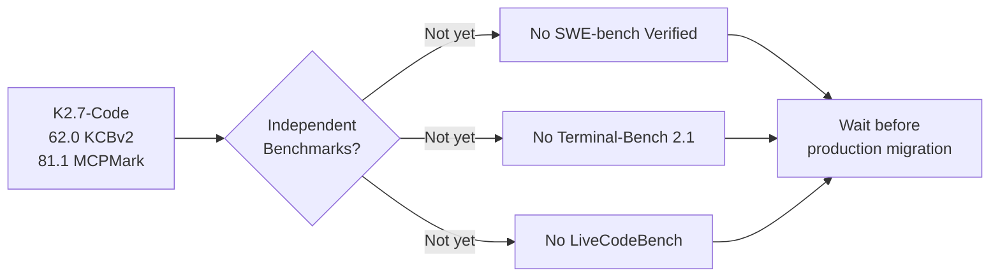
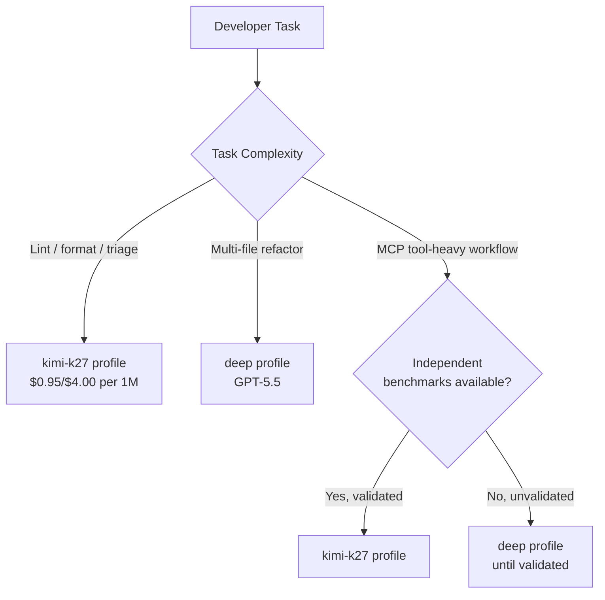

# Kimi K2.7-Code Arrives: What Moonshot's Open-Weight Coding Model Means for Codex CLI Multi-Model Routing


---

Moonshot AI open-sourced Kimi K2.7-Code on 12 June 2026, a one-trillion-parameter Mixture-of-Experts coding model with 32 billion active parameters per token and a 256K context window[^1][^2]. The headline claim — 81.1 per cent on MCPMark Verified, beating Claude Opus 4.8's 76.4 per cent — suggests a model purpose-built for agentic tool-use loops rather than single-shot completions[^2][^3]. At roughly one-quarter the per-token cost of frontier closed models, it looks like a compelling alternative for Codex CLI workflows that route through third-party providers[^4].

Before you rewrite your profiles, however, there is a significant caveat: every published benchmark is a Moonshot proprietary suite. No independent SWE-bench Verified, Terminal-Bench, or LiveCodeBench scores exist yet[^3][^5]. This article examines what K2.7-Code actually offers, how to route Codex CLI through it today, and where the benchmark gap should temper enthusiasm.

## Architecture at a Glance

K2.7-Code is the coding-specialised variant of Moonshot's K2.7 base model. It is not a general-purpose instruct model — there is no K2.7 Instruct variant at the time of writing[^3].

| Specification | Value |
|---|---|
| Total parameters | ~1 trillion |
| Active parameters per token | 32 billion |
| Expert count | 384 (8 selected + 1 shared per token) |
| Layers | 61 (1 dense) |
| Attention | Multi-head Latent Attention (MLA) |
| Context window | 256K tokens |
| Vocabulary | 160K tokens |
| Licence | Modified MIT |

The Modified MIT licence is notably permissive for a frontier-adjacent model, making it viable for regulated industries with data-residency mandates where neither OpenAI nor Anthropic APIs are acceptable[^2][^6].

## Benchmark Claims — and the Gap

Moonshot published percentage gains over K2.6 rather than absolute head-to-head comparisons with GPT-5.5 or Claude Fable 5:

| Moonshot Benchmark | K2.6 Score | K2.7-Code Score | Improvement |
|---|---|---|---|
| Kimi Code Bench v2 | 50.9 | 62.0 | +21.8% |
| Program Bench | 48.3 | 53.6 | +11.0% |
| MLS Bench Lite | 26.7 | 35.1 | +31.5% |
| MCP Atlas | 69.4 | 76.0 | +9.5% |
| MCPMark Verified | 72.8 | 81.1 | +11.4% |

For context, GPT-5.5 scores 69.0 on Kimi Code Bench v2 and Claude Opus 4.8 scores 67.4[^3]. K2.7-Code's 62.0 is below both — on Moonshot's own benchmark. The MCPMark Verified score is the standout, but it measures tool invocation correctness, not end-to-end task resolution[^3][^5].



The VentureBeat analysis noted that practitioners who tested K2.7-Code on real repositories reported that the proprietary benchmark gains did not reliably translate to their own codebases[^5]. The gap between vendor benchmarks and independent evaluation suites is a recurring pattern in the open-weight space — K2.6's strong SWE-bench Pro score of 58.6 per cent did not prevent uneven performance on certain language-specific tasks[^7].

## Pricing Comparison

K2.7-Code's cost advantage is genuine, particularly for cache-heavy agentic workflows where context carries across turns:

| Model | Input ($/1M tokens) | Output ($/1M tokens) | Cache Hit ($/1M tokens) |
|---|---|---|---|
| Kimi K2.7-Code | \$0.95 | \$4.00 | \$0.19 |
| GPT-5.5 | \$5.00 | \$30.00 | \$1.25 |
| Claude Opus 4.8 | \$5.00 | \$25.00 | \$1.25 |

The 30 per cent reduction in thinking tokens compared to K2.6 further compounds savings, since reasoning tokens bill at the output rate of \$4.00 per million[^3][^4]. A task that consumed 50K reasoning tokens on K2.6 would consume roughly 35K on K2.7-Code, saving \$0.06 per task at scale.

⚠️ GPT-5.5 pricing above reflects the standard API rate as of June 2026. Codex CLI users on Pro/Max subscriptions may see different effective rates through the credit-based billing system.

## Routing Codex CLI Through K2.7-Code

Codex CLI supports alternative model providers through the `OPENAI_BASE_URL` environment variable and profile-based configuration. Two practical routing paths exist today.

### Option 1: OpenRouter

K2.7-Code is listed on OpenRouter under `moonshotai/kimi-k2.7-code`[^4]. Configure a Codex CLI profile:

```toml
# ~/.codex/profiles/kimi-k27.toml
model = "moonshotai/kimi-k2.7-code"
```

Set the environment before launching:

```bash
export OPENAI_BASE_URL="https://openrouter.ai/api/v1"
export OPENAI_API_KEY="$YOUR_OPENROUTER_KEY"
codex --profile kimi-k27 "refactor the auth module"
```

⚠️ OpenRouter does not differentiate between tool-use-capable and tool-use-incapable models in its routing layer. Verify that your routing mode (Balanced, Nitro, or Exacto) routes to a provider serving the full K2.7-Code with tool-use enabled[^8].

### Option 2: Moonshot API Direct

Moonshot exposes an OpenAI-compatible endpoint, which Codex CLI can consume directly:

```bash
export OPENAI_BASE_URL="https://api.moonshot.ai/v1"
export OPENAI_API_KEY="$YOUR_MOONSHOT_KEY"
codex --model kimi-k2.7-code "add input validation to the REST handlers"
```

API keys are available at `platform.moonshot.ai`[^3].

### Profile-Based Switching

The practical pattern is to maintain multiple profiles and switch by task type:

```toml
# ~/.codex/profiles/fast.toml — cheap triage and linting
model = "moonshotai/kimi-k2.7-code"
model_reasoning_effort = "low"

# ~/.codex/profiles/deep.toml — complex refactoring
model = "gpt-5.5"
model_reasoning_effort = "high"

# ~/.codex/profiles/review.toml — code review with tool use
model = "moonshotai/kimi-k2.7-code"
model_reasoning_effort = "medium"
```



## Forced Thinking and Its Implications

K2.7-Code forces chain-of-thought reasoning on every request — `thinking` and `preserve_thinking` are permanently enabled and cannot be disabled[^3]. This has two consequences for Codex CLI users:

1. **Minimum latency floor.** Even trivial prompts incur reasoning-token overhead. For quick linting passes, this adds measurable latency compared to models that support `model_reasoning_effort = "low"` with genuine fast paths.

2. **Token budget interaction.** The `tool_output_token_limit` and `model_auto_compact_token_limit` configuration keys in Codex CLI interact with the reasoning token stream. If your compact limit is set aggressively low, the model may truncate its own reasoning mid-chain.

## Self-Hosting Realities

The open-weight licence makes self-hosting theoretically attractive for air-gapped or compliance-constrained environments, but the infrastructure requirements are substantial[^3]:

- **Disk footprint:** ~600 GB for full-precision weights; ~240 GB with aggressive quantisation
- **GPU memory:** Multiple A100 80 GB or H100 nodes for inference at reasonable throughput
- **No GGUF/Ollama support** at the time of writing — ruling out the casual local-model workflow that works for smaller models like Qwen 3 or Llama 4

For most teams, the Moonshot API or OpenRouter endpoint is the pragmatic choice. Self-hosting makes sense only if data-residency regulations prohibit any third-party API call.

## The Decision Framework

Before routing Codex CLI through K2.7-Code for anything beyond experimentation, apply this checklist:

1. **Wait for independent benchmarks.** No SWE-bench Verified, SWE-bench Pro, Terminal-Bench 2.1, or LiveCodeBench scores exist[^3][^5]. Until they do, Moonshot's claims are unverified against the industry-standard suites that matter for agent task completion.

2. **Run your own eval.** Clone a representative repository, define five realistic tasks, and compare K2.7-Code against your current model on completion rate, token cost, and wall-clock time. The VentureBeat reporting confirmed that practitioner results diverged from Moonshot's published gains[^5].

3. **Start with low-stakes profiles.** Use K2.7-Code for linting, formatting, test generation, and code review — tasks where a wrong answer is caught cheaply. Reserve GPT-5.5 or Codex-Spark for complex multi-file refactoring until independent validation arrives.

4. **Monitor the prefix-caching trade-off.** Codex CLI's native prefix caching works with OpenAI's API. When routing through OpenRouter or Moonshot's endpoint, verify whether cached-input pricing (\$0.19/1M) actually applies to your session pattern or whether cache misses dominate.

5. **Track the MCPMark advantage.** The 81.1 per cent MCPMark Verified score is genuinely notable for tool-use workflows[^2][^3]. If your Codex CLI setup relies heavily on MCP servers — database connectors, Terraform providers, Kubernetes operators — K2.7-Code's tool invocation accuracy may deliver real value even before SWE-bench numbers land.

## What This Means for the Multi-Model Landscape

K2.7-Code's release continues the pattern of open-weight models narrowing the gap with closed frontier models on specific capabilities. The MCPMark lead is particularly significant because Codex CLI's value proposition depends on reliable tool invocation through the Model Context Protocol. A model that excels at calling tools correctly but lags on single-shot code generation might still outperform a stronger generalist in heavily-instrumented agent workflows.

The practical takeaway: Codex CLI's profile system exists precisely for this moment. Add K2.7-Code as an experimental profile, instrument your costs, and let your own data — not vendor benchmarks — drive the routing decision.

---

## Citations

[^1]: Moonshot AI, "Kimi K2.7-Code release announcement," [kimi.com/code](https://kimi.com/code), 12 June 2026

[^2]: Digital Applied, "Kimi K2.7-Code: Moonshot's coding-first open-source release," [digitalapplied.com](https://www.digitalapplied.com/blog/kimi-k2-7-code-release-open-source-coding-model), June 2026

[^3]: CoderSera, "Kimi K2.7 Code: The Complete Guide — Benchmarks, Pricing & How to Use (2026)," [codersera.com](https://codersera.com/blog/kimi-k2-7-complete-guide-2026/), June 2026

[^4]: OpenRouter, "Kimi K2.7 Code — API Pricing & Providers," [openrouter.ai](https://openrouter.ai/moonshotai/kimi-k2.7-code), accessed 13 June 2026

[^5]: VentureBeat, "Kimi K2.7-Code cuts thinking tokens 30% — but practitioners say the benchmarks don't check out," [venturebeat.com](https://venturebeat.com/technology/kimi-k2-7-code-cuts-thinking-tokens-30-practitioners-say-benchmarks-dont-check-out), June 2026

[^6]: Lushbinary, "Kimi K2.7 Code vs Claude Fable 5 vs GPT-5.5," [lushbinary.com](https://lushbinary.com/blog/kimi-k2-7-code-vs-claude-fable-5-gpt-5-5-coding-comparison/), June 2026

[^7]: AIMadeTools, "Kimi K2.7 Code Complete Guide: 1T Coding Agent That Beats Opus on Tool Use," [aimadetools.com](https://www.aimadetools.com/blog/kimi-k2-7-code-complete-guide/), June 2026

[^8]: Maxim AI, "Best AI Gateway to Route Codex CLI to Any Model," [getmaxim.ai](https://www.getmaxim.ai/articles/best-ai-gateway-to-route-codex-cli-to-any-model/), 2026
