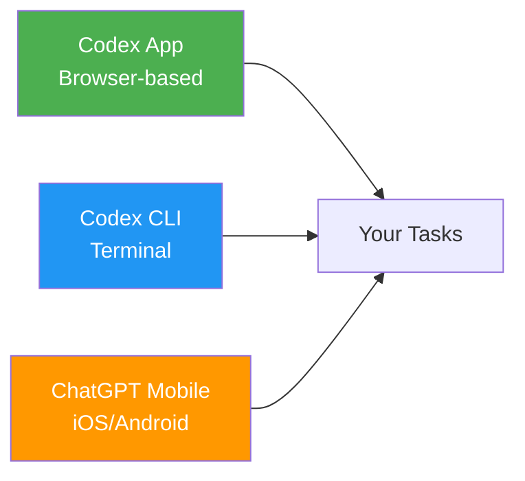
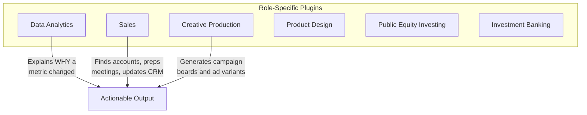
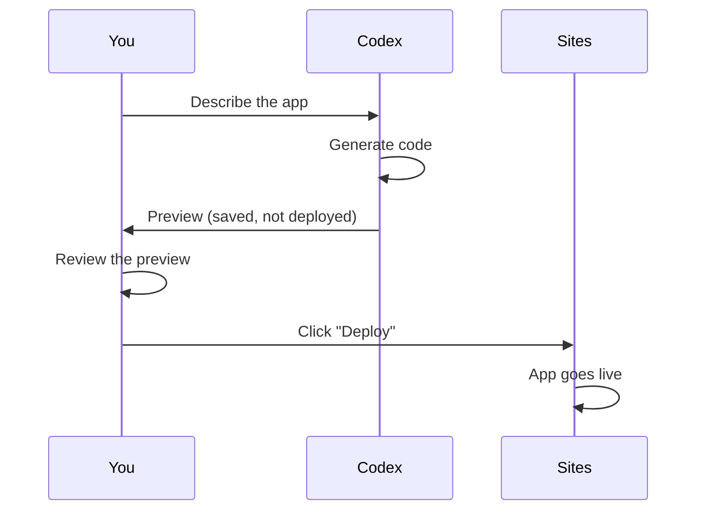

# The Non-Developer's First Week with Codex: A Process Owner's Onboarding Guide

---

Non-developers now account for roughly 20 per cent of Codex's more than five million weekly users—and that cohort is growing three times faster than the developer base [^1]. OpenAI's June 2026 launch of six role-specific plugins and Codex Sites made the platform explicitly accessible to analysts, marketers, sales professionals, designers, and investors [^2]. Yet most onboarding material still assumes you know what a shell command is.

This guide is for Karen in Finance, Raj in Operations, and Priya in Marketing—process owners who have been told "just use Codex" without anyone explaining what that means in practice. It maps the first five working days, from opening the app to publishing your first internal dashboard, with honest guidance on when to trust the agent and when to escalate.

## Day 1: Orientation—What Codex Actually Is

Codex is an AI agent that reads, writes, and executes code on your behalf. You describe what you want in natural language; Codex translates that into working software. The critical mental model: **you are the decision-maker, Codex is the executor**.

There are three surfaces you may encounter:

As a non-developer, you will almost certainly start with the **Codex app** (the browser interface). The CLI and mobile surfaces exist but assume terminal fluency [^3].

### Your First Task

Open the Codex app, select your workspace, and type a request in plain English. OpenAI's best-practices documentation recommends structuring every request with four ingredients [^4]:

1. **Goal** — What you want to change or build ("Create a dashboard showing Q2 sales by region")
2. **Context** — Which data, files, or systems matter ("Use the CSV export from Salesforce attached here")
3. **Constraints** — Standards or limitations ("Follow our brand colours; no external API calls")
4. **Done-when** — Success criteria ("I can filter by region and export to PDF")

> **Tip:** Use the speech dictation feature in the Codex app if typing technical-sounding requests feels unnatural [^4]. Codex interprets intent, not syntax.

## Day 2: Understanding Approval Modes

Codex operates in three approval modes that control how much autonomy the agent has [^5]:

| Mode | What It Does | When to Use It |
|------|-------------|----------------|
| **Suggest** | Every action requires your explicit approval | Your first week; unfamiliar tasks |
| **Auto-edit** | File changes happen automatically; shell commands still need approval | Routine tasks on trusted projects |
| **Full-auto** | Everything executes without confirmation, inside a sandbox | Repetitive, well-understood workflows |

**Start with Suggest mode.** It forces Codex to show you what it intends to do before doing it. You will see proposed file edits and commands; click "Approve" or "Reject" for each. This is your training-wheels period—use it to build intuition about what Codex produces.

### Reading Agent Output Without Understanding Code

You do not need to read every line of code Codex generates. Focus on:

- **The summary line** at the top of each action—Codex describes what it is about to do in English
- **File names**—do they match what you asked for?
- **Test results**—green ticks mean the agent's own checks passed; red crosses mean something failed
- **The final output**—does the dashboard, report, or tool look correct when you open it?

If anything feels wrong, type "Stop" or "Undo" before approving the next step.

## Day 3: Role-Specific Plugins

The June 2026 release introduced six plugins that encode entire professional workflows rather than simple integrations [^2]:

Each plugin bundles domain-specific skills. The Data Analytics plugin does not merely query data—it can explain *why* a key metric changed [^6]. The Sales plugin finds high-priority accounts, prepares meeting briefs, completes follow-ups, and updates CRM records [^6].

### Activating a Plugin

1. Open the Codex app and navigate to **Settings → Plugins**
2. Enable the plugin relevant to your role
3. Your subsequent prompts will automatically route through the plugin's specialised workflow

> **Important:** Plugins are app-only features. If a developer colleague asks you to "use the CLI plugin," clarify that plugins currently have no CLI equivalent [^7].

## Day 4: Building Your First App with Codex Sites

Codex Sites is the feature that makes Codex genuinely useful for process owners. It turns a natural-language prompt into a deployed, hosted web application [^8].

### A Worked Example

Suppose you manage purchase-order approvals. Your current process involves a shared spreadsheet, email chains, and a monthly PDF report nobody reads.

**Your prompt:**

> Build a purchase-order approval dashboard for my operations team. It should show pending approvals sorted by value, let me approve or reject with a single click, and display a chart of monthly spend by department. Use our company colours (navy #1B2A4A and gold #D4A843). Host it behind workspace authentication.

Codex Sites will:

1. Generate the application code
2. Deploy it to an OpenAI-hosted environment
3. Provide a shareable URL restricted to your workspace

### The Save-Then-Deploy Gate

Codex Sites uses a two-step publishing model [^9]:

**Never skip the preview step.** Check that data labels are correct, calculations make sense, and no sensitive information is exposed. Treat every Codex output as a draft until you have verified it [^9].

### What Sites Cannot Do (Yet)

- Sites is currently app-only; there is no `codex sites` CLI subcommand as of v0.136 [^7]
- Sites targets "useful, interactive, low-stakes apps"—it is not a replacement for enterprise platforms [^8]
- Database connections and external API integrations require developer involvement
- The hosting is OpenAI-managed; you cannot deploy to your own infrastructure

## Day 5: Knowing When to Escalate

The most important skill for a non-developer using Codex is recognising when the agent's output needs human technical review.

### Escalate When:

| Signal | Why It Matters |
|--------|---------------|
| Codex asks for API keys or credentials | Security risk—never paste secrets without IT approval |
| The output handles personal data (names, emails, financial records) | GDPR/data-protection obligations apply regardless of who built the tool |
| Calculations involve money, compliance, or legal thresholds | Errors in financial logic can have regulatory consequences |
| Codex suggests installing packages or running shell commands you do not recognise | Supply-chain risk—even sandboxed commands can have side effects |
| The app needs to connect to production databases or external services | Architecture decisions that affect the wider organisation |

### Escalation Phrasing

When raising an issue with a developer colleague, provide:

1. **What you asked Codex to do** (copy your original prompt)
2. **What Codex produced** (share the task URL from the app)
3. **What concerns you** ("The dashboard shows revenue figures but I cannot verify the calculation")

This gives the developer enough context to review without starting from scratch.

## Establishing Governance Before You Scale

Once your first week is complete and you have built confidence with Codex, resist the temptation to roll it out to your entire team without governance. OpenAI's own onboarding guidance recommends four pillars [^9]:

1. **Start internally** — Pilot with internal dashboards using workspace-only access
2. **Review before deployment** — Use the save-then-deploy gate to validate every output
3. **Treat outputs as drafts** — No Codex-generated tool should go to production without human review
4. **Define governance policies** — Establish rules around data access, secrets management, and app ownership before rollout

### A Practical Governance Checklist

- [ ] Who owns apps created by non-developers in Codex Sites?
- [ ] What data sources are approved for use with Codex plugins?
- [ ] Who reviews Codex-generated tools before they are shared beyond the creator?
- [ ] What is the escalation path when Codex produces incorrect financial or compliance outputs?
- [ ] How are Codex-generated apps decommissioned when they are no longer needed?

## The Bigger Picture: Process Owners as Builders

The shift Codex represents is not about replacing developers—it is about expanding who can build. A financial analyst can take a static spreadsheet and, through natural-language prompting, produce a live web application that colleagues use without downloading files or navigating spreadsheet tabs [^6].

But with that power comes responsibility. Codex does not understand your business rules, your regulatory environment, or your organisational politics. It executes instructions with confidence regardless of whether those instructions are correct. Your domain expertise—the knowledge of *why* a process exists—is the irreplaceable ingredient.

The agent builds. You govern.

---

## Citations

[^1]: OpenAI, "Codex for every role, tool, and workflow," openai.com, 2 June 2026. [https://openai.com/index/codex-for-every-role-tool-workflow/](https://openai.com/index/codex-for-every-role-tool-workflow/)

[^2]: VentureBeat, "OpenAI's Codex update lets agents build interactive enterprise workspaces via Sites and role-specific plugins," venturebeat.com, June 2026. [https://venturebeat.com/orchestration/openais-codex-update-lets-agents-build-interactive-enterprise-workspaces-via-sites-and-role-specific-plugins](https://venturebeat.com/orchestration/openais-codex-update-lets-agents-build-interactive-enterprise-workspaces-via-sites-and-role-specific-plugins)

[^3]: Digital Applied, "Codex for Every Role + Codex Sites: 2026 Team Guide," digitalapplied.com, June 2026. [https://www.digitalapplied.com/blog/openai-codex-every-role-sites-2026-team-guide](https://www.digitalapplied.com/blog/openai-codex-every-role-sites-2026-team-guide)

[^4]: OpenAI, "Best practices – Codex," developers.openai.com, 2026. [https://developers.openai.com/codex/learn/best-practices](https://developers.openai.com/codex/learn/best-practices)

[^5]: SmartScope, "Codex CLI Auto Approve Guide: --full-auto vs -a never (2026)," smartscope.blog, 2026. [https://smartscope.blog/en/generative-ai/chatgpt/codex-cli-approval-modes-no-approval/](https://smartscope.blog/en/generative-ai/chatgpt/codex-cli-approval-modes-no-approval/)

[^6]: Medium, "OpenAI Codex Update 2026: New Role-Specific Plugins, Interactive Sites & Annotations," medium.com, June 2026. [https://medium.com/@elara1/openai-codex-update-2026-new-role-specific-plugins-interactive-sites-annotations-6fdc53d83b36](https://medium.com/@elara1/openai-codex-update-2026-new-role-specific-plugins-interactive-sites-annotations-6fdc53d83b36)

[^7]: Daniel Vaughan, "Codex Sites, Annotations, and the June 2026 Business Expansion," codex.danielvaughan.com, 3 June 2026. [https://codex.danielvaughan.com/2026/06/03/codex-sites-annotations-business-plugins-enterprise-expansion-june-2026/](https://codex.danielvaughan.com/2026/06/03/codex-sites-annotations-business-plugins-enterprise-expansion-june-2026/)

[^8]: Taskade, "OpenAI Codex Sites Explained: Who Can Use It & Limits," taskade.com, June 2026. [https://www.taskade.com/blog/codex-sites-explained](https://www.taskade.com/blog/codex-sites-explained)

[^9]: freeCodeCamp, "The Codex Handbook: A Practical Guide to OpenAI's Coding Platform," freecodecamp.org, 2026. [https://www.freecodecamp.org/news/the-codex-handbook-a-practical-guide-to-openai-s-coding-platform/](https://www.freecodecamp.org/news/the-codex-handbook-a-practical-guide-to-openai-s-coding-platform/)
