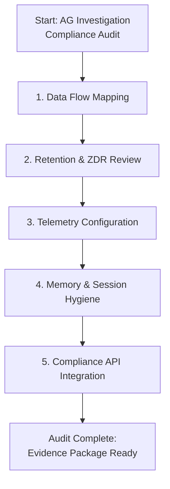
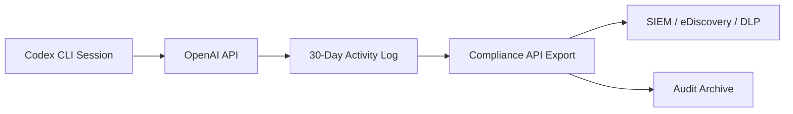

# The 42-State Attorneys General Investigation into OpenAI: What Codex CLI Teams Should Audit Now


On 12 June 2026, New York's attorney general served OpenAI with a subpoena on behalf of a coalition of 42 state attorneys general, demanding records covering advertising, user engagement, consumer and health data processing, activities involving minors and seniors, deep-learning model usage, and internal company policies [^1][^2]. The breadth of the request signals that regulators are no longer investigating isolated incidents — they are stress-testing OpenAI's entire data-handling model, from consumer products to developer APIs, against state consumer-protection and privacy statutes [^3].

For teams running Codex CLI against production codebases, the question is not whether this investigation will produce new rules. It is whether your current configuration already satisfies the obligations that are coming — and whether you can prove it.

## What the Investigation Covers

The subpoena is sweeping. It demands documentation across six domains [^1][^2]:

1. **Advertising and user acquisition** — how OpenAI markets its products and retains users
2. **Consumer data processing** — what happens to inputs and outputs across surfaces
3. **Health data** — whether health-adjacent information flows through OpenAI systems without appropriate safeguards
4. **Minors and seniors** — protections for vulnerable populations
5. **Deep-learning models** — training data provenance, model behaviour, and safety controls
6. **Internal policies** — the gap between documented policy and operational practice

The investigation compounds existing legal pressure: Florida's civil complaint alleging ChatGPT endangered children [^4], Canada's PIPEDA investigation into OpenAI's personal-information handling [^5], and the looming IPO — potentially valued at \$1 trillion and targeted for September 2026 [^2] — which makes regulatory uncertainty a material risk.

## Why This Matters for CLI Developers

Codex CLI is an API-authenticated surface. Code you send to the agent, files it reads, diffs it generates, and tool outputs it processes all transit OpenAI infrastructure. The investigation's focus on "consumer data processing" and "internal policies" means the controls governing that transit are under scrutiny.

Three facts shape the risk landscape:

- **API data is not used for model training** by default on Business, Enterprise, and Edu plans [^6]. But "not trained on" is not the same as "not retained."
- **Default API retention is 30 days** for abuse monitoring [^7]. Prompts and completions are stored unless your organisation has negotiated zero data retention (ZDR) [^7].
- **Codex CLI telemetry** sends anonymous usage and health metrics by default, though these do not contain PII [^8]. The OTel exporter, if enabled, can log raw user prompts [^9].

If your codebase contains customer PII, health records, financial data, or anything covered by state privacy laws (CCPA, VCDPA, CPA, CTDPA, and the growing patchwork of US state legislation), you need to know exactly what Codex CLI is transmitting and how long OpenAI retains it.

## The Five-Point Compliance Audit



### 1. Map Your Data Flow

Before configuring anything, establish what data Codex CLI actually transmits. Every interactive session sends:

- The system prompt (including AGENTS.md contents)
- File contents read by the agent
- Tool call inputs and outputs (shell commands, file edits, MCP server responses)
- Your typed prompts
- Session history up to the context window limit

Run `codex doctor` to see your current environment, including editor, pager, and auth configuration [^10]. Then audit your AGENTS.md for any hardcoded secrets, API keys, or customer-specific data that should never reach an external API.

### 2. Review Retention and ZDR Status

Check whether your organisation has executed OpenAI's Data Processing Addendum (DPA) and whether zero data retention is enabled for your API organisation [^7]:

```bash
# Check your current auth method — ChatGPT login vs API key
codex doctor | grep -i auth
```

**Critical distinction**: ChatGPT-authenticated Codex usage falls under the Compliance API's 30-day retention window [^11]. API-key-authenticated usage follows your API organisation's settings and is _not_ included in Compliance API exports [^11].

If you are on a ChatGPT Plus or Pro plan rather than Enterprise, your data handling follows consumer terms, not enterprise terms. The attorneys general investigation is precisely about those consumer terms.

```toml
# ~/.codex/config.toml — force API-key authentication
forced_login_method = "api"
```

### 3. Lock Down Telemetry

Codex CLI's default telemetry is lightweight and anonymised [^8], but in a regulatory environment where "data minimisation" is becoming a legal requirement, teams should make an explicit decision:

```toml
# ~/.codex/config.toml
analytics.enabled = false

[otel]
exporter = "none"
log_user_prompt = false
```

Setting `analytics.enabled = false` disables machine-level analytics collection [^9]. The `otel.log_user_prompt = false` setting ensures that even if you later enable OTel for your own observability pipeline, raw prompts are not exported [^9].

### 4. Control Memory and Session Persistence

Codex CLI's Dreaming memory system extracts, compresses, and consolidates memories across sessions [^9]. If those memories capture code containing regulated data, they become a secondary retention surface outside your direct control.

```toml
# ~/.codex/config.toml — for regulated projects
[memories]
generate_memories = false
use_memories = false

[history]
persistence = "none"
```

For projects that need memory but require auditability, use a project-level override:

```toml
# /path/to/regulated-project/.codex/config.toml
[memories]
generate_memories = false
use_memories = false
```

This keeps memory active for non-sensitive projects while disabling it where data governance requires it [^9].

### 5. Integrate the Compliance API

Enterprise and Business plans provide a Compliance API that exports activity logs — prompt text, generated responses, user identifiers, timestamps, model names, and token usage [^11]. This is your audit trail.



The Compliance API supports integration with eDiscovery, DLP, and SIEM tools [^11]. If your organisation is not yet pulling these exports, start now. Regulators ask for evidence of controls, not just the existence of controls.

Key considerations:

- The lookback window is **90 days** for the Analytics API and **30 days** for Compliance API activity data [^11]
- **CSV and JSON exports** are available from the Analytics Dashboard for self-serve monitoring [^11]
- API-key-authenticated sessions are **not captured** by the Compliance API — you need your own logging for those [^11]

## Enterprise Configuration Hardening Checklist

For teams operating in regulated environments, the following `config.toml` represents a defensible baseline:

```toml
# ~/.codex/config.toml — regulated environment baseline

# Force enterprise authentication
forced_login_method = "api"
forced_chatgpt_workspace_id = "ws_your_enterprise_id"

# Disable telemetry
analytics.enabled = false

# Disable OTel prompt logging
[otel]
exporter = "none"
log_user_prompt = false

# Restrict sandbox permissions
default_permissions = ":workspace"

# Credential security
cli_auth_credentials_store = "keychain"
```

Pair this with project-level memory controls and managed configuration bundles if your enterprise plan supports cloud-managed config [^12].

## The Regulatory Trajectory

The 42-state coalition is not an anomaly. It sits within a clear trajectory:

| Date | Event | Relevance |
|------|-------|-----------|
| 2026-01 | Canada PIPEDA investigation [^5] | Personal data in training sets |
| 2026-06-01 | Florida AG lawsuit [^4] | Consumer protection, child safety |
| 2026-06-12 | 42-state AG subpoena [^1] | Comprehensive data practices |
| 2026-09 (est.) | OpenAI IPO [^2] | Regulatory uncertainty = material risk |

OpenAI holds SOC 2 Type II certification and ISO 27001/27017/27018/27701 certifications [^6]. It offers data residency in multiple regions and AES-256 encryption at rest [^6]. These are necessary but not sufficient. The investigation is asking whether operational practice matches documented policy — and that gap lives in configuration, not certification.

## What to Do on Monday

1. **Run `codex doctor`** on every developer workstation and CI runner. Capture the output.
2. **Audit `config.toml`** at user, project, and managed-configuration levels. Document what telemetry, memory, and retention settings are active.
3. **Confirm DPA execution** with your OpenAI account team. Verify ZDR status if your codebase handles regulated data.
4. **Enable Compliance API exports** if you are on Enterprise or Business. Route them to your existing SIEM.
5. **Review AGENTS.md files** for hardcoded secrets or customer data that should be in `.gitignore`, not in agent instructions.
6. **Create a regulated-project profile** with memory and history disabled for codebases containing PII, PHI, or financial data.

The attorneys general investigation may take months to produce findings. The configuration audit takes an afternoon. One of these is under your control.

## Citations

[^1]: Bloomberg, "OpenAI Probed by Coalition of State Attorneys General," 13 June 2026. [https://www.bloomberg.com/news/articles/2026-06-13/openai-probed-by-coalition-of-state-attorneys-general](https://www.bloomberg.com/news/articles/2026-06-13/openai-probed-by-coalition-of-state-attorneys-general)

[^2]: Mezha Media, "State attorneys general launched probe into OpenAI, subpoenaed documents on user safety and data," 13 June 2026. [https://mezha.net/eng/bukvy/b5b58c92_state_attorneys_general/](https://mezha.net/eng/bukvy/b5b58c92_state_attorneys_general/)

[^3]: TechTimes, "Federal AI Preemption Talks: OpenAI Subpoena Shows What States Could Lose," 12 June 2026. [https://www.techtimes.com/articles/318316/20260612/federal-ai-preemption-talks-openai-subpoena-shows-what-states-could-lose.htm](https://www.techtimes.com/articles/318316/20260612/federal-ai-preemption-talks-openai-subpoena-shows-what-states-could-lose.htm)

[^4]: DataGuidance, "Florida: AG files lawsuit against OpenAI for alleged deceptive practices and child safety risks," June 2026. [https://www.dataguidance.com/news/florida-ag-files-lawsuit-against-openai-alleged](https://www.dataguidance.com/news/florida-ag-files-lawsuit-against-openai-alleged)

[^5]: Office of the Privacy Commissioner of Canada, "PIPEDA Findings #2026-002: Joint Investigation of OpenAI OpCo, LLC," 2026. [https://www.priv.gc.ca/en/opc-actions-and-decisions/investigations/investigations-into-businesses/2026/pipeda-2026-002/](https://www.priv.gc.ca/en/opc-actions-and-decisions/investigations/investigations-into-businesses/2026/pipeda-2026-002/)

[^6]: OpenAI, "Security and privacy at OpenAI." [https://openai.com/security-and-privacy/](https://openai.com/security-and-privacy/)

[^7]: OpenAI, "Data controls in the OpenAI platform." [https://developers.openai.com/api/docs/guides/your-data](https://developers.openai.com/api/docs/guides/your-data)

[^8]: GitHub Discussion #8291, "Codex Client Analytics," openai/codex. [https://github.com/openai/codex/discussions/8291](https://github.com/openai/codex/discussions/8291)

[^9]: OpenAI Developers, "Configuration Reference — Codex." [https://developers.openai.com/codex/config-reference](https://developers.openai.com/codex/config-reference)

[^10]: OpenAI Developers, "Changelog — Codex," v0.139.0 (9 June 2026). [https://developers.openai.com/codex/changelog](https://developers.openai.com/codex/changelog)

[^11]: OpenAI Developers, "Governance — Codex." [https://developers.openai.com/codex/enterprise/governance](https://developers.openai.com/codex/enterprise/governance)

[^12]: OpenAI Developers, "Advanced Configuration — Codex." [https://developers.openai.com/codex/config-advanced](https://developers.openai.com/codex/config-advanced)
