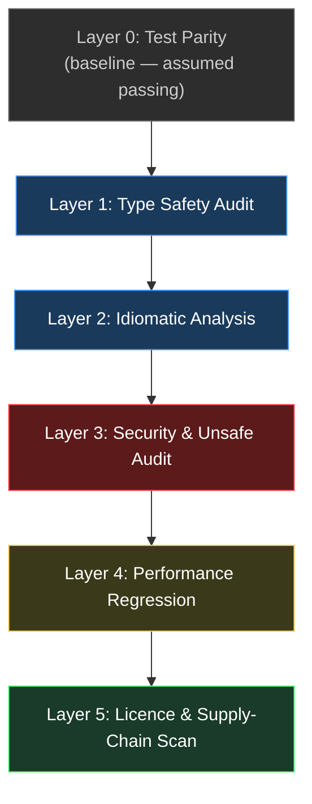

# Post-Rewrite Verification: Five Layers Beyond "The Tests Pass"


---

When Bun's Claude-driven rewrite converted 960,000 lines of Zig to Rust in six days, the test suite passed — yet 13,044 `unsafe` blocks remained, five of which contained genuinely unsound code reachable from safe Rust [^1][^2]. That single data point encapsulates the core problem with agent-driven rewrites: **test parity is necessary but nowhere near sufficient**.

This article maps five verification layers that go beyond green tests, then shows how to wire each one into Codex CLI using hooks, subagents, and `codex exec` with structured output.

## Why Test Parity Is a Weak Signal

Test suites verify *specified* behaviour. They say nothing about:

- **Type-level invariants** the original language enforced implicitly (e.g. Zig's comptime checks, Go's interface satisfaction).
- **Idiomatic violations** that compile but invite bugs — a Rust codebase littered with `.unwrap()` or a TypeScript migration full of `any` casts.
- **Security surface changes** introduced by new dependency trees or FFI boundaries.
- **Performance regressions** masked by functional correctness.
- **Licence obligations** inherited from new transitive dependencies the agent pulled in.

A disciplined verification pipeline treats passing tests as *layer zero* — the floor, not the ceiling.

## The Five-Layer Model



### Layer 1: Type Safety Audit

Agent-translated code frequently weakens the type system to get things compiling. In TypeScript migrations, this manifests as `any` casts and disabled strict-null checks; in Rust, as excessive `unsafe` blocks or `.unwrap()` calls that replace proper error handling [^2][^3].

**What to check:**

- Count of `any`/`unknown` casts vs the original codebase's type coverage.
- Ratio of `unsafe` blocks in Rust rewrites (Bun's 13,044 vs ~73 in comparable hand-written Rust is the benchmark) [^1].
- Strict compiler flags enabled: `@typescript-eslint/no-explicit-any`, `strict-null-checks`, `clippy::pedantic`.

**Codex CLI wiring — PostToolUse hook:**

```toml
[[hooks.PostToolUse]]
matcher = "^(Write|Edit)$"

[[hooks.PostToolUse.hooks]]
type = "command"
command = "/repo/.codex/scripts/type-audit.sh"
timeout = 60
statusMessage = "Running type safety audit..."
```

The hook script runs the relevant type checker (`tsc --noEmit --strict`, `cargo clippy -- -D warnings`) after every file write, catching type regressions at the point of introduction rather than at PR review [^4].

### Layer 2: Idiomatic Analysis

Functionally correct code can be structurally alien to its target language. An AI translating Python to Go might produce valid Go that no Go developer would recognise — channels used as mutexes, error returns ignored, or `init()` functions doing heavy lifting [^5].

**What to check:**

- Language-specific linter rules beyond defaults: `golangci-lint` with `gocritic`, `pylint` with `too-many-branches`, ESLint with `@typescript-eslint` strict presets.
- Semgrep custom rules targeting known AI translation patterns (e.g. `pattern: $X.unwrap()` in Rust, `pattern: (any)` in TypeScript) [^6].
- Cyclomatic complexity deltas between source and target codebases.

**Codex CLI wiring — dedicated subagent:**

```toml
# .codex/agents/idiomatic-reviewer.toml
name = "idiomatic-reviewer"
description = "Reviews translated code for target-language idiom violations"
sandbox_mode = "read-only"
model_reasoning_effort = "high"

developer_instructions = """
You are a senior developer reviewing AI-translated code.
Compare each file against target-language idioms.
Flag: unnecessary type casts, non-idiomatic error handling,
missed standard library utilities, and structural patterns
foreign to the target language.
Output a JSON report with file, line, severity, and suggestion.
"""
```

Spawn this agent post-migration with up to six concurrent threads [^7]:

```bash
codex --profile idiomatic-review \
  "Review all files in src/ changed in the last commit for idiomatic violations. Use the idiomatic-reviewer agent."
```

### Layer 3: Security and Unsafe Audit

Rewrites alter the attack surface. New dependencies appear, FFI boundaries shift, and the agent may introduce patterns the original codebase deliberately avoided [^8].

**What to check:**

- `unsafe` block inventory with justification annotations (Rust).
- Semgrep SAST scan for injection patterns, hardcoded credentials, and insecure deserialisation [^6].
- Dependency audit: `cargo audit`, `npm audit`, `pip-audit` against the new dependency tree.
- FFI boundary mapping: every call crossing a language boundary needs explicit documentation.

**Codex CLI wiring — structured `codex exec`:**

```bash
codex exec \
  --sandbox read-only \
  --output-schema ./schemas/security-audit.json \
  "Audit src/ for: (1) unsafe blocks without justification comments, \
   (2) new dependencies not present in the original Cargo.lock/package-lock.json, \
   (3) FFI calls without error handling. Return structured findings."
```

The `--output-schema` flag enforces a JSON schema on the output, making downstream CI parsing deterministic rather than fragile regex extraction [^9].

### Layer 4: Performance Regression

Test suites rarely include performance assertions. An agent rewrite that replaces a hand-optimised hot path with an idiomatic but slower alternative will pass every functional test while degrading production latency.

**What to check:**

- Benchmark suite comparison: `cargo bench`, `pytest-benchmark`, `go test -bench`.
- Allocation profiling: agent-generated code often allocates more freely than hand-tuned originals.
- Critical path identification: profile the top ten hot paths and compare against pre-rewrite baselines.

**Codex CLI wiring — PostToolUse with benchmark gate:**

```toml
[[hooks.PostToolUse]]
matcher = "^Bash$"

[[hooks.PostToolUse.hooks]]
type = "command"
command = "/repo/.codex/scripts/bench-gate.sh"
timeout = 300
statusMessage = "Checking performance regression..."
```

The `bench-gate.sh` script runs the benchmark suite and exits with code 2 (blocking) if any benchmark regresses beyond a configured threshold — say, 15% wall-clock degradation. Exit code 2 tells Codex to halt and surface the error [^4].

### Layer 5: Licence and Supply-Chain Scan

Agent-generated code may introduce dependencies with incompatible licences or, more subtly, may reproduce patterns from training data that carry latent obligations [^10].

**What to check:**

- FOSSA or ScanCode scan against the new dependency tree, flagging any licence incompatible with your project's licence [^11].
- SBOM generation (`syft`, `cyclonedx-cli`) and diff against the pre-rewrite SBOM.
- Provenance check on new dependencies: age, maintainer count, known vulnerabilities.

**Codex CLI wiring — AGENTS.md constraint:**

```markdown
<!-- AGENTS.md -->
## Licence Constraints

- Do NOT add dependencies licensed under AGPL, SSPL, or EUPL without explicit approval.
- Before adding any new dependency, verify its licence using `cargo license` or `license-checker`.
- All new dependencies must be recorded in DEPENDENCY_DECISIONS.md with licence and justification.
```

AGENTS.md constraints operate as pre-generation guardrails — they shape the agent's behaviour before code is written, complementing the post-hoc scanning layers [^12].

## Putting It All Together: The Verification Profile

Combine all five layers into a dedicated Codex CLI profile:

```toml
# ~/.codex/profiles/verify-rewrite.toml
model = "o3"
model_reasoning_effort = "high"
sandbox_mode = "workspace-write"
approval_policy = "on-request"

[sandbox_workspace_write]
writable_roots = ["/repo/reports"]

[[hooks.PostToolUse]]
matcher = "^(Write|Edit)$"

[[hooks.PostToolUse.hooks]]
type = "command"
command = "/repo/.codex/scripts/type-audit.sh"
timeout = 60
statusMessage = "Type safety check..."

[[hooks.PostToolUse]]
matcher = "^(Write|Edit)$"

[[hooks.PostToolUse.hooks]]
type = "command"
command = "/repo/.codex/scripts/lint-idiomatic.sh"
timeout = 60
statusMessage = "Idiomatic analysis..."

[[hooks.PostToolUse]]
matcher = "^Bash$"

[[hooks.PostToolUse.hooks]]
type = "command"
command = "/repo/.codex/scripts/bench-gate.sh"
timeout = 300
statusMessage = "Performance gate..."
```

Activate the profile for any rewrite session:

```bash
codex --profile verify-rewrite \
  "Translate the billing module from Python to TypeScript, applying all five verification layers after each change."
```

## The Verification Debt Equation

Bun's rewrite demonstrates the arithmetic clearly: six days of agent translation produced six months of verification debt across 13,044 unsafe blocks [^1]. The speed of agent-driven rewrites makes this equation worse, not better — the faster you generate code, the more verification surface accumulates.

The five-layer model does not eliminate this debt. It makes it *visible* and *automated*, converting hidden risk into explicit, CI-gated checkpoints. That is the difference between a rewrite that ships confidently and one that ships with fingers crossed.

## Citations

[^1]: "Bun's unreleased Rust port has 13,365 unsafe blocks. Most can be removed." Bun Blog, May 2026. [https://bun.com/bun-unsafe-audit](https://bun.com/bun-unsafe-audit)

[^2]: "Bun Rust Rewrite Merged: The 13,000 Unsafe Block Problem." byteiota, May 2026. [https://byteiota.com/bun-rust-rewrite-merged-the-13000-unsafe-block-problem/](https://byteiota.com/bun-rust-rewrite-merged-the-13000-unsafe-block-problem/)

[^3]: "How to Test AI Generated Code: A QA Checklist for 2026." ContextQA, 2026. [https://contextqa.com/blog/what-is-ai-generated-code-testing-checklist/](https://contextqa.com/blog/what-is-ai-generated-code-testing-checklist/)

[^4]: "Hooks – Codex CLI." OpenAI Developers Documentation, 2026. [https://developers.openai.com/codex/hooks](https://developers.openai.com/codex/hooks)

[^5]: "Beyond Autocomplete: Best Agentic Coding Workflow in 2026." Kilo AI, 2026. [https://kilo.ai/articles/beyond-autocomplete](https://kilo.ai/articles/beyond-autocomplete)

[^6]: "Semgrep vs ESLint: Security-Focused SAST vs JavaScript Linter (2026)." DEV Community, 2026. [https://dev.to/rahulxsingh/semgrep-vs-eslint-security-focused-sast-vs-javascript-linter-2026-hef](https://dev.to/rahulxsingh/semgrep-vs-eslint-security-focused-sast-vs-javascript-linter-2026-hef)

[^7]: "Subagents – Codex." OpenAI Developers Documentation, 2026. [https://developers.openai.com/codex/subagents](https://developers.openai.com/codex/subagents)

[^8]: "Introducing the AI Agent Security Scanner for IDEs: Verify Your Agents." Cisco Blogs, 2026. [https://blogs.cisco.com/ai/introducing-the-ai-agent-security-scanner-for-ides-verify-your-agents](https://blogs.cisco.com/ai/introducing-the-ai-agent-security-scanner-for-ides-verify-your-agents)

[^9]: "Codex CLI Automations and Scheduled Tasks: Background Agent Workflows." Codex Knowledge Base, March 2026. [https://codex.danielvaughan.com/2026/03/27/codex-cli-automations-scheduled-tasks/](https://codex.danielvaughan.com/2026/03/27/codex-cli-automations-scheduled-tasks/)

[^10]: "Agent-Driven Codebase Rewrites: What Bun's Zig-to-Rust Port Teaches Codex CLI Practitioners." Codex Knowledge Base, June 2026. [https://codex.danielvaughan.com/](https://codex.danielvaughan.com/)

[^11]: "FOSSA Scan: Universal Software Supply Chain Scanner." FOSSA, 2026. [https://fossa.com/products/scan/](https://fossa.com/products/scan/)

[^12]: "AGENTS.md for Codex CLI (2026): Lookup Order, Limits & Monorepo Templates." CodeGateway, 2026. [https://www.codegateway.dev/en/blog/agents-md-playbook-2026](https://www.codegateway.dev/en/blog/agents-md-playbook-2026)
