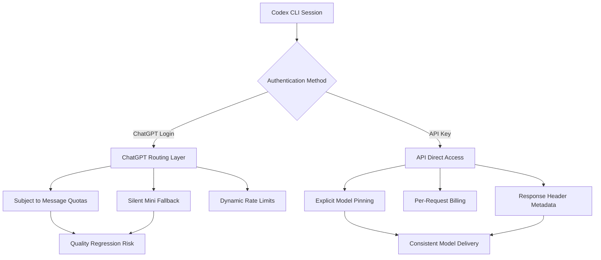
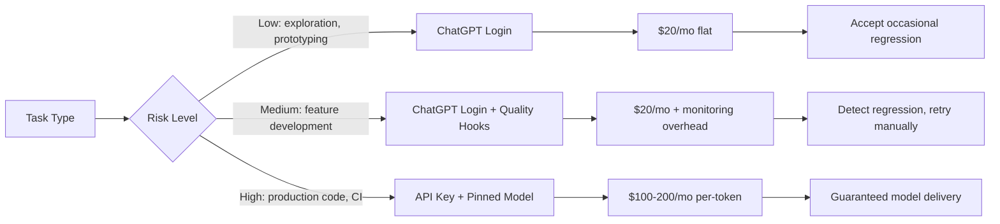

# The Silent Model Downgrade Problem: Detecting and Defending Against GPT-5.5 Quality Regression in Codex CLI Workflows


---

Your Codex CLI session looks normal. The model label says GPT-5.5. The prompt acceptance rate is fine. But the code coming back is subtly wrong — missed edge cases, shallow refactors, boilerplate where nuance should be. You are not imagining it: the model serving your requests may not be the model you think you selected.

This article maps the silent model downgrade problem, explains the mechanisms behind it, and provides concrete Codex CLI configuration and observability patterns to detect and defend against quality regression in production workflows.

## The Documented Silent Switch

OpenAI's own documentation confirms the mechanism. ChatGPT Plus and Go users receive 160 GPT-5.5 messages per three-hour window [^1]. After exhausting that quota, the system silently switches to a "mini" variant — no notification, no label change, no visual feedback [^1][^2]. The user sees "GPT-5.5" in the interface whilst receiving output from a materially less capable model.

This is not a bug. It is documented behaviour. But documentation buried in a help centre article is cold comfort when your Codex CLI session — authenticated via ChatGPT login — starts producing code that fails review.

The community has catalogued the impact. A compilation on chatgptdisaster.com documents over 1,000 verified complaints about quality degradation, many describing a scenario termed "routing layer failure" where the UI displays the premium model name but output quality is visibly degraded [^3]. KuCoin News reported in June 2026 that users had identified performance drops consistent with silent downgrades, with the model being "silently downgraded" without user consent [^4].

## Why Codex CLI Users Are Especially Exposed

The silent switch problem disproportionately affects Codex CLI users who authenticate via ChatGPT login rather than API keys. Here is why:

**Message-counting is opaque.** A single Codex CLI turn can consume multiple internal messages — the system prompt, AGENTS.md injection, tool calls, and the response itself. A session that looks like 20 human prompts may consume 80+ internal messages against the 160-message quota [^5].

**Long sessions drain quotas silently.** Goal mode, subagent orchestration, and autonomous loops can burn through a three-hour quota in under an hour. The developer who kicked off a `/goal` and walked away returns to a session that silently switched models mid-execution.

**No per-turn model verification.** Unlike the API, which returns model metadata in response headers, ChatGPT-authenticated CLI sessions do not expose which model actually served each turn. The developer has no programmatic signal that a downgrade occurred.

## The Broader Quality Regression Pattern

The silent switch is the most mechanically straightforward form of degradation, but the community has identified a broader pattern across the GPT-5.x series.

In March 2026, a forum post titled "GPT-5.4 has significantly degraded in Codex" attracted unanimous agreement from respondents [^3]. When GPT-5.5 Instant launched in May, response lengths dropped by 30% and stylistic characteristics changed noticeably [^6]. By late May, complaints about Thinking mode degradation resurfaced [^3]. ChatGPT's market share reportedly fell from roughly 60% in early 2025 to under 45% by Q1 2026 [^3], driven in part by quality perception issues.

For Codex CLI developers, the concern is not whether the model "feels" different. It is whether pinned configurations reliably deliver consistent code quality across sessions, days, and billing cycles.

## The Two Authentication Paths and Their Quality Implications

Codex CLI supports two fundamentally different authentication models, each with distinct implications for model routing [^7][^8]:



### ChatGPT Login (OAuth)

The ChatGPT login path routes requests through OpenAI's consumer infrastructure. This means your Codex CLI session inherits the same quota system, rate limiting, and silent fallback behaviour as the ChatGPT web interface [^1][^7]. The model you configured in `config.toml` is a *preference*, not a guarantee.

### API Key Authentication

API key authentication routes requests through the OpenAI Platform API. You are billed per token, but you receive the model you requested. Response headers include the model identifier that actually served the request. There is no silent fallback to a cheaper variant [^8][^9].

The trade-off is cost. A ChatGPT Plus subscription at \$20/month provides 160 GPT-5.5 messages per three hours. The equivalent API usage at GPT-5.5 rates can reach \$100-200/month for an active developer [^10].

## Defence Pattern 1: Pin the Model Explicitly

Whether you use ChatGPT login or API keys, always pin the model in your project-level `config.toml` rather than relying on defaults:

```toml
# .codex/config.toml — project-level
model = "gpt-5.5"
model_reasoning_effort = "high"
```

For API-key users, pin to a dated snapshot when available to prevent silent model updates between versions [^9]:

```toml
model = "gpt-5.5-2026-04-23"
```

The `chat-latest` dynamic pointer resolves to whatever OpenAI considers current [^11]. Avoid it in production workflows — it is a convenience alias, not a stability guarantee.

## Defence Pattern 2: Switch to API Key for Critical Workflows

For CI pipelines, goal mode sessions, and any workflow where quality regression would cause downstream failures, use API key authentication:

```toml
# ci.config.toml — CI profile
model = "gpt-5.5-2026-04-23"
model_reasoning_effort = "high"
model_provider = "openai"
```

```bash
# CI invocation with API key
export OPENAI_API_KEY="$YOUR_PLATFORM_KEY"
codex exec -p ci "Refactor the payment module to use the new billing API"
```

This eliminates the silent fallback path entirely. You pay per token, but the model is guaranteed [^8][^9].

## Defence Pattern 3: Quality Gate Hooks

Codex CLI hooks provide the mechanism for post-turn quality validation. A `post-exec` hook can score output quality and alert when regression is detected:

```bash
#!/usr/bin/env bash
# .codex/hooks/post-exec-quality-gate.sh
# Runs after each codex exec invocation

OUTPUT_FILE="$1"
EXPECTED_MODEL="gpt-5.5"

# Check if output contains common regression indicators:
# - Excessive boilerplate comments
# - Missing error handling patterns
# - Shallow implementations (TODO/FIXME density)
TODO_COUNT=$(grep -c -i "TODO\|FIXME\|HACK\|XXX" "$OUTPUT_FILE" 2>/dev/null || echo 0)

if [ "$TODO_COUNT" -gt 5 ]; then
  echo "WARNING: Quality gate triggered — $TODO_COUNT TODO/FIXME markers detected"
  echo "Possible model downgrade. Consider switching to API key authentication."
  exit 1
fi
```

This is a coarse heuristic, but it catches the most common regression signal: a less capable model producing placeholder code where the full model would have provided complete implementations.

## Defence Pattern 4: Observability via OpenTelemetry

Codex CLI supports OpenTelemetry trace export [^12]. Wire it to your observability stack to track model quality metrics over time:

```toml
# config.toml
[telemetry]
otel_endpoint = "http://localhost:4317"
```

Key metrics to monitor:

- **Tokens per turn** — a sudden drop in output tokens per turn can indicate a mini-model fallback
- **Reasoning token ratio** — GPT-5.5 in high reasoning mode produces a characteristic ratio of reasoning to output tokens; a shift suggests a different model
- **Tool call depth** — full models tend to use more tool calls per task than mini variants
- **Session duration vs message count** — correlate session length with the 160-message/3-hour window to predict when fallback may occur

## Defence Pattern 5: Profile-Based Tier Separation

Create separate profiles for interactive work (where ChatGPT login is convenient) and critical workflows (where API key guarantees matter):

```toml
# interactive.config.toml — ChatGPT login, daily pairing
model = "gpt-5.5"
model_reasoning_effort = "medium"
```

```toml
# critical.config.toml — API key, production code
model = "gpt-5.5-2026-04-23"
model_reasoning_effort = "high"
service_tier = "default"
```

```bash
# Interactive session — ChatGPT auth, acceptable if quality dips
codex -p interactive

# Critical refactor — API key, pinned model, no fallback risk
OPENAI_API_KEY="$YOUR_PLATFORM_KEY" codex -p critical
```

This pattern acknowledges reality: most developers cannot justify \$200/month in API costs for every session. Reserve the guaranteed path for work that matters.

## What OpenAI Is Doing About Quality Monitoring

OpenAI published its own approach to quality monitoring in March 2026 [^13]. The company monitors 99.9% of internal coding agent traffic using GPT-5.4 Thinking as a supervisory model. The system analyses full conversation context — everything the agent saw and did — and routes high-severity cases for human review within 30 minutes [^13].

The monitoring has analysed tens of millions of internal agentic coding trajectories. Approximately 1,000 triggered moderate-severity alerts requiring human review, though many originated from deliberate red-teaming exercises [^13].

This is relevant to Codex CLI teams for two reasons. First, it confirms that even OpenAI considers model quality monitoring essential for coding agents. Second, it demonstrates a pattern — LLM-as-judge scoring of agent output — that teams can replicate locally using `codex exec` with a cheaper model to score the output of a more expensive one.

## The Cost-Quality Decision Framework



The framework is straightforward: match the authentication method to the risk tolerance of the task. Most development work tolerates occasional quality dips. Production code generation, CI pipelines, and large-scale refactors do not.

## Practical Checklist

1. **Audit your authentication method.** Run `codex doctor` and check whether your session uses ChatGPT login or an API key [^14]. Know which path your critical workflows take.

2. **Pin models in project config.** Never rely on `chat-latest` or default model selection for repeatable workflows.

3. **Monitor message consumption.** Track how many internal messages your sessions consume relative to the 160/3-hour quota. If you regularly exceed 100 messages per session, you are in the fallback danger zone.

4. **Deploy quality gate hooks.** Even a simple TODO/FIXME counter catches the most egregious regression patterns.

5. **Reserve API key auth for high-stakes work.** The cost premium buys model delivery guarantees that ChatGPT login cannot provide.

6. **Review output quality periodically.** Schedule a weekly manual review of agent-generated code from the previous week. Pattern-match against known regression indicators: excessive comments, missing error handling, shallow implementations, and inconsistent naming conventions.

## Looking Ahead

The silent downgrade problem is structural, not incidental. OpenAI's consumer infrastructure is designed to maximise availability across millions of users, which means graceful degradation under load [^1]. This is the correct engineering choice for a consumer product. It is the wrong default for a professional coding tool.

The long-term fix is likely a dedicated Codex API tier that provides the convenience of ChatGPT authentication with the model guarantees of API access. Until that arrives, the defence is configuration discipline: pin your models, separate your profiles, monitor your output, and reserve guaranteed access for the work that cannot tolerate silent regression.

---

## Citations

[^1]: OpenAI Help Center, "GPT-5.5 in ChatGPT," [https://help.openai.com/en/articles/11909943-gpt-5-in-chatgpt](https://help.openai.com/en/articles/11909943-gpt-5-in-chatgpt) — Confirms 160 messages per 3 hours for Plus users and silent mini fallback.

[^2]: CustomGPT.ai, "ChatGPT Plus Limits 2026: Every Cap," [https://customgpt.ai/chatgpt-plus-limits-2026/](https://customgpt.ai/chatgpt-plus-limits-2026/) — Documents the silent switch mechanism with no visual feedback.

[^3]: chatgptdisaster.com, "ChatGPT User Complaints Library 2026: 1,099 Verified Reports," [https://chatgptdisaster.com/stories.html](https://chatgptdisaster.com/stories.html) — Catalogues routing layer failure reports and quality degradation complaints.

[^4]: KuCoin News, "OpenAI users report performance drop in GPT-5.5; model silently downgraded," [https://www.kucoin.com/news/flash/openai-users-report-gpt-5-5-performance-drop-model-downgraded-silently](https://www.kucoin.com/news/flash/openai-users-report-gpt-5-5-performance-drop-model-downgraded-silently) — June 2026 reporting on silent downgrade incidents.

[^5]: OpenAI Developers, "Advanced Configuration — Codex," [https://developers.openai.com/codex/config-advanced](https://developers.openai.com/codex/config-advanced) — Documents model configuration keys and context window settings.

[^6]: 36kr/EU Edition, "Solid Evidence: GPT-5.5 Caught with 'Diminished Intelligence'," [https://eu.36kr.com/en/p/3827354345411464](https://eu.36kr.com/en/p/3827354345411464) — Reports on GPT-5.5 performance changes including 30% response length reduction.

[^7]: OpenAI Developers, "Authentication — Codex," [https://developers.openai.com/codex/auth](https://developers.openai.com/codex/auth) — Documents the three authentication methods and their implications.

[^8]: Context Studios, "Codex ChatGPT Login vs API Key: Which Access Method Fits Your Team in 2026?," [https://www.contextstudios.ai/comparisons/codex-app-chatgpt-login-vs-api-key](https://www.contextstudios.ai/comparisons/codex-app-chatgpt-login-vs-api-key) — Compares authentication paths and billing models.

[^9]: OpenAI API Documentation, "Deprecations," [https://platform.openai.com/docs/deprecations](https://platform.openai.com/docs/deprecations) — Documents dated model snapshots and version pinning for API access.

[^10]: Morphllm, "Codex Pricing (2026)," [https://www.morphllm.com/codex-pricing](https://www.morphllm.com/codex-pricing) — Community cost analysis documenting \$100-200/month per developer at API rates.

[^11]: OpenAI Developers, "Config basics — Codex," [https://developers.openai.com/codex/config-basic](https://developers.openai.com/codex/config-basic) — Documents the chat-latest dynamic model pointer.

[^12]: OpenAI Developers, "Codex CLI Reference," [https://developers.openai.com/codex/cli/reference](https://developers.openai.com/codex/cli/reference) — Documents CLI command-line options and telemetry configuration.

[^13]: OpenAI, "How we monitor internal coding agents for misalignment," [https://openai.com/index/how-we-monitor-internal-coding-agents-misalignment/](https://openai.com/index/how-we-monitor-internal-coding-agents-misalignment/) — March 2026 publication documenting 99.9% monitoring coverage and GPT-5.4 Thinking as supervisory model.

[^14]: OpenAI Developers, "Codex CLI Reference — codex doctor," [https://developers.openai.com/codex/cli/reference](https://developers.openai.com/codex/cli/reference) — Documents the diagnostic command for verifying session authentication and environment.
