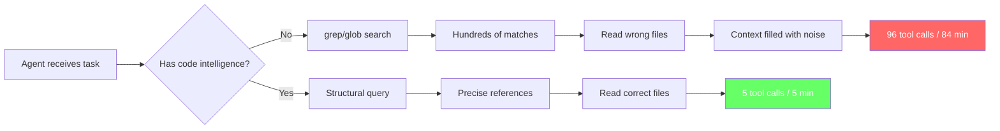
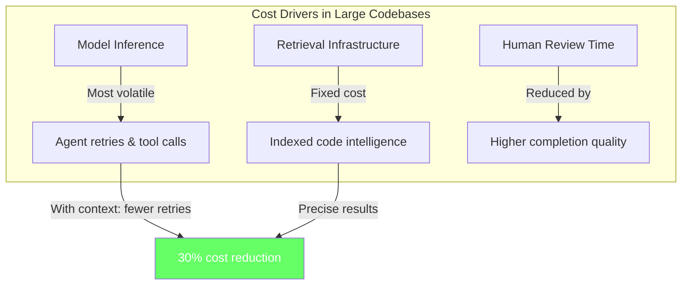

# The 400K LOC Threshold: What 1,281 Agent Runs Reveal About Codex CLI Performance in Large Codebases


---

Sourcegraph's CodeScaleBench study analysed 1,281 agent runs across more than 40 enterprise-scale open-source repositories and surfaced a finding that should reshape how senior engineers configure Codex CLI: the difference between complete failure and near-perfect completion is not model intelligence — it is efficient access to context [^1]. Below the 400,000 lines-of-code mark, standard tools work well enough. Above it, agents relying on grep, file read, and glob start failing systematically [^2]. This article maps those five failure patterns onto Codex CLI and provides configuration recipes for each.

## The Study: CodeScaleBench in Brief

CodeScaleBench is a living benchmark suite comprising 370 software engineering tasks divided into two parts [^3]:

- **CodeScaleBench-SDLC** — 150 tasks spanning the full software development lifecycle, using SWE-Bench-style patch verification plus a `ground_truth.json` produced by a curator agent for context-retrieval metrics.
- **CodeScaleBench-Org** — 220 tasks requiring organisation-level codebase navigation across multiple repositories.

The benchmark targets codebases with millions of lines, complex dependency graphs, and cross-repository context — the environments where enterprise developers actually work [^3]. Sourcegraph's analysis of 1,281 runs across these tasks identified five recurring failure patterns [^2].

## Pattern 1: The 400K LOC Threshold

At roughly 400,000 lines of code, agents hit a structural ceiling. Following imports through 22,000 files becomes unmanageable; the search space overwhelms traditional approaches [^2]. For Codex CLI, this manifests as the agent burning context tokens on exploratory file reads that return nothing useful.

### Codex CLI Defence: Scoped Context with AGENTS.md File Maps

The most effective mitigation is pre-loading architectural knowledge into `AGENTS.md` so the agent starts with codebase understanding rather than reconstructing it through trial-and-error [^2]:

```markdown
# AGENTS.md — large codebase file map

## Architecture Overview
This is a modular monolith with 14 bounded contexts under src/domains/.
Each domain follows: handler.go -> service.go -> repository.go -> models.go

## Key Entry Points
- API routes: src/api/routes/ (one file per domain)
- Domain logic: src/domains/{name}/service.go
- Shared types: src/shared/types/
- Database migrations: db/migrations/

## Navigation Rules
- Never search test files for production logic
- The canonical handler for each domain is in src/domains/{name}/handler.go
- Legacy code in src/legacy/ is read-only; do not modify
```

Pair this with `--add-dir` for cross-repository tasks and a tight `writable_roots` to prevent the agent from wandering into irrelevant directories:

```toml
# config.toml — large codebase profile
[profile.large-repo]
model = "o4-mini"
model_reasoning_effort = "high"
writable_roots = ["src/domains/payments", "src/domains/billing"]
```

## Pattern 2: Finding Code vs. Finding the Right Code

Keyword search in a large codebase returns hundreds of matches across test files, legacy code, and documentation. Agents anchor on the wrong result when distinguishing between multiple `handler.go` files or `__init__.py` modules scattered across packages [^2]. This is the retrieval precision problem: volume does not equal accuracy.

### Codex CLI Defence: Deterministic Code Search via MCP

The Sourcegraph MCP server exposes 13 tools to any MCP-compatible agent, providing deterministic, exact-match results across every repository [^4]. It is backed by SCIP (the open Protobuf-based code intelligence protocol), providing go-to-definition and find-all-references navigation across repositories [^5].

```toml
# config.toml — Sourcegraph MCP server
[mcp-servers.sourcegraph]
command = "npx"
args = ["-y", "@anthropic-ai/sourcegraph-mcp"]
env = { SOURCEGRAPH_ACCESS_TOKEN = "sgp_..." }
```

With this configured, the agent can issue precise structural queries — "find all callers of `PaymentService.Process`" — rather than grepping for string matches. The distinction matters: grep returns text; a code intelligence server returns semantic references [^5].

Where Sourcegraph is unavailable, a language server via the LSP MCP bridge provides a lighter alternative for single-repository work:

```toml
[mcp-servers.lsp-bridge]
command = "npx"
args = ["-y", "mcp-lsp-bridge", "--language", "go", "--workspace", "."]
```

## Pattern 3: Half-Finished Refactoring as Hidden Bugs

Locally correct changes can break broader systems without surface-level indication. The study found that performance drops significantly in multi-repository tasks compared to single-repo work [^2]. The "80% problem" describes this precisely: agents reliably complete visible work but miss the invisible 20% outside their context window — auth middleware, API DTOs, audit logging paths, integration tests in sibling repositories, and frontend permission guards [^6].

### Codex CLI Defence: Multi-Directory Coordination and Stop Hooks

Use `--add-dir` to ensure the agent can see all affected repositories:

```bash
codex --cd ~/code/payments-api \
  --add-dir ~/code/api-gateway \
  --add-dir ~/code/shared-types \
  --sandbox workspace-write \
  "Rename PaymentStatus enum values from snake_case to PascalCase across all services"
```

Then add a Stop hook that runs cross-repository validation before the agent declares completion:

```toml
# config.toml — cross-repo verification hook
[[hooks]]
event = "on_agent_stop"
command = "bash"
args = ["-c", """
echo 'Checking for incomplete refactoring...'
grep -rn 'payment_status\|PAYMENT_STATUS' src/ --include='*.go' && \
  echo 'INCOMPLETE: snake_case references remain' && exit 1
echo 'Refactoring complete across all directories'
"""]
```

## Pattern 4: Tool Thrashing

This is the most striking finding. One benchmark task saw a baseline agent make 96 tool calls over 84 minutes; the same task with proper tooling took five calls in under five minutes [^2]. Across the full dataset, proper context infrastructure delivered a 30% cost reduction and 38% speed improvement [^2]. The compounding effect is insidious: failed searches accumulate in the conversation history, consuming context tokens and limiting output quality in later turns.



### Codex CLI Defence: Compact Proactively and Limit Tool Output

Two configuration levers directly attack tool thrashing:

```toml
# config.toml — anti-thrashing settings
model_auto_compact_token_limit = 160000   # Compact at 80% of 200K, not 95%
tool_output_token_limit = 4000            # Truncate verbose tool output
```

Lowering `model_auto_compact_token_limit` to 80-85% of context capacity provides headroom for the post-compaction re-read cycle and prevents the cascading compaction problem [^7]. Setting `tool_output_token_limit` prevents a single large file read from consuming disproportionate context.

Additionally, use profiles to switch reasoning effort based on task complexity:

```toml
[profile.explore]
model = "o4-mini"
model_reasoning_effort = "low"

[profile.implement]
model = "o3"
model_reasoning_effort = "high"
```

Use the `explore` profile for navigation and the `implement` profile when the agent has located the correct files and is ready to write code.

## Pattern 5: More Tools Does Not Mean Better Performance

The study found a paradox: agents given additional search tools sometimes performed worse [^2]. Excessive retrieval dilutes context with irrelevant files. Retrieval quality matters more than volume; precise file selection outperforms accuracy buried in noise [^2].

### Codex CLI Defence: Curate Your MCP Stack

Resist the temptation to connect every available MCP server. Each tool definition consumes system prompt tokens [^8]. For a large codebase, a curated stack typically looks like:

```toml
# config.toml — curated MCP for large codebases
[mcp-servers.code-search]
command = "npx"
args = ["-y", "@anthropic-ai/sourcegraph-mcp"]
env = { SOURCEGRAPH_ACCESS_TOKEN = "sgp_..." }

[mcp-servers.git-context]
command = "npx"
args = ["-y", "mcp-git"]
```

Two servers — one for code intelligence, one for Git history — often outperform five or six miscellaneous tools. Every additional tool definition inflates the system prompt and increases the chance of the agent selecting the wrong tool for a given query.

## The Economics: Context Infrastructure vs. Model Upgrades

The Sourcegraph findings carry a clear cost implication. Organisations cannot improve agent performance by upgrading to a more expensive frontier model if the bottleneck is retrieval infrastructure [^6]. The 30% cost reduction from proper tooling [^2] dwarfs the savings from switching between GPT-5.5 (\$5/\$30 per million tokens) [^9] and o4-mini (\$1.10/\$4.40 per million tokens) [^10].



The practical formula: invest in context infrastructure first, model selection second. A well-indexed codebase with Sourcegraph MCP and curated `AGENTS.md` file maps will outperform a frontier model navigating blind.

## Configuration Checklist for Large Codebases

| Failure Pattern | Codex CLI Mitigation | Config Key |
|---|---|---|
| 400K LOC threshold | AGENTS.md file maps, scoped `writable_roots` | `writable_roots` in profile |
| Wrong code found | Sourcegraph or LSP MCP server | `[mcp-servers.sourcegraph]` |
| Half-finished refactoring | `--add-dir`, Stop hook verification | `[[hooks]]` event `on_agent_stop` |
| Tool thrashing | Early compaction, truncated tool output | `model_auto_compact_token_limit`, `tool_output_token_limit` |
| Tool overload | Curated MCP stack (2-3 servers max) | Remove unnecessary `[mcp-servers.*]` |

## Conclusion

The CodeScaleBench data makes the case unambiguously: above 400,000 lines of code, agent success depends on infrastructure, not intelligence. For Codex CLI users operating in enterprise-scale repositories, the highest-leverage investment is not a model upgrade — it is deterministic code search, architectural file maps in `AGENTS.md`, proactive context compaction, and a curated MCP server stack. The agents that navigate 22,000 files in five tool calls are not smarter; they are better equipped.

## Citations

[^1]: Stephanie Jarmak, quoted in Paul Sawers, "What 1,281 agent runs reveal about coding agent failure in large codebases," Tessl.io, 20 May 2026. [https://tessl.io/blog/coding-agent-failure-patterns-large-codebases/](https://tessl.io/blog/coding-agent-failure-patterns-large-codebases/)

[^2]: Paul Sawers, "What 1,281 agent runs reveal about coding agent failure in large codebases," Tessl.io, 20 May 2026. [https://tessl.io/blog/coding-agent-failure-patterns-large-codebases/](https://tessl.io/blog/coding-agent-failure-patterns-large-codebases/)

[^3]: Sourcegraph, "CodeScaleBench: Testing coding agents on large codebases and multi-repo software engineering tasks," Sourcegraph Blog, 2026. [https://sourcegraph.com/blog/codescalebench-testing-coding-agents-on-large-codebases-and-multi-repo-software-engineering-tasks](https://sourcegraph.com/blog/codescalebench-testing-coding-agents-on-large-codebases-and-multi-repo-software-engineering-tasks)

[^4]: Sourcegraph, "MCP Server," Sourcegraph, 2026. [https://sourcegraph.com/mcp](https://sourcegraph.com/mcp)

[^5]: Sourcegraph, "Context Engineering: A Practical Guide for AI Agents (2026)," Sourcegraph Blog, 2026. [https://sourcegraph.com/blog/context-engineering](https://sourcegraph.com/blog/context-engineering)

[^6]: Sourcegraph, "Agentic Coding in 2026: A Practical Guide for Big Code," Sourcegraph Blog, 2026. [https://sourcegraph.com/blog/agentic-coding](https://sourcegraph.com/blog/agentic-coding)

[^7]: OpenAI, "Best practices — Codex," OpenAI Developers, 2026. [https://developers.openai.com/codex/learn/best-practices](https://developers.openai.com/codex/learn/best-practices)

[^8]: Daniel Vaughan, "MCP Schema Bloat and the System Prompt Tax," Codex Knowledge Base, April 2026. [https://codex.danielvaughan.com/2026/04/23/mcp-schema-bloat-system-prompt-tax-tool-definition-performance/](https://codex.danielvaughan.com/2026/04/23/mcp-schema-bloat-system-prompt-tax-tool-definition-performance/)

[^9]: AWS, "Get started with OpenAI GPT-5.5, GPT-5.4 models, and Codex on Amazon Bedrock," AWS News Blog, June 2026. [https://aws.amazon.com/blogs/aws/get-started-with-openai-gpt-5-5-gpt-5-4-models-and-codex-on-amazon-bedrock/](https://aws.amazon.com/blogs/aws/get-started-with-openai-gpt-5-5-gpt-5-4-models-and-codex-on-amazon-bedrock/)

[^10]: OpenAI, "Pricing," OpenAI, June 2026. [https://openai.com/api/pricing/](https://openai.com/api/pricing/)
