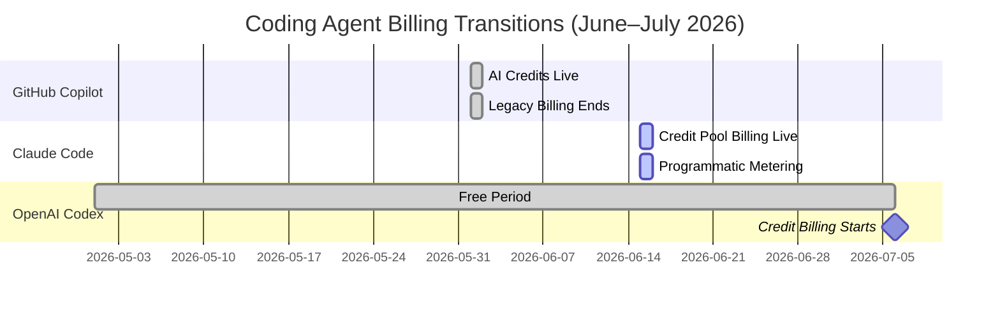
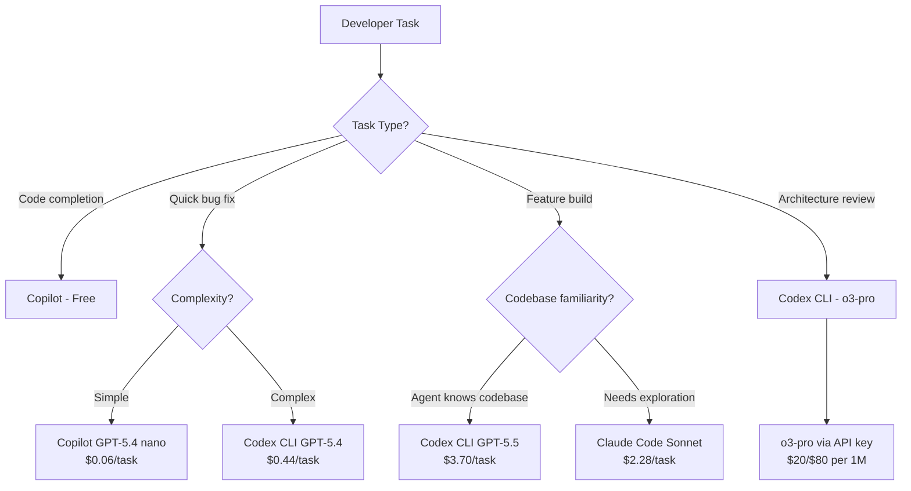

# The Agent Billing Convergence: Managing Developer Costs as Copilot, Codex, and Claude Code All Move to Usage-Based Pricing


---

Within six weeks, the three dominant coding agent platforms will have completed their migration to usage-based billing. GitHub Copilot switched to AI Credits on 1 June 2026 [^1]. Anthropic moves Claude Code's programmatic usage to metered credit pools tomorrow, 15 June [^2]. OpenAI's Workspace Agents free period ends on 6 July, when credit-based billing takes effect for Business and Enterprise accounts [^3]. For teams running two or three of these tools in parallel — which most serious engineering organisations now do — the compounding cost exposure demands a unified management strategy.

This article maps the billing mechanics across all three platforms, compares the token economics model by model, and presents a concrete cost-control playbook for Codex CLI practitioners who also use Copilot and Claude Code.

## The Three Transitions at a Glance



### GitHub Copilot (1 June 2026)

All Copilot plans now include a monthly AI Credit allotment, where 1 credit equals \$0.01 USD [^1]. Pro subscribers receive 1,500 total credits (\$15 effective, comprising 1,000 base + 500 flex), Pro+ gets 7,000 total (\$70, comprising 3,900 base + 3,100 flex), Business 1,900 per seat (\$19), and Enterprise 3,900 per seat (\$39) [^4]. Code completions and Next Edit Suggestions remain free; chat and agent interactions consume credits at per-model token rates [^1].

### Claude Code (15 June 2026)

Anthropic is shifting Agent SDK, headless CLI, and GitHub Actions usage to dedicated credit pools billed at full API rates [^2]. Pro subscribers receive \$20 in Claude Code credits, Max 5x gets \$100, and Max 20x gets \$200 [^2]. Unused credits do not roll over. Interactive Claude Code usage within the IDE remains on the standard subscription limits.

### OpenAI Workspace Agents (6 July 2026)

The free period for Codex with ChatGPT Business and Enterprise subscriptions ends, and credit-based billing activates [^3]. Credits are consumed per million tokens: GPT-5.5 at 125 input / 750 output credits, GPT-5.4 at 62.50 / 375, and GPT-5.4 mini at 18.75 / 113 [^5].

## Token Cost Comparison: The Same Task, Three Platforms

The pricing spread across platforms is substantial. The table below shows per-million-token costs for the default or recommended model on each platform:

| Platform | Default Model | Input ($/1M) | Output ($/1M) | Cached Input ($/1M) |
|----------|--------------|-------------|---------------|-------------------|
| Codex (API key) | GPT-5.5 | \$5.00 | \$30.00 | \$0.50 |
| Codex (Workspace) | GPT-5.5 | 125 credits | 750 credits | 12.50 credits |
| Copilot | GPT-5.4 | \$2.50 | \$15.00 | \$0.25 |
| Copilot | GPT-5.5 | \$5.00 | \$30.00 | \$0.50 |
| Claude Code | Sonnet 4.6 | \$3.00 | \$15.00 | \$0.30 |
| Claude Code | Opus 4.8 | \$5.00 | \$25.00 | \$0.50 |
| Gemini CLI (via Copilot) | Gemini 3.5 Flash | \$1.50 | \$9.00 | \$0.15 |

[^6] [^7]

The cheapest agentic path for routine tasks is GPT-5.4 nano on Copilot at \$0.20/\$1.25, or DeepSeek V4 Flash at \$0.14/\$0.28 via third-party routing [^7]. The most expensive is Claude Fable 5 at \$10.00/\$50.00 — a 179x spread on output pricing [^7].

### Real-World Task Costs

Using realistic workload profiles (bug fix: 400K cumulative input tokens at 75% cache hit rate; feature implementation: 2M input at 80% cache) [^7]:

| Task | Sonnet 4.6 | GPT-5.5 (Codex) | GPT-5.4 (Copilot) | Gemini 3.5 Flash |
|------|-----------|-----------------|-------------------|-----------------|
| Bug fix | \$0.54 | \$0.88 | \$0.44 | \$0.26 |
| Feature | \$2.28 | \$3.70 | \$1.85 | \$1.09 |

A developer averaging five bug fixes and two features per day would consume roughly \$7.26/day on Sonnet 4.6, \$11.80 on GPT-5.5, or \$4.48 on Gemini 3.5 Flash. Monthly costs at this cadence: \$145–\$236 on Claude Code, \$96–\$236 on Copilot, or \$90–\$236 on Codex [^7].

## The Dual-Tool Cost Trap

Most teams do not use a single agent. Microsoft's own divisions reportedly faced approximately \$2,000 per engineer per month in Claude Code token billing before migrating heavy usage to flat-rate Copilot Enterprise at \$39 per seat [^7]. The lesson: agent costs compound silently across platforms.



## Codex CLI Cost-Control Playbook

The following strategies apply to Codex CLI specifically, but the principles transfer to any usage-based agent.

### 1. Route by Model, Not by Habit

Named profiles in `config.toml` let you match model cost to task complexity:

```toml
[profiles.quick]
model = "gpt-5.4-mini"
model_reasoning_effort = "low"

[profiles.standard]
model = "gpt-5.4"
model_reasoning_effort = "medium"

[profiles.deep]
model = "gpt-5.5"
model_reasoning_effort = "high"

[profiles.architect]
model = "o3-pro"
model_reasoning_effort = "xhigh"
```

Invoke with `codex --profile quick "fix the typo in README"`. The difference between `gpt-5.4-mini` and `gpt-5.5` is 8.5x on input and 6.7x on output [^6]. For routine tasks, the cheaper model delivers equivalent results.

### 2. Maximise Cache Hits

Prompt caching reduces effective input costs by up to 10x on OpenAI models (from \$5.00 to \$0.50 per million tokens for GPT-5.5) [^6]. Three practices that improve cache hit rates:

- **Stable system prompts**: keep AGENTS.md and skill instructions consistent across sessions so the prefix remains cacheable.
- **Ordered context**: place static context (file maps, coding standards) before dynamic context (current diff, user prompt).
- **Session continuity**: use `codex resume` rather than starting fresh sessions for related tasks; the conversation prefix becomes cacheable.

### 3. Control Context Size

Context compaction directly reduces token consumption. Configure the compaction threshold to trigger earlier for cost-sensitive workflows:

```toml
model_auto_compact_token_limit = 80000
tool_output_token_limit = 8000
```

The `tool_output_token_limit` cap prevents runaway costs from verbose tool outputs (test results, log dumps) [^3]. Reducing it from the default to 8,000 tokens can cut per-turn costs by 30–50% on output-heavy workflows.

### 4. Use the API Key Escape Valve for CI/CD

For automated pipelines (`codex exec` in CI), an API key bypasses Workspace Agent credits and bills directly to your OpenAI API account at standard rates [^3]. This separation is critical: CI pipelines can burn through a month of Workspace Agent credits in a single deployment cycle.

```bash
# CI pipeline: use API key, not workspace credits
export OPENAI_API_KEY="$YOUR_API_KEY"
codex exec --model gpt-5.4-mini \
  --approval-policy full-auto \
  "run the test suite and report failures as JSON"
```

### 5. Monitor Across Platforms

No single dashboard covers all three billing systems. The minimum viable monitoring stack:

| Platform | Monitoring Approach |
|----------|-------------------|
| Codex CLI | `codex usage` command; OpenAI Usage Dashboard; OpenTelemetry traces [^8] |
| Copilot | GitHub Settings > Copilot > Usage; organisation-level credit reports [^1] |
| Claude Code | Anthropic Console > Usage; credit pool dashboard [^2] |

For unified monitoring, the `ccusage` community tool aggregates token consumption across Codex CLI and Claude Code sessions [^9], and the OpenAI Analytics Dashboard export provides CSV data suitable for cost modelling [^3].

## The Subscription Breakeven Arithmetic

Before defaulting to API keys, check whether subscription credits are actually cheaper:

- **Codex Plus (\$20/month)**: 15–80 messages per 5-hour window. At GPT-5.5 averaging 5–45 credits per message [^5], the effective floor is roughly 330 credits/month for light users — equivalent to approximately \$3.30 in API value. Heavy users extracting 80 messages across multiple windows can reach \$36+ in effective value.
- **Claude Max 5x (\$100/month)**: \$100 in Claude Code credits. Breaks even against Opus 4.8 API rates at approximately 111 bug-fix tasks per month — roughly five per working day [^7].
- **Copilot Pro (\$10/month)**: 1,500 total credits (\$15 value, base + flex). With GPT-5.4 as the default, this covers approximately 10 agent chat sessions before exhaustion [^4].

For most individual developers, subscriptions still offer better value than raw API billing. The API key path becomes cheaper only at very high volume or when you need cheaper models not available through subscriptions.

## The June 2026 Cost Audit Checklist

With all three transitions happening now, every team should run this audit:

1. **Inventory your agent tools**: list every coding agent in use across the team, including personal accounts
2. **Extract baseline usage**: pull the last 30 days of token consumption from each platform's dashboard
3. **Map tasks to agents**: identify which agent handles which task type; eliminate redundant coverage
4. **Configure model routing**: set up named profiles (Codex) or model preferences (Copilot/Claude) to match cost tiers to task complexity
5. **Set budget alerts**: configure spending limits on each platform before the billing transitions take effect
6. **Separate CI from interactive**: route automated pipelines to API keys with their own budget caps
7. **Review monthly**: usage patterns shift as teams adopt new workflows; revisit the routing table quarterly

## What Comes Next

The convergence on usage-based billing is not a coincidence. It reflects a market consensus that flat-rate pricing cannot sustain agentic workloads where a single complex task can consume millions of tokens [^7]. The implication for developers: **agent cost management is now a core engineering skill**, not an afterthought.

Teams that treat agent billing as infrastructure — with the same rigour they apply to cloud compute costs — will maintain their productivity advantage. Teams that ignore it will discover, as Microsoft reportedly did, that unconstrained agent usage can reach thousands of dollars per engineer per month [^7].

The Codex CLI practitioner's advantage is configuration depth: named profiles, compaction tuning, cache optimisation, and the API key/subscription split give you more cost levers than any competing platform. Use them.

---

## Citations

[^1]: GitHub Blog, "GitHub Copilot is moving to usage-based billing", 2026. [https://github.blog/news-insights/company-news/github-copilot-is-moving-to-usage-based-billing/](https://github.blog/news-insights/company-news/github-copilot-is-moving-to-usage-based-billing/)

[^2]: Bind AI Blog, "Claude Code Pricing June 2026: What Each Plan Actually Costs", 2026. [https://blog.getbind.co/claude-code-pricing-changes-june-15-what-youll-actually-pay-2026/](https://blog.getbind.co/claude-code-pricing-changes-june-15-what-youll-actually-pay-2026/)

[^3]: OpenAI Codex Pricing, "Pricing — Codex | OpenAI Developers", 2026. [https://developers.openai.com/codex/pricing](https://developers.openai.com/codex/pricing)

[^4]: GitHub Docs, "Models and pricing for GitHub Copilot", 2026. [https://docs.github.com/en/copilot/reference/copilot-billing/models-and-pricing](https://docs.github.com/en/copilot/reference/copilot-billing/models-and-pricing)

[^5]: OpenAI Codex Pricing, credit rate card per 1M tokens, 2026. [https://developers.openai.com/codex/pricing](https://developers.openai.com/codex/pricing)

[^6]: OpenAI API Pricing, per-model token rates, 2026. [https://developers.openai.com/api/docs/pricing](https://developers.openai.com/api/docs/pricing)

[^7]: MorphLLM, "AI Coding Costs (2026): Claude vs Codex vs Gemini, Real Monthly Spend From Token Math", 2026. [https://www.morphllm.com/ai-coding-costs](https://www.morphllm.com/ai-coding-costs)

[^8]: OpenAI Codex CLI documentation, usage monitoring and OpenTelemetry traces, 2026. [https://developers.openai.com/codex/cli](https://developers.openai.com/codex/cli)

[^9]: ccusage community tool for cross-agent token monitoring. Referenced in Daniel Vaughan, "The Codex CLI Companion Tools Ecosystem", 2026. [https://codex.danielvaughan.com/2026/04/29/codex-cli-companion-tools-ecosystem/](https://codex.danielvaughan.com/2026/04/29/codex-cli-companion-tools-ecosystem/)
