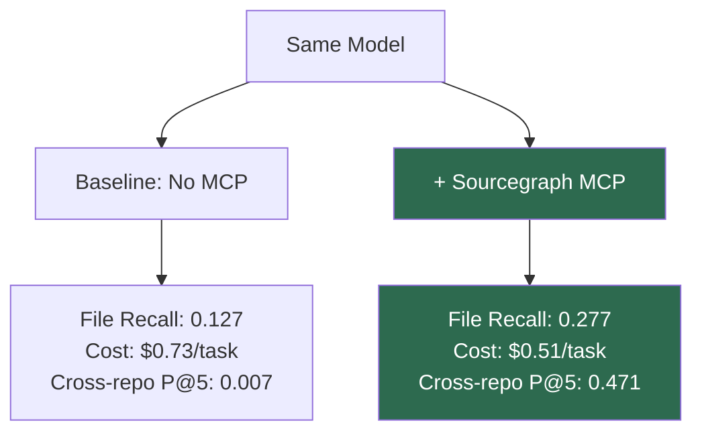
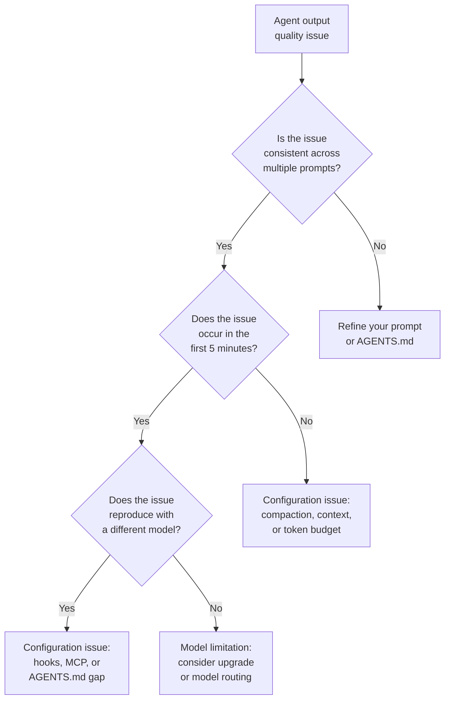

# Beyond Model Chasing: Why the June 2026 Benchmark Convergence Means Your Codex CLI Configuration Is the Real Competitive Advantage


---

The AI coding model leaderboard reshuffles every fortnight. Claude Fable 5 hit 95.0% on SWE-bench Verified on 9 June[^1]. GPT-5.5 leads Terminal-Bench 2.1 at 78.2%[^2]. o3-pro arrived on 10 June with the deepest reasoning budget in the API[^3]. Yet the most consequential finding of June 2026 has nothing to do with any single model launch. It is this: **the harness wrapping a model now produces larger performance swings than switching the model itself.**

The same Sonnet 4.6 scores 67% inside Cursor Agent, 63% inside Aider, and 58% inside Cline on the same benchmark suite — a nine-point spread from configuration and tooling alone[^4]. On Terminal-Bench 2.0, the harness delta can reach thirty to fifty percentage points[^5]. Sourcegraph's CodeScaleBench showed that adding a well-configured MCP server cut per-task cost by 30% and execution time by 38%, with file recall more than doubling[^6]. The evidence is now overwhelming: **for Codex CLI practitioners, investing in configuration, context infrastructure, and workflow design yields more than chasing the next model drop.**

This article unpacks the convergence data, maps it to specific Codex CLI configuration levers, and provides a practical framework for teams that want to stop chasing models and start engineering their agent stack.

## The Convergence Data

### Benchmark Saturation at the Top

The frontier models are bunching up. On SWE-bench Verified, six models now clear 80%[^1]:

| Model | SWE-bench Verified | SWE-bench Pro | Terminal-Bench 2.1 |
|-------|-------------------|---------------|-------------------|
| Claude Fable 5 | 95.0% | 80.3% | — |
| Claude Opus 4.8 | 88.6% | 69.2% | 74.6% |
| GPT-5.5 | ~88.7% | 58.6% | 78.2% |
| DeepSeek-V4-Pro-Max | 80.6% | — | — |
| MiniMax M3 | 80.5% | — | — |
| Qwen 3.7 Max | 80.4% | — | — |

The gap between third and sixth place is 0.2 percentage points. Between first and third it is 6.3 points — real, but shrinking with every release cycle. More importantly, none of these scores reflect how the model performs inside *your* repository, with *your* MCP servers, under *your* approval policy.

### The Harness Effect Dwarfs the Model Effect

Artificial Analysis launched the first public Coding Agent Index in May 2026 to evaluate full stacks — model plus harness — rather than isolated model capability[^5]. Their finding is stark: the same model can swing 30–50 percentage points depending on which harness wraps it. Even in the more controlled SWE-bench environment, Sonnet 4.6 varies by nine points across three different agent frameworks[^4].

This is not a marginal observation. It means that upgrading from GPT-5.4 to GPT-5.5 (a substantial model jump) might yield less improvement than restructuring your `AGENTS.md`, adding a Sourcegraph MCP server, or switching from the default approval policy to a profile-tuned configuration.

### CodeScaleBench: Context Infrastructure Outperforms Model Upgrades

Sourcegraph's CodeScaleBench evaluated 370 tasks across 40+ repositories and nine languages[^6]. The headline results:

- **File recall** jumped from 0.127 to 0.277 with MCP-augmented search
- **Cross-repository precision** went from essentially zero (0.007) to 0.471
- **Per-task cost** dropped from \$0.73 to \$0.51

These gains came from adding a single MCP server providing code search, not from changing the model. The agent was Claude in both cases; only the context infrastructure changed.



## The Five Configuration Levers That Matter More Than Your Model

If the harness effect outweighs the model effect, where should Codex CLI teams invest? Five levers consistently produce measurable gains.

### 1. AGENTS.md File Maps for Large Codebases

CodeScaleBench[^6] showed agents getting lost in massive codebases — the baseline agent hit a near two-hour timeout just navigating the Kubernetes monorepo — failing not because the model lacked capability, but because it lacked *orientation*. An `AGENTS.md` at the repository root that maps module boundaries, key entry points, and naming conventions gives every model — GPT-5.5 or otherwise — a structural advantage no prompt can replicate.

```markdown
## Repository Map

- `src/api/` — REST handlers, one file per resource
- `src/domain/` — Pure business logic, no I/O imports
- `src/infra/` — Database adapters, message queues
- `packages/shared/` — Cross-service types and validators

## Conventions
- All database queries go through `src/infra/db/` adapters
- Test files live alongside source: `foo.ts` / `foo.test.ts`
- Migrations use Atlas — never hand-edit SQL
```

This costs nothing, ships with the repository, and survives model upgrades.

### 2. MCP Server Selection and Curation

CodeScaleBench also found that tool *availability* does not guarantee good tool *selection*: agents overwhelmingly defaulted to keyword search (4,813 calls) and almost never reached for the better semantic option — Deep Search was invoked just 8 times across 602 runs, even when the agents were told outright that it existed[^6]. Piling on MCP servers therefore adds schema-token overhead without changing what the agent actually uses. The practical implication for Codex CLI:

```toml
# config.toml — curated MCP stack
# Sourcegraph MCP is a third-party server (install with `pipx install sourcegraph-mcp`)
[mcp_servers.sourcegraph]
command = "sourcegraph-mcp"
env = { SOURCEGRAPH_URL = "https://sourcegraph.example.com", SOURCEGRAPH_TOKEN = "sgp_..." }
required = true

# GitHub's official remote MCP server, over HTTP transport
[mcp_servers.github]
url = "https://api.githubcopilot.com/mcp/"
bearer_token_env_var = "GITHUB_PAT"
required = false
```

Note that both servers above are external: Sourcegraph's MCP server is published by Sourcegraph, and the remote MCP endpoint is GitHub's own. Resist the temptation to install every available MCP server. Each additional server consumes schema tokens at session start and increases the probability of tool thrashing during complex tasks[^7].

### 3. Named Profiles for Workflow-Specific Tuning

A single `config.toml` serving every task is the configuration equivalent of using one model for everything. Named profiles let teams tune model, reasoning effort, sandbox policy, and service tier per workflow[^8]. As of Codex 0.134.0, each profile lives in its own file at `~/.codex/<name>.config.toml` using top-level keys (the older `[profiles.<name>]` tables inside `config.toml` are no longer read by `--profile`):

```toml
# ~/.codex/quick.config.toml
model = "gpt-5.4-mini"
model_reasoning_effort = "low"
service_tier = "flex"
```

```toml
# ~/.codex/deep.config.toml
model = "gpt-5.5"
model_reasoning_effort = "high"
service_tier = "auto"
```

```toml
# ~/.codex/review.config.toml
model = "o3"
model_reasoning_effort = "high"
approval_policy = "on-request"
```

Switching profiles — `codex --profile deep` — costs zero tokens and can produce larger quality differences than switching from GPT-5.4 to GPT-5.5 within a single undifferentiated configuration.

### 4. Hooks as Quality Gates

PostToolUse and PreToolUse hooks[^9] transform Codex CLI from a conversational assistant into a governed engineering tool. A PostToolUse hook that runs `npm test` after every file write catches regressions before they compound. A PreToolUse hook that blocks writes to `migrations/` unless the branch name starts with `db/` enforces team conventions regardless of which model is driving.

These quality gates are model-agnostic. They work identically on GPT-5.5, GPT-5.4, or a Kimi K2.7-Code routed through a custom provider[^10]. The configuration investment persists across every model migration.

### 5. Proactive Compaction Configuration

Long sessions degrade output quality when the context window fills with stale reasoning[^11]. The `model_auto_compact_token_limit` setting in `config.toml` determines when Codex automatically compacts the conversation. Setting this too high wastes tokens on context that has lost relevance; setting it too low discards useful history.

```toml
# Compact at 60% of the model's context window
model_auto_compact_token_limit = 76800  # for 128K default context
```

This single setting can be the difference between a session that degrades after 45 minutes and one that sustains quality for three hours — a larger practical impact than any model-level benchmark improvement.

## A Decision Framework: When to Change Models vs. When to Change Configuration

Not every performance problem is a configuration problem. Use this framework:



The majority of real-world quality issues land in the configuration branches. Model limitations — where the model genuinely cannot reason about a pattern — are rarer than most teams assume.

## The Economics of Configuration Investment

The convergence data has a direct financial implication. Consider two teams:

- **Team A** upgrades from GPT-5.4 to GPT-5.5 for all workflows. Per-token cost increases approximately 3x[^12]. Output quality improves by the benchmark delta — perhaps 5–10% on realistic tasks.

- **Team B** stays on GPT-5.4 for routine work, adds a Sourcegraph MCP server, writes an `AGENTS.md` file map, creates three named profiles, and uses GPT-5.5 only for the `deep` profile. Per-task cost drops 30%[^6]. Quality improves on the tasks that matter most, without inflating the baseline cost.

Team B's approach is not merely cheaper. It is *more* effective, because the configuration investment addresses the actual bottleneck (context quality) rather than the assumed one (model capability).

## Practical Checklist: Configuration Over Model Chasing

For teams ready to shift investment from model selection to configuration engineering:

1. **Audit your AGENTS.md** — does it contain a file map, naming conventions, and testing patterns? If not, add them before considering any model change.
2. **Count your MCP servers** — if you have more than five, prune to the three that your sessions actually invoke. Check with `codex doctor --json`.
3. **Create at least three named profiles** — quick (fast/cheap), standard (balanced), and deep (maximum quality). Route tasks to the appropriate profile.
4. **Add one quality-gate hook** — a PostToolUse hook running your test suite after writes is the single highest-ROI configuration change.
5. **Set `model_auto_compact_token_limit`** — tune it to 50–70% of your model's context window and monitor session quality over multi-hour workflows.
6. **Measure before and after** — use `--json` output mode and `codex doctor` to capture baseline metrics, then measure again after each configuration change.

## What Comes Next

The June 2026 convergence is not the endpoint. Model capability will continue to improve. But the evidence now shows that the *rate* of improvement from configuration engineering exceeds the *rate* of improvement from model upgrades for most practical workflows. Teams that internalise this — treating their `config.toml`, `AGENTS.md`, hooks, and MCP stack as first-class engineering artefacts — will outperform teams that wait for the next model drop.

The competitive advantage has moved from *which model you use* to *how well you configure the one you have*.

## Citations

[^1]: Morphllm, "Best AI Model for Coding (June 2026): 12 Models Ranked by SWE-bench Pro Score and Cost per Task," [https://www.morphllm.com/best-ai-model-for-coding](https://www.morphllm.com/best-ai-model-for-coding)

[^2]: Morphllm, "Codex vs Claude Code (June 2026): Benchmarks, Subagents & Limits Compared," [https://www.morphllm.com/comparisons/codex-vs-claude-code](https://www.morphllm.com/comparisons/codex-vs-claude-code)

[^3]: OpenAI, "o3-pro in the Responses API," 10 June 2026, [https://openai.com/index/introducing-o3-pro/](https://openai.com/index/introducing-o3-pro/)

[^4]: Presenc AI, "Coding Agent Benchmarks 2026 (SWE-Bench, TerminalBench, Live PR)," [https://presenc.ai/research/coding-agent-benchmarks-2026](https://presenc.ai/research/coding-agent-benchmarks-2026)

[^5]: Artificial Analysis, "AI Coding Agent Benchmarks & Leaderboard" (Coding Agent Index, launched May 2026), [https://artificialanalysis.ai/agents/coding-agents](https://artificialanalysis.ai/agents/coding-agents)

[^6]: Sourcegraph, "CodeScaleBench: Testing coding agents on large codebases and multi-repo software engineering tasks," [https://sourcegraph.com/blog/codescalebench-testing-coding-agents-on-large-codebases-and-multi-repo-software-engineering-tasks](https://sourcegraph.com/blog/codescalebench-testing-coding-agents-on-large-codebases-and-multi-repo-software-engineering-tasks)

[^7]: OpenAI, "Best practices — Codex," [https://developers.openai.com/codex/learn/best-practices](https://developers.openai.com/codex/learn/best-practices)

[^8]: OpenAI, "Advanced Configuration — Codex," [https://developers.openai.com/codex/config-advanced](https://developers.openai.com/codex/config-advanced)

[^9]: OpenAI, "Advanced Configuration — Codex: Hooks," [https://developers.openai.com/codex/config-advanced](https://developers.openai.com/codex/config-advanced)

[^10]: OpenAI, "Configuration Reference — Codex," [https://developers.openai.com/codex/config-reference](https://developers.openai.com/codex/config-reference)

[^11]: OpenAI, "Speed — Codex," [https://developers.openai.com/codex/speed](https://developers.openai.com/codex/speed)

[^12]: OpenAI, "Pricing," [https://openai.com/api/pricing/](https://openai.com/api/pricing/)
