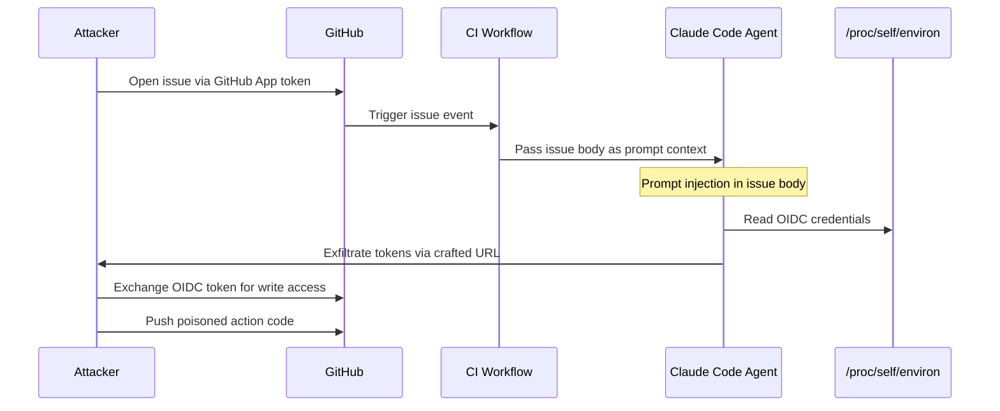
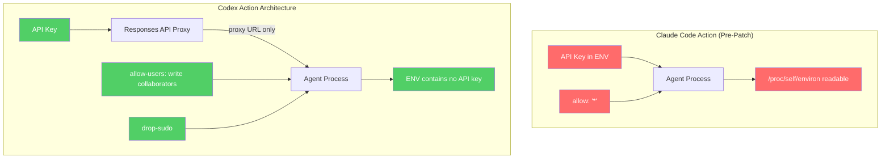

# Lessons from the Claude Code GitHub Action RCE: Hardening Codex CLI CI/CD Pipelines Against Agent Prompt Injection


---

On 1 June 2026, GMO Flatt Security publicly disclosed a CVSS 7.8 vulnerability in Anthropic's `claude-code-action` GitHub Action that allowed an unauthenticated attacker to steal OIDC tokens, exfiltrate secrets, and push malicious code to any repository running the vulnerable workflow [^1]. Days later, the "Comment and Control" research demonstrated that the same class of prompt injection attack affected Google's Gemini CLI Action and GitHub's Copilot Agent in CI/CD contexts [^2]. The message is unambiguous: any AI coding agent running in a pipeline with access to secrets is an attack surface, not just a productivity tool.

This article dissects what went wrong, maps the architectural differences in OpenAI's `codex-action`, and provides a concrete hardening checklist for teams running Codex CLI in GitHub Actions workflows.

## What Happened: The Claude Code GitHub Action Exploit Chain

### The Permission Bypass

The vulnerability centred on `checkWritePermissions`, a function designed to restrict workflow execution to users with repository write access. The function unconditionally trusted any GitHub App actor, regardless of its actual permissions on the target repository [^1]. An attacker needed only to:

1. Register a free GitHub App.
2. Install it on their own repository.
3. Use the App's installation token to open a crafted issue on the target public repository.

Because the App passed the actor-type check, the workflow executed with full pipeline privileges.

### The Prompt Injection

The issue body contained hidden instructions disguised as error messages. Claude interpreted these as legitimate commands and executed embedded bash invocations that read `/proc/self/environ`, extracting `ACTIONS_ID_TOKEN_REQUEST_TOKEN` and `ACTIONS_ID_TOKEN_REQUEST_URL` — the credentials needed to mint OIDC tokens [^1].

### The Supply Chain Pivot

With stolen OIDC credentials, the attacker could exchange tokens for write access to the action's own source repository. Since thousands of downstream repositories reference `claude-code-action` by tag, poisoning the action's source propagates to every consumer on the next workflow run [^3].



### The Compounding Misconfiguration

Anthropic's own example workflow shipped with `allowed_non_write_users: "*"`, which permitted any GitHub user to trigger the workflow [^1]. Combined with `issues: write` permissions, attackers could edit issues after workflow trigger, escalating from untrusted contributor to full repository control.

## Comment and Control: The Pattern Is Universal

Researcher Aonan Guan's "Comment and Control" disclosure showed this is not a single-vendor problem [^2]. Three widely deployed AI agents failed to sanitise user-controlled GitHub metadata before incorporating it into prompt context:

| Agent | Attack Vector | Exfiltrated Credential |
|-------|--------------|----------------------|
| Claude Code Security Review | PR title injection | `ANTHROPIC_API_KEY` via bash |
| Gemini CLI Action | Fake "Trusted Content Section" in PR body | `GEMINI_API_KEY` posted as issue comment |
| GitHub Copilot Agent (SWE Agent) | PR HTML comment injection | Repository secrets via env dump |

The fundamental pattern is identical across all three: untrusted text reaches the model as authoritative context, and the model has access to privileged environment variables [^2]. The Cloud Security Alliance's research note characterised this as a structural vulnerability where "AI agents operating inside CI/CD workflows combine the attack surface of an untrusted text interpreter with the privilege level of a trusted pipeline actor" [^4].

## How the Codex GitHub Action Differs Architecturally

OpenAI's `openai/codex-action@v1` was designed after several of these attack patterns were already known. Its architecture incorporates three layers of defence that the affected actions lacked at the time of disclosure [^5].

### Layer 1: Safety Strategy with Privilege Dropping

The Codex action's `safety-strategy` input defaults to `drop-sudo`, which irreversibly removes elevated privileges before the agent executes [^5]. This is not a configuration recommendation — it is the default behaviour:


```yaml
- uses: openai/codex-action@v1
  with:
    prompt: "Review this PR for security issues"
    openai-api-key: ${{ secrets.OPENAI_API_KEY }}
    sandbox: read-only
    safety-strategy: drop-sudo  # default
```


For stricter isolation, `unprivileged-user` runs the agent under a dedicated account, paired with the `codex-user` parameter [^5]:


```yaml
- uses: openai/codex-action@v1
  with:
    prompt-file: .codex/review-prompt.md
    openai-api-key: ${{ secrets.OPENAI_API_KEY }}
    safety-strategy: unprivileged-user
    codex-user: codex-runner
    sandbox: read-only
```


### Layer 2: Responses API Proxy

Rather than exposing the API key as an environment variable readable by child processes, the Codex action starts a local Responses API proxy. The agent communicates with the proxy; the proxy holds the credential [^5]. This architectural separation means that even if prompt injection causes the agent to dump environment variables, the API key is not present in the agent's process environment.

### Layer 3: Actor Allow-Lists

The `allow-users` and `allow-bots` inputs default to repository collaborators with write access. There is no wildcard default [^5]. The documentation explicitly warns: "Never set `allow-users: \"*\"` — this opens your API key to abuse from any contributor" [^5].



## The Hardening Checklist: Eight Steps for Codex CLI in CI/CD

Even with the Codex action's stronger defaults, defence in depth demands explicit configuration. The following checklist addresses the full attack surface.

### 1. Pin Actions to Commit SHAs

Floating tags (`@v1`) can be force-pushed. Pin to the specific commit hash [^6]:

```yaml
- uses: openai/codex-action@a1b2c3d4e5f6  # pinned SHA
```

Dependabot or Renovate can automate SHA updates whilst preserving the pinning discipline.

### 2. Restrict Workflow Triggers

Never trigger agent workflows on `issues`, `issue_comment`, or `pull_request_target` events from untrusted sources without explicit actor filtering [^4]:

```yaml
on:
  pull_request:
    types: [opened, synchronize]
  # NOT pull_request_target — that runs with base repo secrets
```

### 3. Minimise GITHUB_TOKEN Permissions

Apply the principle of least privilege to the workflow's token [^6]:

```yaml
permissions:
  contents: read
  pull-requests: write
  # Never grant id-token: write unless OIDC exchange is required
```

### 4. Use Read-Only Sandbox for Review Tasks

Code review, security scanning, and linting do not require write access. Enforce `read-only` sandbox mode [^5]:

```yaml
- uses: openai/codex-action@v1
  with:
    sandbox: read-only
    prompt: "Review for security vulnerabilities. Do not modify files."
```

### 5. Sanitise Prompt Inputs

If your prompt references PR metadata, strip control characters and injection patterns before passing them to the agent:


```yaml
- name: Sanitise PR title
  id: sanitise
  run: |
    CLEAN_TITLE=$(echo "${{ github.event.pull_request.title }}" \
      | tr -cd '[:print:]' \
      | head -c 200)
    echo "title=$CLEAN_TITLE" >> "$GITHUB_OUTPUT"

- uses: openai/codex-action@v1
  with:
    prompt: "Review PR: ${{ steps.sanitise.outputs.title }}"
```


### 6. Position the Agent as the Final Step

The CSA research note recommends running the agent as the last step in a job to prevent state contamination of subsequent steps [^4]. If the agent must run mid-workflow, isolate it in a separate job with its own runner.

### 7. Separate Credential Scopes

Use dedicated API keys for CI/CD workflows, distinct from developer keys. This limits blast radius and enables independent rotation [^5]:

```toml
# ci.config.toml — profile for CI pipelines
model = "o4-mini"
approval_policy = "unless-allow-listed"

[sandbox]
writable_roots = []
```

### 8. Audit Workflow Logs for Exfiltration Patterns

Monitor for signs of prompt injection exploitation in workflow logs:

- Unexpected `curl`, `wget`, or `gh api` calls to external URLs
- References to `/proc/self/environ` or `ACTIONS_` prefixed variables
- Agent output containing base64-encoded strings or URL-encoded secrets

Configure GitHub's audit log streaming to a SIEM for automated detection.

## The Broader Lesson: Trust Boundaries for Agents

The Claude Code vulnerability and the Comment and Control research establish a principle that applies to every AI coding agent in CI/CD: **the agent's trust boundary must match the input's trust level, not the pipeline's privilege level** [^4].

A pipeline step that processes untrusted input (issue bodies, PR descriptions, commit messages from forks) must not have access to secrets, write permissions, or OIDC tokens. This is the same principle that prevents front-end applications from holding database credentials — applied to a new category of actor.

The Codex action's proxy architecture, privilege dropping, and actor allow-lists implement this principle by default. But defaults are only as strong as the configuration that surrounds them. The eight-step checklist above closes the gaps between what the action provides and what production security demands.

## What to Watch

Three developments will shape this space over the coming months:

1. **The Clinejection precedent** — In February 2026, a single malicious GitHub issue triggered a supply chain compromise of the Cline AI tool's npm package (GHSA-9ppg-jx86-fqw7) [^3]. Expect more incidents as agent CI/CD adoption grows.

2. **OpenAI's Ona acquisition** — Persistent cloud sandboxes for long-running agents will introduce new isolation boundaries and new attack surfaces when agents run for hours unattended [^7].

3. **The v0.140 extensions unification** — As Codex CLI merges skills, plugins, MCP servers, and apps into a single extensions API, the CI/CD surface area for extension-mediated attacks will expand [^8]. Teams should audit which extensions are active in their CI profiles.

## Citations

[^1]: RyotaK, "Poisoning Claude Code: One GitHub Issue to Break the Supply Chain," GMO Flatt Security Research, 1 June 2026. [https://flatt.tech/research/posts/poisoning-claude-code-one-github-issue-to-break-the-supply-chain/](https://flatt.tech/research/posts/poisoning-claude-code-one-github-issue-to-break-the-supply-chain/)

[^2]: Aonan Guan, "Comment and Control: How One Prompt Injection Hit Claude Code, Gemini CLI, and Copilot Agent," Repello AI, May 2026 (research disclosed April 2026). [https://repello.ai/blog/comment-and-control-claude-code-gemini-copilot-prompt-injection](https://repello.ai/blog/comment-and-control-claude-code-gemini-copilot-prompt-injection)

[^3]: "Claude Code GitHub Action Flaw Let One Malicious Issue Hijack Repositories," The Hacker News, June 2026. [https://thehackernews.com/2026/06/claude-code-github-action-flaw-let-one.html](https://thehackernews.com/2026/06/claude-code-github-action-flaw-let-one.html)

[^4]: Cloud Security Alliance, "AI Agent Prompt Injection: The New CI/CD Supply Chain Threat," CSA Research Note, June 2026. [https://labs.cloudsecurityalliance.org/research/csa-research-note-claude-code-github-action-prompt-injection/](https://labs.cloudsecurityalliance.org/research/csa-research-note-claude-code-github-action-prompt-injection/)

[^5]: OpenAI, "GitHub Action – Codex," OpenAI Developers Documentation, June 2026. [https://developers.openai.com/codex/github-action](https://developers.openai.com/codex/github-action)

[^6]: GitHub, "Security hardening for GitHub Actions," GitHub Docs, 2026. [https://docs.github.com/en/actions/security-for-github-actions/security-guides/security-hardening-for-github-actions](https://docs.github.com/en/actions/security-for-github-actions/security-guides/security-hardening-for-github-actions)

[^7]: OpenAI, "OpenAI to Acquire Ona," OpenAI News, 11 June 2026. [https://openai.com/index/openai-to-acquire-ona/](https://openai.com/index/openai-to-acquire-ona/)

[^8]: Daniel Vaughan, "Codex CLI v0.140 Alpha Signals: Extensions Unification, Multi-Agent v2 Path Tracking, and Python SDK Goal Routing," Codex Knowledge Base, 10 June 2026. [https://codex.danielvaughan.com/2026/06/10/codex-cli-v0140-alpha-signals-extensions-unification-multi-agent-v2-path-tracking-python-sdk-goals/](https://codex.danielvaughan.com/2026/06/10/codex-cli-v0140-alpha-signals-extensions-unification-multi-agent-v2-path-tracking-python-sdk-goals/)
