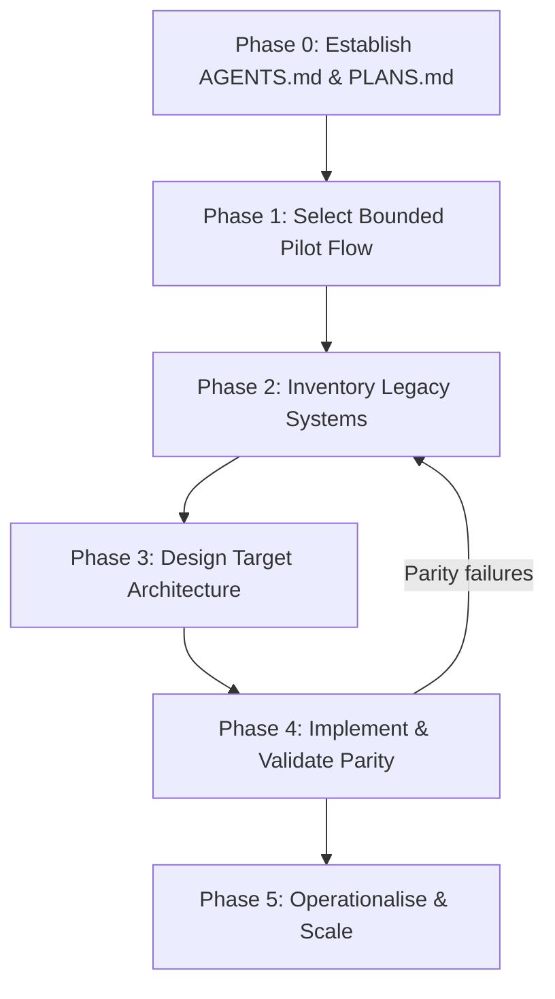
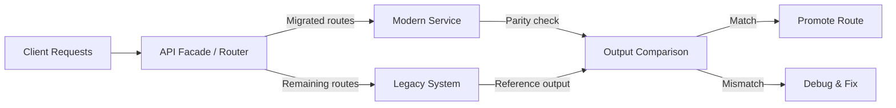

# Legacy Code Modernisation with Codex CLI: The Strangler Fig Pattern, ExecPlans, and Parity-First Migration Workflows


---

Large-scale code modernisation remains one of the highest-stakes engineering tasks a team can undertake. A 2026 Leidos case study demonstrated that AI-assisted Oracle-to-PostgreSQL migration completed 80–90 per cent of the mechanical translation in minutes, with the remaining 10–20 per cent requiring senior engineering review[^1]. That ratio — fast mechanical throughput gated by careful human judgement — is precisely the dynamic Codex CLI is built to exploit. This article walks through a practitioner's workflow for modernising legacy codebases using Codex CLI, combining the strangler fig architectural pattern with ExecPlan-driven planning and parity-first validation.

## Why Agents Amplify Good Process (and Bad)

Before reaching for any tool, the critical insight from Sourcegraph's 2026 modernisation guide bears repeating: "AI amplifies good processes and bad processes equally. A team without tests, search, or observability gets worse output, not better, when they layer agents on top."[^1]

Codex CLI is not a magic wand for legacy modernisation. What it provides is a structured agent loop that can follow documented plans, execute mechanical transformations at speed, and surface mismatches between legacy and modern behaviour — provided your process gives it the right scaffolding.

## The Five-Phase Framework

OpenAI's official Codex Cookbook documents a five-phase modernisation methodology built around ExecPlans[^2]. Each phase produces concrete artefacts that the next phase consumes:



### Phase 0: Bootstrap Your Agent Contract

Before touching legacy code, establish the planning contract that governs how Codex operates during the migration. Create two files in `.agent/`:

```toml
# .agent/AGENTS.md excerpt
## Migration Rules
- Never modify legacy source files — they are read-only reference
- All modern code goes under modern/<language>/
- Every implementation change must have a corresponding parity test
- Reference original source locations in comments (e.g., "See COBOL COMPUTE-BALANCE paragraph")
- Run characterisation tests after every milestone
```

The `PLANS.md` file defines the ExecPlan format — a structured document that Codex follows to deliver a working feature or system change[^3]. Each ExecPlan spells out scope, milestones, validation criteria, and rollback options.

### Phase 1: Select a Bounded Pilot

The single most important decision is choosing the right pilot flow. Use Codex to survey the codebase:

```bash
codex exec --sandbox read-only \
  "Look through this repository and propose two candidate pilot flows for modernisation. For each, list: programs involved, orchestration, business scenario, and your recommendation. Prefer flows that are bounded, testable, and representative."
```

A good pilot is small enough to complete in days, complex enough to reveal integration challenges, and representative enough that patterns transfer to subsequent flows[^4].

### Phase 2: Inventory the Legacy Surface

This phase produces `pilot_overview.md` — a technical inventory that Codex generates by reading through legacy source:

```bash
codex exec --sandbox read-only \
  "Create pilot_reporting_overview.md following .agent/PLANS.md. Include: programs and copybooks grouped by type, JCL jobs and steps, data sets or tables, and a text diagram showing sequences and data flows."
```

For COBOL-to-Java or COBOL-to-Python migrations specifically, Codex reads through programs, JCL scripts, and VSAM file definitions, extracting business logic and documenting hidden dependencies[^5]. The inventory becomes the ground truth that all subsequent design decisions reference.

### Phase 3: Design the Target

With the inventory complete, Codex drafts `pilot_design.md` covering service ownership, data models, and public APIs:

```bash
codex exec --sandbox read-only \
  --output-schema ./design-schema.json \
  "Based on pilot_reporting_overview.md, draft pilot_reporting_design.md with: target service design, target data model, and API design overview. Then generate an OpenAPI spec at modern/openapi/pilot.yaml."
```

The `--output-schema` flag ensures structured, parseable output when you need to feed design artefacts into downstream automation[^6].

### Phase 4: Implement with Parity Gates

This is where the strangler fig pattern meets agent-assisted implementation.

## The Strangler Fig Pattern with Codex CLI

The strangler fig pattern — named after vines that gradually envelop and replace host trees — avoids catastrophic big-bang rewrites by building new functionality alongside legacy systems[^1]. A facade routes requests between old and new paths, and traffic migrates incrementally.



### Characterisation Tests: Pin Before You Refactor

Michael Feathers' characterisation test technique captures current system behaviour — including its quirks — so any change to observable behaviour surfaces immediately[^1]. Codex excels at generating these:

```bash
codex exec \
  "Read the legacy reporting module in src/legacy/reports/. Generate characterisation tests that capture current input-output behaviour for all public interfaces. Use golden-file comparisons. Save to tests/characterisation/"
```

The critical instruction in your AGENTS.md: **never modify existing tests unless explicitly asked**. Codex may otherwise make tests pass by weakening assertions rather than fixing implementation bugs[^7].

### The Migration Prompt Pattern

OpenAI's official migration use-case documentation provides a starter prompt template[^4]:

```bash
codex exec \
  "Migrate the reporting module from [legacy stack] to [target stack].
Requirements:
- Inventory legacy assumptions across routing, data models, auth, configuration, build tooling, tests, deployment, and external contracts
- Map old stack to new one; identify what has no direct equivalent
- Propose incremental plan with compatibility layers
- Keep behaviour unchanged unless migration requires it
- Work in milestones and run validation after each
- Keep rollback options visible
- Start by mapping the migration surface and proposing checkpoints"
```

The key principle: keep behaviour unchanged until the migration itself forces a visible change, and name those exceptions explicitly[^4].

### Parity Validation After Every Milestone

After each implementation milestone, run the smallest validation that proves parity[^3]:

```bash
codex exec \
  "Run the characterisation tests in tests/characterisation/ against the modern implementation. Compare outputs line-by-line with the legacy golden files. Report any mismatches with the specific input that triggered them and the relevant source locations in both legacy and modern code."
```

When mismatches appear, Codex can diagnose the root cause:

```bash
codex exec --sandbox read-only \
  "Here is a failing parity test and the relevant legacy COBOL and modern Python code. Explain why outputs differ and propose the smallest change to the modern implementation that aligns it with legacy behaviour."
```

## Configuration for Migration Workflows

### Named Profiles for Migration Phases

Different migration phases have different cost-quality trade-offs. Use named profiles in `~/.codex/config.toml`:

```toml
[profile.inventory]
model = "o3"
reasoning_effort = "high"
# Inventory needs deep code comprehension

[profile.translate]
model = "gpt-5.5"
# Mechanical translation at scale

[profile.review]
model = "o3-pro"
reasoning_effort = "high"
# Architectural review of translated code
```

Switch profiles per phase:

```bash
codex --profile inventory exec "Inventory the legacy billing module..."
codex --profile translate exec "Translate the billing service to Python..."
codex --profile review exec "Review the translated billing service for architectural issues..."
```

The o3-pro model, released to the Responses API on 10 June 2026 at \$20/\$80 per million tokens (input/output), is particularly suited to the review phase where maximum-compute reasoning justifies the premium[^8].

### Goal Mode for Long-Running Migrations

For migration slices that span multiple turns, Goal Mode (GA since v0.133, May 2026) keeps Codex working towards defined objectives across sessions[^9]:

```bash
codex --profile translate \
  "Migrate the payment processing flow from COBOL to Python following pilot_payments_execplan.md. Validate parity after each milestone."
```

Within the TUI, use `/goal` to set the migration objective and let Codex work autonomously through the ExecPlan milestones.

### Hooks for Migration Safety

Configure hooks in `~/.codex/config.toml` to enforce migration-specific guardrails:

```toml
[[hooks]]
event = "PostToolUse"
type = "command"
command = "python scripts/check_legacy_untouched.py"
# Fails if any legacy source file was modified

[[hooks]]
event = "Stop"
type = "command"
command = "python scripts/run_parity_tests.py"
# Runs characterisation tests before session ends
```

## Repository Structure

The OpenAI Cookbook recommends this layout for modernisation projects[^2]:

```
.agent/
  AGENTS.md              # Agent behaviour contract
  PLANS.md               # ExecPlan format specification
pilot_execplan.md        # Scoped migration plan
pilot_overview.md        # Legacy inventory
pilot_design.md          # Target architecture
pilot_validation.md      # Parity test plan
modern/
  openapi/
    pilot.yaml           # API specification
  python/
    pilot/
      models.py          # Domain models
      repositories.py    # Data access
      services.py        # Business logic
  tests/
    pilot_parity_test.py # Parity validation
tests/
  characterisation/      # Golden-file legacy behaviour tests
```

## Scaling Beyond the Pilot

Once the pilot succeeds, create `template_modernisation_execplan.md` — a reusable ExecPlan template with placeholder sections for inventory, design, and validation[^2]. Each subsequent flow copies the template, and the patterns compound.

For large-scale migrations across multiple teams, combine ExecPlans with `codex exec` in CI/CD pipelines:

```bash
# CI job: validate parity for all migrated flows
for flow in payments reporting billing; do
  codex exec --sandbox read-only \
    --output-schema ./parity-report-schema.json \
    "Run parity tests for the ${flow} flow and report results" \
    > "reports/${flow}-parity.json"
done
```

## Where Codex CLI Struggles

Honest assessment matters more than enthusiasm. Codex CLI handles mechanical translation well but struggles with[^1]:

- **Unstated business knowledge** — rules that exist only in tribal knowledge or comments written decades ago
- **Long-horizon architectural judgement** — deciding whether to preserve a legacy pattern or replace it with a modern idiom
- **Hidden coupling outside source trees** — cron jobs, infrastructure-as-code, runbooks, and operational procedures that reference legacy systems
- **Load-bearing quirks** — behaviour that looks like a bug but is actually relied upon by downstream systems

For each of these, the answer is the same: document it in the ExecPlan before asking Codex to act. The agent follows plans; it cannot invent institutional knowledge.

## Practical Checklist

1. **Establish `.agent/AGENTS.md`** with migration-specific rules (legacy read-only, parity gates, comment provenance)
2. **Write characterisation tests** before any modernisation work begins
3. **Create a bounded ExecPlan** for the pilot flow
4. **Inventory with `--sandbox read-only`** to prevent accidental legacy modification
5. **Translate in milestones** using the migration prompt pattern
6. **Validate parity** after every milestone with golden-file comparisons
7. **Use named profiles** to route inventory to o3, translation to GPT-5.5, and review to o3-pro
8. **Configure hooks** to enforce legacy immutability and parity test execution
9. **Template the ExecPlan** for subsequent flows
10. **Never skip human review** on the 10–20 per cent that requires architectural judgement

## Citations

[^1]: Sourcegraph, "Legacy Code Modernization: A Practical Guide for Engineering Teams," 2026. [https://sourcegraph.com/blog/legacy-code-modernization](https://sourcegraph.com/blog/legacy-code-modernization)

[^2]: OpenAI, "Modernizing your Codebase with Codex," OpenAI Cookbook, 2026. [https://developers.openai.com/cookbook/examples/codex/code_modernization](https://developers.openai.com/cookbook/examples/codex/code_modernization)

[^3]: OpenAI, "Using PLANS.md for multi-hour problem solving," OpenAI Cookbook, 2026. [https://developers.openai.com/cookbook/articles/codex_exec_plans](https://developers.openai.com/cookbook/articles/codex_exec_plans)

[^4]: OpenAI, "Run code migrations — Codex use cases," OpenAI Developers, 2026. [https://developers.openai.com/codex/use-cases/code-migrations](https://developers.openai.com/codex/use-cases/code-migrations)

[^5]: AWS, "Reimagining mainframe applications with AWS Transform and Claude Code," AWS Blog, 2026. [https://aws.amazon.com/blogs/migration-and-modernization/reimagining-mainframe-applications-with-aws-transform-and-claude-code/](https://aws.amazon.com/blogs/migration-and-modernization/reimagining-mainframe-applications-with-aws-transform-and-claude-code/)

[^6]: OpenAI, "Command line options — Codex CLI," OpenAI Developers, 2026. [https://developers.openai.com/codex/cli/reference](https://developers.openai.com/codex/cli/reference)

[^7]: Agensi, "Best Testing Skills for Codex CLI: QA & Test Generation (2026)," 2026. [https://www.agensi.io/learn/best-testing-skills-codex-cli](https://www.agensi.io/learn/best-testing-skills-codex-cli)

[^8]: OpenAI, "o3-pro model release," June 2026. Model available via Responses API at \$20/\$80 per million tokens. ⚠️ Pricing confirmed from multiple sources but may have changed since publication.

[^9]: OpenAI, "Codex CLI v0.133 release — Goal Mode GA," May 2026. [https://releasebot.io/updates/openai/codex](https://releasebot.io/updates/openai/codex)
