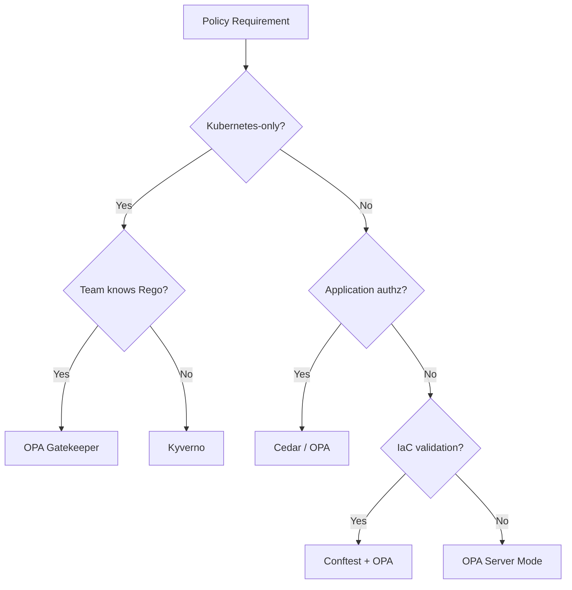

# Codex CLI for Policy-as-Code: Agent-Assisted OPA Rego, Kyverno, and Conftest Authoring for Infrastructure Compliance


---

## The Rego Tax and Why Agents Matter

Platform engineering teams face a persistent bottleneck: writing, testing, and maintaining policy-as-code. Red Hat's March 2026 research coined the term "Rego tax" — the cognitive and time overhead of manually authoring OPA policies for every new compliance requirement [^1]. With organisations juggling NIST AI Agent Standards (February 2026) [^2], the EU Cyber Resilience Act, and internal governance mandates, policy backlogs grow faster than teams can address them.

Codex CLI transforms this workflow. Rather than hand-crafting Rego rules from scratch, a senior engineer can describe the intent — "deny pods without resource limits in production namespaces" — and let GPT-5.5 generate syntactically correct, testable policy code. The agent handles the boilerplate; the engineer reviews the logic.

This article covers three policy-as-code frameworks (OPA/Rego, Kyverno, Conftest), demonstrates practical Codex CLI workflows for each, and establishes the guardrails that prevent policy hallucination from becoming a production incident.

## Architecture: Where Codex CLI Fits in the Policy Lifecycle

```mermaid
flowchart LR
    A[Compliance Requirement] --> B[Codex CLI: Policy Generation]
    B --> C[Unit Tests via OPA test / Kyverno CLI]
    C --> D[conftest verify against sample resources]
    D --> E[Code Review & Merge]
    E --> F[CI Enforcement: terraform plan | conftest]
    E --> G[Admission Control: Gatekeeper / Kyverno]

    style B fill:#e8f4fd,stroke:#0078d4
```

Codex CLI operates at stage B — the generation phase — but its value compounds when integrated with the testing and verification stages that follow. The key principle: **never deploy agent-generated policy without automated verification**.

## OPA Rego: Agent-Assisted Policy Authoring

### Configuration

Create a dedicated profile for policy work in `~/.codex/config.toml`:

```toml
[profiles.policy]
model = "gpt-5.5"
model_reasoning_effort = "high"
approval_policy = "unless-allow-listed"
sandbox_permissions = "read-only"
```

The `read-only` sandbox prevents the agent from accidentally modifying existing policies during generation. High reasoning effort matters for Rego because the language's logic-programming semantics benefit from extended chain-of-thought.

### AGENTS.md Conventions for Policy Repositories

```markdown
# Policy Repository Conventions

## Rego Style
- Use `package` declarations matching directory structure
- Every `deny` rule MUST have a corresponding `test_deny_*` in `*_test.rego`
- Prefer `deny[msg]` with descriptive messages over boolean `deny`
- Use `input.review.object` for Gatekeeper constraint templates
- Pin OPA compatibility to v1 syntax (no deprecated `import future.keywords`)

## Testing Requirements
- All policies must pass `opa test ./policies/ -v` before merge
- Use `conftest verify` against fixtures in `testdata/`
- Coverage threshold: 90% (enforced by CI)

## Output Format
- When generating constraint templates, include both the Rego
  and the Kubernetes ConstraintTemplate YAML wrapper
```

### Interactive Policy Generation

```bash
codex -p policy
```

Then prompt:

> Write an OPA Gatekeeper constraint template that denies any Deployment in namespaces labelled `env: production` if the container image tag is `latest` or missing. Include unit tests.

Codex CLI generates both the Rego source and the `ConstraintTemplate` Kubernetes manifest. The critical follow-up:

```bash
opa test ./policies/ -v
```

### Non-Interactive Pipeline Generation

For batch policy generation from a compliance matrix:

```bash
codex exec -p policy \
  --sandbox read-only \
  --output-schema ./schemas/policy-output.json \
  "Read the compliance requirements in requirements/cis-k8s-1.9.csv and generate OPA Rego policies for each control that lacks coverage. Output as JSON with fields: control_id, policy_file_path, rego_content, test_content"
```

The `--output-schema` flag ensures structured output that a downstream script can parse and write to the correct file paths [^3].

## Kyverno: YAML-Native Policy Generation

Kyverno appeals to teams that want Kubernetes-native policies without learning Rego [^4]. Its YAML-based syntax is more amenable to agent generation because GPT-5.5 has extensive training data for Kubernetes manifests.

### Generation Pattern

```bash
codex exec -p policy \
  "Generate a Kyverno ClusterPolicy that:
   1. Validates all Pods have the label 'team' set
   2. Mutates Deployments to add a default resource request of 100m CPU and 128Mi memory if not specified
   3. Generates a NetworkPolicy denying all ingress for any new namespace
   Include kyverno test manifests for each rule."
```

### Validation with Kyverno CLI

```bash
kyverno apply ./policies/ --resource ./testdata/valid-pod.yaml
kyverno apply ./policies/ --resource ./testdata/invalid-pod.yaml
kyverno test ./policies/
```

### PostToolUse Hook for Policy Validation

Add automatic validation after every file write in your policy repository:

```toml
[[hooks]]
event = "PostToolUse"
tool = "apply_patch"
command = "bash -c 'if [[ \"$CODEX_FILE_PATH\" == *.yaml ]] && grep -q \"kind: ClusterPolicy\" \"$CODEX_FILE_PATH\" 2>/dev/null; then kyverno validate ./policies/ 2>&1 | tail -5; fi'"
timeout_ms = 10000
```

This ensures the agent receives immediate feedback if generated YAML is syntactically invalid [^5].

## Conftest: Pre-Deployment Policy Gates

Conftest validates any structured configuration against Rego policies — Terraform plans, Dockerfiles, Kubernetes manifests, and Helm values [^6]. It bridges the gap between policy authoring and CI enforcement.

### Terraform Plan Validation Workflow

```bash
# Generate the plan
terraform plan -out=tfplan
terraform show -json tfplan > tfplan.json

# Validate against policies
conftest test tfplan.json --policy ./policies/terraform/

# Or use Codex to generate the policy first
codex exec -p policy \
  "Write a Conftest Rego policy (package terraform.aws) that denies any aws_s3_bucket resource missing server_side_encryption_configuration. Include a test file with a passing and failing fixture."
```

### CI Integration Pattern

```yaml
# .github/workflows/policy-check.yaml
name: Policy Validation
on: [pull_request]
jobs:
  conftest:
    runs-on: ubuntu-latest
    steps:
      - uses: actions/checkout@v4
      - uses: open-policy-agent/conftest-action@v3
        with:
          files: tfplan.json
          policy: policies/terraform/
      - name: OPA Unit Tests
        run: opa test ./policies/ -v --threshold 90
```

## The Policy Hallucination Problem

Agent-generated policies carry a specific risk: **logical correctness without semantic correctness**. A Rego rule can be syntactically valid, pass unit tests, yet enforce the wrong constraint because the agent misunderstood the compliance requirement.

### Defence Patterns

1. **Mandatory test fixtures** — AGENTS.md instructs the agent to generate both valid and invalid test resources for every policy. If the agent cannot articulate what should be denied, the policy is suspect.

2. **Negative testing** — Require tests that explicitly verify the policy *allows* legitimate resources. False-positive policies that block valid deployments are operationally worse than missing policies.

3. **Policy review checklist** — Add a Stop hook that outputs a verification prompt:

```toml
[[hooks]]
event = "Stop"
command = "echo '⚠️ POLICY REVIEW: Verify (1) test coverage ≥90%, (2) deny messages are actionable, (3) no overly broad resource matching'"
```

4. **Staged rollout** — Generate policies in `audit` mode first (Gatekeeper) or `Audit` action (Kyverno) before switching to enforcement [^7].

## Model Selection for Policy Work

| Task | Recommended Model | Reasoning |
|------|------------------|-----------|
| Rego generation (complex logic) | GPT-5.5 | Benefits from extended reasoning for logic programming |
| Kyverno YAML generation | GPT-5.5 or Codex-Spark | YAML generation is well-suited to faster models |
| Policy review and audit | o3 | Deep reasoning catches logical errors in existing policies |
| Bulk policy migration | GPT-5.4-mini | Cost-efficient for repetitive transformations |

Configure model routing via profiles:

```toml
[profiles.policy-review]
model = "o3"
model_reasoning_effort = "high"

[profiles.policy-bulk]
model = "gpt-5.4-mini"
model_reasoning_effort = "medium"
```

## Practical Recipe: CIS Kubernetes Benchmark Coverage

A common task: generating policies for all uncovered CIS Kubernetes Benchmark controls.

```bash
codex exec -p policy \
  --output-schema ./schemas/cis-gap-analysis.json \
  "Compare the CIS Kubernetes Benchmark 1.9 controls against the existing policies in ./policies/kubernetes/. Identify controls without coverage. For each gap, output: control_id, control_description, suggested_policy_type (gatekeeper|kyverno), and complexity (low|medium|high)."
```

Then iterate through the gaps:

```bash
for control in $(jq -r '.[].control_id' gaps.json); do
  codex exec -p policy \
    "Generate a Gatekeeper constraint template for CIS control $control. Include unit tests and a testdata fixture."
done
```

⚠️ Agent-generated CIS mappings should be verified against the published benchmark document. GPT-5.5 occasionally conflates control numbers from different benchmark versions.

## Codex CLI Skills for Policy Repositories

Create a reusable skill at `.codex/skills/policy-gen.md`:

```markdown
# Policy Generation Skill

When asked to generate a policy:
1. Identify the target framework (OPA/Gatekeeper, Kyverno, Conftest)
2. Write the policy with descriptive deny messages
3. Write unit tests with ≥2 valid and ≥2 invalid fixtures
4. Run `opa test` or `kyverno test` to verify
5. Output a summary of what the policy enforces and its scope
```

## OPA vs Kyverno vs Cedar: When to Use Each



Cedar, maintained by AWS, targets fine-grained application authorisation and is gaining adoption for MCP access control [^8]. For infrastructure compliance, OPA and Kyverno remain the dominant choices in June 2026.

## Limitations and Cautions

- **Rego v1 syntax awareness** — GPT-5.5 occasionally generates deprecated `import future.keywords` syntax rather than native v1 patterns. Pin your AGENTS.md to specify v1 explicitly [^9].
- **Constraint template scope** — Agent-generated `match` blocks may be overly broad (matching all namespaces when only production is intended). Always review resource selectors.
- **Policy interaction** — The agent generates policies in isolation. It cannot predict how a new policy interacts with existing deny rules unless you provide the full policy set as context.
- **Kyverno version sensitivity** — Kyverno's policy API evolved significantly between 1.x and 2.x. Specify the target version in your prompt.

## Citations

[^1]: Red Hat Emerging Technologies, "Eliminating the 'Rego tax': How AI orchestrators automate Kubernetes compliance", March 2026. https://next.redhat.com/2026/03/20/eliminating-the-rego-tax-how-ai-orchestrators-automate-kubernetes-compliance/

[^2]: NIST AI Agent Standards Initiative, February 2026. Referenced in CodiLime, "Why Open Policy Agent is the Missing Guardrail for Your AI Agents". https://codilime.com/blog/why-use-open-policy-agent-for-your-ai-agents/

[^3]: OpenAI Codex CLI Documentation, "Command line options — `--output-schema`". https://developers.openai.com/codex/cli/reference

[^4]: CNCF Blog, "Policy-as-Code: Flexible Kubernetes governance with Kyverno", March 2026. https://www.cncf.io/blog/2026/03/19/policy-as-code-flexible-kubernetes-governance-with-kyverno/

[^5]: OpenAI Codex CLI Documentation, "Hooks". https://developers.openai.com/codex/cli/features

[^6]: Conftest 2026 Reference. https://appsecsanta.com/conftest

[^7]: OPA Gatekeeper Documentation, "Audit Mode". https://www.openpolicyagent.org/docs/latest/

[^8]: Natoma AI, "MCP Access Control: OPA vs Cedar — The Definitive Guide". https://natoma.ai/blog/mcp-access-control-opa-vs-cedar-the-definitive-guide

[^9]: OPA v1.0 Migration Guide, Rego v1 syntax. https://www.openpolicyagent.org/docs/latest/
