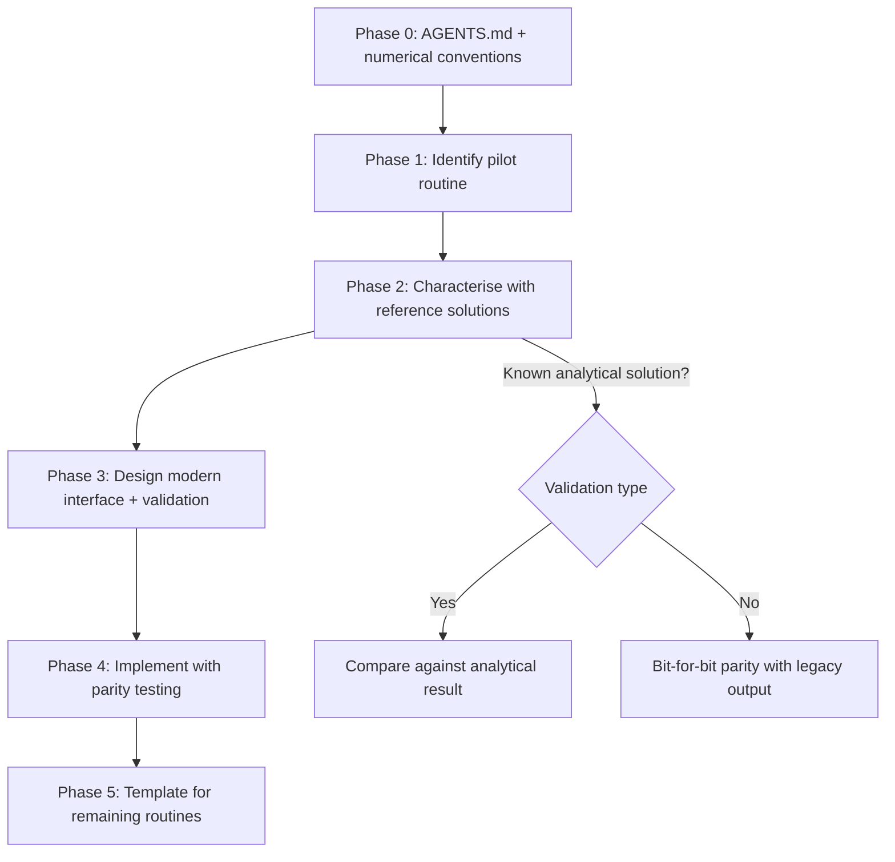
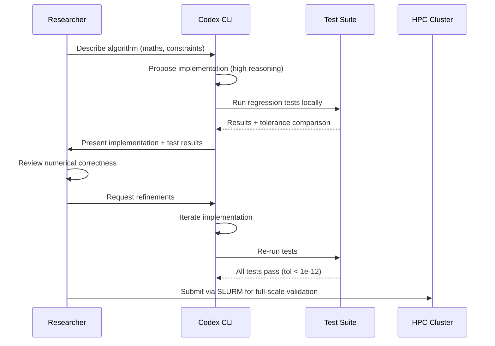

# Codex CLI for Scientific Computing: From Black Hole Simulations to Reproducible Research Pipelines


---

When OpenAI published its case study on 11 June 2026 showing how astrophysicist Chi-kwan Chan uses Codex to derive candidate algorithms for black hole plasma simulations, it revealed something the developer tooling community has been slow to acknowledge: Codex CLI is quietly becoming a serious instrument for computational science[^1]. Chan, an associate astronomer at the University of Arizona's Steward Observatory and secretary of the Event Horizon Telescope Science Council, uses Codex to propose and implement numerical schemes for general relativistic magnetohydrodynamic (GRMHD) simulations — then inspects, tests, and validates them against known solutions[^2].

This article examines how to configure Codex CLI for scientific computing workflows, covering everything from AGENTS.md conventions for research codebases to MCP server integration with scientific tool ecosystems.

## Why Scientific Code Is Different

Scientific codebases present challenges that commercial software rarely encounters:

- **Mixed-language stacks**: A single project might span Fortran 90 kernels, C++ solver infrastructure, Python analysis scripts, and shell-based job schedulers[^3].
- **Correctness over coverage**: Unit tests exist, but validation often depends on comparison against analytical solutions, convergence studies, or reference datasets rather than simple assertion-based tests.
- **Legacy gravity**: Critical numerical routines may date back decades. Rewriting is risky because subtle floating-point behaviour can affect scientific conclusions.
- **Reproducibility requirements**: Results must be reproducible across compilers, architectures, and MPI configurations.

Codex CLI's sandbox execution model, configurable reasoning effort, and support for arbitrary shell commands make it well suited to these constraints — provided the configuration is right.

## Configuring AGENTS.md for Research Repositories

A well-structured `AGENTS.md` for a scientific codebase differs materially from a typical web application's. Here is a template drawn from patterns that work across computational physics, bioinformatics, and climate modelling projects:

```markdown
# AGENTS.md — Plasma Simulation Project

## Repository Structure
- `src/fortran/` — Core GRMHD solver (Fortran 2018, compiled with gfortran 13+)
- `src/cpp/` — Ray-tracing and post-processing (C++20, CMake)
- `scripts/python/` — Analysis pipelines (Python 3.12, NumPy, SciPy, Matplotlib)
- `tests/regression/` — Reference output comparisons (tolerance: 1e-12)
- `jobs/` — SLURM job scripts for HPC submission
- `docs/` — LaTeX source for methodology papers

## Build and Test
- Build: `cmake -B build -S src/cpp && cmake --build build`
- Fortran: `make -C src/fortran`
- Test: `pytest tests/ -x --tb=short`
- Regression: `python tests/regression/compare.py --tolerance 1e-12`

## Conventions
- All numerical constants must use named parameters, never magic numbers
- Fortran routines use `implicit none` and `intent` declarations
- Python analysis scripts must include docstrings with units
- Floating-point comparisons use relative tolerance, never exact equality
- Do NOT modify reference datasets in tests/regression/data/
```

The critical difference from a standard software project is the emphasis on numerical conventions, tolerance thresholds, and the explicit prohibition against modifying reference data. Without these constraints, Codex may "fix" a failing regression test by updating the expected output rather than correcting the code[^4].

## Reasoning Effort for Algorithmic Tasks

Scientific algorithm development — deriving discretisation schemes, implementing boundary conditions, or translating mathematical notation into code — demands higher reasoning effort than typical software engineering tasks[^5].

```toml
# ~/.codex/profiles/research.config.toml
model = "o3"
reasoning_effort = "high"

[history]
model_auto_compact_token_limit = 90000
```

For exploratory work where Codex proposes candidate algorithms (as in Chan's workflow), `o3` with high reasoning effort is the appropriate choice. The model's extended chain-of-thought reasoning catches subtle mathematical errors that `gpt-5.5` at medium effort would miss[^6].

For routine tasks — reformatting data files, writing plotting scripts, updating documentation — switch to a lighter profile:

```toml
# ~/.codex/profiles/analysis.config.toml
model = "gpt-5.5"
reasoning_effort = "medium"
```

Named profiles let researchers switch context without editing configuration:

```bash
codex --profile research "Derive a second-order TVD scheme for the advection equation"
codex --profile analysis "Plot the convergence rate from results/convergence.csv"
```

## MCP Server Integration for Scientific Tools

The Model Context Protocol opens Codex CLI to domain-specific tool ecosystems. Harvard's Zitnik Lab has built ToolUniverse, a comprehensive MCP-based scientific tools platform that provides Codex with access to drug discovery databases, genomics tools, and literature search capabilities[^7].

```toml
# ~/.codex/config.toml
[mcp]

[mcp.tooluniverse]
command = "npx"
args = ["-y", "@tooluniverse/mcp-server"]

[mcp.filesystem]
command = "npx"
args = ["-y", "@modelcontextprotocol/server-filesystem", "/data/simulations"]
```

For data-intensive research, connecting to a data platform MCP server enables natural-language querying of experimental datasets without leaving the Codex session:

```toml
[mcp.duckdb]
command = "npx"
args = ["-y", "duckdb-mcp-server", "--db", "/data/experiments.duckdb"]
```

⚠️ Keep MCP server count minimal. OpenAI's best practices documentation warns that attaching too many MCP servers degrades model performance[^8]. For scientific workflows, two or three targeted servers outperform a sprawling collection.

## The Jupyter Notebook Problem

Codex CLI's relationship with Jupyter notebooks remains fraught. The `.ipynb` format — JSON containing code cells, outputs, and metadata — frequently causes Codex to produce malformed files[^9]. The current workarounds:

1. **Convert to scripts first**: Use `jupyter nbconvert --to script notebook.ipynb` before asking Codex to modify the code, then convert back.
2. **Use the JupyterLab sidebar extension**: The `jupyterlab-codex-sidebar` package connects JupyterLab 4 to `codex exec --json`, providing an in-notebook chat interface[^10].
3. **Prefer `.py` files with cell markers**: Use the `# %%` cell delimiter convention (supported by VS Code, JupyterLab, and Spyder) instead of `.ipynb` files.

```bash
# Convert notebook to percent-format script
jupytext --to py:percent analysis.ipynb
# Now Codex can safely edit analysis.py
codex "Add error bars to the convergence plot in analysis.py"
# Convert back when needed
jupytext --to notebook analysis.py
```

## Legacy Scientific Code Modernisation

The five-phase ExecPlan framework from OpenAI's Cookbook applies directly to scientific code modernisation[^11], but with domain-specific adaptations:



The critical addition for scientific code is Phase 2's emphasis on characterisation. Before modernising a Fortran routine, you need reference outputs that serve as ground truth. Codex can generate the test harness:

```bash
codex "Create a Python test harness that runs the Fortran binary \
  with inputs from tests/regression/data/advection_1d.dat, \
  captures stdout, and compares against the reference output \
  with relative tolerance 1e-10"
```

Research from Argonne National Laboratory demonstrates that LLM-assisted translation from legacy Fortran to modern parallel frameworks (such as Kokkos) is viable for fundamental numerical kernels, though human verification of numerical correctness remains essential[^3].

## Reproducibility Hooks

Codex CLI's hook system enables reproducibility enforcement. A `PostToolUse` hook can capture the exact environment state after every code modification:

```toml
# .codex/hooks.toml
[[hooks]]
event = "PostToolUse"
command = "python scripts/capture_env.py"
```

Where `capture_env.py` records:

- Compiler versions (`gfortran --version`, `g++ --version`)
- Python package versions (`pip freeze`)
- Git commit hash
- Environment variables affecting numerical behaviour (`OMP_NUM_THREADS`, `MKL_NUM_THREADS`)

This creates an automatic provenance trail for every Codex-assisted modification — addressing a core requirement for computational reproducibility[^12].

## Practical Workflow: From Hypothesis to Validated Code

Combining these elements, a typical scientific computing session with Codex CLI follows this pattern:



The key insight from Chan's work is that Codex generates *candidate* solutions — it proposes numerical schemes that the researcher then validates against physical understanding and known solutions[^1]. This is precisely the correct workflow: the agent accelerates exploration of the algorithm design space whilst the domain expert retains responsibility for correctness.

## What Does Not Work (Yet)

Honesty about limitations matters for a senior audience:

- **HPC job management**: Codex cannot submit, monitor, or retrieve results from SLURM/PBS job schedulers in real time. The sandbox environment has no access to cluster login nodes.
- **Large binary datasets**: Codex cannot meaningfully inspect HDF5, NetCDF, or FITS files without MCP tools that expose their structure as text.
- **GPU kernel optimisation**: Whilst Codex can write CUDA or HIP kernels, it lacks the ability to profile them. Performance-critical GPU code still requires human expertise with `nsys` or `rocprof`.
- **Cross-node debugging**: MPI debugging remains firmly outside Codex's capability envelope.

## Configuration Checklist

For researchers adopting Codex CLI, this checklist covers the essential setup:

1. **Create domain-specific AGENTS.md** with numerical conventions, tolerance thresholds, and build instructions
2. **Set up named profiles** — `research` (o3, high reasoning) for algorithm work, `analysis` (gpt-5.5, medium) for scripting
3. **Connect relevant MCP servers** — filesystem access to data directories, domain-specific tools (ToolUniverse, DuckDB), limit to three servers maximum
4. **Convert notebooks** to percent-format `.py` files for reliable editing
5. **Add reproducibility hooks** capturing compiler versions and environment state
6. **Protect reference data** via explicit AGENTS.md rules and `.codexignore` entries
7. **Use `codex exec`** for batch processing of data analysis tasks in CI pipelines

## Citations

[^1]: OpenAI, "How an astrophysicist uses Codex to help simulate black holes," openai.com, June 2026. [https://openai.com/index/using-codex-to-simulate-black-holes/](https://openai.com/index/using-codex-to-simulate-black-holes/)

[^2]: Chi-kwan Chan faculty profile, Steward Observatory, University of Arizona. [https://www.as.arizona.edu/people/faculty/chi-kwan-chan](https://www.as.arizona.edu/people/faculty/chi-kwan-chan)

[^3]: M. Khan et al., "From Legacy Fortran to Portable Kokkos: An Autonomous Agentic AI Workflow," arXiv:2509.12443, 2025. [https://arxiv.org/html/2509.12443v1](https://arxiv.org/html/2509.12443v1)

[^4]: OpenAI, "Best practices — Codex," developers.openai.com, 2026. [https://developers.openai.com/codex/learn/best-practices](https://developers.openai.com/codex/learn/best-practices)

[^5]: OpenAI, "Advanced Configuration — Codex," developers.openai.com, 2026. [https://developers.openai.com/codex/config-advanced](https://developers.openai.com/codex/config-advanced)

[^6]: OpenAI, "o3-pro model card," developers.openai.com, June 2026. ⚠️ Specific benchmark comparisons between o3 and gpt-5.5 for mathematical reasoning tasks are based on general model capability assessments; exact scientific code generation benchmarks are not publicly available.

[^7]: Zitnik Lab, Harvard Medical School, "ToolUniverse: GPT Codex CLI Integration," 2026. [https://zitniklab.hms.harvard.edu/ToolUniverse/guide/building_ai_scientists/codex_cli.html](https://zitniklab.hms.harvard.edu/ToolUniverse/guide/building_ai_scientists/codex_cli.html)

[^8]: OpenAI, "Best practices — Codex: MCP server guidance," developers.openai.com, 2026. [https://developers.openai.com/codex/learn/best-practices](https://developers.openai.com/codex/learn/best-practices)

[^9]: OpenAI Developer Community, "Codex working with Jupyter notebook .ipynb files," community.openai.com, 2026. [https://community.openai.com/t/codex-working-with-jupyter-notebook-ipynb-files/1260513](https://community.openai.com/t/codex-working-with-jupyter-notebook-ipynb-files/1260513)

[^10]: jupyterlab-codex-sidebar, PyPI, 2026. [https://pypi.org/project/jupyterlab-codex-sidebar/](https://pypi.org/project/jupyterlab-codex-sidebar/)

[^11]: OpenAI, "Modernizing your Codebase with Codex," OpenAI Cookbook, 2026. [https://developers.openai.com/cookbook/examples/codex/code_modernization](https://developers.openai.com/cookbook/examples/codex/code_modernization)

[^12]: V. Stodden, M. McNutt, et al., "Enhancing reproducibility for computational methods," Science, vol. 354, no. 6317, 2016. ⚠️ General reproducibility principles applied to Codex CLI hooks; specific Codex-for-science reproducibility studies are not yet published.
