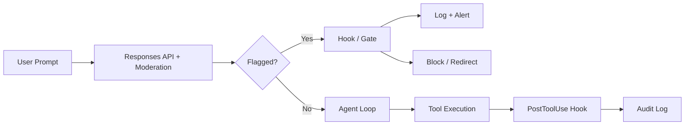
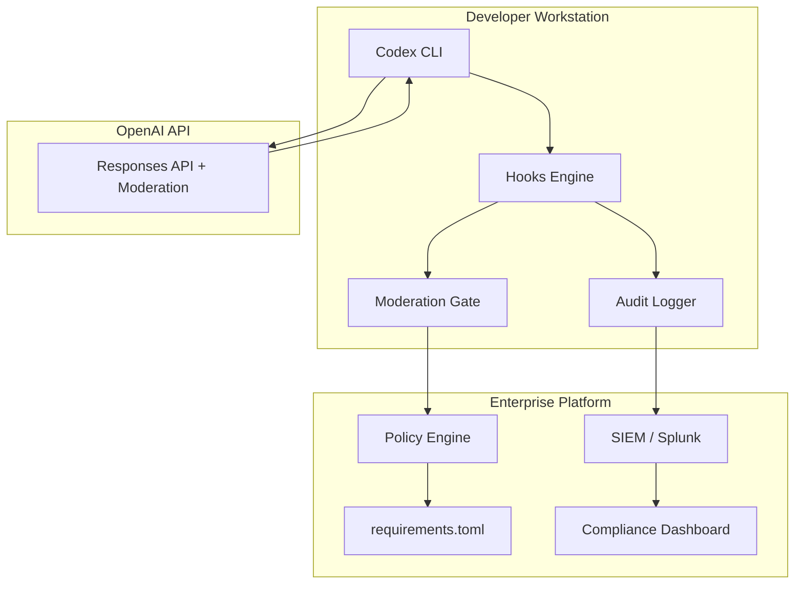

# Inline Moderation Scores in the Responses API: Building Safety-Aware Codex CLI Workflows for Enterprise Governance


---

On 4 June 2026, OpenAI shipped inline moderation scores in the Responses API and Chat Completions API [^1]. The feature lets you request content-safety classifications for both the user input and the model's generated output inside the same API call that produces the response — no second round-trip to the standalone Moderation endpoint required. For Codex CLI practitioners, this matters because every CLI session already speaks the Responses API under the hood [^2]. The moderation signal is now available at the wire level, and the question becomes: how do you surface it, act on it, and log it across your agent workflows?

This article walks through the mechanics of inline moderation, maps them to the Codex CLI hooks system, and presents concrete patterns for enterprise governance — from automated post-generation screening to compliance audit trails.

## What Inline Moderation Actually Does

Before 4 June, checking whether model output violated a content policy meant calling the `/v1/moderations` endpoint separately after generation [^3]. That worked, but it introduced latency, doubled your API calls, and left a gap: by the time the moderation result came back, the agent had already moved on to the next tool call.

Inline moderation collapses the two-step flow into one. You add a `moderation` object to your Responses API request:

```python
response = client.responses.create(
    model="gpt-5.5",
    input=[
        {"role": "user", "content": "Refactor the auth module to use JWT"}
    ],
    moderation={"model": "omni-moderation-latest"},
)
```

The response now carries two additional fields [^1]:

- `response.moderation.input` — classification of the user prompt
- `response.moderation.output` — classification of the generated text

Each contains the familiar moderation result structure:

```json
{
  "flagged": false,
  "categories": {
    "harassment": false,
    "hate": false,
    "illicit": false,
    "self-harm": false,
    "sexual": false,
    "violence": false
  },
  "category_scores": {
    "harassment": 0.0002,
    "hate": 0.0001,
    "illicit": 0.0003,
    "self-harm": 0.0000,
    "sexual": 0.0001,
    "violence": 0.0001
  }
}
```

The `omni-moderation-latest` model covers eleven categories and subcategories [^3]. Text-only categories include `harassment/threatening`, `hate/threatening`, `illicit/violent`, and `sexual/minors`. Categories that work on both text and images include `self-harm`, `self-harm/intent`, `self-harm/instructions`, `violence`, `violence/graphic`, and `sexual`.

Tool arguments and tool outputs also receive moderation coverage, which is crucial for Codex CLI's shell-execution model where the real action happens inside Bash tool calls [^1].

## Why This Matters for Codex CLI

Codex CLI's architecture routes every interaction through the Responses API — whether you authenticate via ChatGPT subscription or API key [^2]. The agent loop reads the model response, extracts tool calls (typically Bash commands and file writes), presents them for approval, and executes them inside a sandboxed environment [^4].

Inline moderation sits at the response layer, meaning the safety signal arrives before the agent acts on the output. This opens three practical integration points:



1. **Pre-execution screening** — Inspect `moderation.output` before the agent applies file changes or runs commands.
2. **Post-execution auditing** — Log moderation scores alongside session transcripts for compliance review.
3. **Threshold-based routing** — Route high-scoring outputs to human review rather than autonomous execution.

## Connecting Moderation to the Hooks System

Codex CLI's hooks engine (stable since v0.124.0) provides the event-driven interface to intercept agent actions [^5]. The key hook events for moderation integration are:

| Hook Event | When It Fires | Moderation Use |
|------------|---------------|----------------|
| `UserPromptSubmit` | Before prompt enters conversation | Screen input for policy violations |
| `PreToolUse` | Before tool execution | Gate on output moderation score |
| `PostToolUse` | After tool execution | Log moderation metadata |
| `Stop` | Session ends | Aggregate session-level scores |

### Pattern 1: PostToolUse Moderation Logger

The simplest integration logs moderation scores to a structured audit file after every tool execution. Configure in `~/.codex/config.toml`:

```toml
[[hooks]]
event = "PostToolUse"
command = "/usr/local/bin/moderation-logger.sh"
timeout_ms = 5000
```

The hook script receives the event payload on stdin as JSON. A minimal logger:

```bash
#!/usr/bin/env bash
# moderation-logger.sh — Append moderation scores to audit log
set -euo pipefail

INPUT=$(cat)
TIMESTAMP=$(date -u +"%Y-%m-%dT%H:%M:%SZ")
SESSION_ID=$(echo "$INPUT" | jq -r '.session_id // "unknown"')

# Extract moderation data if present in the response metadata
echo "$INPUT" | jq -c --arg ts "$TIMESTAMP" --arg sid "$SESSION_ID" \
  '{timestamp: $ts, session: $sid, event: .hook_event_name, tool: .tool_name}' \
  >> "${CODEX_AUDIT_DIR:-$HOME/.codex/audit}/moderation.jsonl"
```

### Pattern 2: API-Key Workflows with Explicit Moderation Checks

For `codex exec` automation pipelines using API-key authentication, you can build moderation-aware wrappers that check scores before processing structured output:

```bash
#!/usr/bin/env bash
# safe-exec.sh — Run codex exec with post-hoc moderation check
set -euo pipefail

RESULT=$(codex exec --output-schema schema.json "$1" 2>/dev/null)

# Call moderation on the output
MODERATION=$(curl -s https://api.openai.com/v1/moderations \
  -H "Authorization: Bearer $OPENAI_API_KEY" \
  -H "Content-Type: application/json" \
  -d "{\"model\": \"omni-moderation-latest\", \"input\": $(echo "$RESULT" | jq -Rs .)}")

FLAGGED=$(echo "$MODERATION" | jq -r '.results[0].flagged')

if [ "$FLAGGED" = "true" ]; then
  echo "BLOCKED: Moderation flagged output" >&2
  echo "$MODERATION" | jq '.results[0].categories' >&2
  exit 1
fi

echo "$RESULT"
```

### Pattern 3: PreToolUse Deny Gate with Score Thresholds

For enterprise environments that need hard blocks, a `PreToolUse` hook can deny tool execution when moderation scores exceed a configurable threshold [^5]:

```toml
[[hooks]]
event = "PreToolUse"
command = "/usr/local/bin/moderation-gate.sh"
timeout_ms = 3000
```

The deny response uses the Permission Decision format:

```json
{
  "hookSpecificOutput": {
    "hookEventName": "PreToolUse",
    "permissionDecision": "deny",
    "permissionDecisionReason": "Output moderation score exceeded threshold (violence: 0.82)"
  }
}
```

## Enterprise Governance Architecture

For organisations running Codex CLI across engineering teams, inline moderation slots into a broader governance stack:



### Requirements.toml Policy Enforcement

Enterprise admins can deploy managed `requirements.toml` policies that mandate moderation-aware hooks across all developer machines [^6]. While `requirements.toml` does not have a native moderation field, you can enforce hook configurations indirectly:

```toml
# requirements.toml — Deployed via Codex Admin console
[hooks]
required_events = ["PostToolUse", "Stop"]
```

⚠️ As of v0.139.0, `requirements.toml` does not natively enforce specific hook scripts — only hook event registration. Organisations typically combine `requirements.toml` with managed desktop configuration (MDM) to deploy the hook scripts themselves.

### Compliance API Integration

The Codex Compliance API exports activity logs including prompt text, responses, user identifiers, timestamps, and token usage [^7]. When combined with moderation scores logged by PostToolUse hooks, you get a complete audit trail:

| Data Source | What It Captures |
|-------------|------------------|
| Compliance API | Session metadata, prompts, responses, token counts |
| Moderation hook logs | Per-response safety scores, flagged categories |
| SIEM integration | Correlated events, anomaly detection, alerting |

This three-layer approach satisfies common requirements for SOC 2 Type II evidence collection, where you need to demonstrate both that content safety controls exist and that they are operating effectively [^8].

## Practical Considerations

**Latency impact.** Inline moderation adds roughly 50–150ms to response times depending on output length [^1]. For interactive CLI sessions, this is imperceptible. For high-throughput `codex exec` batch pipelines, factor it into your SLA calculations.

**Streaming limitation.** When using streaming responses, moderation scores arrive only after generation completes — they are not available on partial chunks [^1]. This means real-time blocking during streaming requires a different approach (typically a PostToolUse hook that inspects the completed output).

**False positives on refusals.** The model may discuss harmful content in the context of refusing a request. These refusals can trigger moderation flags even though the model behaved correctly [^1]. Always inspect `category_scores` thresholds rather than relying solely on the boolean `flagged` field.

**Cost.** Inline moderation through the Responses API does not incur additional per-call charges — it is bundled with the generation request [^3]. The standalone `/v1/moderations` endpoint remains free for fallback checks.

**Model coverage.** The `omni-moderation-latest` model is the recommended choice. It handles both text and images, which matters for Codex CLI sessions that use the image attachment feature added in v0.138.0 [^9].

## Configuration Checklist

For teams adopting inline moderation with Codex CLI:

1. **Enable moderation in API-key workflows** — add `moderation={"model": "omni-moderation-latest"}` to any direct Responses API calls in your automation scripts.
2. **Deploy PostToolUse audit hooks** — log moderation metadata to a JSONL file that your SIEM can ingest.
3. **Set category score thresholds** — start conservative (0.7) and tune based on false-positive rates in your specific codebase.
4. **Integrate with the Compliance API** — correlate moderation events with session-level activity exports.
5. **Test with `codex doctor`** — verify hook registration and execution with `codex doctor --all` [^10].
6. **Document in AGENTS.md** — add a section noting that moderation hooks are active so the agent (and developers) understand the governance layer.

## Citations

[^1]: OpenAI, "Changelog — June 4, 2026: Moderation scores in Responses API and Completions API", [https://developers.openai.com/api/docs/changelog](https://developers.openai.com/api/docs/changelog)

[^2]: OpenAI, "CLI — Codex | OpenAI Developers", [https://developers.openai.com/codex/cli](https://developers.openai.com/codex/cli)

[^3]: OpenAI, "Moderation | OpenAI API", [https://developers.openai.com/api/docs/guides/moderation](https://developers.openai.com/api/docs/guides/moderation)

[^4]: OpenAI, "Features — Codex CLI | OpenAI Developers", [https://developers.openai.com/codex/cli/features](https://developers.openai.com/codex/cli/features)

[^5]: OpenAI, "Hooks — Codex | OpenAI Developers", [https://developers.openai.com/codex/hooks](https://developers.openai.com/codex/hooks)

[^6]: OpenAI, "Admin Setup — Codex | OpenAI Developers", [https://developers.openai.com/codex/enterprise/admin-setup](https://developers.openai.com/codex/enterprise/admin-setup)

[^7]: OpenAI, "Governance — Codex | OpenAI Developers", [https://developers.openai.com/codex/enterprise/governance](https://developers.openai.com/codex/enterprise/governance)

[^8]: Agentic Control Plane, "Codex CLI Audit Log, Hook & Governance — Install Guide", [https://agenticcontrolplane.com/integrations/codex](https://agenticcontrolplane.com/integrations/codex)

[^9]: OpenAI, "Changelog — Codex CLI 0.138.0", [https://developers.openai.com/codex/changelog](https://developers.openai.com/codex/changelog)

[^10]: OpenAI, "Command line options — Codex CLI | OpenAI Developers", [https://developers.openai.com/codex/cli/reference](https://developers.openai.com/codex/cli/reference)
