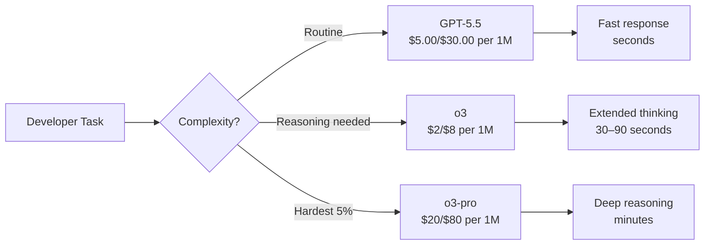
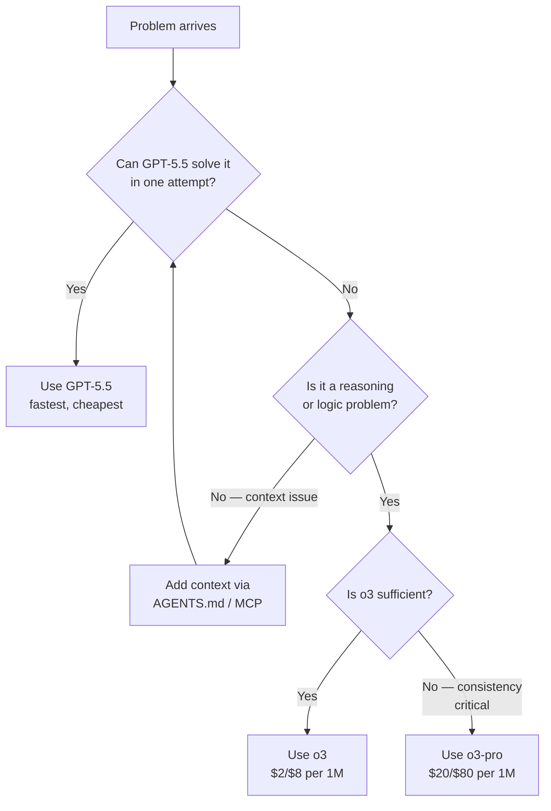

# o3-pro Lands in the API: Configuring Codex CLI for Maximum-Compute Reasoning on the Hardest Problems


---

On 10 June 2026, OpenAI added **o3-pro** to the Responses API — a high-compute variant of o3 that trades latency and cost for substantially better accuracy on the problems where standard models stumble [^1]. The same day, OpenAI slashed o3's own pricing by roughly 80 per cent, dropping input costs from \$10 to \$2 per million tokens and output from \$40 to \$8 [^2]. Together, the two moves reshape the reasoning-model economics for Codex CLI users: o3 is now cheap enough for routine reasoning work, and o3-pro exists for the tasks where consistency matters more than speed.

This article explains what o3-pro actually is, when it earns its premium over GPT-5.5 and standard o3, how to configure Codex CLI profiles to route work to it, and how to keep costs under control when a single response can consume tens of thousands of output tokens.

## What o3-pro Is (and Is Not)

o3-pro is not a new architecture. It is the same o3 model given a larger compute budget at inference time — OpenAI's phrasing is that it "uses more compute to think harder" [^1]. The reinforcement-learning-trained chain-of-thought runs for longer, producing more reasoning tokens before the final answer. The result is measurably higher consistency on hard problems:

| Benchmark | o3 | o3-pro | Improvement |
|---|---|---|---|
| AIME 2024 (maths) | 91.4% | 96.7% | +5.3 pp |
| SWE-bench Verified (coding) | 69.1% | 71.7% | +2.6 pp |
| Codeforces Elo | 2584 | 2727+ | +143 Elo |
| ARC-AGI (science reasoning) | 82.8% | 87.7% | +4.9 pp |

*Sources: OpenAI announcement [^1], benchmark analysis [^3], SWE-bench results [^4].*

Key constraints to be aware of:

- **200K context window**, matching o3 [^5].
- **100K max output tokens**, sufficient for lengthy reasoning chains [^5].
- **No streaming** — responses arrive as a single payload [^5].
- **No fine-tuning** — you cannot customise the model [^5].
- **Responses API only** — Chat Completions is not supported [^5].
- **Latency**: responses routinely take several minutes; OpenAI recommends background mode to avoid HTTP timeouts [^5].

## When o3-pro Earns Its Premium

At \$20 / \$80 per million tokens (input / output), o3-pro costs 10× more than the post-reduction o3 (\$2 / \$8) and roughly 2.7× more than GPT-5.5 on output [^2] [^6]. That premium is justified in a narrow but important set of scenarios:

1. **Logic bugs that defy reproduction** — the kind where you've stared at a stack trace for an hour and the answer requires correlating state across multiple modules. o3-pro's extended reasoning chain catches subtle interactions that shorter chains miss.

2. **Architecture-level refactoring decisions** — evaluating whether a monolith decomposition preserves correctness, or whether a concurrency model introduces race conditions. The extra reasoning tokens let the model explore more branches before committing.

3. **Complex algorithm design and optimisation** — competitive-programming-grade problems where a 143-Elo improvement translates directly into solving problems the standard model cannot [^3].

4. **Security audits requiring formal reasoning** — tracing data flows through authentication boundaries, evaluating cryptographic protocol correctness, or verifying that a permissions model is watertight.

5. **Cross-repository impact analysis** — when a change in a shared library affects multiple downstream services and you need the model to hold the full dependency graph in working memory.

For routine code generation, test writing, documentation, and standard refactoring, GPT-5.5 or the newly repriced o3 remain the cost-effective choice.

## Configuring Codex CLI for o3-pro

### Profile-Based Model Routing

Since Codex CLI 0.134.0, profiles live in separate files rather than `[profiles.*]` sections in `config.toml` [^7]. Create a dedicated o3-pro profile:

```toml
# ~/.codex/o3-pro.config.toml
model = "o3-pro"
model_reasoning_effort = "high"
model_reasoning_summary = "detailed"
approval_policy = "unless-allow-listed"
```

Activate it from the terminal:

```bash
codex --profile o3-pro
```

Or switch mid-session without losing context (available since v0.117.0 [^8]):

```
/model o3-pro
```

### Reasoning Effort Levels

The `model_reasoning_effort` setting controls how many reasoning tokens the model consumes before answering [^9]. For o3-pro, the available levels are:

- **minimal** — fastest, fewest reasoning tokens; suitable for extraction and routing tasks.
- **low** — light reasoning; adequate for straightforward refactors.
- **medium** — OpenAI's recommended default for interactive coding [^9].
- **high** — extended reasoning; the sweet spot for o3-pro's intended use cases.

⚠️ An `xhigh` level exists in some configurations but is not documented for o3-pro specifically. Use `high` unless experimentation shows measurable gains.

### Handling Latency: Background Mode

o3-pro responses can take several minutes [^5]. For Codex CLI interactive sessions, this manifests as a long pause in the TUI. Two mitigation strategies:

**1. Use `codex exec` for batch tasks:**

```bash
codex exec --model o3-pro \
  --output-schema schema/audit-result.json \
  "Audit the authentication module for race conditions. \
   Trace every path from login to session creation."
```

The `--output-schema` flag ensures the response conforms to a JSON schema, making the result parseable by downstream automation [^10].

**2. Use the `--resume` flag for multi-turn reasoning:**

```bash
# Start a reasoning session
codex exec --model o3-pro \
  "Analyse the concurrency model in src/worker/ and identify potential deadlocks."

# Resume with follow-up
codex exec resume --last \
  --output-schema schema/deadlock-report.json \
  "Now propose fixes for each identified deadlock, with before/after code."
```

The `resume --last` command finds the newest matching session through the state database, which was optimised for speed in recent releases [^11].

## Cost Control Strategies

A single o3-pro response solving a complex problem can easily generate 20,000–50,000 output tokens of reasoning chain plus answer. At \$80 per million output tokens, that is \$1.60–\$4.00 per response. Without guardrails, costs accumulate quickly.

### Token Budget Limits

Set explicit limits in your profile:

```toml
# ~/.codex/o3-pro.config.toml
model = "o3-pro"
model_reasoning_effort = "high"
model_reasoning_summary = "detailed"
tool_output_token_limit = 8192
```

The `tool_output_token_limit` constrains tool output size, preventing the model from ingesting unnecessarily large context that inflates reasoning token consumption.

### The Three-Tier Model Routing Pattern

Rather than using o3-pro for everything, configure three profiles that route work by complexity:



Create the corresponding profiles:

```toml
# ~/.codex/daily.config.toml
model = "gpt-5.5"
model_reasoning_effort = "medium"

# ~/.codex/reasoning.config.toml
model = "o3"
model_reasoning_effort = "high"
model_reasoning_summary = "detailed"

# ~/.codex/o3-pro.config.toml
model = "o3-pro"
model_reasoning_effort = "high"
model_reasoning_summary = "detailed"
```

Switch between them as needed:

```bash
# Daily driver
codex --profile daily

# Hit a hard problem — escalate
/model o3
/reasoning high

# Still stuck — bring in the big guns
/model o3-pro
```

### Monthly Credit Monitoring

Codex CLI v0.137.0 added monthly credit limits display [^12]. Use it to track o3-pro spend:

```bash
codex credits
```

For API key users, set billing alerts at the OpenAI dashboard to avoid surprise costs. A reasonable starting budget for a team experimenting with o3-pro is \$50–\$100 per developer per month, with the understanding that most work stays on cheaper models.

## o3-pro in CI/CD Pipelines

The no-streaming constraint and multi-minute latency make o3-pro unsuitable for fast feedback loops. However, it excels in asynchronous quality gates:

```bash
# Pre-merge architecture review (runs in CI, latency acceptable)
codex exec --model o3-pro \
  --output-schema schema/arch-review.json \
  "Review this PR for architectural violations against AGENTS.md. \
   Check for: breaking interface contracts, missing error handling \
   in cross-service calls, and concurrency anti-patterns."
```

Pair this with the exit code handling patterns from `codex exec` — a non-zero exit signals the review found issues, gating the merge [^10].

## The o3 Price Drop: Practical Impact

The 80 per cent o3 price reduction on 10 June deserves attention in its own right [^2]. At \$2 / \$8 per million tokens, o3 is now priced below where GPT-4o sat at its launch. This makes extended reasoning accessible for everyday development:

| Use Case | Model | Estimated Cost per Task |
|---|---|---|
| Generate unit tests | GPT-5.5 | \$0.02–\$0.05 |
| Debug complex logic bug | o3 | \$0.05–\$0.15 |
| Architecture review | o3-pro | \$1.50–\$4.00 |
| Batch security audit (50 files) | o3 | \$0.50–\$1.50 |

The repriced o3 is the new default recommendation for any task where you previously would have reached for `model_reasoning_effort = "high"` on GPT-5.5. It reasons better and now costs comparably.

## Caveats and Limitations

**No streaming means no early abort.** With GPT-5.5, you can watch the response form and cancel if it is heading in the wrong direction. o3-pro delivers the complete response at once — you pay for the full reasoning chain whether or not the answer is useful.

**Knowledge cutoff is June 2024** [^5]. For questions about recent API changes, library versions, or security advisories, o3-pro's training data is two years stale. Always ground it with current documentation via AGENTS.md or MCP tools.

**SWE-bench Verified caveats.** OpenAI itself has acknowledged that SWE-bench Verified is increasingly contaminated and recommends SWE-bench Pro instead [^13]. The 71.7% score is directionally useful but should not be treated as a precise measure of coding ability.

**Responses API only.** If your tooling or MCP servers rely on Chat Completions, they will not work with o3-pro. Codex CLI uses the Responses API by default, so this is primarily a concern for custom integrations [^5].

## Decision Framework



The key insight: **o3-pro is not a better version of GPT-5.5 — it is a specialised tool for the hardest 5 per cent of problems** [^3]. Most developers will use it a few times per week at most, escalating from the daily driver only when cheaper models demonstrably fail.

## Getting Started Today

1. **Create the profile**: `~/.codex/o3-pro.config.toml` with the configuration shown above.
2. **Test on a known-hard problem**: pick a bug or architecture question that your team has struggled with recently.
3. **Compare results**: run the same prompt through GPT-5.5, o3, and o3-pro. Note where o3-pro's answer diverges — that is where the extra compute adds value.
4. **Set billing alerts**: at the OpenAI dashboard, configure a \$50 monthly alert for o3-pro usage.
5. **Document in AGENTS.md**: add a section noting which problem categories warrant o3-pro escalation, so the pattern survives team turnover.

---

## Citations

[^1]: [OpenAI API Changelog — o3-pro announcement, 10 June 2026](https://developers.openai.com/api/docs/changelog)
[^2]: [VentureBeat — "OpenAI announces 80% price drop for o3, its most powerful reasoning model"](https://venturebeat.com/ai/openai-announces-80-price-drop-for-o3-its-most-powerful-reasoning-model)
[^3]: [Artificial Analysis — o3-pro Intelligence, Performance & Price Analysis](https://artificialanalysis.ai/models/o3-pro)
[^4]: [SWE-bench — o3-pro benchmark results](https://www.swebench.com/viewer.html)
[^5]: [OpenAI API Docs — o3-pro Model](https://developers.openai.com/api/docs/models/o3-pro)
[^6]: [OpenAI API Pricing](https://openai.com/api/pricing/)
[^7]: [Codex CLI Advanced Configuration — profile file migration](https://developers.openai.com/codex/config-advanced)
[^8]: [Codex Knowledge Base — Dynamic Model Routing in Codex CLI: Mid-Session Switching](https://codex.danielvaughan.com/2026/04/12/codex-cli-dynamic-model-routing-mid-session-switching/)
[^9]: [OpenAI API Docs — Reasoning Models guide](https://developers.openai.com/api/docs/guides/reasoning)
[^10]: [OpenAI Developers — Codex CLI Non-interactive mode](https://developers.openai.com/codex/noninteractive)
[^11]: [Releasebot — Codex Updates June 2026, resume --last optimisation](https://releasebot.io/updates/openai/codex)
[^12]: [Codex CLI Changelog — v0.137.0 monthly credit limits display](https://developers.openai.com/codex/changelog)
[^13]: [OpenAI — "Why SWE-bench Verified no longer measures frontier coding capabilities"](https://openai.com/index/why-we-no-longer-evaluate-swe-bench-verified/)
