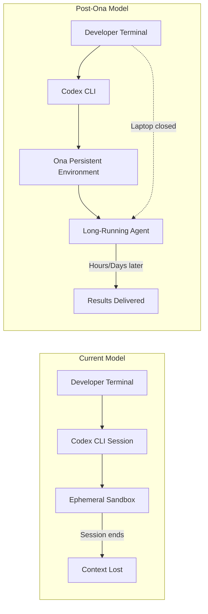
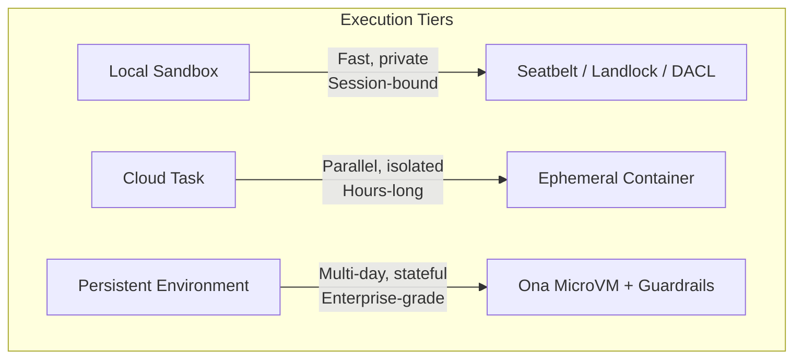
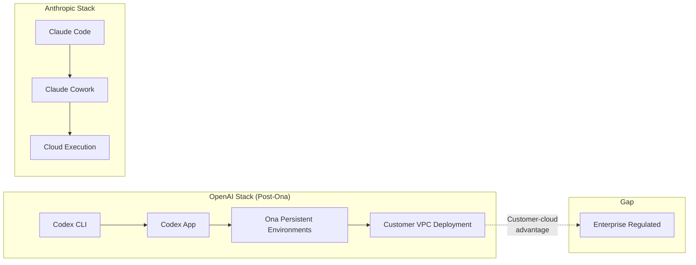

# OpenAI Acquires Ona: What Ex-Gitpod's Persistent Cloud Environments Mean for Codex CLI's Execution Model


---

On 11 June 2026, OpenAI announced its acquisition of Ona — the 79-person, Kiel-based cloud infrastructure company formerly known as Gitpod[^1]. The deal signals a fundamental shift in how Codex agents will execute: from ephemeral, session-bound sandboxes to persistent, enterprise-grade cloud environments where agents continue working after you close your laptop.

This article unpacks what Ona brings to the table, how it changes the Codex CLI execution model, and what senior developers should start preparing for now.

## From Gitpod to Ona: The AI-Agent Pivot

Gitpod built its reputation as an open-source cloud development environment (CDE) used by over 750,000 developers[^2]. In September 2025, the company rebranded to Ona and pivoted entirely from IDE-centric developer workspaces to "mission control for your personal team of software engineering agents"[^2].

The rebrand was not cosmetic. Ona introduced three core architectural components[^2]:

- **Ona Environments** — API-first, pre-configured execution spaces with OS-level isolation
- **Ona Agents** — AI collaborators operating within those environments
- **Ona Guardrails** — Enterprise security controls including VPC deployment, audit trails, RBAC, SSO/OIDC, and command-level security

By the time of the acquisition, Ona reported that agents co-authored 60% of merged pull requests and contributed 72% of merged code within their engineering teams[^2]. Enterprise adoption had grown 13-fold in 2026 alone[^1].

## Why OpenAI Needed This

Codex's current execution model has a fundamental constraint: agents are bound to sessions. Close your terminal or let a session time out, and context evaporates. The `/goal` command (GA since May 2026) partially addresses this with persistent objectives that survive session breaks[^3], but the underlying execution environment remains ephemeral.

Ona solves the infrastructure layer. Its persistent cloud environments let agents maintain state, access tools, and continue multi-step work over hours or days without a developer keeping a terminal open[^4].



## The Three Execution Tiers Taking Shape

With Ona integrated, Codex is converging on three distinct execution tiers. Each has different trade-offs for latency, security, and cost:

### 1. Local Sandbox (Codex CLI today)

The model you already know. Codex CLI runs in a sandboxed subprocess on your machine with Seatbelt (macOS), Landlock/Bubblewrap (Linux), or restricted tokens and DACLs (Windows)[^5]. Fast, private, and bounded by your terminal session.

```toml
# codex.toml — local execution (default)
[profile.default]
model = "gpt-5.5"
approval_policy = "unless-allow-listed"
sandbox = "local"
```

### 2. Cloud Tasks (Codex App today)

The Codex App already runs tasks in cloud sandboxes — isolated containers with their own filesystem snapshots, network restrictions, and resource quotas[^6]. Each task gets a dedicated environment. Multiple tasks run in parallel. But environments are still relatively short-lived.

### 3. Persistent Environments (Ona-powered, coming)

The Ona layer adds long-lived, stateful environments that survive across sessions. Think of them as cloud workstations for agents — pre-configured with your repository, toolchain, credentials, and compliance controls. The agent picks up where it left off, even if you started the task on Monday and check results on Wednesday.



## What This Means for Codex CLI Users

### The `/app` Handoff Becomes Strategic

The `/app` command introduced in v0.138 already hands off a CLI session to the Codex Desktop app[^7]. Post-Ona, this handoff path extends further: start work locally in the CLI, hand off to a persistent cloud environment, and monitor progress from any device — including ChatGPT on mobile[^8].

### Cloud Task Economics Change

Container sessions shifted to per-minute billing with a 5-minute minimum in June 2026[^9]. Ona's persistent environments will likely introduce a different pricing model — closer to always-on infrastructure than per-task billing. Teams should model both patterns:

```bash
# Current: per-task cloud execution
codex --cloud exec "refactor auth module"

# Future: persistent environment (speculative syntax)
codex env create --repo myorg/backend --persist
codex env attach --env env-abc123
codex exec "run full test suite and fix failures"
# Close laptop. Agent continues.
codex env status --env env-abc123
```

### Customer-Cloud Deployment

Ona supports running its control plane inside customer AWS, GCP, or Azure accounts[^10]. This is critical for regulated industries — banking, healthcare, government — where code and credentials cannot leave the organisation's VPC. Expect Codex to inherit this capability, addressing a key enterprise objection.

### Security Model Deepens

Ona's guardrails layer adds capabilities that Codex's current sandbox does not provide[^2]:

| Capability | Current Codex Sandbox | Ona Guardrails |
|---|---|---|
| Filesystem isolation | Yes (per-session) | Yes (persistent, audited) |
| Network restriction | Yes (configurable) | Yes + VPC deployment |
| Audit trails | Limited (local logs) | Full audit logging |
| RBAC | Profile-based | Enterprise RBAC + SSO |
| Credential management | Environment variables | Managed secrets store |
| Cross-environment isolation | N/A (single session) | OS-level microVM isolation |

## The Competitive Context

This acquisition is not happening in a vacuum. Anthropic's Claude Code has been gaining enterprise ground — Claude Fable 5 launched on 9 June 2026 with 95% SWE-bench Verified[^11], and Claude's Cowork platform already offers persistent cloud execution for agent tasks[^12]. The Ramp AI Index showed Anthropic overtaking OpenAI in business adoption at 34.4% versus 32.3%[^13].

Ona gives OpenAI a direct answer to Claude Cowork's persistent execution story, with the added advantage of customer-cloud deployment that Anthropic does not yet offer at the same level.



## What to Prepare Now

The acquisition is announced but integration takes time. Here is what you can do today:

### 1. Audit Your Long-Running Workflows

Identify tasks that currently require babysitting — multi-hour test suites, large-scale refactors, dependency upgrades across monorepos. These are your first candidates for persistent environments.

### 2. Structure Your AGENTS.md for Stateless Resumption

Persistent agents will need to pick up context cold. Ensure your `AGENTS.md` files are comprehensive enough that an agent landing in your repository can orient itself without conversational history:

```markdown
# AGENTS.md
## Project Overview
Backend API service — Go 1.23, PostgreSQL 16, deployed to EKS.

## Build & Test
- `make test` — unit tests (< 2 min)
- `make integration` — requires local Docker Compose stack
- `make lint` — golangci-lint with project config

## Architecture Decisions
- Repository pattern for data access (see internal/repo/)
- Event sourcing for audit trail (see internal/events/)
- No ORM — raw SQL with sqlc code generation
```

### 3. Plan Your Credential Strategy

Persistent environments need access to your tools — Git, CI, package registries, cloud APIs. Start separating agent credentials from developer credentials now. Use scoped tokens with minimum necessary permissions and short expiry windows.

### 4. Model the Cost Implications

With workspace agent credit-based pricing starting 6 July 2026[^14], and persistent environments likely adding infrastructure costs, build a cost model that accounts for:

- Token consumption (model inference)
- Container time (execution environment)
- Persistent storage (repository state, build caches)
- Network egress (if running in customer cloud)

## The Bigger Picture

Ona's 79 engineers joining OpenAI is not just an acqui-hire. It is an infrastructure acquisition that repositions Codex from "a tool you supervise keystroke by keystroke to a worker you hand a job and check on later"[^4]. For CLI users, the terminal remains the starting point — but the execution plane behind it is about to become dramatically more capable.

The shift from ephemeral to persistent execution is the same transition that transformed CI/CD from local build scripts to cloud-native pipelines. Codex is following the same arc, and Ona provides the infrastructure to get there.

---

## Citations

[^1]: OpenAI, "OpenAI to acquire Ona," openai.com, 11 June 2026. [https://openai.com/index/openai-to-acquire-ona/](https://openai.com/index/openai-to-acquire-ona/)

[^2]: InfoQ, "Gitpod Rebrands to Ona, Pivots to AI-Agent Mission Control," infoq.com, September 2025. [https://www.infoq.com/news/2025/09/gitpod-ona](https://www.infoq.com/news/2025/09/gitpod-ona)

[^3]: OpenAI Developers, "Codex Changelog — Goal mode GA," developers.openai.com, 21 May 2026. [https://developers.openai.com/codex/changelog](https://developers.openai.com/codex/changelog)

[^4]: CNBC, "OpenAI to acquire Ona to support its AI coding assistant, Codex," cnbc.com, 11 June 2026. [https://www.cnbc.com/2026/06/11/open-ai-ona-acquisition-codex.html](https://www.cnbc.com/2026/06/11/open-ai-ona-acquisition-codex.html)

[^5]: Daniel Vaughan, "Inside the Codex Windows Sandbox: Restricted Tokens, Synthetic SIDs, and the Four-Layer Execution Architecture," codex.danielvaughan.com, 14 May 2026. [https://codex.danielvaughan.com/2026/05/14/codex-cli-windows-sandbox-engineering-restricted-tokens-acls-elevated-architecture/](https://codex.danielvaughan.com/2026/05/14/codex-cli-windows-sandbox-engineering-restricted-tokens-acls-elevated-architecture/)

[^6]: OpenAI, "Introducing the Codex app," openai.com, February 2026. [https://openai.com/index/introducing-the-codex-app/](https://openai.com/index/introducing-the-codex-app/)

[^7]: OpenAI Developers, "Codex CLI Changelog — v0.138.0," developers.openai.com, 8 June 2026. [https://developers.openai.com/codex/changelog](https://developers.openai.com/codex/changelog)

[^8]: OpenAI, "Codex for every role, tool, and workflow," openai.com, 2 June 2026. [https://openai.com/index/codex-for-every-role-tool-workflow/](https://openai.com/index/codex-for-every-role-tool-workflow/)

[^9]: OpenAI Developers, "API Changelog — Container session billing," developers.openai.com, 2 June 2026. [https://developers.openai.com/api/docs/changelog](https://developers.openai.com/api/docs/changelog)

[^10]: andrew.ooo, "OpenAI Acquires Ona (ex-Gitpod): Codex Gets a Cloud," andrew.ooo, June 2026. [https://andrew.ooo/answers/openai-acquires-ona-gitpod-codex-explained-june-2026/](https://andrew.ooo/answers/openai-acquires-ona-gitpod-codex-explained-june-2026/)

[^11]: BenchLM, "SWE-bench Verified Benchmark 2026," benchlm.ai, June 2026. [https://benchlm.ai/benchmarks/sweVerified](https://benchlm.ai/benchmarks/sweVerified)

[^12]: Techzine Global, "As Anthropic claims the enterprise, OpenAI fights back with Ona deal," techzine.eu, June 2026. [https://www.techzine.eu/news/devops/142087/as-anthropic-claims-the-enterprise-openai-fights-back-with-ona-deal/](https://www.techzine.eu/news/devops/142087/as-anthropic-claims-the-enterprise-openai-fights-back-with-ona-deal/)

[^13]: Daniel Vaughan, "Anthropic Overtakes OpenAI in Business Adoption," codex.danielvaughan.com, 13 June 2026. [https://codex.danielvaughan.com/2026/06/13/anthropic-overtakes-openai-business-adoption-codex-cli-vendor-diversification-platform-hedging/](https://codex.danielvaughan.com/2026/06/13/anthropic-overtakes-openai-business-adoption-codex-cli-vendor-diversification-platform-hedging/)

[^14]: TechTimes, "OpenAI Workspace Agents Free Ride Ends July 6," techtimes.com, 10 June 2026. [https://www.techtimes.com/articles/318162/20260610/openai-workspace-agents-free-ride-ends-july-6credit-pricing-gives-businesses-26-days-model-costs.htm](https://www.techtimes.com/articles/318162/20260610/openai-workspace-agents-free-ride-ends-july-6credit-pricing-gives-businesses-26-days-model-costs.htm)
