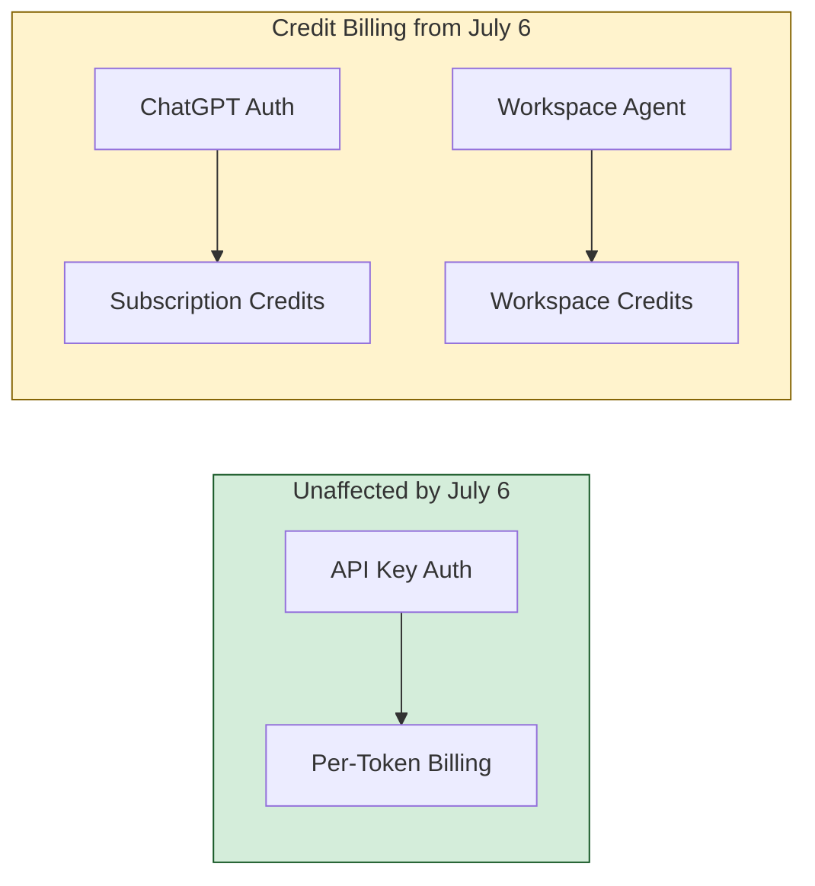
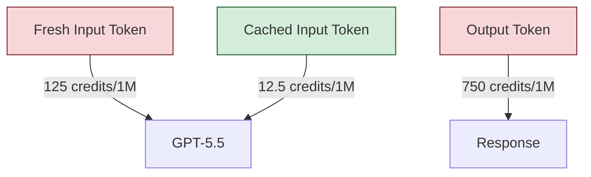

# Workspace Agents Credit Pricing Starts July 6: A Codex CLI Practitioner's Budget Preparation Guide


---

OpenAI's free period for Workspace Agents ends on **6 July 2026**, when credit-based billing takes effect for Business and Enterprise accounts [^1]. That gives teams twenty-two days to audit their agent usage, configure cost controls, and set budget expectations. This article walks through the credit arithmetic, the CLI configuration levers that directly affect spend, and a concrete preparation checklist.

## What Changes on 6 July

Workspace Agents — the cloud-hosted Codex instances that run asynchronously on GitHub repositories, respond to Slack threads, and execute scheduled workflows — have been free since their launch [^1]. From 6 July, every agent run will consume **credits** drawn from a workspace's purchased pool [^2].

The key distinction for CLI practitioners: **local Codex CLI sessions authenticated with an API key are unaffected** by this change. API-key usage continues on standard per-token billing [^3]. The credit system applies to ChatGPT-authenticated sessions (subscription plans) and Workspace Agent runs initiated through the Codex App, IDE extensions, or cloud integrations [^2].



## The Credit Rate Card

Credits are consumed based on three token categories, with rates varying by model [^2][^4]:

| Model | Input (per 1M tokens) | Cached Input (per 1M tokens) | Output (per 1M tokens) |
|-------|----------------------|------------------------------|------------------------|
| GPT-5.5 | 125 credits | 12.5 credits | 750 credits |
| GPT-5.4 | 62.5 credits | 6.25 credits | 375 credits |
| GPT-5.4 mini | 18.75 credits | 1.875 credits | 113 credits |
| Codex-Spark | 3.75 credits | 0.375 credits | 15 credits |

The critical ratio to internalise: **output tokens cost 6× more than input tokens**, and **cached input costs 10× less than fresh input** [^4]. Every cost-optimisation strategy flows from these two facts.

### What a Typical Run Costs

A GPT-5.5 Workspace Agent run consuming 20,000 fresh input tokens, 80,000 cached input tokens, and 5,000 output tokens costs approximately **7.25 credits** [^2]. Across a team, typical monthly spend falls between **\$100 and \$200 per developer** depending on model selection and usage intensity [^5].

## CLI Configuration Levers That Cut Spend

The same `config.toml` profiles that control local CLI behaviour also influence how Workspace Agents consume credits when they inherit configuration from your project's `.codex/config.toml`. Here are the levers that matter most.

### 1. Model Routing with Named Profiles

Route cheap tasks through cheaper models. A single profile switch halves credit consumption [^6]:

```toml
# ~/.codex/config.toml

[profiles.default]
model = "gpt-5.5"
model_reasoning_effort = "medium"

[profiles.bulk]
model = "gpt-5.4-mini"
model_reasoning_effort = "low"
service_tier = "flex"

[profiles.review]
model = "gpt-5.5"
model_reasoning_effort = "high"
```

GPT-5.4 mini consumes roughly **3–4 credits per message** compared to GPT-5.5's **10–14 credits** [^6]. Routing subagent fan-out, test generation, and lint-fix tasks through the `bulk` profile stretches your credit allocation considerably.

### 2. Service Tier Selection

The `service_tier` key controls latency-cost tradeoffs [^7]:

```toml
# Flex tier: ~50% lower credit rates, higher latency
service_tier = "flex"

# Fast tier: 2× credit rates, lower latency
service_tier = "fast"
```

For Workspace Agent runs that execute asynchronously (the user is not waiting), `flex` is almost always the correct choice. Reserve `fast` for interactive CLI sessions where latency matters [^7].

### 3. Token Budget Controls

Cap output verbosity and context window usage to prevent runaway credit consumption [^8]:

```toml
# Limit output tokens per tool call
tool_output_token_limit = 8000

# Trigger compaction before context fills
model_auto_compact_token_limit = 80000

# Reduce model verbosity
model_verbosity = "concise"
```

Since output tokens cost 6× input tokens, even modest reductions in output length produce significant savings.

### 4. Maximise Cache Hits

Cached input tokens cost 90% less than fresh input [^4]. To maximise cache hit rates:

- **Maintain long sessions** within a single repository rather than spawning many short sessions
- **Structure AGENTS.md** with stable preamble sections that rarely change
- **Pin MCP server configurations** in project config so the tool schema preamble is consistent across runs



## Enterprise Admin Controls

For Business and Enterprise workspaces, admins should configure credit governance before 6 July [^9]:

### Monthly Credit Limits

Enterprise admins can set monthly credit limits per workspace through the admin dashboard, introduced in Codex CLI v0.137.0 [^10]. This prevents unexpected cost overruns during the transition period.

### Managed Configuration Bundles

Deploy `requirements.toml` policies through the Codex Policies page to enforce cost-conscious defaults across your organisation [^9]:

```toml
# requirements.toml — deployed via admin panel
[policy]
default_model = "gpt-5.4"
max_model = "gpt-5.5"
service_tier = "flex"
approval_policy = "unless-allow-listed"

[policy.workspace_agents]
enabled = true
max_concurrent = 3
```

### Analytics Dashboard

The self-serve analytics dashboard provides usage breakdowns by surface (CLI, IDE, cloud, desktop), model, and user [^9]. Export data as CSV or JSON for integration with internal cost-tracking systems. Note that dashboard data can lag by up to 12 hours [^11].

## The 22-Day Preparation Checklist

Use the remaining free period to establish your cost baseline:

### Week 1 (14–20 June): Measure

1. **Export current usage** from the analytics dashboard — note agent run counts, model distribution, and token volumes per developer
2. **Identify your top-5 workspace agent workflows** by credit consumption using the rate card above
3. **Run `codex doctor`** across your team's environments to verify configuration consistency [^10]

### Week 2 (21–27 June): Optimise

4. **Create named profiles** for cost-tiered workflows (default, bulk, review) in your project `.codex/config.toml`
5. **Set `service_tier = "flex"`** on all Workspace Agent configurations — they run asynchronously and do not need fast-tier latency
6. **Review AGENTS.md files** for oversized content that inflates fresh input token counts on every run
7. **Configure `tool_output_token_limit`** and `model_auto_compact_token_limit` to cap output spend

### Week 3 (28 June – 4 July): Govern

8. **Set monthly credit limits** in the admin dashboard to establish guardrails
9. **Deploy `requirements.toml`** with organisation-wide model and tier defaults
10. **Establish a credit burn alert** — export usage weekly and compare against your budget projection

### Final Check (5 July)

11. **Validate** that all Workspace Agent configurations inherit the optimised project config
12. **Brief your team** on the per-run credit cost expectations so nobody is surprised on Monday

## API Key as a Cost Escape Valve

Teams running heavy agent workloads may find that **API-key billing breaks even below 10–40 sessions per month** compared to subscription credit consumption [^4]. For CI/CD pipelines and scheduled automation, API-key authentication with `--ephemeral` and `--ignore-user-config` flags avoids credit consumption entirely, billing directly against your API account at standard token rates [^3].

The hybrid approach — subscription for interactive sessions, API key for automation — remains the most cost-effective pattern:

```toml
# Project config: automation profile uses API key
[profiles.ci]
model = "gpt-5.4-mini"
service_tier = "flex"
# API key set via OPENAI_API_KEY in CI environment
```

## What to Watch After 6 July

OpenAI has signalled potential token price cuts ahead of their IPO [^12], and the competitive pressure from Anthropic's credit-inclusive Claude Max plans and Google's Gemini Pro subscriptions suggests that credit rates may not remain static. Build your cost monitoring infrastructure now so you can respond to rate card changes quickly.

The workspace agent pricing transition is not a crisis — it is a signal to treat agent compute as a first-class engineering cost, the same way teams learned to manage cloud compute budgets a decade ago. The teams that measure, profile, and optimise during the free period will barely notice the switch. The teams that do not will get an unpleasant invoice in August.

---

## Citations

[^1]: [OpenAI Workspace Agents Free Ride Ends July 6](https://www.techtimes.com/articles/318162/20260610/openai-workspace-agents-free-ride-ends-july-6credit-pricing-gives-businesses-26-days-model-costs.htm) — TechTimes, 10 June 2026

[^2]: [Codex Pricing — OpenAI Developers](https://developers.openai.com/codex/pricing) — OpenAI, June 2026

[^3]: [Codex CLI Authentication Paths: ChatGPT Login vs API Key](https://codex.danielvaughan.com/2026/06/13/codex-cli-authentication-paths-chatgpt-login-api-key-billing-rate-limits-model-access/) — Codex Knowledge Base, 13 June 2026

[^4]: [Codex Pricing (2026): Free vs \$20 Plus vs \$100 Pro, with Credit Burn Rates and Real Session Costs](https://www.morphllm.com/codex-pricing) — Morph, June 2026

[^5]: [OpenAI Codex Pricing Explained: Credits, Seats, Fast Mode, and What Teams Actually Pay in 2026](https://nerova.ai/costs-roi/openai-codex-pricing-explained-2026) — Nerova, 2026

[^6]: [The June 2026 Coding Agent Billing Reset](https://codex.danielvaughan.com/2026/06/01/june-2026-coding-agent-billing-reset-openai-github-anthropic-google-pricing-changes-codex-cli-budget/) — Codex Knowledge Base, 1 June 2026

[^7]: [Dynamic Model Routing in Codex CLI: Mid-Session Switching, /fast Mode, and Service Tier Workflows](https://codex.danielvaughan.com/2026/04/12/codex-cli-dynamic-model-routing-mid-session-switching/) — Codex Knowledge Base, 12 April 2026

[^8]: [Codex CLI Configuration Complete Guide: Hierarchy, Profiles, and Trust](https://codex.danielvaughan.com/2026/04/16/codex-cli-configuration-complete-guide-hierarchy-profiles-trust/) — Codex Knowledge Base, 16 April 2026

[^9]: [Admin Setup — Codex Enterprise](https://developers.openai.com/codex/enterprise/admin-setup) — OpenAI Developers, June 2026

[^10]: [Codex Updates — June 2026](https://releasebot.io/updates/openai/codex) — Releasebot, June 2026

[^11]: [Codex Enterprise Analytics and Compliance APIs](https://codex.danielvaughan.com/2026/05/11/codex-enterprise-analytics-compliance-apis-governance-dashboards/) — Codex Knowledge Base, 11 May 2026

[^12]: [AI Token Price War: OpenAI Pre-IPO Cuts](https://codex.danielvaughan.com/2026/06/12/ai-token-price-war-openai-pre-ipo-cuts-spacex-nasdaq-codex-cli-budget-strategy/) — Codex Knowledge Base, 12 June 2026
