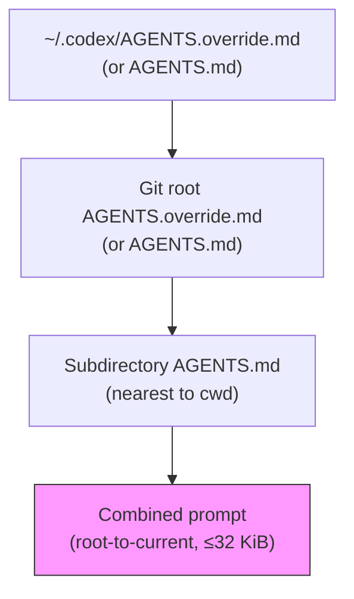
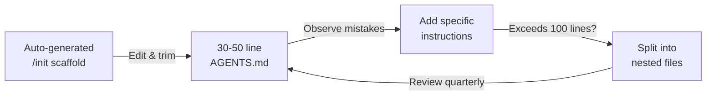

# AGENTS.md Beyond /init: Writing Project Instructions That Actually Reduce Token Spend


---

The `/init` slash command, promoted to a first-class feature in the June 11 Codex app release[^1], scaffolds a starter `AGENTS.md` in seconds. That scaffold is useful — and dangerously incomplete. A Princeton study published in March 2026 measured Codex CLI across 124 merged pull requests in ten repositories and found that the presence of a well-written `AGENTS.md` reduced median runtime by 28.64% and output token consumption by 16.58%[^2]. But the same research community has observed that auto-generated instruction files can *increase* costs by up to 23% when they bloat the context with vague or irrelevant guidance[^3].

This article covers what `/init` gets right, what it misses in the June 2026 feature landscape, and how to write project instructions that earn back those tokens.

## What /init Actually Generates

Running `/init` from the TUI analyses your project structure — detecting language, build tools, test frameworks, and linting configuration — then produces a tailored markdown scaffold[^4]. A typical output for a Python FastAPI project includes:

```markdown
# AGENTS.md

## Build & Test
- Run tests: `pytest tests/ -v`
- Lint: `ruff check .`
- Type check: `mypy src/`

## Code Style
- Use type hints on all public functions
- Prefer `pathlib` over `os.path`

## PR Guidelines
- One logical change per commit
- Include tests for new behaviour
```

This covers three of the six recommended sections from the emerging AGENTS.md specification[^3]: build commands, code style, and commit guidelines. It says nothing about hooks, MCP servers, skills, goal mode boundaries, named profile context, or security constraints. For a solo developer on a greenfield project, the scaffold may suffice. For a team running Codex CLI with the full June 2026 feature set, it leaves critical gaps.

## The Discovery Hierarchy — A Quick Refresher

Codex builds its instruction chain once per session[^5]. Understanding the hierarchy is prerequisite to writing effective instructions:



Files closer to the working directory appear later in the combined prompt and effectively override earlier guidance[^5]. The default size cap is 32 KiB, configurable via `project_doc_max_bytes` in `config.toml`[^5]:

```toml
# ~/.codex/config.toml
project_doc_max_bytes = 65536
project_doc_fallback_filenames = ["TEAM_GUIDE.md", ".agents.md"]
```

## The Six Sections /init Misses

### 1. Hook Policy Declarations

Codex CLI's lifecycle hooks — `PreToolUse`, `PostToolUse`, `OnStart`, `OnStop` — are the primary mechanism for enforcing quality gates and safety constraints[^6]. Yet `/init` generates no hook guidance. Without explicit mention, the agent may silently bypass or misinterpret hook outcomes.

```markdown
## Hook Policies
- PostToolUse `lint-gate` runs `ruff check` on every file write. If it fails, fix the issue before proceeding.
- PreToolUse `deny-secrets` blocks writes to `.env`, `secrets/`, and any file matching `*.key`. Do not attempt workarounds.
- Stop hook runs `pytest tests/unit/ -x`. All tests must pass before the session ends.
```

Declaring hooks in AGENTS.md creates a feedback loop: the agent knows *why* a hook exists, not just that it fired[^6].

### 2. MCP Server Context

With the MCP ecosystem now spanning 90+ official plugins[^7], a project may depend on external tool servers for database queries, Kubernetes inspection, or documentation lookups. The agent needs to know which servers are available and when to use them.

```markdown
## MCP Servers
- `@postgres-mcp`: Use for schema inspection and migration dry-runs. Never execute DDL without confirmation.
- `@context7`: Use for library documentation lookups instead of web search when the library is indexed.
- `@snyk-mcp`: Run after adding any new dependency. Treat critical findings as blocking.
```

Without this section, the agent either ignores available tools or invokes them speculatively, wasting tokens on exploratory calls[^8].

### 3. Skill Routing Hints

Skills (`SKILL.md` files in `~/.agents/skills/`) encode reusable workflows that load on demand[^9]. AGENTS.md should declare which skills apply to this project and when to invoke them, keeping the always-loaded context lean whilst ensuring the agent knows where to find specialised guidance.

```markdown
## Skills
- Use the `tdd-cycle` skill for all feature work. Write the failing test first.
- Use the `api-review` skill before opening PRs that change `routes/`.
- Do NOT use the `quick-fix` skill in this repo — our CI requires full test coverage.
```

This separation follows OpenAI's official guidance: instructions that apply to *every* conversation belong in AGENTS.md; instructions that apply to specific *operations* belong in skills[^4].

### 4. Goal Mode Boundaries

Goal mode, promoted to GA in May 2026[^10], allows Codex to pursue multi-hour autonomous objectives. Without guardrails in AGENTS.md, goal mode sessions can drift into unnecessary refactoring or scope creep.

```markdown
## Goal Mode
- Maximum scope: one feature branch per goal session.
- Must check in with the developer (pause for approval) after every 5 file modifications.
- Never merge branches autonomously. Leave the PR open for human review.
- Token budget: stop and summarise if approaching 500K output tokens.
```

### 5. Named Profile Context

Named profiles in `config.toml` control model selection, reasoning effort, and permission levels[^11]. AGENTS.md should reference which profiles exist and when to suggest switching, without duplicating the TOML configuration.

```markdown
## Profiles
- Default profile uses `gpt-5.5` with `reasoning_effort: medium`.
- Switch to `@deep-review` profile (reasoning_effort: high) for architecture changes or security-sensitive code.
- CI pipelines use the `@ci-auto` profile with `ask_for_approval: never`. Do not override this in interactive sessions.
```

### 6. Security and Forbidden Zones

The `/init` scaffold occasionally includes a generic "don't modify production configs" line. Production AGENTS.md files need specificity:

```markdown
## Security
- Never read or reference: `.env`, `.env.local`, `secrets/`, `*.pem`, `*.key`
- Never modify: `infrastructure/terraform/`, `k8s/production/`
- Never commit credentials, API keys, or tokens — even in test fixtures.
- If a task requires production access, stop and ask the developer.
```

## Writing for Token Efficiency

The Princeton findings[^2] demonstrate that the mechanism is straightforward: without AGENTS.md, the agent spends tokens exploring — reading directory structures, inferring build systems, guessing test commands. With well-written instructions, those exploratory steps are eliminated.

But there is a ceiling. The morphllm analysis of 60,000+ repositories using AGENTS.md found that files exceeding 200 lines showed diminishing returns, with the context budget consumed by instructions leaving less room for actual code[^3]. The practical guidelines:

1. **Start at 30–50 lines.** Cover the six core sections (build, style, hooks, MCP, skills, security) with one to three bullet points each.
2. **Add guidance reactively.** When Codex makes the same mistake twice, add a specific instruction. Do not anticipate failures that have not occurred[^4].
3. **Use nested files for subdirectory rules.** A `services/payments/AGENTS.md` with five lines beats a root file with fifty lines that include payment-specific rules.
4. **Prefer commands over descriptions.** `Run pytest tests/unit/ -x` is cheaper to parse than "Please ensure all unit tests pass before proceeding."



## Verifying Your Instruction Chain

After editing, verify that Codex loads the correct files:

```bash
# Quick verification — ask Codex to echo its instructions
codex --ask-for-approval never "Summarise the current instructions."

# Verify nested overrides from a subdirectory
codex --cd services/payments --ask-for-approval never \
  "Show which instruction files are active."

# Debug via logs
codex -c log_dir=./.codex-log "Run tests"
# Then inspect ./.codex-log/codex-tui.log for loaded files
```

The `/debug-config` slash command also prints configuration layer diagnostics, showing which files contributed to the active instruction chain[^12].

## The /init-to-Production Checklist

For teams adopting Codex CLI in June 2026, this checklist bridges the gap between the `/init` scaffold and production-grade project instructions:

| Step | Action | Verification |
|------|--------|-------------|
| 1 | Run `/init` from repo root | File exists at `./AGENTS.md` |
| 2 | Replace generic build commands with exact flags | `codex "Run the tests"` executes the right command |
| 3 | Add hook policy section | Agent references hooks by name in its reasoning |
| 4 | Add MCP server context | Agent uses declared servers instead of guessing |
| 5 | Add skill routing hints | Agent invokes correct skill for task type |
| 6 | Add goal mode boundaries | Goal sessions stay within declared scope |
| 7 | Add security forbidden zones | Agent refuses to read/write protected paths |
| 8 | Trim to under 100 lines | `wc -l AGENTS.md` confirms ≤100 |
| 9 | Create nested files for subdirectories | Each service/module has ≤20 lines of local guidance |
| 10 | Commit and review quarterly | `git log --oneline AGENTS.md` shows deliberate evolution |

## AGENTS.md vs CLAUDE.md vs .cursorrules

With 30+ agents now reading AGENTS.md across 60,000+ repositories[^3], the format has become the de facto cross-tool standard. For teams running multiple agents:

| Aspect | AGENTS.md | CLAUDE.md | .cursorrules |
|--------|-----------|-----------|--------------|
| **Scope** | Cross-tool (30+ agents) | Claude Code only | Cursor only |
| **Format** | Plain markdown | Markdown + `@imports` | Markdown/MDC |
| **Hierarchy** | Nearest file wins | Global + project + subdirectory | Single file + `.cursor/rules/` |
| **Default size cap** | 32 KiB | ~200 lines recommended | No hard limit |

Claude Code can import AGENTS.md by adding `@AGENTS.md` as the first line of CLAUDE.md[^3], enabling single-file sharing across tools. Teams standardising on AGENTS.md get portability; teams committed to a single agent can use the native format.

## Conclusion

The `/init` command is a gift — it eliminates the blank-page problem and gets teams started in seconds. But treating the scaffold as finished is leaving 29% of your runtime and 17% of your token budget on the table[^2]. The six missing sections — hook policies, MCP context, skill routing, goal boundaries, profile context, and security zones — represent the configuration surface that distinguishes a well-calibrated agent from one that guesses its way through every session.

Start with `/init`. Edit aggressively. Measure with `/debug-config`. Trim quarterly.

---

## Citations

[^1]: OpenAI, "Codex Changelog — June 11, 2026: Codex app 26.609," [https://developers.openai.com/codex/changelog](https://developers.openai.com/codex/changelog)
[^2]: Princeton University, "On the Impact of AGENTS.md Files on the Efficiency of AI Coding Agents," arXiv:2601.20404, March 2026, [https://arxiv.org/abs/2601.20404](https://arxiv.org/abs/2601.20404)
[^3]: Morphllm, "AGENTS.md Spec (2026): Recommended Sections + AGENTS.md vs CLAUDE.md vs .cursorrules," [https://www.morphllm.com/agents-md-guide](https://www.morphllm.com/agents-md-guide)
[^4]: OpenAI, "Best practices — Codex," [https://developers.openai.com/codex/learn/best-practices](https://developers.openai.com/codex/learn/best-practices)
[^5]: OpenAI, "AGENTS.md — Codex CLI," [https://developers.openai.com/codex/guides/agents-md](https://developers.openai.com/codex/guides/agents-md)
[^6]: OpenAI, "Hooks — Codex CLI," [https://developers.openai.com/codex/cli/hooks](https://developers.openai.com/codex/cli/hooks)
[^7]: OpenAI, "Codex Plugin Marketplace," referenced in Codex app updates, April–June 2026
[^8]: Shipyard, "Codex CLI Cheatsheet: config, commands, AGENTS.md, + best practices," [https://shipyard.build/blog/codex-cli-cheat-sheet/](https://shipyard.build/blog/codex-cli-cheat-sheet/)
[^9]: OpenAI, "Skills — Codex CLI," [https://developers.openai.com/codex/cli/skills](https://developers.openai.com/codex/cli/skills)
[^10]: OpenAI, "Codex Changelog — May 2026: Goal mode GA," [https://developers.openai.com/codex/changelog](https://developers.openai.com/codex/changelog)
[^11]: OpenAI, "Config basics — Codex CLI," [https://developers.openai.com/codex/config-basic](https://developers.openai.com/codex/config-basic)
[^12]: OpenAI, "Slash commands in Codex CLI," [https://developers.openai.com/codex/cli/slash-commands](https://developers.openai.com/codex/cli/slash-commands)
