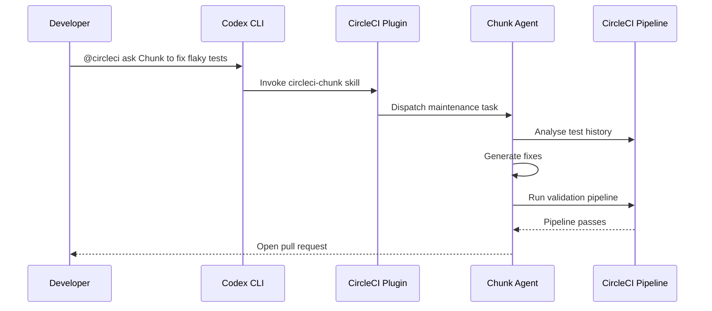

# Codex CLI and CircleCI: Wiring the MCP Server and Plugin into Your CI/CD Feedback Loop


---

The build broke. You open a browser tab, click through to CircleCI, expand the failed job, scroll past infrastructure noise to find the actual error, context-switch back to your editor, fix the issue, push, and wait. Multiply by a dozen failures a week and you have hours of dead time that contributes nothing to shipping software.

CircleCI's MCP Server and Codex Plugin eliminate that round-trip by surfacing pipeline data, build failure logs, test results, and configuration validation directly inside your Codex CLI session[^1]. Since the MCP server's latest update in June 2026 — adding pipeline status tools, prompt iteration, config validation, and flaky test detection[^2] — the integration is now mature enough to replace the dashboard tab for most CI debugging workflows.

This article covers both integration paths (MCP server and Codex plugin), the sixteen tools the server exposes, practical configuration for Codex CLI, and how to delegate autonomous CI maintenance to CircleCI's Chunk agent without leaving the terminal.

## Two Integration Paths: MCP Server vs Codex Plugin

CircleCI provides two distinct routes into Codex CLI. Understanding the difference saves you from installing both when you only need one.

```mermaid
flowchart LR
    subgraph Codex CLI
        A[Agent Loop]
    end
    subgraph "Path 1: MCP Server"
        B["@circleci/mcp-server-circleci"]
        C[CircleCI REST API]
    end
    subgraph "Path 2: Codex Plugin"
        D[CircleCI Plugin]
        E[CircleCI Local CLI]
        F[Chunk Agent]
    end
    A -->|MCP protocol| B
    B -->|HTTPS + token| C
    A -->|@circleci skill| D
    D -->|CLI commands| E
    D -->|Delegation| F
    E -->|HTTPS + token| C
    F -->|Pipeline execution| C
```

**The MCP Server** (`@circleci/mcp-server-circleci`) is a standalone STDIO or Docker process that speaks the Model Context Protocol. It works with any MCP-compatible client — Codex CLI, Claude Desktop, Cursor, Windsurf — making it the right choice for teams that standardise across multiple AI tools[^1].

**The Codex Plugin** bundles four skills (`circleci-builds`, `circleci-config`, `circleci-cli`, `circleci-chunk`) into a single installable package from the Codex plugin directory. It wraps the CircleCI local CLI binary and adds Chunk delegation[^3]. If your team is all-in on Codex, this is the shorter path.

Both paths require a CircleCI personal API token. Neither requires a paid CircleCI plan for basic pipeline inspection — the free tier supports the full API surface.

## Setting Up the MCP Server in Codex CLI

### Option A: Interactive CLI

```bash
codex mcp add circleci \
  --env CIRCLECI_TOKEN=$CIRCLECI_TOKEN \
  -- npx -y @circleci/mcp-server-circleci@latest
```

This writes the correct TOML stanza and restarts the MCP connection automatically[^4].

### Option B: Direct config.toml

For teams checking shared configuration into version control, edit `~/.codex/config.toml` (user-scope) or `.codex/config.toml` (project-scope):

```toml
[mcp_servers.circleci]
command = "npx"
args = ["-y", "@circleci/mcp-server-circleci@latest"]
env = { CIRCLECI_TOKEN = "" }
env_vars = ["CIRCLECI_TOKEN"]
startup_timeout_sec = 15
tool_timeout_sec = 60
```

For on-premises CircleCI Server installations, add the base URL:

```toml
[mcp_servers.circleci]
command = "npx"
args = ["-y", "@circleci/mcp-server-circleci@latest"]
env_vars = ["CIRCLECI_TOKEN", "CIRCLECI_BASE_URL"]
```

### Option C: Docker (Air-Gapped or Locked-Down Environments)

```toml
[mcp_servers.circleci]
command = "docker"
args = [
  "run", "--rm", "-i",
  "-e", "CIRCLECI_TOKEN",
  "-e", "CIRCLECI_BASE_URL",
  "-e", "MAX_MCP_OUTPUT_LENGTH",
  "circleci/mcp-server-circleci"
]
env_vars = ["CIRCLECI_TOKEN"]
```

The Docker image is published to Docker Hub by CircleCI, so you can mirror it into your internal registry for environments where pulling from the public internet is not permitted[^1].

### Verification

After saving, run `/mcp` in the Codex TUI to confirm the server appears. Alternatively, verify from the command line:

```bash
codex doctor
```

The `codex doctor` output should list the CircleCI MCP server as connected with its sixteen tools available[^5].

## The Sixteen Tools

The MCP server exposes a focused tool surface. Here is the complete inventory as of June 2026[^1]:

| Tool | Purpose |
|------|---------|
| `list_followed_projects` | List all CircleCI projects you follow; returns `projectSlug` values for subsequent calls |
| `get_latest_pipeline_status` | Check the latest pipeline status for a given branch |
| `get_build_failure_logs` | Retrieve detailed failure logs by project slug + branch, job URL, or pipeline URL |
| `get_job_test_results` | Fetch test metadata and results for a specific job |
| `find_flaky_tests` | Analyse test execution history to identify unstable tests |
| `find_underused_resource_classes` | Detect jobs running on oversized compute resources |
| `config_helper` | Validate `.circleci/config.yml` and suggest improvements |
| `run_pipeline` | Trigger a new pipeline on a specified branch |
| `run_rollback_pipeline` | Trigger a rollback pipeline |
| `rerun_workflow` | Rerun a workflow from the start or from the failed job |
| `list_artifacts` | List artifacts produced by a job |
| `list_component_versions` | Display all versions for CircleCI components (orbs, images) |
| `analyze_diff` | Examine git diffs against project rules |
| `create_prompt_template` | Generate structured prompt templates for AI applications on CircleCI |
| `recommend_prompt_template_tests` | Generate test cases for prompt templates |
| `run_evaluation_tests` | Execute evaluation tests against a CircleCI pipeline |
| `download_usage_api_data` | Retrieve usage and billing data from the CircleCI Usage API |

The `MAX_MCP_OUTPUT_LENGTH` environment variable (default: 50,000 characters) controls how much log data each tool returns. For large monorepo builds, increasing this to `100000` prevents truncation of failure logs[^1].

## Practical Workflows

### Debugging a Failed Build

The most common workflow is diagnosing a red pipeline without opening a browser:

```
You: The CI pipeline failed on my feature branch. What went wrong?
```

Codex calls `get_latest_pipeline_status`, identifies the failed job, then calls `get_build_failure_logs` to pull the relevant logs. It classifies the failure — compilation error, test failure, infrastructure timeout, or resource exhaustion — and suggests a targeted fix[^3].

For test failures specifically, `get_job_test_results` returns structured metadata including test name, class, duration, and failure message. Codex can cross-reference this with your local codebase to propose a patch directly.

### Finding and Fixing Flaky Tests

Flaky tests are the silent productivity drain that most teams tolerate rather than fix. The `find_flaky_tests` tool analyses execution history across recent pipeline runs and returns tests that have alternated between pass and fail on the same commit[^2].

```
You: Find the flaky tests in this project and explain why they're unstable.
```

Codex calls `find_flaky_tests`, receives the list of unstable tests with their pass/fail ratios, then reads the test source code to identify common culprits: shared mutable state, time-dependent assertions, uncontrolled network calls, or race conditions in concurrent tests.

### Validating Configuration Before Pushing

Rather than pushing a `.circleci/config.yml` change and waiting for the remote validation to fail:

```
You: Validate the CircleCI config for this repo before I push.
```

The `config_helper` tool performs schema validation locally and returns warnings about deprecated keys, unused orb commands, or configuration anti-patterns. This catches errors in seconds rather than minutes[^3].

### Optimising Resource Spend

The `find_underused_resource_classes` tool analyses job execution metrics to identify pipelines running on `xlarge` when `medium` would suffice. Combined with `download_usage_api_data`, Codex can calculate your actual spend and recommend concrete resource class downgrades:

```
You: Are any of our CI jobs using oversized resource classes? Show me the potential savings.
```

## Delegating to Chunk: Autonomous CI Maintenance

For maintenance tasks that exceed a single conversation turn — stabilising a batch of flaky tests, generating missing test coverage, or optimising a complex pipeline configuration — the Codex plugin's `circleci-chunk` skill delegates work to Chunk, CircleCI's autonomous CI agent[^6].

Chunk runs inside CircleCI's infrastructure. It reads the repository, makes changes, validates them by running the actual pipeline, and opens a pull request when the pipeline passes. During private beta, Chunk opened pull requests for 90% of the flaky tests it analysed[^6].



### Prerequisites for Chunk

1. Enable Chunk in the CircleCI web console
2. Install the CircleCI GitHub App (not just OAuth) on your organisation
3. Store OpenAI or Anthropic API credentials in a `circleci-agents` context
4. Add a `.circleci/cci-agent-setup.yml` with dependency installation instructions[^3]

### Example Delegation

```
You: @circleci ask Chunk to fix any flaky tests in this project
```

Chunk analyses historical test data, identifies inconsistent failures, generates fixes, validates through actual pipeline execution, and opens a pull request upon success. The entire loop runs without further developer input.

## Security Considerations

### Token Scope

The CircleCI personal API token grants read and write access to every project you follow. For CI debugging workflows, this is necessary — `get_build_failure_logs` needs read access, `run_pipeline` needs write access. For team deployments, consider:

- **Dedicated service account tokens** rather than personal tokens for shared MCP server deployments
- **Scoped tokens** if your CircleCI plan supports them (Enterprise tier)
- **Project-scope configuration** (`.codex/config.toml`) with `env_vars` pulling from environment variables rather than hardcoded values[^4]

### Approval Policies

For destructive operations like `run_pipeline` and `rerun_workflow`, set per-tool approval modes:

```toml
[mcp_servers.circleci]
command = "npx"
args = ["-y", "@circleci/mcp-server-circleci@latest"]
env_vars = ["CIRCLECI_TOKEN"]
default_tools_approval_mode = "auto"

[mcp_servers.circleci.tools.run_pipeline]
approval_mode = "prompt"

[mcp_servers.circleci.tools.rerun_workflow]
approval_mode = "prompt"

[mcp_servers.circleci.tools.run_rollback_pipeline]
approval_mode = "approve"
```

This grants auto-approval for read operations (log fetching, test results, project listing) whilst requiring explicit confirmation before triggering pipelines or reruns[^4].

## AGENTS.md Integration

Add CI context to your project's `AGENTS.md` so Codex understands your pipeline structure without needing to discover it each session:

```markdown
## CI/CD

This project uses CircleCI. The config lives at `.circleci/config.yml`.

Key workflows:
- `build-and-test`: runs on every push, executes unit and integration tests
- `deploy-staging`: triggered on `main` merges, deploys to staging
- `deploy-production`: manual approval gate, deploys to production

When investigating CI failures, check the CircleCI MCP server first with
`get_build_failure_logs` before attempting local reproduction.

Known flaky tests are tracked in `docs/flaky-tests.md`.
```

This reduces token spend by eliminating the discovery phase where Codex would otherwise call `list_followed_projects` and `get_latest_pipeline_status` to orient itself[^7].

## When to Use the MCP Server vs the Plugin

| Criterion | MCP Server | Codex Plugin |
|-----------|-----------|--------------|
| Multi-tool team (Cursor, Claude, Windsurf) | ✅ Works everywhere | ❌ Codex only |
| Chunk delegation | ❌ Not included | ✅ Built-in skill |
| Config validation | ✅ `config_helper` tool | ✅ Via CircleCI CLI |
| Local CLI operations | ❌ API only | ✅ Full CLI access |
| Docker/air-gapped deployment | ✅ Official image | ❌ Requires npm |
| Per-tool approval control | ✅ Via config.toml | ⚠️ Plugin-level only |

For most teams, the recommendation is straightforward: install the **MCP server** for pipeline visibility and debugging, add the **plugin** only if you need Chunk delegation or local CLI operations[^3].

## Limitations

- **Log size**: CircleCI's API returns compressed logs. Very large build outputs (multi-gigabyte) may hit the `MAX_MCP_OUTPUT_LENGTH` ceiling even at elevated values. For these, direct log download remains necessary. ⚠️
- **Real-time streaming**: The MCP server returns completed job data, not live streaming logs. You cannot watch a build in progress through the MCP tools.
- **Parallelism visibility**: For highly parallelised workflows (50+ parallel containers), the tool responses can be large. Use `get_build_failure_logs` with a specific job URL rather than branch-level queries to avoid fetching all parallel job logs at once.
- **Chunk availability**: Chunk requires CircleCI's GitHub App and an AI provider API key stored in a CircleCI context. Organisations using GitLab or Bitbucket as their VCS provider cannot currently use Chunk[^6].

## Citations

[^1]: CircleCI-Public, "mcp-server-circleci", GitHub repository, [https://github.com/CircleCI-Public/mcp-server-circleci](https://github.com/CircleCI-Public/mcp-server-circleci) (accessed 15 June 2026).

[^2]: CircleCI, "MCP Server updates: Pipeline Status and Prompt Iteration tools, Config Validation and Flaky Test Detection", CircleCI Changelog, [https://circleci.com/changelog/](https://circleci.com/changelog/) (accessed 15 June 2026).

[^3]: CircleCI, "CircleCI is now available as a Codex plugin", CircleCI Blog, [https://circleci.com/blog/circleci-codex-plugin/](https://circleci.com/blog/circleci-codex-plugin/) (accessed 15 June 2026).

[^4]: OpenAI, "Model Context Protocol – Codex", OpenAI Developers, [https://developers.openai.com/codex/mcp](https://developers.openai.com/codex/mcp) (accessed 15 June 2026).

[^5]: OpenAI, "Changelog – Codex", OpenAI Developers, [https://developers.openai.com/codex/changelog](https://developers.openai.com/codex/changelog) (accessed 15 June 2026).

[^6]: CircleCI, "Introducing Chunk: The agent that validates code at AI speed", CircleCI Blog, [https://circleci.com/blog/introducing-chunk/](https://circleci.com/blog/introducing-chunk/) (accessed 15 June 2026).

[^7]: CircleCI, "Getting started with Codex and CircleCI", CircleCI Blog, [https://circleci.com/blog/getting-started-with-codex-and-circleci/](https://circleci.com/blog/getting-started-with-codex-and-circleci/) (accessed 15 June 2026).
