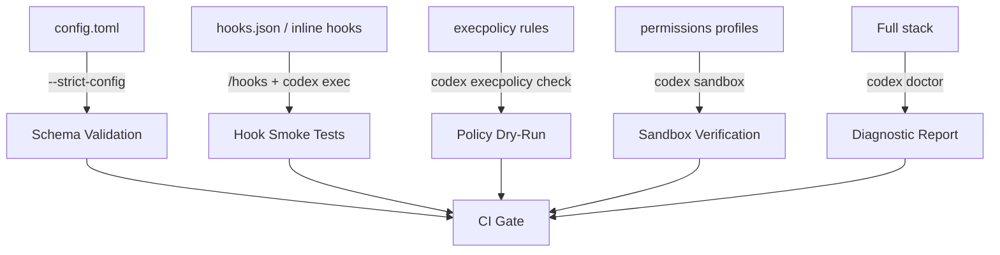

# Testing Your Codex CLI Configuration: Validation Commands, Hook Smoke Tests, and CI Pre-Flight Checks


---

Your Codex CLI configuration is code. It controls which model runs, what the sandbox permits, how hooks gate tool calls, and which MCP servers the agent can reach. Yet most teams treat `config.toml`, `hooks.json`, and AGENTS.md as write-once artefacts — deployed without tests, validated only when something breaks in production. As organisations scale from individual CLI users to team-wide adoption with managed configuration, untested configuration becomes an operational liability.

This article maps the validation surface built into Codex CLI as of v0.139 — the commands, flags, and patterns that let you treat your agent configuration with the same rigour you apply to application code.

## The Configuration Testing Surface

Codex CLI ships with five distinct validation mechanisms, each targeting a different layer of the configuration stack [^1] [^2].



### 1. `--strict-config`: Schema Validation for config.toml

The `--strict-config` flag causes Codex to error on unrecognised fields in `config.toml` [^1]. Without it, Codex silently ignores typos and stale keys — a `model_reasoning_efort` (note the typo) produces no warning, and the agent runs with the default reasoning effort instead.

```bash
# Validate config before a real session
codex exec --strict-config -q "echo hello"

# Validate a specific profile
codex exec --strict-config --profile ci-review -q "echo hello"
```

In CI, the exit code is the gate. A non-zero return from `--strict-config` means configuration is invalid:

```bash
#!/usr/bin/env bash
set -euo pipefail

codex exec --strict-config -q "exit 0" 2>/dev/null
echo "Config validation passed"
```

**What it catches:** Misspelt keys, removed configuration options after CLI upgrades, invalid TOML syntax, and type mismatches (e.g. a string where an integer is expected).

**What it does not catch:** Logically valid but operationally wrong values — a `model = "gpt-5.3-codex"` passes schema validation today but will fail at runtime after 30 June 2026 [^3].

### 2. `codex doctor`: The Comprehensive Diagnostic

`codex doctor` runs a suite of checks across eight diagnostic categories: local installation, configuration parsing, authentication, runtime environment, Git, terminal, app-server, and thread inventory [^4] [^5].

```bash
# Interactive report
codex doctor

# Machine-readable JSON for CI parsing
codex doctor --json > doctor-report.json

# Summary view for quick checks
codex doctor --summary
```

The JSON output is structured for programmatic consumption. A CI step can parse it to gate deployments:

```bash
#!/usr/bin/env bash
set -euo pipefail

REPORT=$(codex doctor --json 2>/dev/null)

# Check for any failed checks
FAILURES=$(echo "$REPORT" | jq '[.checks[] | select(.status == "fail")] | length')

if [ "$FAILURES" -gt 0 ]; then
    echo "codex doctor found $FAILURES failing checks:"
    echo "$REPORT" | jq '.checks[] | select(.status == "fail") | .name'
    exit 1
fi
```

Since v0.135, `codex doctor` includes editor and pager environment details, Git configuration, and terminal capability detection [^5]. Since v0.139, it reports richer MCP server status and sandbox image health [^6].

### 3. `codex execpolicy check`: Dry-Running Command Policies

The `codex execpolicy check` command evaluates your execution policy rules against a command *without running it* [^7] [^8]. This is the testing primitive for teams that use policy rules to control which shell commands the agent may execute.

```bash
# Test whether 'rm -rf /' would be blocked
codex execpolicy check --rules .codex/policy.rules --pretty rm -rf /

# Test with multiple merged rule files
codex execpolicy check \
    --rules /etc/codex/org-policy.rules \
    --rules .codex/project-policy.rules \
    --pretty \
    git push --force origin main
```

The output is JSON containing the decision (`allow`, `prompt`, or `forbidden`), the matched rules, and the matched prefix [^8]:

```json
{
    "decision": "forbidden",
    "matchedRules": [
        {
            "prefix": "rm -rf",
            "decision": "forbidden",
            "source": ".codex/policy.rules:3"
        }
    ],
    "matchedPrefix": "rm -rf"
}
```

When multiple rules match, Codex applies the strictest decision: `forbidden` overrides `prompt`, which overrides `allow` [^8].

**The CI pattern:** Build a test matrix of commands that should be allowed and commands that should be blocked, then assert the expected decisions:

```bash
#!/usr/bin/env bash
set -euo pipefail

RULES=".codex/policy.rules"

# Commands that must be allowed
assert_allowed() {
    local decision
    decision=$(codex execpolicy check --rules "$RULES" "$@" | jq -r '.decision')
    if [ "$decision" != "allow" ]; then
        echo "FAIL: expected 'allow' for: $*  (got: $decision)"
        exit 1
    fi
}

# Commands that must be blocked
assert_forbidden() {
    local decision
    decision=$(codex execpolicy check --rules "$RULES" "$@" | jq -r '.decision')
    if [ "$decision" != "forbidden" ]; then
        echo "FAIL: expected 'forbidden' for: $*  (got: $decision)"
        exit 1
    fi
}

assert_allowed git status
assert_allowed npm test
assert_allowed cargo build
assert_forbidden rm -rf /
assert_forbidden curl -X POST
assert_forbidden docker run --privileged

echo "All execpolicy assertions passed"
```

### 4. `codex sandbox`: Testing Permission Profiles

The `codex sandbox` subcommand runs arbitrary commands under the internal Codex sandbox policies — macOS Seatbelt, Linux Landlock/bwrap, or Windows restricted tokens [^1] [^9]. This lets you verify that your permission profiles actually enforce the filesystem and network boundaries you intend.

```bash
# Test that a read-only profile blocks writes
codex sandbox --permissions-profile read-only \
    touch /tmp/should-fail.txt
# Expected: permission denied

# Test that workspace-write allows writes within project
codex sandbox --permissions-profile workspace-write \
    touch ./src/allowed.txt
# Expected: success

# Test with managed config included
codex sandbox --include-managed-config \
    --permissions-profile ci-agent \
    curl https://api.example.com/health
# Verify network access rules
```

For enterprise teams using `requirements.toml` with managed permission profiles, the `--include-managed-config` flag ensures the sandbox test includes administrator-imposed restrictions [^9] [^10].

### 5. Hook Smoke Tests with `codex exec`

Hooks lack a dedicated `--dry-run` flag, but you can smoke-test them using `codex exec` with a minimal prompt that triggers the hook lifecycle [^2] [^11]:

```bash
# Trigger SessionStart + Stop hooks
codex exec -q "echo test" 2>&1 | tee hook-test.log

# Trigger PreToolUse + PostToolUse hooks for Bash
codex exec -q "Run: ls -la" 2>&1 | tee hook-test.log
```

The `/hooks` TUI command provides interactive hook inspection [^11]:

- View all configured hooks and their sources
- Review new or changed hooks
- Trust or disable individual hooks
- Verify hook trust status

For CI automation, where the TUI is unavailable, use `--dangerously-bypass-hook-trust` only in environments where hook sources are already vetted through version control [^1]:

```bash
# CI-only: bypass trust check when hooks are committed to the repo
codex exec \
    --dangerously-bypass-hook-trust \
    --strict-config \
    -q "Run: echo hook-test" 2>&1
```

⚠️ Never use `--dangerously-bypass-hook-trust` outside a controlled CI environment. The flag exists specifically for pipelines that vet hook sources through code review.

## Building a CI Pre-Flight Pipeline

Combining these five mechanisms into a single CI step creates a comprehensive configuration gate. The following GitHub Actions workflow runs all checks before any `codex exec` automation:


```yaml
name: Codex Config Pre-Flight
on:
  pull_request:
    paths:
      - '.codex/**'
      - 'AGENTS.md'
      - '**/AGENTS.md'

jobs:
  preflight:
    runs-on: ubuntu-latest
    steps:
      - uses: actions/checkout@v4

      - name: Install Codex CLI
        run: npm install -g @openai/codex@latest

      - name: Schema validation
        run: codex exec --strict-config -q "exit 0"
        env:
          OPENAI_API_KEY: ${{ secrets.OPENAI_API_KEY }}

      - name: Doctor diagnostics
        run: |
          codex doctor --json > doctor-report.json
          FAILS=$(jq '[.checks[] | select(.status == "fail")] | length' doctor-report.json)
          if [ "$FAILS" -gt 0 ]; then
            echo "::error::codex doctor found $FAILS failing checks"
            jq '.checks[] | select(.status == "fail")' doctor-report.json
            exit 1
          fi

      - name: Execution policy tests
        run: |
          if [ -f .codex/policy.rules ]; then
            bash scripts/test-execpolicy.sh
          else
            echo "No policy rules found, skipping"
          fi

      - name: AGENTS.md size check
        run: |
          for f in $(find . -name AGENTS.md); do
            LINES=$(wc -l < "$f")
            if [ "$LINES" -gt 150 ]; then
              echo "::warning file=$f::AGENTS.md is $LINES lines (recommended: <150)"
            fi
          done
```


## Testing AGENTS.md Effectiveness

AGENTS.md files are harder to validate mechanically — their correctness depends on whether the model follows the instructions. A pragmatic approach uses `codex exec` with targeted prompts that produce verifiable output [^12]:

```bash
# Test that AGENTS.md conventions are picked up
codex exec -q "What test framework does this project use? Reply with only the framework name." \
    --output-schema '{"type":"object","properties":{"framework":{"type":"string"}},"required":["framework"]}'
```

If your AGENTS.md specifies `pytest` as the test runner, the structured output should reflect that. Differences indicate the instruction is either missing, buried too deep in a verbose file, or contradicted by a subdirectory override.

## Profile-Specific Validation

Named profiles are a common source of configuration drift — a `ci-fast` profile might reference a deprecated model string or an approval policy that made sense three months ago [^13]. Test each profile independently:

```bash
#!/usr/bin/env bash
set -euo pipefail

PROFILES=("default" "ci-review" "ci-fast" "deep-reasoning")

for profile in "${PROFILES[@]}"; do
    echo "Testing profile: $profile"
    codex exec --strict-config --profile "$profile" -q "exit 0" 2>/dev/null \
        && echo "  PASS" \
        || { echo "  FAIL: profile '$profile' has configuration errors"; exit 1; }
done
```

## MCP Server Health Checks

MCP servers configured in `config.toml` can fail silently if the server binary is missing, the path has changed, or a dependency is not installed. Use `codex mcp list` combined with a connection test [^14]:

```bash
# List configured MCP servers
codex mcp list

# Health-check each server (server names from config.toml)
codex mcp list --json | jq -r '.[].name' | while read -r server; do
    echo -n "Testing MCP server '$server': "
    timeout 10 codex exec -q "List the tools available from MCP server $server" 2>/dev/null \
        && echo "OK" \
        || echo "UNREACHABLE"
done
```

## The Testing Matrix

The following matrix maps configuration layers to their testing tools:

| Layer | Tool | Catches | CI-Friendly |
|-------|------|---------|-------------|
| config.toml syntax | `--strict-config` | Typos, stale keys, type errors | Yes |
| Runtime environment | `codex doctor --json` | Auth failures, missing binaries, sandbox issues | Yes |
| Execution policies | `codex execpolicy check` | Wrong allow/block decisions | Yes |
| Permission profiles | `codex sandbox` | Filesystem/network boundary violations | Yes |
| Hooks | `codex exec` + log inspection | Hook failures, trust issues | Partial |
| AGENTS.md | `codex exec` + structured output | Instruction ineffectiveness | Partial |
| Named profiles | `--strict-config --profile` | Profile-specific errors | Yes |
| MCP servers | `codex mcp list` + connection test | Unreachable servers | Partial |

## Limitations

Configuration testing in Codex CLI has genuine constraints worth acknowledging:

- **No `--dry-run` for hooks.** You must trigger hooks through actual (minimal) sessions, which consumes tokens. A dedicated hook dry-run command remains an open feature request [^11].
- **AGENTS.md validation is probabilistic.** The model may or may not follow instructions on any given run. Test multiple times or use structured output constraints to increase confidence.
- **`codex doctor` covers runtime, not logic.** It confirms the CLI can authenticate and reach the API, but it cannot tell you whether your model choice is optimal for your workload.
- **Deprecated model detection requires runtime checks.** `--strict-config` validates syntax, not model availability. A model string that passes validation today may return HTTP 404 after a deprecation deadline [^3].
- **MCP server health checks are integration tests.** They require network access and may be slow or flaky in CI.

## Conclusion

Codex CLI provides enough built-in tooling to establish a meaningful configuration testing practice. The combination of `--strict-config` for schema validation, `codex doctor` for environment diagnostics, `codex execpolicy check` for policy dry-runs, and `codex sandbox` for permission verification covers the critical layers. Wire these into a CI gate triggered on changes to `.codex/`, `AGENTS.md`, or profile files, and you catch configuration regressions before they waste tokens or violate security boundaries in production.

The gap — and the opportunity for the CLI to improve — is in hook dry-runs and AGENTS.md effectiveness testing, where the current tooling requires actual model invocations rather than deterministic checks.

---

## Citations

[^1]: OpenAI, "Command line options – Codex CLI," OpenAI Developers, 2026. [https://developers.openai.com/codex/cli/reference](https://developers.openai.com/codex/cli/reference)

[^2]: OpenAI, "Hooks – Codex," OpenAI Developers, 2026. [https://developers.openai.com/codex/hooks](https://developers.openai.com/codex/hooks)

[^3]: OpenAI, "Deprecations – OpenAI API," OpenAI Developers, 2026. [https://developers.openai.com/api/docs/deprecations](https://developers.openai.com/api/docs/deprecations)

[^4]: OpenAI, "feat(cli): add codex doctor diagnostics," GitHub PR #22336, May 2026. [https://github.com/openai/codex/pull/22336](https://github.com/openai/codex/pull/22336)

[^5]: OpenAI, "feat(doctor): report editor and pager environment," GitHub PR #27081, June 2026. [https://github.com/openai/codex/pull/27081](https://github.com/openai/codex/pull/27081)

[^6]: OpenAI, "Changelog – Codex," OpenAI Developers, June 2026. [https://developers.openai.com/codex/changelog](https://developers.openai.com/codex/changelog)

[^7]: OpenAI, "Rules – Codex," OpenAI Developers, 2026. [https://developers.openai.com/codex/rules](https://developers.openai.com/codex/rules)

[^8]: OpenAI, "codex-rs/execpolicy/README.md," GitHub openai/codex, 2026. [https://github.com/openai/codex/blob/main/codex-rs/execpolicy/README.md](https://github.com/openai/codex/blob/main/codex-rs/execpolicy/README.md)

[^9]: OpenAI, "Agent approvals & security – Codex," OpenAI Developers, 2026. [https://developers.openai.com/codex/agent-approvals-security](https://developers.openai.com/codex/agent-approvals-security)

[^10]: OpenAI, "Configuration Reference – Codex," OpenAI Developers, 2026. [https://developers.openai.com/codex/config-reference](https://developers.openai.com/codex/config-reference)

[^11]: OpenAI, "Hooks – Codex," OpenAI Developers, 2026. [https://developers.openai.com/codex/hooks](https://developers.openai.com/codex/hooks)

[^12]: OpenAI, "Best practices – Codex," OpenAI Developers, 2026. [https://developers.openai.com/codex/learn/best-practices](https://developers.openai.com/codex/learn/best-practices)

[^13]: OpenAI, "Configuration basics – Codex," OpenAI Developers, 2026. [https://developers.openai.com/codex/config](https://developers.openai.com/codex/config)

[^14]: OpenAI, "Model Context Protocol – Codex," OpenAI Developers, 2026. [https://developers.openai.com/codex/mcp](https://developers.openai.com/codex/mcp)
