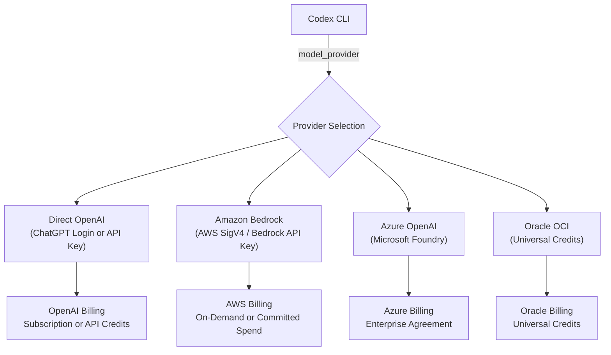
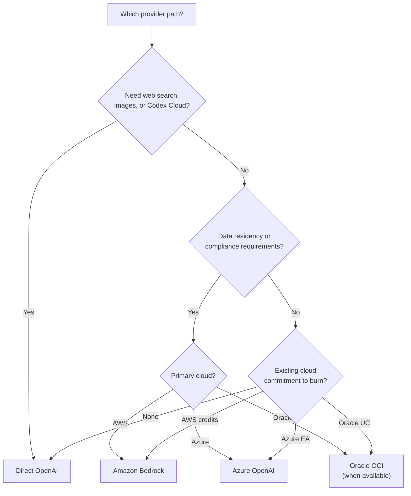

# Codex CLI in the Multi-Cloud Era: Configuring Model Providers Across AWS Bedrock, Azure OpenAI, Oracle OCI, and Direct OpenAI


---

On 27 April 2026, Microsoft and OpenAI restructured their partnership: Microsoft's licence to OpenAI intellectual property became non-exclusive, and OpenAI gained the freedom to sell its products on any cloud provider[^1]. The next day, GPT-5.5, GPT-5.4, and Codex appeared on Amazon Bedrock[^2]. Six weeks later — on 11 June 2026 — OpenAI announced that Oracle Cloud Infrastructure customers could apply eligible Universal Credits toward OpenAI models and Codex[^3]. Azure OpenAI through Microsoft Foundry had already been available since early 2026[^4].

For Codex CLI practitioners, this means the tool you run in your terminal can now route inference through at least four distinct billing and infrastructure paths. Each path carries different authentication mechanics, feature availability, data residency implications, and cost structures. This article maps the full landscape and provides the `config.toml` configuration for each.

## The Four Paths



Each provider path is selected via the `model_provider` key in `~/.codex/config.toml`. The CLI's custom provider architecture allows multiple providers to coexist in a single configuration file, with the active provider switched by changing a single line[^5].

## Path 1: Direct OpenAI

The default path. Two sub-variants exist: **ChatGPT sign-in** (subscription billing, full feature set including Codex Cloud, web search, and image generation) and **API key** (usage-based billing, no cloud features)[^6].

### ChatGPT Sign-In

```bash
codex login
```

Opens a browser for OAuth. The resulting access token is stored according to `cli_auth_credentials_store`:

```toml
# ~/.codex/config.toml
cli_auth_credentials_store = "keyring"  # file | keyring | auto
```

For headless environments without a browser:

```bash
codex login --device-auth
```

Enterprise workspaces can also issue access tokens for non-interactive automation[^7]:

```bash
printenv CODEX_ACCESS_TOKEN | codex login --with-access-token
```

### API Key

```bash
export OPENAI_API_KEY  # set to your OpenAI Platform key
```

No `config.toml` changes required — `openai` is the default provider. API key users are billed at standard OpenAI Platform rates[^6].

**Feature availability:** Full. This is the only path that supports the complete feature matrix including web search, image generation, voice dictation, Codex Cloud tasks, and fast/priority service tiers[^8].

**Models:** GPT-5.5, GPT-5.4, GPT-5.4-mini, GPT-5.3-codex-spark (Pro only)[^9].

## Path 2: Amazon Bedrock

Generally available since 1 June 2026[^2]. Codex CLI gained first-class Bedrock support in v0.124.0 (23 April 2026) with a built-in `amazon-bedrock` provider, AWS SigV4 signing, and full credential-chain authentication[^10].

### Configuration

```toml
# ~/.codex/config.toml
model_provider = "amazon-bedrock"
model = "openai.gpt-5.5"

[model_providers.amazon-bedrock.aws]
profile = "default"
region = "us-east-2"
```

### Authentication

Codex checks credentials in order[^10]:

1. **Bedrock API Key** — fastest path for evaluation:
   ```bash
   export AWS_BEARER_TOKEN_BEDROCK="<your-bedrock-api-key>"
   export AWS_REGION="us-east-2"
   ```
2. **AWS SDK credential chain** — shared config files, environment variables, SSO, federated identity, or `credential_process`.

For desktop or IDE usage, credentials can be stored in `~/.codex/.env`.

### Limitations

Bedrock inference is on-demand only. This means[^10]:

- **No fast/priority service tier** — the `service_tier` config key has no effect
- **No web search, image generation, or voice dictation** — these depend on OpenAI-hosted cloud services
- **No Codex Cloud** — tasks run locally only
- **No GovCloud** — Bedrock Mantle endpoints are not supported in AWS GovCloud regions

Model availability also varies by AWS region. Verify with `aws bedrock list-foundation-models --query "modelSummaries[?providerName=='OpenAI']"`.

**Billing advantage:** Usage counts toward existing AWS committed spend, avoiding a separate OpenAI vendor relationship[^2].

## Path 3: Azure OpenAI (Microsoft Foundry)

Available through Azure AI Foundry, this path routes inference through Microsoft-managed infrastructure with enterprise-grade networking, RBAC, and compliance boundaries[^4].

### Configuration

```toml
# ~/.codex/config.toml
model_provider = "azure"
model = "gpt-5-codex"  # Must match your Azure deployment name

[model_providers.azure]
name = "Azure OpenAI"
base_url = "https://YOUR_RESOURCE.openai.azure.com/openai"
env_key = "AZURE_OPENAI_API_KEY"
wire_api = "responses"
query_params = { api-version = "2025-04-01-preview" }
```

```bash
export AZURE_OPENAI_API_KEY  # set to your Azure resource key
```

### Critical Gotcha: Deployment Names

The `model` field must match the **deployment name** you gave the model inside Azure AI Foundry, not the base model name[^11]. If you deployed GPT-5.2-Codex as `my-codex-deployment`, your config must read `model = "my-codex-deployment"`.

### Limitations

- **GPT-5.5 availability** — as of mid-June 2026, GPT-5.5 is available only when authenticated via ChatGPT subscription, not through API-key authentication against Azure OpenAI deployments[^4] ⚠️
- **No managed identity** — Codex CLI does not yet support Entra ID token-based authentication; API key authentication is required[^12]
- **Cloud features unavailable** — same restrictions as Bedrock for OpenAI-hosted services

**Billing advantage:** Draws from existing Azure Enterprise Agreement spend; integrates with Azure Cost Management[^4].

## Path 4: Oracle OCI (Universal Credits)

Announced 11 June 2026, this is the newest path[^3]. Oracle customers with eligible Universal Credits can apply them toward OpenAI models and Codex through OCI.

### Current Status

**This path is not yet technically live.** OpenAI's announcement states "availability will begin in the coming weeks"[^3]. No technical configuration documentation, model SKU list, or CLI provider implementation has been published. ⚠️

### What We Know

- **Billing mechanism:** draws from existing annual Universal Credits commitment — no new vendor agreement, security review, or budget line item required[^13]
- **Scope:** described as "frontier models and Codex" without naming specific model versions[^3]
- **Access method:** through OCI, under existing Oracle purchasing workflows[^3]
- **Geographic scope:** runs within OCI regions, including sovereign and isolated options[^13]

### What to Watch For

When the OCI path goes live, expect either:

1. **A built-in `oracle-oci` provider** — similar to the `amazon-bedrock` provider, with native credential-chain support
2. **A custom provider configuration** — using OCI's OpenAI-compatible endpoint URL and API key authentication

Enterprises with Oracle commitments should contact their Oracle sales representative for early-access timing[^3].

## Feature Parity Matrix

Not all paths are created equal. The following matrix reflects the state as of 15 June 2026:

| Feature | Direct OpenAI | AWS Bedrock | Azure OpenAI | Oracle OCI |
|---------|:------------:|:-----------:|:------------:|:----------:|
| GPT-5.5 | ✅ | ✅ | ❌ ⚠️ | TBD |
| GPT-5.4 | ✅ | ✅ | ✅ | TBD |
| GPT-5.4-mini | ✅ | ✅ | ✅ | TBD |
| GPT-5.3-codex-spark | Pro only | ❌ | ❌ | TBD |
| Web search | ✅ | ❌ | ❌ | TBD |
| Image generation | ✅ | ❌ | ❌ | TBD |
| Voice dictation | ✅ | ❌ | ❌ | TBD |
| Codex Cloud tasks | ✅ | ❌ | ❌ | TBD |
| Fast/Priority tier | ✅ | ❌ | ❌ | TBD |
| Data residency control | Limited | ✅ | ✅ | ✅ |
| Existing cloud billing | ❌ | ✅ | ✅ | ✅ |

## Named Profiles for Multi-Provider Routing

The practical power of multi-cloud Codex lies in named profiles. You can configure different providers for different workflows within a single `config.toml`:

```toml
# Default: Direct OpenAI for full features
model = "gpt-5.5"
model_provider = "openai"

# AWS Bedrock for cost-controlled batch work
[profiles.bedrock-batch]
model_provider = "amazon-bedrock"
model = "openai.gpt-5.5"
model_reasoning_effort = "medium"

# Azure for regulated workloads
[profiles.azure-regulated]
model_provider = "azure"
model = "gpt-5-codex"

[model_providers.azure]
name = "Azure OpenAI"
base_url = "https://compliance-project.openai.azure.com/openai"
env_key = "AZURE_OPENAI_API_KEY"
wire_api = "responses"
query_params = { api-version = "2025-04-01-preview" }

[model_providers.amazon-bedrock.aws]
profile = "codex-team"
region = "eu-west-1"
```

Switch at launch:

```bash
codex --profile bedrock-batch "refactor the auth module"
codex --profile azure-regulated "review the PCI-DSS compliance gaps"
```

Or in CI/CD, where the provider choice maps to the deployment environment:

```bash
# CI pipeline: route through Bedrock for AWS-billed workloads
CODEX_PROFILE=bedrock-batch codex exec "generate migration scripts"
```

## Decision Framework



The decision reduces to three questions:

1. **Do you need the full feature set?** Only direct OpenAI provides web search, image generation, voice, Codex Cloud, and fast/priority processing. If your workflow depends on any of these, the other paths are not viable.

2. **Do you have compliance constraints?** Bedrock and Azure route inference through infrastructure you already govern — VPC controls, private endpoints, audit logging within your cloud account. Oracle OCI will offer similar sovereign-region options.

3. **Where does your budget live?** If your organisation has committed AWS, Azure, or Oracle spend that is under-utilised, routing Codex inference through that path converts sunk cost into productive AI usage without new procurement.

## The Hybrid Pattern

Most enterprise teams will not pick one path exclusively. The emerging pattern is a **hub-and-spoke model**: direct OpenAI for interactive development (full features, lowest latency), with cloud-billed providers for CI/CD pipelines and batch operations (consolidated billing, compliance alignment).

```toml
# Interactive development — full features
model_provider = "openai"

# CI/CD — Bedrock-billed, no cloud features needed
[profiles.ci]
model_provider = "amazon-bedrock"
model = "openai.gpt-5.4-mini"
model_reasoning_effort = "low"
```

This separation maps cleanly to the `service_tier` and cost optimisation strategies covered in the Workspace Agents billing preparation guide[^14].

## Looking Ahead

The post-exclusivity landscape is still settling. Oracle OCI access has been announced but is not yet live. Google Cloud Platform — notably absent from the current provider list — remains a plausible future addition given OpenAI's existing infrastructure deals with GCP[^1]. The custom provider architecture in `config.toml` means CLI users can point Codex at any Responses API-compatible endpoint, so new cloud paths require configuration changes, not software updates[^5].

For now, the actionable steps are:

1. **Audit your current provider path** — run `/status` in the CLI to confirm which provider is active
2. **Configure named profiles** for each cloud path your organisation uses
3. **Map CI/CD pipelines** to the appropriate billing path
4. **Watch for Oracle OCI** provider documentation in the coming weeks
5. **Test feature parity** — ensure your workflow does not depend on cloud-only features before switching away from direct OpenAI

The multi-cloud era does not change what Codex CLI does. It changes who pays for it, where the inference runs, and which compliance frameworks govern the data. Configuration is the lever.

---

## Citations

[^1]: TechCrunch, "OpenAI ends Microsoft legal peril over its \$50B Amazon deal," 27 April 2026. [https://techcrunch.com/2026/04/27/openai-ends-microsoft-legal-peril-over-its-50b-amazon-deal/](https://techcrunch.com/2026/04/27/openai-ends-microsoft-legal-peril-over-its-50b-amazon-deal/)

[^2]: AWS, "Get started with OpenAI GPT-5.5, GPT-5.4 models, and Codex on Amazon Bedrock," April 2026. [https://aws.amazon.com/blogs/aws/get-started-with-openai-gpt-5-5-gpt-5-4-models-and-codex-on-amazon-bedrock/](https://aws.amazon.com/blogs/aws/get-started-with-openai-gpt-5-5-gpt-5-4-models-and-codex-on-amazon-bedrock/)

[^3]: OpenAI, "Access OpenAI models and Codex through your Oracle cloud commitment," 11 June 2026. [https://openai.com/index/openai-on-oracle-cloud/](https://openai.com/index/openai-on-oracle-cloud/)

[^4]: Microsoft Learn, "Codex with Azure OpenAI in Microsoft Foundry Models," 2026. [https://learn.microsoft.com/en-us/azure/foundry/openai/how-to/codex](https://learn.microsoft.com/en-us/azure/foundry/openai/how-to/codex)

[^5]: OpenAI Developers, "Advanced Configuration – Codex," 2026. [https://developers.openai.com/codex/config-advanced](https://developers.openai.com/codex/config-advanced)

[^6]: OpenAI Developers, "Authentication – Codex," 2026. [https://developers.openai.com/codex/auth](https://developers.openai.com/codex/auth)

[^7]: OpenAI Help Center, "Enterprise Access Tokens for Codex," 2026. [https://help.openai.com/en/articles/20001193](https://help.openai.com/en/articles/20001193)

[^8]: OpenAI Developers, "Use Codex with Amazon Bedrock," 2026. [https://developers.openai.com/codex/amazon-bedrock](https://developers.openai.com/codex/amazon-bedrock)

[^9]: OpenAI Developers, "Models – Codex," 2026. [https://developers.openai.com/codex/models](https://developers.openai.com/codex/models)

[^10]: OpenAI Developers, "Use Codex with Amazon Bedrock," 2026. [https://developers.openai.com/codex/amazon-bedrock](https://developers.openai.com/codex/amazon-bedrock)

[^11]: Microsoft Q&A, "Problem connecting Azure Foundry models to VS Code Codex," June 2026. [https://learn.microsoft.com/en-us/answers/questions/5872481/problem-connecting-azure-foundry-models-to-vs-code](https://learn.microsoft.com/en-us/answers/questions/5872481/problem-connecting-azure-foundry-models-to-vs-code)

[^12]: GitHub, "Support the Azure default credential chain for Azure OpenAI authentication," Issue #10764. [https://github.com/openai/codex/issues/10764](https://github.com/openai/codex/issues/10764)

[^13]: Digital Applied, "OpenAI and Oracle Universal Credits: Enterprise Readout," June 2026. [https://www.digitalapplied.com/blog/openai-oracle-universal-credits-2026-enterprise-readout](https://www.digitalapplied.com/blog/openai-oracle-universal-credits-2026-enterprise-readout)

[^14]: Codex Knowledge Base, "Workspace Agents Credit Pricing Starts July 6," 14 June 2026. [https://codex.danielvaughan.com/2026/06/14/workspace-agents-credit-pricing-july-2026-codex-cli-budget-preparation-cost-optimisation/](https://codex.danielvaughan.com/2026/06/14/workspace-agents-credit-pricing-july-2026-codex-cli-budget-preparation-cost-optimisation/)
