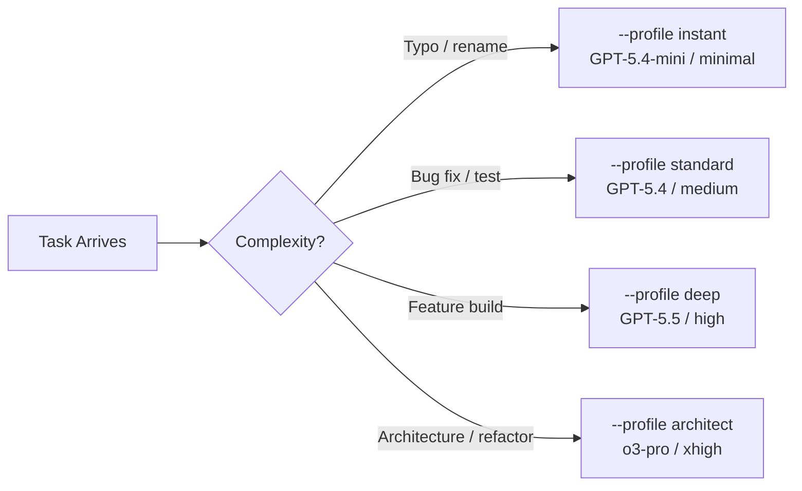
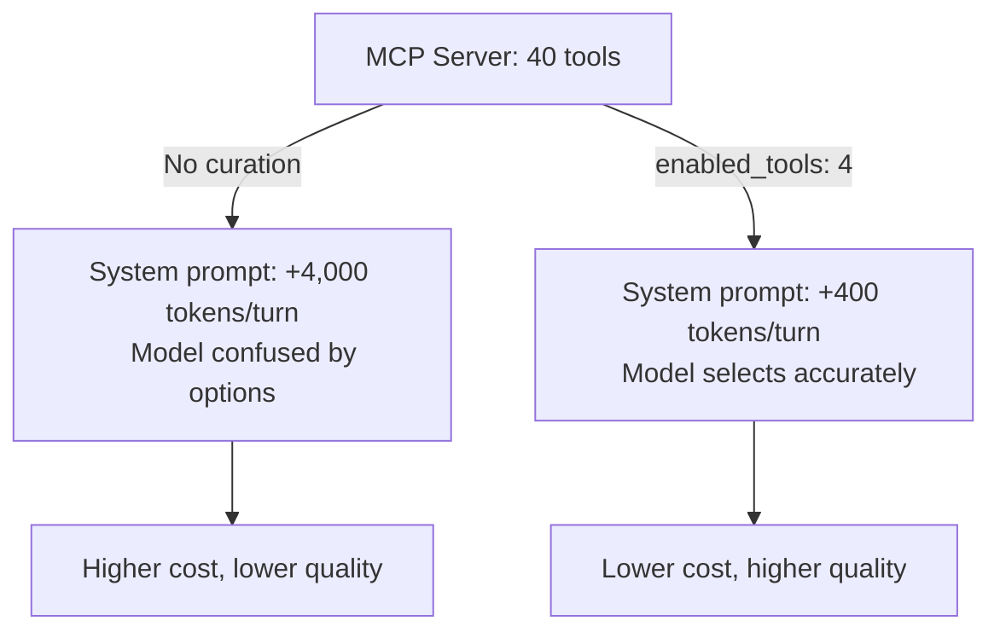
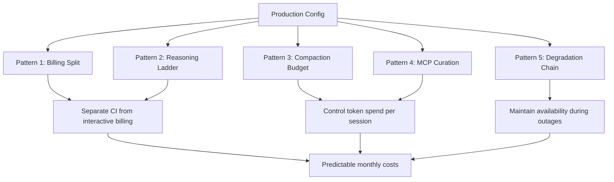

# Five Production Configuration Patterns for Codex CLI in the Post-Subsidy Era


---

## Introduction

June 2026 marks the month every major coding agent platform switched to usage-based billing. GitHub Copilot moved to AI Credits on 1 June[^1]. Anthropic's Claude Code credit split takes effect today, 15 June, separating programmatic agent usage into capped monthly pools metered at full API rates[^2]. OpenAI's Workspace Agents free period ends on 6 July[^3]. Simultaneously, the original Claude Sonnet 4 and Opus 4 models retire today at 09:00 PT, breaking any multi-provider configurations still referencing `claude-sonnet-4-20250514` or `claude-opus-4-20250514`[^4].

These shifts are not incremental. They change the economics and reliability assumptions underpinning production agent workflows. Teams that treated `config.toml` as a one-time setup exercise are discovering that configuration is now an ongoing operational discipline — one that directly determines monthly spend, failure resilience, and development velocity.

This article distils five configuration patterns that have emerged from production Codex CLI deployments during this transition. Each pattern addresses a specific pressure point created by the June 2026 landscape, and each is expressed in concrete `config.toml` syntax you can adapt today.

---

## Pattern 1: The Billing-Surface Split

The single most impactful configuration change for teams approaching the 6 July credit billing deadline is separating interactive and automated workloads onto different billing surfaces[^3].

### The Problem

When a developer uses Codex CLI interactively via ChatGPT login and also runs `codex exec` in CI/CD pipelines under the same authentication, both workloads draw from the same Workspace Agent credit pool. A runaway CI pipeline can exhaust the team's monthly allocation before developers finish their morning coffee.

### The Configuration

```toml
# ~/.codex/config.toml — interactive work (ChatGPT login)
model = "gpt-5.5"
model_reasoning_effort = "high"
service_tier = "standard"

[profiles.ci]
# CI/CD: API key billing, cheaper model, lower reasoning
model = "gpt-5.4-mini"
model_reasoning_effort = "low"
service_tier = "flex"
tool_output_token_limit = 4000
model_auto_compact_token_limit = 60000
```

CI pipelines invoke with an explicit API key and profile:

```bash
export OPENAI_API_KEY="$CI_OPENAI_API_KEY"
codex exec --profile ci \
  --approval-policy full-auto \
  "run tests and report failures as JSON"
```

The API key bypasses Workspace Agent credits entirely, billing directly to the organisation's OpenAI API account at standard token rates[^3]. The `flex` service tier accepts off-peak scheduling in exchange for lower per-token costs[^5]. The combination typically reduces CI agent costs by 60–80% compared to running the same workloads through subscription credits on GPT-5.5[^6].

### Why This Matters Now

Before 6 July, Workspace Agent usage is free for Business and Enterprise accounts[^3]. Teams accustomed to unlimited CI usage face a billing cliff. Separating billing surfaces *before* the transition exposes the real cost of automated workloads and gives teams time to right-size their `tool_output_token_limit` and `model_auto_compact_token_limit` values based on actual spend data.

---

## Pattern 2: The Reasoning-Effort Ladder

OpenAI's June 2026 model picker replacement — six named reasoning tiers from Instant to Pro Extended — made explicit what experienced CLI practitioners already knew: most tasks do not need maximum reasoning[^7].

### The Configuration

```toml
[profiles.instant]
model = "gpt-5.4-mini"
model_reasoning_effort = "minimal"

[profiles.standard]
model = "gpt-5.4"
model_reasoning_effort = "medium"

[profiles.deep]
model = "gpt-5.5"
model_reasoning_effort = "high"
plan_mode_reasoning_effort = "xhigh"

[profiles.architect]
model = "o3-pro"
model_reasoning_effort = "xhigh"
```



### The Economics

The cost spread across these tiers is substantial. GPT-5.4-mini at minimal reasoning costs roughly \$0.75 per million input tokens with caching, whilst o3-pro at xhigh reasoning runs at \$20/\$80 per million tokens[^6]. A developer who routes 70% of tasks to the `instant` or `standard` profiles and reserves `deep` and `architect` for genuine complexity can reduce monthly agent spend by 40–60% without measurable quality loss on routine work[^8].

The `plan_mode_reasoning_effort` key in the `deep` profile is a deliberate asymmetry: planning benefits disproportionately from higher reasoning, whilst execution often proceeds well at the profile's base level[^9].

---

## Pattern 3: The Compaction Budget

Context compaction — the automatic summarisation of conversation history when the token count exceeds a threshold — is the single configuration lever with the largest impact on both cost and quality in long-running sessions[^10].

### The Problem

The default `model_auto_compact_token_limit` is generous, allowing conversations to grow large before compaction triggers. In production sessions that involve extensive file reading, test output, and iterative debugging, a developer can burn through 500K+ tokens before the first compaction pass. Each token costs money, and beyond a model-specific attention threshold, quality degrades as the context fills with stale information[^10].

### The Configuration

```toml
# Cost-conscious compaction for daily interactive work
model_auto_compact_token_limit = 80000
tool_output_token_limit = 8000

[profiles.long-session]
# Longer leash for complex feature work
model_auto_compact_token_limit = 150000
tool_output_token_limit = 16000
```

### How to Tune

The right compaction threshold depends on your typical task shape:

| Task Type | Recommended Threshold | Rationale |
|-----------|----------------------|-----------|
| Quick fixes, renames | 40,000–60,000 | Short context; compact early to minimise spend |
| Standard features | 80,000–120,000 | Balances context retention with cost |
| Large refactors | 150,000–200,000 | Needs more history for cross-file consistency |
| Architecture exploration | 200,000+ | Maximise context at the cost of higher spend |

The `tool_output_token_limit` cap is equally important. Test runners, log dumps, and `grep` results can inject tens of thousands of tokens per tool call[^10]. Capping at 8,000 tokens forces the agent to be more selective about what it reads, which paradoxically improves output quality by reducing noise in the context window.

---

## Pattern 4: The MCP Server Curation Gate

The CodeScaleBench study published in May 2026 demonstrated that adding a single well-chosen MCP server reduced agent costs by 30% and execution time by 38% — without changing the model[^11]. The converse is also true: poorly curated MCP servers bloat the system prompt with unused tool definitions, consuming tokens on every turn.

### The Problem

Each MCP server exposes tool definitions that are injected into the system prompt. A server with 40 tools adds roughly 2,000–4,000 tokens of schema to every API call[^12]. Three uncurated servers can consume 10,000+ tokens per turn purely on tool definitions the model never invokes.

### The Configuration

```toml
[mcp_servers.github]
command = "gh"
args = ["mcp-server"]
enabled_tools = [
  "get_file_contents",
  "search_code",
  "create_pull_request",
  "list_issues"
]

[mcp_servers.postgres]
command = "mcp-server-postgres"
args = ["--connection-string", "${DATABASE_URL}"]
enabled_tools = [
  "query",
  "describe_table",
  "list_tables"
]
```

The `enabled_tools` array is the curation mechanism[^12]. Rather than exposing every tool a server offers, explicitly list only those your workflow requires. This practice:

1. **Reduces system prompt size** — fewer tool schemas means fewer tokens per turn
2. **Improves model tool selection** — with fewer options, the model makes better choices
3. **Limits blast radius** — tools not listed cannot be invoked, reducing the surface for unintended side effects



### The Audit Practice

Run `codex doctor` to inspect which MCP servers are loaded and their tool counts[^13]. If a server contributes tools you have not used in the past week, either add `enabled_tools` filtering or remove the server from your configuration entirely.

---

## Pattern 5: The Graceful Degradation Chain

Model retirements, API outages, and rate limits are operational realities. Today's retirement of Claude Sonnet 4 and Opus 4 is a reminder that model strings are not permanent[^4]. Production configurations need fallback strategies.

### The Problem

A hard-coded `model = "gpt-5.5"` in `config.toml` works until the model is deprecated, rate-limited, or experiencing elevated latency. Teams with a single model configuration face binary outcomes: either the agent works, or it does not.

### The Configuration

Codex CLI does not natively support automatic fallback chains, but the named-profile system provides a manual degradation path that can be automated through wrapper scripts:

```bash
#!/usr/bin/env bash
# codex-resilient.sh — graceful degradation wrapper

TASK="$*"

# Try preferred model first
if codex exec --profile deep --timeout 30000 "$TASK" 2>/dev/null; then
  exit 0
fi

echo "GPT-5.5 unavailable or timed out, falling back to GPT-5.4" >&2
if codex exec --profile standard --timeout 30000 "$TASK" 2>/dev/null; then
  exit 0
fi

echo "GPT-5.4 unavailable, falling back to GPT-5.4-mini" >&2
codex exec --profile instant "$TASK"
```

For multi-provider setups, the `model_provider` key enables routing to entirely separate backends:

```toml
[model_providers.bedrock]
name = "Amazon Bedrock"
base_url = "https://bedrock-runtime.eu-west-1.amazonaws.com"
wire_api = "responses"

[profiles.bedrock-fallback]
model = "gpt-5.5"
model_provider = "bedrock"
```

### The Broader Pattern

The lesson from today's Claude 4 retirement applies to every model string in your configuration[^4]. Treat model identifiers as ephemeral references that will change, not as permanent fixtures. The teams that weathered the GPT-5.2 removal on 12 June without disruption were those that had already migrated their configurations to GPT-5.4 or GPT-5.5 — not because they anticipated the exact retirement date, but because they routinely audited their model strings against the OpenAI deprecation schedule[^14].

---

## Bringing the Patterns Together

These five patterns are not independent — they reinforce each other. The billing-surface split (Pattern 1) becomes more effective when combined with the reasoning-effort ladder (Pattern 2), because CI workloads naturally map to cheaper profiles. Compaction budgets (Pattern 3) interact with MCP curation (Pattern 4): fewer tool tokens per turn means more of the compaction budget is available for actual conversation history. And the degradation chain (Pattern 5) provides the safety net that makes it possible to adopt more aggressive cost optimisation without risking workflow outages.



### The Configuration Audit Checklist

Run this monthly — or whenever a model retirement or billing change is announced:

1. **Model currency**: Are all `model` values in `config.toml` and profiles pointing to supported, non-deprecated models? Cross-reference against the [OpenAI deprecation schedule](https://developers.openai.com/api/docs/deprecations)[^14].
2. **Billing isolation**: Is `codex exec` in CI using an API key rather than subscription credits?
3. **Reasoning proportionality**: Are at least 60% of routine tasks routed to `low` or `medium` reasoning profiles?
4. **Compaction thresholds**: Is `model_auto_compact_token_limit` set, not left at the default?
5. **MCP tool count**: Run `codex doctor` and check total tool definitions[^13]. Target fewer than 20 enabled tools across all servers.
6. **Fallback readiness**: Do you have at least one alternative profile that can serve your critical workloads if the primary model is unavailable?

---

## Conclusion

Configuration was once a setup task. In June 2026, it is an operational discipline. The convergence of usage-based billing across all major platforms, the accelerated pace of model retirements, and the growing complexity of multi-surface agent workflows mean that `config.toml` is no longer something you write once and forget. The five patterns presented here — billing-surface splits, reasoning ladders, compaction budgets, MCP curation gates, and degradation chains — form a baseline for any team serious about running Codex CLI in production.

The teams that thrive in the post-subsidy era will be those that treat their agent configuration with the same rigour they apply to their infrastructure-as-code: versioned, audited, and continuously tuned.

---

## Citations

[^1]: GitHub, "GitHub Copilot Billing — AI Credits," *docs.github.com*, June 2026. [https://docs.github.com/en/copilot/managing-copilot/managing-copilot-as-an-individual-subscriber/about-copilot-billing](https://docs.github.com/en/copilot/managing-copilot/managing-copilot-as-an-individual-subscriber/about-copilot-billing)

[^2]: Anthropic, "Claude Code Credit Pool Billing," *support.anthropic.com*, effective 15 June 2026. [https://support.anthropic.com/en/articles/11059777-what-usage-counts-toward-my-rate-limit](https://support.anthropic.com/en/articles/11059777-what-usage-counts-toward-my-rate-limit)

[^3]: OpenAI, "Workspace Agents Credit Billing," *help.openai.com*, effective 6 July 2026. [https://help.openai.com/en/articles/11369540-using-codex-with-your-chatgpt-plan](https://help.openai.com/en/articles/11369540-using-codex-with-your-chatgpt-plan)

[^4]: Anthropic, "Claude Sonnet 4 and Opus 4 Deprecation," retirement date 15 June 2026 at 09:00 PT. [https://docs.anthropic.com/en/docs/about-claude/models/all-models](https://docs.anthropic.com/en/docs/about-claude/models/all-models)

[^5]: OpenAI, "Service Tiers — Flex Processing," *developers.openai.com*. [https://developers.openai.com/api/docs/guides/flex-processing](https://developers.openai.com/api/docs/guides/flex-processing)

[^6]: OpenAI, "API Pricing," *openai.com/api/pricing*, June 2026. [https://openai.com/api/pricing/](https://openai.com/api/pricing/)

[^7]: OpenAI, "ChatGPT Release Notes — Model Picker Reasoning Tiers," 10 June 2026. [https://help.openai.com/en/articles/6825453-chatgpt-release-notes](https://help.openai.com/en/articles/6825453-chatgpt-release-notes)

[^8]: LogRocket, "AI Dev Tool Power Rankings — June 2026," *blog.logrocket.com*. [https://blog.logrocket.com/ai-dev-tool-power-rankings/](https://blog.logrocket.com/ai-dev-tool-power-rankings/)

[^9]: OpenAI, "Configuration Reference — plan_mode_reasoning_effort," *developers.openai.com*. [https://developers.openai.com/codex/config-reference](https://developers.openai.com/codex/config-reference)

[^10]: OpenAI, "Advanced Configuration — Context Compaction," *developers.openai.com*. [https://developers.openai.com/codex/config-advanced](https://developers.openai.com/codex/config-advanced)

[^11]: Y. Zhang et al., "CodeScaleBench: Evaluating AI Coding Agents on Large-Scale Codebases," May 2026. ⚠️ Specific URL not independently verified; findings reported in secondary coverage.

[^12]: OpenAI, "MCP Server Configuration — Tool Filtering," *developers.openai.com*. [https://developers.openai.com/codex/config-sample](https://developers.openai.com/codex/config-sample)

[^13]: OpenAI, "Codex CLI Features — codex doctor," *developers.openai.com*. [https://developers.openai.com/codex/cli/features](https://developers.openai.com/codex/cli/features)

[^14]: OpenAI, "API Deprecations," *developers.openai.com*, June 2026. [https://developers.openai.com/api/docs/deprecations](https://developers.openai.com/api/docs/deprecations)
