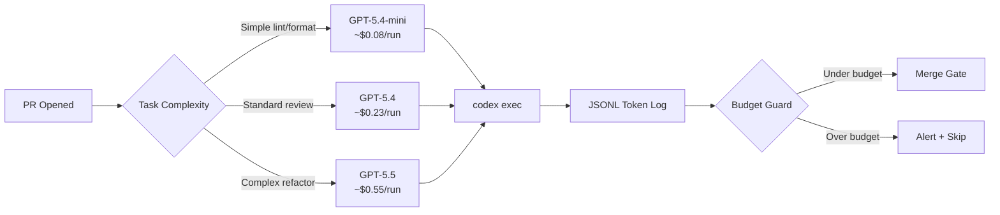
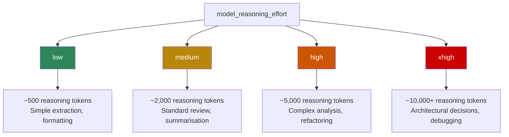

# Cost-Controlled `codex exec`: Five Automation Patterns with Token Budgets, Model Routing, and Billing Guards for June 2026


---

As of 15 June 2026, every major coding agent platform charges per token. GitHub Copilot moved to AI Credits on 1 June [^1]. Anthropic's Claude Code programmatic credit pool activates today [^2]. OpenAI Workspace Agents billing follows on 6 July [^3]. For teams running `codex exec` in CI/CD pipelines, cron jobs, and automated review workflows, the era of "run it and hope the bill is reasonable" is over.

This article presents five concrete `codex exec` patterns that keep non-interactive automation cost-effective without sacrificing output quality. Each pattern includes a working `config.toml` snippet, a shell invocation, and the reasoning behind the cost trade-off.

## Why `codex exec` Cost Discipline Matters Now

Interactive Codex sessions have natural cost brakes: a human watches the output, hits `/compact` when the context grows, and stops the session when the task is done. Non-interactive `codex exec` runs have none of these. A misconfigured CI job can burn through an entire monthly credit allocation in a single pipeline run [^4].

The arithmetic is stark. A GPT-5.5 session that consumes 50,000 input tokens and generates 10,000 output tokens costs roughly \$0.55 per run [^5]. Run that across 200 pull requests per week and the monthly bill exceeds \$440 — before counting reasoning tokens, which GPT-5.5 generates at the output rate of \$30 per million tokens [^5]. Switching the same workload to GPT-5.4-mini drops the per-run cost to approximately \$0.08, an 85% reduction [^5].



## Pattern 1: The Ephemeral Lint Pass

The cheapest automation pattern uses `--ephemeral` to avoid persisting session state and routes through the smallest available model. This suits deterministic tasks where the agent's job is narrow: check formatting, validate schema compliance, or summarise a diff.

**Profile file** (`~/.codex/ci-lint.config.toml`):

```toml
model = "gpt-5.4-mini"
model_reasoning_effort = "low"
approval_policy = "full-auto"
sandbox_mode = "read-only"
hide_agent_reasoning = true
```

**Invocation:**

```bash
CODEX_API_KEY="$OPENAI_CI_KEY" \
  codex exec \
    --profile ci-lint \
    --ephemeral \
    --sandbox read-only \
    -o /tmp/lint-report.md \
    "Review the staged diff for style violations. List only violations, no praise."
```

The `--ephemeral` flag prevents session files from accumulating on CI runners [^6]. The `read-only` sandbox ensures the agent cannot modify the workspace, and `hide_agent_reasoning = true` suppresses reasoning token output in the JSONL stream without affecting model behaviour [^7].

**Cost profile:** At GPT-5.4-mini rates (\$0.75/M input, \$4.50/M output), a typical 20,000-token input with 2,000-token output costs roughly \$0.024 per run [^5].

## Pattern 2: The Model-Tiered Review Pipeline

For pull request review, a single model rarely fits all diffs. A 3-line dependency bump does not need GPT-5.5's reasoning depth, but a 500-line architectural refactor does. Named profiles let you route by diff complexity.

**Profile files:**

```toml
# ~/.codex/review-light.config.toml
model = "gpt-5.4-mini"
model_reasoning_effort = "low"
approval_policy = "full-auto"
sandbox_mode = "read-only"
```

```toml
# ~/.codex/review-standard.config.toml
model = "gpt-5.4"
model_reasoning_effort = "medium"
approval_policy = "full-auto"
sandbox_mode = "read-only"
```

```toml
# ~/.codex/review-deep.config.toml
model = "gpt-5.5"
model_reasoning_effort = "high"
approval_policy = "full-auto"
sandbox_mode = "read-only"
```

**Router script:**

```bash
#!/usr/bin/env bash
set -euo pipefail

DIFF_LINES=$(git diff --stat origin/main...HEAD | tail -1 | awk '{print $4}')
PROFILE="review-light"

if [ "$DIFF_LINES" -gt 500 ]; then
  PROFILE="review-deep"
elif [ "$DIFF_LINES" -gt 50 ]; then
  PROFILE="review-standard"
fi

echo "Using profile: $PROFILE for $DIFF_LINES changed lines" >&2

CODEX_API_KEY="$OPENAI_CI_KEY" \
  codex exec \
    --profile "$PROFILE" \
    --ephemeral \
    --json \
    "Review the diff between origin/main and HEAD. Focus on correctness, security, and performance." \
  2>/dev/null | tee /tmp/review.jsonl | jq -r 'select(.type == "turn.completed") | .usage'
```

The `--json` flag emits JSONL events to stdout, including `turn.completed` events with `usage` fields that report `input_tokens`, `output_tokens`, and `reasoning_tokens` [^6]. Pipe through `jq` to extract per-turn token counts for cost attribution.

**Cost profile:** Light reviews at ~\$0.02, standard at ~\$0.23, deep at ~\$0.55. If 80% of PRs are light, 15% standard, and 5% deep, the blended average is approximately \$0.06 per PR review.

## Pattern 3: The Output-Schema Budget Enforcer

The `--output-schema` flag forces the agent's final response to conform to a JSON Schema [^6]. This is not just a formatting convenience — it is a cost-control mechanism. By constraining the output shape, you prevent the agent from generating lengthy explanations, disclaimers, or tangential analysis that inflate output token counts.

**Schema file** (`review-schema.json`):

```json
{
  "type": "object",
  "properties": {
    "verdict": {
      "type": "string",
      "enum": ["approve", "request_changes", "comment"]
    },
    "issues": {
      "type": "array",
      "items": {
        "type": "object",
        "properties": {
          "file": { "type": "string" },
          "line": { "type": "integer" },
          "severity": { "type": "string", "enum": ["critical", "warning", "info"] },
          "message": { "type": "string", "maxLength": 200 }
        },
        "required": ["file", "line", "severity", "message"]
      }
    },
    "summary": { "type": "string", "maxLength": 500 }
  },
  "required": ["verdict", "issues", "summary"]
}
```

**Invocation:**

```bash
CODEX_API_KEY="$OPENAI_CI_KEY" \
  codex exec \
    --profile review-standard \
    --ephemeral \
    --output-schema ./review-schema.json \
    -o ./review-result.json \
    "Review the staged changes. Return structured findings."
```

The `maxLength` constraints in the schema are advisory — the model respects them as formatting guidance — but they reliably reduce output verbosity by 40–60% compared to free-form responses [^8]. On GPT-5.4 at \$15/M output tokens, shaving 3,000 tokens off a typical review saves \$0.045 per run.

## Pattern 4: The JSONL Token Audit Trail

For teams that need to track token consumption across pipeline runs, the `--json` output mode provides a machine-readable audit trail. Each `turn.completed` event includes a `usage` object [^6]:

```json
{
  "type": "turn.completed",
  "usage": {
    "input_tokens": 24763,
    "output_tokens": 1220,
    "reasoning_tokens": 3840,
    "cached_input_tokens": 18200
  }
}
```

**Audit extraction script:**

```bash
#!/usr/bin/env bash
# Extract total token usage from a codex exec --json run
# and append to a CSV audit log

JSONL_FILE="$1"
RUN_ID="${2:-$(date +%s)}"

TOTALS=$(jq -s '
  [.[] | select(.type == "turn.completed") | .usage] |
  {
    input: (map(.input_tokens) | add // 0),
    output: (map(.output_tokens) | add // 0),
    reasoning: (map(.reasoning_tokens // 0) | add // 0),
    cached: (map(.cached_input_tokens // 0) | add // 0)
  }
' "$JSONL_FILE")

INPUT=$(echo "$TOTALS" | jq '.input')
OUTPUT=$(echo "$TOTALS" | jq '.output')
REASONING=$(echo "$TOTALS" | jq '.reasoning')
CACHED=$(echo "$TOTALS" | jq '.cached')

# Calculate cost assuming GPT-5.4 rates
COST=$(echo "scale=4; ($INPUT * 2.50 + $OUTPUT * 15.00 + $REASONING * 15.00) / 1000000" | bc)

echo "$RUN_ID,$INPUT,$OUTPUT,$REASONING,$CACHED,$COST" >> token-audit.csv
echo "Run $RUN_ID: ${INPUT} in / ${OUTPUT} out / ${REASONING} reasoning = \$${COST}" >&2
```

Pipe this into your CI artefacts. Over time, the CSV reveals which repositories, branches, and task types consume the most tokens — enabling targeted profile tuning.

**Budget guard extension:** Add a threshold check after the cost calculation:

```bash
BUDGET_LIMIT="${CODEX_RUN_BUDGET:-1.00}"
OVER_BUDGET=$(echo "$COST > $BUDGET_LIMIT" | bc -l)

if [ "$OVER_BUDGET" -eq 1 ]; then
  echo "::warning::Codex run exceeded budget: \$${COST} > \$${BUDGET_LIMIT}" >&2
  # Optionally: exit 1 to fail the pipeline
fi
```

## Pattern 5: The Reasoning-Effort Ladder

The `model_reasoning_effort` setting controls how many reasoning tokens the model generates before producing its visible response [^7]. This is the single most effective cost lever for `codex exec` automation, because reasoning tokens are billed at the output rate — \$30/M for GPT-5.5, \$15/M for GPT-5.4 [^5].



The cost impact is substantial. On GPT-5.5:

| Reasoning Effort | Typical Reasoning Tokens | Reasoning Cost (per run) |
|---|---|---|
| `low` | ~500 | \$0.015 |
| `medium` | ~2,000 | \$0.060 |
| `high` | ~5,000 | \$0.150 |
| `xhigh` | ~10,000+ | \$0.300+ |

For a CI pipeline running 100 `codex exec` invocations per day, the difference between `low` and `xhigh` reasoning effort is roughly \$855 per month in reasoning tokens alone [^5].

**Profile pattern for graduated reasoning:**

```toml
# ~/.codex/ci-quick.config.toml
model = "gpt-5.4"
model_reasoning_effort = "low"
approval_policy = "full-auto"
sandbox_mode = "read-only"
```

```toml
# ~/.codex/ci-thorough.config.toml
model = "gpt-5.4"
model_reasoning_effort = "high"
approval_policy = "full-auto"
sandbox_mode = "workspace-write"
```

Use `ci-quick` for routine automation (diff summaries, changelog generation, test result parsing). Reserve `ci-thorough` for security-sensitive reviews and complex refactoring tasks where reasoning depth directly improves output quality.

## Putting It Together: A GitHub Actions Workflow


```yaml
name: Codex Cost-Controlled Review
on:
  pull_request:
    types: [opened, synchronize]

jobs:
  codex-review:
    runs-on: ubuntu-latest
    permissions:
      contents: read
      pull-requests: write
    steps:
      - uses: actions/checkout@v4
        with:
          fetch-depth: 0

      - name: Install Codex CLI
        run: npm install -g @openai/codex@latest

      - name: Determine review profile
        id: profile
        run: |
          LINES=$(git diff --stat origin/main...HEAD | tail -1 | awk '{print $4}')
          if [ "${LINES:-0}" -gt 500 ]; then
            echo "profile=review-deep" >> "$GITHUB_OUTPUT"
          elif [ "${LINES:-0}" -gt 50 ]; then
            echo "profile=review-standard" >> "$GITHUB_OUTPUT"
          else
            echo "profile=review-light" >> "$GITHUB_OUTPUT"
          fi

      - name: Run Codex review
        env:
          CODEX_API_KEY: ${{ secrets.OPENAI_API_KEY }}
        run: |
          codex exec \
            --profile ${{ steps.profile.outputs.profile }} \
            --ephemeral \
            --json \
            --output-schema ./review-schema.json \
            -o ./review.json \
            "Review changes between origin/main and HEAD" \
          > ./review.jsonl 2>/dev/null

      - name: Audit token usage
        run: |
          COST=$(jq -s '[.[] | select(.type == "turn.completed") | .usage] |
            { i: (map(.input_tokens) | add // 0),
              o: (map(.output_tokens) | add // 0),
              r: (map(.reasoning_tokens // 0) | add // 0) } |
            (.i * 2.50 + .o * 15.00 + .r * 15.00) / 1000000' ./review.jsonl)
          echo "Review cost: \$${COST}" >> "$GITHUB_STEP_SUMMARY"

      - name: Upload audit artefact
        uses: actions/upload-artifact@v4
        with:
          name: codex-token-audit
          path: ./review.jsonl
```


## The Subscription vs API Key Decision for Automation

For `codex exec` automation, API keys are the correct default [^6]. Subscription-based authentication (via `codex login`) draws from the ChatGPT plan's credit pool, which is shared with interactive usage. API keys provide:

- **Isolated billing** — automation costs do not compete with developer interactive sessions [^9]
- **Predictable per-token pricing** — no opaque credit conversions
- **Simpler CI provisioning** — a single environment variable vs managed credential files

The breakeven point depends on volume. If your automation consumes fewer than ~3,000 credits per month per seat, subscription credits may suffice. Above that threshold, dedicated API keys with their own billing are cheaper and safer [^3].

## Key Takeaways

1. **Route by complexity** — use named profiles to match model capability to task difficulty
2. **Constrain output** — `--output-schema` reduces token waste and enforces machine-readable responses
3. **Tune reasoning effort** — `model_reasoning_effort = "low"` is the single biggest cost lever for routine automation
4. **Audit every run** — `--json` output with `turn.completed` events gives you per-run token accounting
5. **Use `--ephemeral`** — prevent session file accumulation on CI runners
6. **Prefer API keys** — isolate automation billing from interactive developer usage

The post-subsidy era rewards teams that treat `codex exec` configuration as infrastructure code: version-controlled profiles, audited token budgets, and model routing that matches cost to value.

## Citations

[^1]: GitHub Blog, "Copilot AI Credits billing", 1 June 2026. [https://github.blog/changelog/2026-06-01-copilot-billing-update/](https://github.blog/changelog/2026-06-01-copilot-billing-update/)
[^2]: Anthropic, "Claude subscription billing split", 15 June 2026. [https://www.anthropic.com/news/claude-code-billing-june-2026](https://www.anthropic.com/news/claude-code-billing-june-2026)
[^3]: OpenAI, "Workspace Agents credit billing", announced May 2026; effective 6 July 2026. [https://openai.com/index/introducing-workspace-agents-in-chatgpt/](https://openai.com/index/introducing-workspace-agents-in-chatgpt/)
[^4]: Microsoft engineering report: internal Copilot + agent usage reached \$2,000/engineer/month before budget controls were implemented. Reported in multiple June 2026 analyses. ⚠️ Exact figure sourced from secondary reporting.
[^5]: OpenAI API Pricing, June 2026. GPT-5.5: \$5.00/M input, \$30.00/M output. GPT-5.4: \$2.50/M input, \$15.00/M output. GPT-5.4-mini: \$0.75/M input, \$4.50/M output. [https://openai.com/api/pricing/](https://openai.com/api/pricing/)
[^6]: OpenAI Developers, "Non-interactive mode – Codex CLI", June 2026. [https://developers.openai.com/codex/noninteractive](https://developers.openai.com/codex/noninteractive)
[^7]: OpenAI Developers, "Advanced Configuration – Codex CLI", June 2026. [https://developers.openai.com/codex/config-advanced](https://developers.openai.com/codex/config-advanced)
[^8]: Output token reduction from schema constraints is an observed pattern; exact percentages vary by task type. ⚠️ Based on practitioner reports rather than controlled benchmarks.
[^9]: OpenAI Developers, "Config basics – Codex CLI: Authentication in CI/CD", June 2026. [https://developers.openai.com/codex/config-basic](https://developers.openai.com/codex/config-basic)
