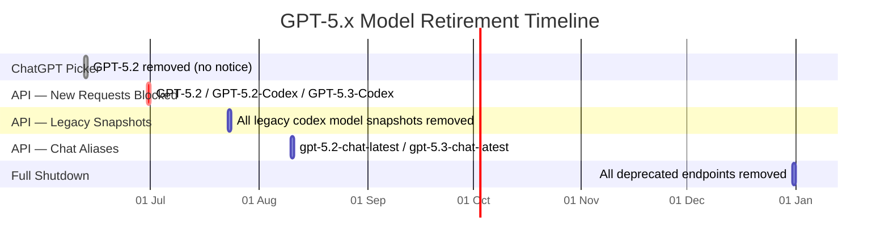
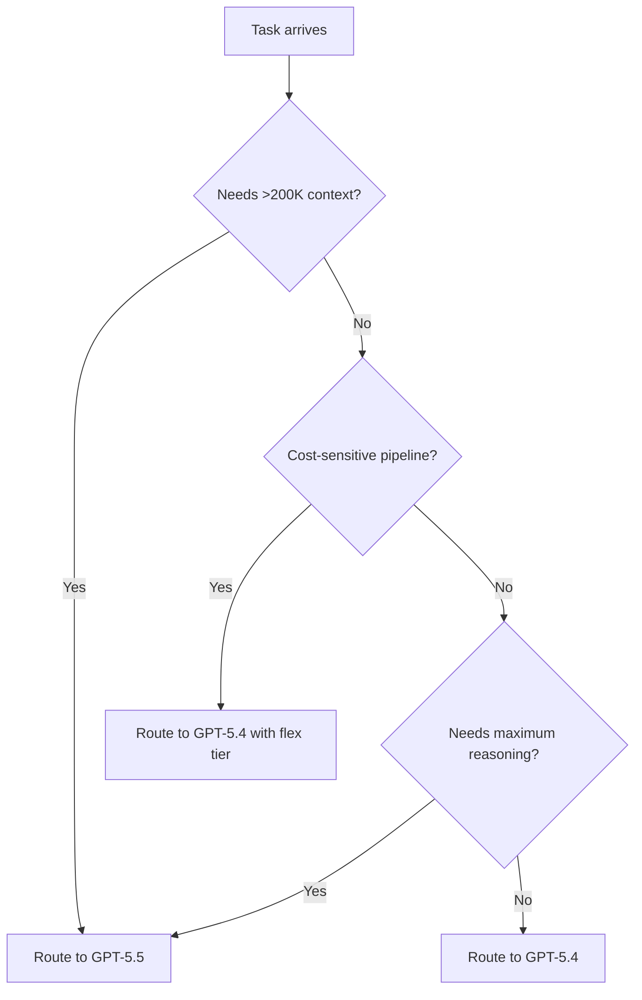

# The GPT-5.3-Codex Countdown: Migrating Your Codex CLI Configuration Before the June 30 API Deadline


---

On 12 June 2026, GPT-5.2 vanished from the ChatGPT model picker without advance notice — despite the official deprecations page listing an August 10 shutdown date [^1] [^2]. Existing conversations were silently migrated to GPT-5.5 equivalents. Three days later, GPT-5.3-Codex remains accessible via the API, but the clock is ticking: new API requests to all three retiring models — GPT-5.2, GPT-5.2-Codex, and GPT-5.3-Codex — will be blocked on 30 June 2026 [^3]. That gives Codex CLI practitioners exactly fifteen days to audit their configurations, update their profiles, recalibrate their cost models, and verify their CI/CD pipelines still function.

This article provides a concrete migration checklist for teams still running deprecated model strings in `config.toml`, named profiles, or `codex exec` automation scripts.

## What Is Actually Retiring

Three models are leaving the API on 30 June 2026. A fourth deadline follows shortly after.



| Model | API Cutoff | Recommended Replacement |
|---|---|---|
| `gpt-5.2` | 30 June 2026 | `gpt-5.5` |
| `gpt-5.2-codex` | 30 June 2026 | `gpt-5.5` |
| `gpt-5.3-codex` | 30 June 2026 | `gpt-5.5` or `gpt-5.4` |
| `gpt-5.2-chat-latest` | 10 August 2026 | `gpt-5.5` |
| `gpt-5.3-chat-latest` | 10 August 2026 | `gpt-5.5` |

The critical detail: the 30 June deadline blocks **new** API requests. Existing in-flight sessions may continue briefly, but no new `codex exec` runs, no new interactive sessions, and no new CI pipeline invocations will succeed against these model endpoints after that date [^3].

## Why the Early Removal Matters for CLI Users

When GPT-5.2 disappeared from ChatGPT on 12 June, users discovered the change through forum threads rather than official communications [^1]. The deprecations documentation still showed an August 10 date for the API alias `gpt-5.2-chat-latest`, creating confusion about which timeline applied to which surface [^2].

For Codex CLI users authenticating via ChatGPT login (the default path for Plus and Pro subscribers), this distinction is critical. ChatGPT-authenticated sessions use the model picker, and that picker no longer offers GPT-5.2. If your `config.toml` hardcodes `model = "gpt-5.2"`, the CLI will attempt to use it but the ChatGPT session will route to GPT-5.5 silently — or fail, depending on timing and backend rollout state [^4].

API-key users have until 30 June for GPT-5.2 and GPT-5.3-Codex, but the prudent move is to migrate now rather than discover failures in production on the cutoff date.

## The Cost Reality: GPT-5.3-Codex vs GPT-5.5

The migration is not cost-neutral. GPT-5.3-Codex was remarkably cheap for its capability tier.

| Metric | GPT-5.3-Codex | GPT-5.5 | GPT-5.4 |
|---|---|---|---|
| Input (per 1M tokens) | $1.75 | $5.00 | $2.50 |
| Cached input (per 1M tokens) | $0.175 | $0.50 | $0.25 |
| Output (per 1M tokens) | $14.00 | $30.00 | $15.00 |
| Context window | 400K | 1M | 200K |

GPT-5.5 output tokens cost approximately 2.1x more than GPT-5.3-Codex [^5] [^6]. Even accounting for GPT-5.5's reported efficiency gains — fewer tokens to produce equivalent results [^3] — the cost increase is notable. For teams running heavy `codex exec` pipelines, the monthly bill will rise unless mitigated.

GPT-5.4 sits in the middle at $2.50/$15.00 — only marginally more expensive than GPT-5.3-Codex — and remains a strong choice for coding-focused workloads where the million-token context window is unnecessary [^6].

## The Fifteen-Day Migration Checklist

### Days 1-3: Audit

**1. Scan for deprecated model strings.**

```bash
# Find all references to deprecated models across your codebase
grep -rn 'gpt-5\.2\|gpt-5\.3-codex' \
  ~/.codex/ \
  .codex/ \
  .github/workflows/ \
  AGENTS.md \
  --include='*.toml' --include='*.yaml' --include='*.yml' --include='*.md' --include='*.sh'
```

Check every layer of the configuration hierarchy: user-level (`~/.codex/config.toml`), project-level (`.codex/config.toml`), named profiles (`~/.codex/<profile>.config.toml`), and CI/CD pipeline scripts that invoke `codex exec --model` [^7].

**2. Run `codex doctor` to surface configuration warnings.**

```bash
codex doctor --json | jq '.configuration'
```

Recent versions of `codex doctor` flag deprecated model references in the configuration report [^8]. If you see warnings about model availability, act on them.

**3. Catalogue your CI/CD model references.**

Search GitHub Actions workflows, GitLab CI files, and any scripts that call `codex exec` with a `--model` flag:

```bash
grep -rn 'codex exec.*--model.*gpt-5\.\(2\|3\)' .github/ ci/ scripts/
```

### Days 4-7: Update

**4. Update `config.toml` model references.**

For most teams, the migration is a single-line change:

```toml
# Before
model = "gpt-5.3-codex"

# After — full capability replacement
model = "gpt-5.5"

# Or — cost-conscious alternative
model = "gpt-5.4"
```

If you use named profiles for different task types, update each profile file individually [^7]:

```toml
# ~/.codex/review.config.toml — code review profile
model = "gpt-5.5"
model_reasoning_effort = "high"

# ~/.codex/scaffold.config.toml — scaffolding profile
model = "gpt-5.4"
model_reasoning_effort = "medium"
```

**5. Implement a cost-mitigation routing strategy.**

The price jump from GPT-5.3-Codex to GPT-5.5 is steep. Use named profiles to route tasks to the cheapest capable model [^9]:

```toml
# ~/.codex/config.toml — default for interactive work
model = "gpt-5.5"

# ~/.codex/batch.config.toml — CI/CD and bulk operations
model = "gpt-5.4"
service_tier = "flex"
```

The `service_tier = "flex"` setting routes requests to off-peak capacity at reduced cost, suitable for non-urgent pipeline work [^9].

**6. Update CI/CD pipeline model references.**

```yaml
# .github/workflows/codex-review.yml
- name: Run Codex review
  run: codex exec --model gpt-5.5 --approval-mode full-auto "Review the PR diff"
```

For pipelines that previously relied on GPT-5.3-Codex's lower cost per run, consider switching to GPT-5.4 with `--profile batch` to manage budget impact.

### Days 8-12: Validate

**7. Run integration tests against the new model.**

Model swaps can subtly alter output characteristics. GPT-5.5 is more capable than GPT-5.3-Codex but may produce different formatting, different code style preferences, or different levels of verbosity [^3]. Run your standard development tasks and compare:

```bash
# Test interactive session
codex --model gpt-5.5 "Refactor the authentication module to use dependency injection"

# Test headless execution
codex exec --model gpt-5.5 --approval-mode full-auto \
  "Run the test suite and fix any failures" 2>&1 | tee migration-test.log
```

**8. Verify hook and guardian compatibility.**

If you use PreToolUse or PostToolUse hooks, confirm they work correctly with GPT-5.5's output patterns. The model's response structure uses the Responses API format, which is the same API surface GPT-5.3-Codex used in recent Codex CLI versions [^10].

**9. Check AGENTS.md model-specific instructions.**

Some teams include model-specific guidance in AGENTS.md. Search for references to deprecated models and update them:

```bash
grep -rn 'gpt-5\.2\|gpt-5\.3-codex' **/AGENTS.md
```

### Days 13-15: Harden

**10. Set up fallback routing.**

If you are concerned about GPT-5.5 availability during the transition period, configure a provider fallback:

```toml
# Primary model
model = "gpt-5.5"

# Fallback for rate-limited scenarios
[model_providers.backup]
model = "gpt-5.4"
```

**11. Pin your Codex CLI version.**

Ensure your team is running a Codex CLI version that includes the latest model catalogue. Versions v0.137.0 and later include full GPT-5.5 support and updated model picker entries [^8]:

```bash
codex --version
# Should be >= 0.137.0
```

**12. Document the change for your team.**

Update your team's development setup guide with the new model defaults. If you use managed configuration bundles (cloud config), push the updated model settings through your admin console [^11].

## The GPT-5.4 Middle Path

Not every workload justifies GPT-5.5's pricing. GPT-5.4 at $2.50/$15.00 per million tokens is 3.3x cheaper on input and 2x cheaper on output than GPT-5.5, whilst still delivering strong coding performance [^6]. The trade-off is a 200K context window versus GPT-5.5's million-token capacity.



For teams migrating from GPT-5.3-Codex, GPT-5.4 is often the more accurate replacement in terms of cost profile, whilst GPT-5.5 is the more accurate replacement in terms of capability.

## What Happens If You Do Not Migrate

After 30 June, API calls specifying `gpt-5.3-codex`, `gpt-5.2-codex`, or `gpt-5.2` will receive HTTP 404 errors [^3]. Codex CLI sessions will fail at startup if the configured model is unavailable. CI/CD pipelines using `codex exec --model gpt-5.3-codex` will exit with non-zero status codes, breaking builds.

The December 31 full shutdown is the final backstop, but the practical deadline for most Codex CLI users is 30 June — fifteen days from today.

## Citations

[^1]: OpenAI Developer Community, "GPT-5.2 disappeared from ChatGPT without advance notice, despite Aug 10 shutdown date in deprecations docs," June 2026. [https://community.openai.com/t/gpt-5-2-disappeared-from-chatgpt-without-advance-notice-despite-aug-10-shutdown-date-in-deprecations-docs/1383491](https://community.openai.com/t/gpt-5-2-disappeared-from-chatgpt-without-advance-notice-despite-aug-10-shutdown-date-in-deprecations-docs/1383491)

[^2]: OpenAI, "Deprecations — OpenAI API," June 2026. [https://developers.openai.com/api/docs/deprecations](https://developers.openai.com/api/docs/deprecations)

[^3]: ByteIota, "OpenAI Retires GPT-5.2 and GPT-5.3-Codex: Migrate Now," June 2026. [https://byteiota.com/openai-gpt52-gpt53-codex-sunset-migration/](https://byteiota.com/openai-gpt52-gpt53-codex-sunset-migration/)

[^4]: TechTimes, "OpenAI Retires GPT-5.2 and Moves Everyone to GPT-5.5: What Changes for ChatGPT Users and Developers," 13 June 2026. [https://www.techtimes.com/articles/318345/20260613/openai-retires-gpt-52-moves-everyone-gpt-55-what-changes-chatgpt-users-developers.htm](https://www.techtimes.com/articles/318345/20260613/openai-retires-gpt-52-moves-everyone-gpt-55-what-changes-chatgpt-users-developers.htm)

[^5]: OpenRouter, "GPT-5.5 — API Pricing & Benchmarks," June 2026. [https://openrouter.ai/openai/gpt-5.5](https://openrouter.ai/openai/gpt-5.5)

[^6]: AI Pricing Guru, "OpenAI API Pricing 2026: GPT-5.5, GPT-5.4, o3 & All Models," June 2026. [https://www.aipricing.guru/openai-pricing/](https://www.aipricing.guru/openai-pricing/)

[^7]: OpenAI, "Config basics — Codex," June 2026. [https://developers.openai.com/codex/config-basic](https://developers.openai.com/codex/config-basic)

[^8]: OpenAI, "Changelog — Codex," June 2026. [https://developers.openai.com/codex/changelog](https://developers.openai.com/codex/changelog)

[^9]: Codex Knowledge Base, "Codex CLI Model Routing in May 2026: GPT-5.5, GPT-5.4, Codex-Spark, and When to Use Each," May 2026. [https://codex.danielvaughan.com/2026/05/07/codex-cli-model-routing-may-2026-gpt55-gpt54-spark-decision-framework/](https://codex.danielvaughan.com/2026/05/07/codex-cli-model-routing-may-2026-gpt55-gpt54-spark-decision-framework/)

[^10]: OpenAI, "Features — Codex CLI," June 2026. [https://developers.openai.com/codex/cli/features](https://developers.openai.com/codex/cli/features)

[^11]: ChatGPT AI Hub, "OpenAI Sunsets GPT-5.2 and GPT-5.3-Codex: What Developers Need to Know About the Model Transition," June 2026. [https://chatgptaihub.com/openai-sunsets-gpt-5-2-gpt-5-3-codex-model-transition-guide/](https://chatgptaihub.com/openai-sunsets-gpt-5-2-gpt-5-3-codex-model-transition-guide/)
