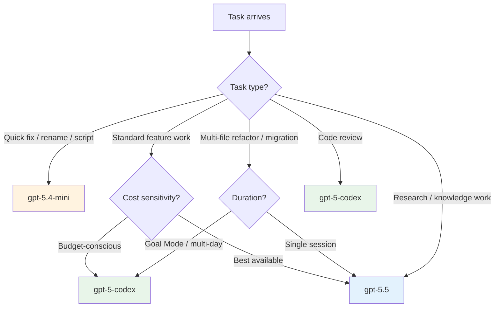

# GPT-5-Codex Refreshed: The June 14 Model Update and the Mid-2026 Model Selection Decision Tree for Codex CLI


---

On 14 June 2026, OpenAI published "Introducing upgrades to Codex," positioning a refreshed GPT-5-Codex as the default model for cloud tasks and code review across every Codex surface [^1]. The timing is deliberate: the same weekend Anthropic's Claude Code billing split takes effect [^2], OpenAI is signalling that its purpose-built coding model undercuts general-purpose alternatives on both price and task accuracy.

This article unpacks what actually changed in the refresh, how the model slots into the broader Codex CLI model lineup, and how to configure `config.toml` profiles that route work to the right model at the right cost.

---

## What Changed on 14 June

The model identifier remains `gpt-5-codex` — the same string introduced in late March 2026 [^3]. What changed is the underlying snapshot. OpenAI's API documentation now states that "the underlying model snapshot will be regularly updated" [^4], and the June 14 announcement confirms an updated training run focused on three areas:

1. **Agentic coding reliability** — the model was "trained with a focus on real-world software engineering work" and is "equally proficient at quick, interactive sessions and at independently powering through long, complex tasks" [^1].
2. **Code review accuracy** — OpenAI specifically highlights that its "code review capability can catch critical bugs before they ship" [^1].
3. **Cross-surface consistency** — GPT-5-Codex is now the default for cloud tasks and code review, and available for local tasks via CLI and IDE extension [^1].

The refresh coincides with Goal Mode reaching general availability across app, IDE extension, and CLI [^5], making reliable long-horizon model performance a prerequisite rather than a nice-to-have.

---

## Technical Specifications

The core specifications, drawn from the API model card [^4]:

| Parameter | Value |
|-----------|-------|
| Model ID | `gpt-5-codex` |
| Context window | 400,000 tokens |
| Maximum output tokens | 128,000 tokens |
| Input pricing | \$1.25 / 1M tokens |
| Cached input pricing | \$0.125 / 1M tokens |
| Output pricing | \$10.00 / 1M tokens |
| Input modalities | Text, images |
| Output modalities | Text |
| Reasoning tokens | Supported |
| Function calling | Supported |
| Structured outputs | Supported |
| Fine-tuning | Not supported |
| Knowledge cutoff | 30 September 2024 |

The 400K context window matches GPT-5.5 and exceeds the 128K windows of older models. The 128K output ceiling is generous enough for large multi-file diffs without truncation.

---

## The June 2026 Model Lineup for Codex CLI

As of mid-June 2026, Codex CLI users face a four-model decision [^6] [^7] [^8]:



### Pricing comparison

| Model | Input / 1M | Output / 1M | Cached input / 1M | Best for |
|-------|-----------|------------|-------------------|----------|
| `gpt-5.4-mini` | ⚠️ Varies | ⚠️ Varies | ⚠️ Varies | Fast, cheap subagent work |
| `gpt-5-codex` | \$1.25 | \$10.00 | \$0.125 | Coding tasks, code review, Goal Mode |
| `gpt-5.4` | \$2.50 | \$15.00 | ⚠️ Not confirmed | General-purpose with strong coding |
| `gpt-5.5` | \$5.00 | \$30.00 | \$2.50 | Complex reasoning, research, frontier |

GPT-5-Codex is 50% cheaper on input and 33% cheaper on output than GPT-5.4, and 75% cheaper on input and 67% cheaper on output than GPT-5.5 [^4] [^8]. For pure coding tasks, this pricing advantage compounds rapidly during Goal Mode sessions that may run for hours.

---

## Benchmark Context

Benchmarks require careful interpretation. The June 2026 landscape is complicated by the shift from SWE-bench Verified to SWE-bench Pro [^9]:

- **GPT-5-Codex** scored approximately 77% on SWE-bench Verified (500 tasks) [^10].
- **GPT-5.4 (xHigh)** leads the Scale SEAL standardised leaderboard at 59.10% on SWE-bench Pro [^9].
- **GPT-5.5** scores 58.6% on SWE-bench Pro [^11].

These numbers are not directly comparable — SWE-bench Verified and SWE-bench Pro use different task sets and scaffolding. OpenAI stopped reporting Verified scores in early 2026, recommending SWE-bench Pro instead [^9]. The practical takeaway: GPT-5-Codex is purpose-trained for agentic coding workflows and performs competitively with frontier general-purpose models on coding tasks, at a fraction of the cost.

---

## CLI Configuration

### Setting GPT-5-Codex as your default

In `~/.codex/config.toml`:

```toml
model = "gpt-5-codex"
```

Or for a single invocation:

```bash
codex --model gpt-5-codex "refactor the auth middleware to use JWT validation"
```

### Named profiles for model routing

The real power emerges with named profiles that route different task types to appropriate models [^12]:

```toml
# Default: cost-effective coding model
model = "gpt-5-codex"
model_reasoning_effort = "medium"

[profiles.deep]
model = "gpt-5.5"
model_reasoning_effort = "high"

[profiles.fast]
model = "gpt-5.4-mini"
model_reasoning_effort = "low"

[profiles.review]
model = "gpt-5-codex"
model_reasoning_effort = "high"
plan_mode_reasoning_effort = "high"

[profiles.goal]
model = "gpt-5-codex"
model_reasoning_effort = "medium"
plan_mode_reasoning_effort = "high"
```

Usage:

```bash
# Standard feature work
codex "add pagination to the /users endpoint"

# Deep reasoning for architecture decisions
codex --profile deep "design the event sourcing migration strategy"

# Quick renames and formatting
codex --profile fast "rename userService to UserService across the codebase"

# Code review with high reasoning
codex --profile review /review

# Long-running Goal Mode session
codex --profile goal --goal "migrate the payments module from REST to gRPC"
```

### Subagent model routing

For subagent workflows, GPT-5-Codex's lower cost makes it an attractive orchestrator, whilst delegating heavy reasoning to GPT-5.5 subagents when needed [^13]:

```toml
model = "gpt-5-codex"

[agents.research]
model = "gpt-5.5"
instructions = "Deep research and architecture analysis"

[agents.implement]
model = "gpt-5-codex"
instructions = "Implementation following the agreed plan"
```

---

## When GPT-5-Codex Is the Wrong Choice

GPT-5-Codex is optimised for coding. It is not the best choice for:

- **Non-coding knowledge work** — GPT-5.5's broader training makes it stronger for research, writing, and analysis tasks [^8].
- **Computer Use workflows** — GPT-5.5 and GPT-5.4 have explicit Computer Use support; GPT-5-Codex's vision capabilities are limited to image input, not screen interaction [^4].
- **Tasks requiring the latest knowledge** — the September 2024 cutoff means GPT-5-Codex lacks awareness of frameworks, APIs, and libraries released after that date. Use web search (`codex --search live`) or MCP servers to compensate [^14].

---

## The Competitive Context

The timing of this refresh is not accidental. On 15 June 2026, Anthropic's Claude Code billing splits programmatic usage into a separate, capped credit pool at full API rates [^2]. A Pro subscriber receives \$20/month in agentic credits — roughly 1.3 million output tokens with Claude Opus 4.6 at \$15/M output.

By contrast, \$20 buys 2 million output tokens with GPT-5-Codex at \$10/M output — a 54% advantage in raw throughput. For teams evaluating their agentic coding budget, GPT-5-Codex's pricing makes sustained Goal Mode sessions materially cheaper than the Claude Code alternative on a per-token basis.

---

## Migration Checklist

If you are still running `gpt-5.3-codex` or `gpt-5.4` as your default coding model:

1. **Update `config.toml`** — set `model = "gpt-5-codex"`.
2. **Update CI pipelines** — any `codex exec --model` flags should reference `gpt-5-codex`.
3. **Review named profiles** — ensure your `review` and `goal` profiles use `gpt-5-codex` for cost efficiency.
4. **Test compaction behaviour** — the 400K context window reduces compaction frequency; consider adjusting compaction thresholds if you previously tuned them for 128K models.
5. **Verify MCP server compatibility** — the Responses API wire format is required; confirm your MCP servers support `oneOf`/`allOf` schema structures preserved since v0.139 [^15].
6. **Check `gpt-5.3-codex` sunset** — the API deadline for GPT-5.3-Codex is 30 June 2026; migration is not optional [^16].

---

## Citations

[^1]: OpenAI, "Introducing upgrades to Codex," 14 June 2026. [https://openai.com/index/introducing-upgrades-to-codex/](https://openai.com/index/introducing-upgrades-to-codex/)
[^2]: Codersera, "Anthropic's June 15 Billing Change: What Every Claude Code & Agent SDK User Must Do," June 2026. [https://codersera.com/blog/anthropic-june-2026-billing-change-claude-code/](https://codersera.com/blog/anthropic-june-2026-billing-change-claude-code/)
[^3]: Daniel Vaughan, "gpt-5-codex: The New Codex Flagship and What It Means for Your Workflow," 30 March 2026. [https://codex.danielvaughan.com/2026/03/30/gpt-5-codex-new-flagship-model-guide/](https://codex.danielvaughan.com/2026/03/30/gpt-5-codex-new-flagship-model-guide/)
[^4]: OpenAI API Docs, "GPT-5-Codex Model," accessed 15 June 2026. [https://developers.openai.com/api/docs/models/gpt-5-codex](https://developers.openai.com/api/docs/models/gpt-5-codex)
[^5]: Digit.in, "OpenAI upgrades Codex with Appshots, Goal mode and more developer-focused tools," June 2026. [https://www.digit.in/news/general/openai-upgrades-codex-with-appshots-goal-mode-and-more-developer-focused-tools.html](https://www.digit.in/news/general/openai-upgrades-codex-with-appshots-goal-mode-and-more-developer-focused-tools.html)
[^6]: OpenAI Developers, "Models — Codex," accessed 15 June 2026. [https://developers.openai.com/codex/models](https://developers.openai.com/codex/models)
[^7]: OpenAI Developers, "Advanced Configuration — Codex," accessed 15 June 2026. [https://developers.openai.com/codex/config-advanced](https://developers.openai.com/codex/config-advanced)
[^8]: GPT-5.5 Review, BuildFastWithAI, 2026. [https://www.buildfastwithai.com/blogs/gpt-5-5-review-2026](https://www.buildfastwithai.com/blogs/gpt-5-5-review-2026)
[^9]: MorphLLM, "Best AI Model for Coding (June 2026): 12 Models Ranked by SWE-bench Pro Score and Cost per Task." [https://www.morphllm.com/best-ai-model-for-coding](https://www.morphllm.com/best-ai-model-for-coding)
[^10]: Medium, "GPT-5-Codex Review," 2026. Referenced via search results — original article behind paywall.
[^11]: TokenMix, "GPT-5.5 Review: 88.7% SWE-Bench, 92.4% MMLU, 2x Price Tag (2026)." [https://tokenmix.ai/blog/gpt-5-5-spud-review-88-swe-bench-2026](https://tokenmix.ai/blog/gpt-5-5-spud-review-88-swe-bench-2026)
[^12]: OpenAI Developers, "Configuration Reference — Codex," accessed 15 June 2026. [https://developers.openai.com/codex/config-reference](https://developers.openai.com/codex/config-reference)
[^13]: OpenAI Developers, "Subagents — Codex," accessed 15 June 2026. [https://developers.openai.com/codex/subagents](https://developers.openai.com/codex/subagents)
[^14]: OpenAI Developers, "Features — Codex CLI," accessed 15 June 2026. [https://developers.openai.com/codex/cli/features](https://developers.openai.com/codex/cli/features)
[^15]: Releasebot, "Codex Updates by OpenAI — June 2026." [https://releasebot.io/updates/openai/codex](https://releasebot.io/updates/openai/codex)
[^16]: Daniel Vaughan, "The GPT-5.3-Codex Countdown," 15 June 2026. [https://codex.danielvaughan.com/2026/06/15/gpt-5-3-codex-countdown-migration-codex-cli-configuration-june-30-api-deadline/](https://codex.danielvaughan.com/2026/06/15/gpt-5-3-codex-countdown-migration-codex-cli-configuration-june-30-api-deadline/)
