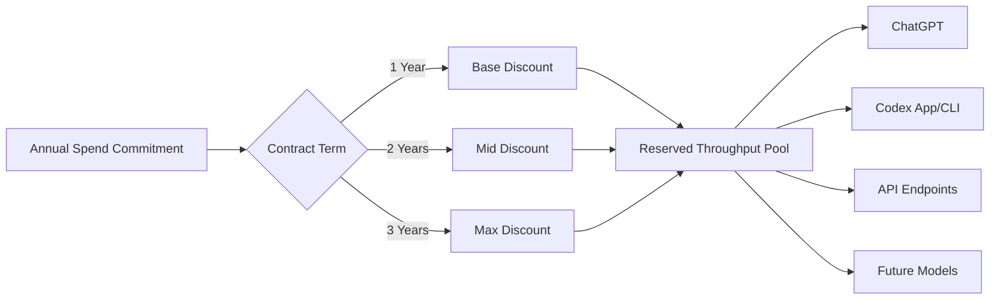
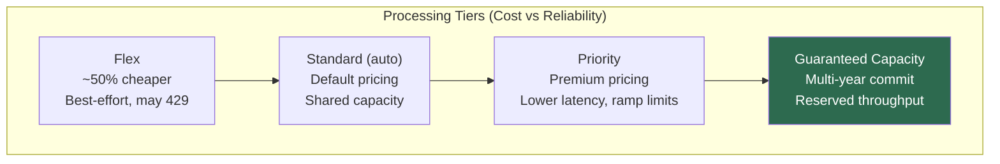
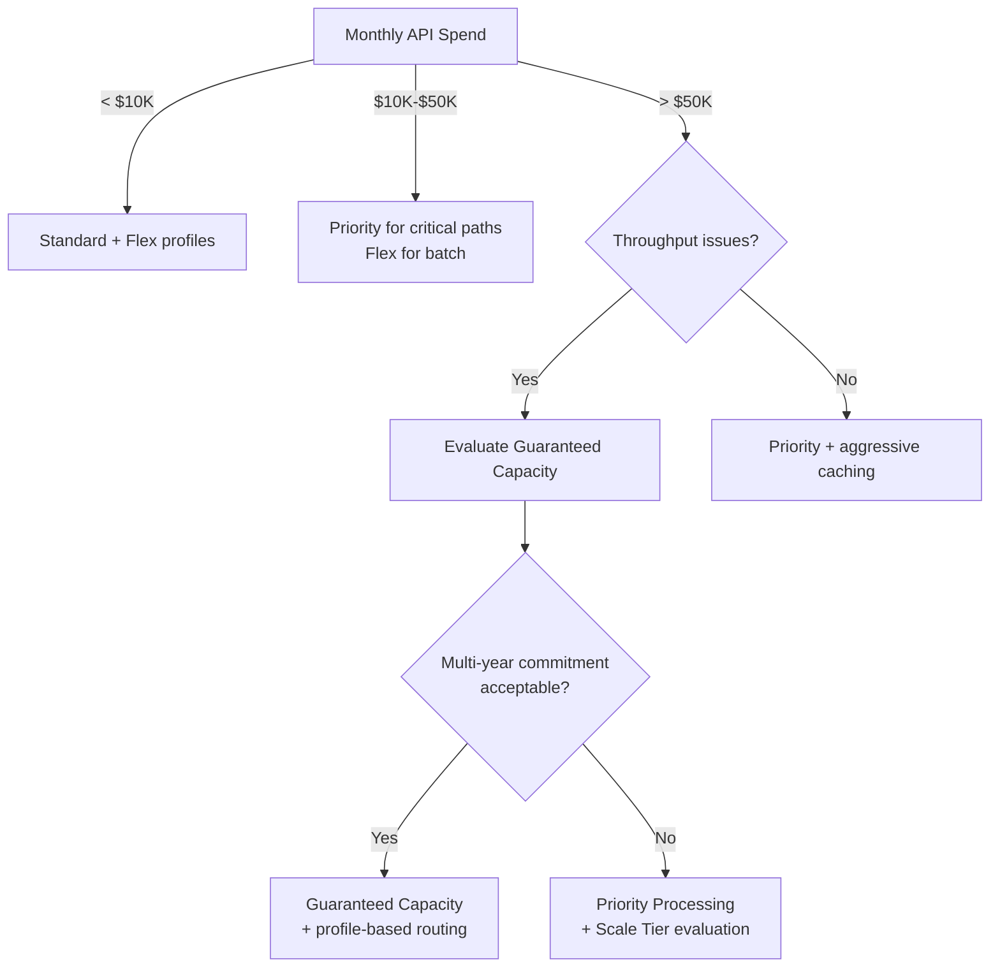

# OpenAI's Guaranteed Capacity: What Reserved Compute Means for Codex CLI Teams Running Agents at Scale


---

On 19 May 2026, OpenAI launched **Guaranteed Capacity** — a multi-year compute reservation programme that lets enterprise customers lock in access to OpenAI infrastructure with one- to three-year commitments and tiered discounts [^1]. CEO Sam Altman framed the rationale bluntly: "As models get better, we expect that the world will be capacity-constrained for some time" [^2].

For teams running Codex CLI heavily — CI/CD pipelines, multi-agent orchestration, batch code reviews — this is not an abstract infrastructure announcement. It sits at the intersection of three concerns every engineering leader faces: **throughput reliability**, **cost predictability**, and **the service tier stack that Codex CLI already exposes**. This article maps Guaranteed Capacity onto the practical configuration decisions you make in `config.toml` every day.

## The Compute Reservation Model

Guaranteed Capacity works as a **draw-down commitment** rather than a fixed allocation of tokens or requests [^1]. Customers commit a spend level over one, two, or three years. In return, they receive:

- **Certainty of access** — reserved throughput that does not compete with on-demand traffic during peak load [^1]
- **Tiered discounts** — increasing with commitment length [^2]
- **Portfolio flexibility** — the commitment can be drawn across OpenAI's entire product range, including models released during the contract term [^3]

Availability is first-come, first-served, and OpenAI has stated that sales continue only until capacity sells out [^2]. The programme targets teams running agents, production systems, and customer-facing applications — precisely the workloads that Codex CLI powers in engineering organisations [^1].



## The Service Tier Stack: Where Guaranteed Capacity Fits

Codex CLI's `service_tier` configuration key already controls how requests are routed through OpenAI's processing tiers [^4]. Understanding where Guaranteed Capacity sits in the hierarchy is essential for configuration decisions.

### Tier 1: Flex Processing

The cheapest option. Set `service_tier = "flex"` in your `config.toml` or per-profile. Tokens are priced at Batch API rates — roughly 50% cheaper than standard [^5]. The trade-off is real: requests queue under load, timeouts are common (OpenAI recommends extending to 15 minutes or longer), and insufficient capacity returns a `429 Resource Unavailable` error with no charge [^5].

```toml
# Profile for non-urgent batch work
[profiles.batch-review]
model = "gpt-5.5"
service_tier = "flex"
```

Flex is ideal for overnight code review pipelines, evaluation runs, and any workflow where latency is immaterial.

### Tier 2: Standard (Default)

The default `service_tier = "auto"` routes requests through standard processing. Rate limits scale with your usage tier — from 100 RPM at Tier 1 to 10,000 RPM at Tier 5 [^6]. No throughput guarantees; during peak demand, you share capacity with every other standard customer.

### Tier 3: Priority Processing

Set `service_tier = "priority"` for significantly lower and more consistent latency [^7]. Priority carries a per-token premium over standard rates, but cache discounts still apply [^7]. There is a ramp rate limit: if traffic exceeds approximately 1 million TPM with more than a 50% increase within 15 minutes, Priority requests may be downgraded to Standard billing [^7].

```toml
# Profile for interactive development
[profiles.interactive]
model = "gpt-5.5"
service_tier = "priority"
```

### Tier 4: Guaranteed Capacity

This is where the new programme sits — **above** Priority in the stack. Unlike the pay-as-you-go tiers, Guaranteed Capacity provides contractually reserved throughput with multi-year pricing commitments [^1]. The precise API-level mechanism for routing requests through reserved capacity has not been publicly documented at the time of writing, but the logical expectation is an organisation-level configuration that elevates all requests to reserved infrastructure. ⚠️



## The Codex CLI Configuration Matrix

For teams evaluating Guaranteed Capacity, the decision intersects with three existing `config.toml` levers:

### 1. Named Profiles for Tier Routing

Named profiles let you assign different service tiers to different workloads without changing your default configuration [^4]:

```toml
# Default: standard for ad-hoc work
[profiles.default]
model = "gpt-5.5"
service_tier = "auto"

# CI pipeline: flex for cost savings
[profiles.ci]
model = "gpt-5.4-mini"
service_tier = "flex"

# Production hotfix: priority for speed
[profiles.hotfix]
model = "gpt-5.5"
service_tier = "priority"
```

With Guaranteed Capacity, a fourth profile tier emerges — the reserved pool for critical, high-throughput workloads. The exact configuration key is not yet documented, but organisations with active contracts should watch for an update to the `service_tier` parameter or a dedicated `capacity_id` field. ⚠️

### 2. Model Selection and Token Economics

Guaranteed Capacity commitments are drawn down across the entire portfolio [^3]. This means model selection directly affects how quickly you consume your reservation. The current Codex credit rate card illustrates the spread [^8]:

| Model | Input (credits/1M tokens) | Cached Input | Output |
|-------|---------------------------|-------------|--------|
| GPT-5.5 | 125 | 12.50 | 750 |
| GPT-5.4 | 62.50 | 6.25 | 375 |
| GPT-5.4 mini | 18.75 | 1.875 | 113 |

A team routing bulk code reviews through GPT-5.4 mini instead of GPT-5.5 stretches the same commitment approximately 6.6x further on output tokens. The `model` key in named profiles becomes a direct lever on reservation burn rate.

### 3. Compaction and Cache Maximisation

The `model_auto_compact_token_limit` setting triggers automatic history compaction when the conversation context approaches the configured threshold [^4]. Combined with prompt caching — which reduces input costs by up to 90% — compaction strategy directly affects how efficiently you use reserved capacity.

```toml
# Aggressive compaction to maximise cache hits
model_auto_compact_token_limit = 100000
```

Teams on Guaranteed Capacity should treat compaction tuning as a capacity efficiency exercise, not just a latency optimisation.

## The Decision Framework: When Guaranteed Capacity Makes Sense

Not every team running Codex CLI needs reserved compute. The programme targets a specific profile:

### You Probably Need It If

- **CI/CD pipelines run Codex on every PR** — high-volume, predictable traffic that benefits from throughput guarantees and is vulnerable to `429` errors during peak hours
- **Multi-agent orchestration is in production** — subagent workflows with `agents.max_threads = 6` can generate burst traffic that exceeds standard rate limits [^9]
- **Your monthly API spend exceeds \$50,000** — at this scale, the multi-year discount likely outweighs the commitment risk, and capacity certainty becomes a reliability requirement
- **You cannot tolerate silent downgrades** — ChatGPT-authenticated sessions already face silent fallback from GPT-5.5 to mini after 160 messages [^10]; API-key workflows with reserved capacity eliminate this category of risk entirely

### You Probably Do Not Need It If

- **Codex CLI usage is exploratory** — individual developers using interactive sessions rarely hit rate limits
- **Flex processing meets your latency requirements** — if overnight batch processing is acceptable, the 50% discount on Flex already provides significant savings without a multi-year lock-in
- **Your provider strategy is multi-cloud** — teams routing through Amazon Bedrock, OpenRouter, or LiteLLM proxies may find that Guaranteed Capacity's portfolio draw-down model does not cover non-OpenAI provider traffic



## The Infrastructure Context

OpenAI's Guaranteed Capacity launch is not isolated. The company has contracted over 10 GW of US AI infrastructure capacity through partnerships with Oracle (\$300 billion over 5 years starting 2027), AWS (\$38 billion over 7 years), NVIDIA, Broadcom, and AMD [^3]. The confidential S-1 filing on 10 June 2026 adds IPO pressure to demonstrate predictable, contracted revenue [^11].

For Codex CLI teams, this context matters for two reasons:

1. **Capacity constraints are real.** The reservation model exists because demand outstrips supply. Teams that wait may find allocations exhausted.
2. **Pricing stability is not guaranteed.** OpenAI is reportedly contemplating meaningful token price reductions ahead of the IPO [^12]. A multi-year commitment at today's rates could look expensive if list prices drop significantly post-IPO.

The hedging strategy is straightforward: negotiate contracts with **price-adjustment clauses** that track list-price changes, or structure commitments with annual renegotiation windows.

## Practical Preparation Checklist

For teams considering Guaranteed Capacity, the following steps map directly to Codex CLI configuration:

1. **Measure current consumption** — Export your usage dashboard data and calculate monthly token volumes by model and service tier
2. **Profile your traffic patterns** — Identify peak hours and burst patterns from CI/CD pipelines and multi-agent workflows
3. **Implement named profiles** — Separate interactive, CI, and batch workloads with distinct `service_tier` settings before committing to reserved capacity
4. **Maximise cache hit rates** — Tune `model_auto_compact_token_limit` and review AGENTS.md file maps to ensure consistent context prefixes across sessions
5. **Model-route for efficiency** — Use GPT-5.4 mini for routine tasks, reserving GPT-5.5 for complex reasoning, to stretch commitment draw-down
6. **Establish the API-key path** — Ensure critical workloads use API-key authentication rather than ChatGPT subscription auth, eliminating silent downgrade risk [^10]
7. **Monitor with `service_tier` response field** — The API response includes the tier that actually processed your request, revealing any downgrades from Priority to Standard [^7]

## What Remains Unclear

Several details remain undocumented at the time of writing:

- **The exact `config.toml` mechanism** for routing Codex CLI requests through reserved capacity ⚠️
- **SLA terms** — latency percentiles, availability guarantees, and penalty clauses for non-delivery ⚠️
- **Geographic binding** — whether reserved capacity is region-specific ⚠️
- **Underconsumption policies** — whether unused capacity rolls over or is forfeited ⚠️

These gaps are typical of a programme that launched less than a month ago. Enterprise teams should negotiate these terms explicitly rather than assuming favourable defaults.

## Citations

[^1]: OpenAI, "Guaranteed Capacity," [https://openai.com/business/guaranteed-capacity/](https://openai.com/business/guaranteed-capacity/), May 2026.
[^2]: Pulse2, "OpenAI: New Guaranteed Capacity Offering Lets Customers Secure Long-Term AI Compute," [https://pulse2.com/openai-new-guaranteed-capacity-offering-lets-customers-secure-long-term-ai-compute/](https://pulse2.com/openai-new-guaranteed-capacity-offering-lets-customers-secure-long-term-ai-compute/), May 2026.
[^3]: Kingy AI, "Multi-Year Compute Contracts Are the Enterprise AI Tell — And OpenAI Just Called It," [https://kingy.ai/ai/multi-year-compute-contracts-are-the-enterprise-ai-tell-and-openai-just-called-it/](https://kingy.ai/ai/multi-year-compute-contracts-are-the-enterprise-ai-tell-and-openai-just-called-it/), May 2026.
[^4]: OpenAI Developers, "Configuration Reference – Codex," [https://developers.openai.com/codex/config-reference](https://developers.openai.com/codex/config-reference), June 2026.
[^5]: OpenAI Developers, "Flex Processing," [https://developers.openai.com/api/docs/guides/flex-processing](https://developers.openai.com/api/docs/guides/flex-processing), June 2026.
[^6]: OpenAI Developers, "Rate Limits," [https://developers.openai.com/api/docs/guides/rate-limits](https://developers.openai.com/api/docs/guides/rate-limits), June 2026.
[^7]: OpenAI Developers, "Priority Processing," [https://developers.openai.com/api/docs/guides/priority-processing](https://developers.openai.com/api/docs/guides/priority-processing), June 2026.
[^8]: OpenAI Developers, "Pricing – Codex," [https://developers.openai.com/codex/pricing](https://developers.openai.com/codex/pricing), June 2026.
[^9]: OpenAI Codex GitHub, "Releases – v0.140.0-alpha.9," [https://github.com/openai/codex/releases](https://github.com/openai/codex/releases), June 2026.
[^10]: OpenAI Help Center, "Codex Rate Card," [https://help.openai.com/en/articles/20001106-codex-rate-card](https://help.openai.com/en/articles/20001106-codex-rate-card), June 2026.
[^11]: OpenAI, "Confidential Submission of Draft S-1 to the SEC," [https://openai.com/index/openai-submits-confidential-s-1/](https://openai.com/index/openai-submits-confidential-s-1/), June 2026.
[^12]: CryptoBriefing, "OpenAI Considers Significant Token Price Cuts Ahead of IPO," [https://cryptobriefing.com/openai-token-price-cuts-ipo/](https://cryptobriefing.com/openai-token-price-cuts-ipo/), June 2026.
