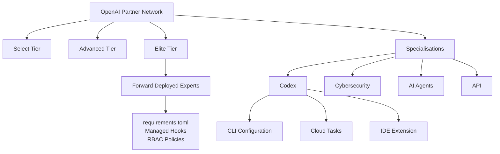
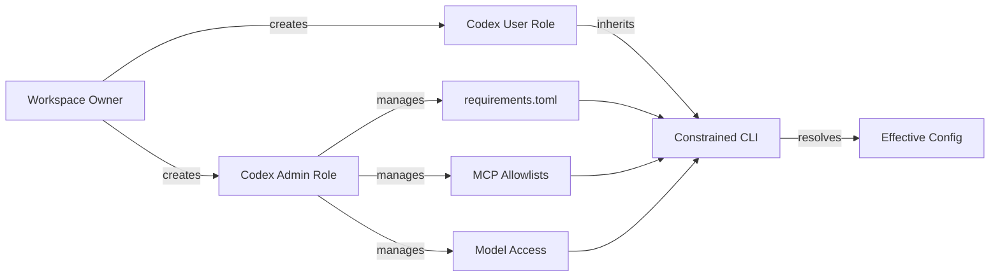

# The OpenAI Partner Network and the Codex Specialisation: What Managed Enterprise Deployments Mean for CLI Developers


On 15 June 2026 OpenAI announced the **Partner Network**, a `\$150 million` programme to certify a large cohort of consultants and channel enterprise AI deployments through global systems integrators.[^1] The programme introduces four specialisation tracks, Codex, cybersecurity, API and agent transformation, each designed to help customers identify partners with proven capability in a specific product area.[^1][^2] For CLI developers, this changes what your daily environment looks like: the constraints you work within will increasingly come not from your own `config.toml` but from centrally managed policies pushed by certified partners and enterprise administrators.

This article unpacks the announcement, maps the managed configuration architecture that underpins partner deployments, and offers practical guidance for CLI developers operating inside those constraints.

## The Partner Network at a glance

According to the announcement, the programme runs three tiers, **Select**, **Advanced** and **Elite**, with progression tied to sales performance, technical capability, deployment experience and co-selling engagement.[^1] Founding partners named at launch include Accenture, Bain & Company, Boston Consulting Group, Eliza, McKinsey and PwC.[^1][^3]

OpenAI is backing the programme with more than training materials. A **Forward Deployed Experts** pilot pairs qualified partners with OpenAI's own engineering teams for complex rollouts.[^1][^2] These are the people who will configure your organisation's `requirements.toml` and managed hooks. Accenture's chief AI officer described the partnership as enabling enterprise-grade AI transformation at scale, and Agilent reported that consulting-led work had already accelerated its data-processing timelines.[^3]

### Early results cited by founding partners

Several case studies accompanied the launch, giving a sense of where partner-managed deployments are headed.[^2][^3] They are not CLI-specific, but they signal the scale and governance requirements that will shape the environments CLI developers work inside:

| Partner | Customer | Reported outcome |
|---------|----------|------------------|
| Bain & Company | Paychex | Large reduction in customer wait times using AI-powered service workflows |
| Artium | eBay | AI customer-service platform deployment |
| Accenture | T-Mobile | Real-time intent and sentiment analysis across customer interactions |
| BCG | Agilent | Accelerated data processing across laboratory and diagnostic workflows |

Treat the headline figures as the partners' own reporting rather than independently verified benchmarks.

## The Codex specialisation in detail

Of the four tracks, the **Codex specialisation** matters most here. It is described as validating a partner's technical expertise in deploying Codex for software-engineering workflows, covering three surfaces:[^1][^2]

1. **CLI configuration and governance:** deploying `requirements.toml`, managed hooks, MCP allowlists and RBAC policies across developer workstations
2. **IDE extension management:** configuring Codex extensions within enterprise IDE environments
3. **Cloud task orchestration:** setting up and governing Codex cloud tasks for asynchronous code generation and review

The specialisation is meant to give enterprise buyers confidence that a certified partner can deploy Codex securely, not just demonstrate it in a sales pitch.

What has not been published, at the time of writing, is the detail: specific certification requirements, exam formats, or curriculum for the Codex specialisation. For now the specialisation is defined by its scope (CLI, IDE, cloud tasks) rather than by a published syllabus, so treat any specifics you hear before the curriculum lands as provisional.



## How managed configuration works

When a partner deploys Codex across an enterprise, developers do not install the CLI and authenticate freely. The admin layer imposes **requirements**, constraints you cannot override, and **managed defaults**, starting values you can adjust per session.[^4]

### The configuration precedence stack

Codex resolves configuration through a strict hierarchy. Requirements, the non-negotiable constraints, merge in this order:[^4]

1. **Cloud-managed requirements** pushed from the ChatGPT Business or Enterprise admin console
2. **macOS MDM** delivered via the `com.openai.codex` preference domain as `requirements_toml_base64`
3. **System `requirements.toml`** at `/etc/codex/` (Unix) or `%ProgramData%\OpenAI\Codex\` (Windows)

Managed defaults follow a parallel stack with your own `config.toml` at the bottom.[^4] The critical rule: later sources cannot weaken allowlists set by earlier ones. If cloud requirements restrict sandbox modes, neither MDM nor local configuration can re-enable the blocked modes.

### What partners typically lock down

Based on the managed-configuration documentation,[^4] a partner-deployed `requirements.toml` commonly enforces:

```toml
# Restrict approval policies: no fully autonomous execution
allowed_approval_policies = ["untrusted", "on-request"]

# Sandbox modes: block full filesystem and network access
allowed_sandbox_modes = ["read-only", "workspace-write"]

# Permission profiles: only the built-in safe presets
default_permissions = ":workspace"
allowed_permission_profiles = [":read-only", ":workspace"]

# Feature restrictions
[features]
browser_use = false
computer_use = false
```

In an environment like this, a CLI developer cannot run with `approval_policy = "never"`, cannot select the `:danger-full-access` permission profile, and cannot pass `-s danger-full-access` or the `--dangerously-bypass-approvals-and-sandbox` (alias `--yolo`) flag. Full autonomy is precisely what the policy removes: every state-changing tool call goes through `untrusted` or `on-request` review.[^4] (The legacy `--full-auto` flag is deprecated in any case; `--sandbox workspace-write` is its modern equivalent.)

### Network and MCP server controls

Partners deploying Codex behind enterprise firewalls typically configure a default-deny network allowlist and restrict which MCP servers may connect:[^4]

```toml
# Network access: only approved domains are reachable from the sandbox
[experimental_network]
enabled = true
allowed_domains = [
    "api.openai.com",
    "*.internal.example.com",
    "registry.npmjs.org",
]
managed_allowed_domains_only = true

# MCP servers: defined and governed centrally
[mcp_servers.internal-jira]
command = "internal-jira-mcp"
args = ["--config", "/etc/codex/jira.toml"]
```

With `managed_allowed_domains_only = true`, any outbound connection to a host outside `allowed_domains` fails with a policy violation, the default-deny posture you want in production. At the time of writing, managed configuration also governs which MCP servers developers may use, so you cannot connect an arbitrary server without it being permitted by the admin layer; confirm the exact approval mechanism against the managed-configuration documentation, as it is still evolving.[^4]

### Managed hooks

The most impactful constraint on day-to-day CLI workflow is managed hooks: lifecycle hooks injected by the enterprise that run on every matching tool call. Hooks are configured under `[[hooks.<Event>]]` in `config.toml` (or in `hooks.json`) and enabled with `features.hooks = true`:[^4]

```toml
[[hooks.PreToolUse]]
matcher = "^Bash$"

[[hooks.PreToolUse.hooks]]
type = "command"
command = "python3 /enterprise/hooks/policy-gate.py"
timeout = 30
```

This is how partners enforce compliance gates: every `Bash` tool call passes through a policy script before execution, and a `PreToolUse` hook can deny the call outright by returning a `permissionDecision` of `deny`. Codex maintains a hook-trust model so that only vetted hook sources run; `--dangerously-bypass-hook-trust` is the escape hatch that overrides it, and is exactly the kind of flag an enterprise policy forbids. Whether your personal project hooks run alongside the managed ones is an administrator's decision, so confirm it with your Codex Admin rather than assuming.

## RBAC and the two-role pattern

The admin-setup documentation recommends a two-role pattern: `Codex Users` and `Codex Admin`.[^5] Admins manage policies, model access and governance settings; users operate within those constraints. Workspace owners can create custom roles with granular permissions, assigned to groups and synchronised through SCIM, in the ChatGPT admin console.[^5]

For CLI developers, the practical implication is that your ChatGPT login or access token inherits whatever role your admin has assigned. If your role restricts model access, `--model gpt-5.5` will not work even if your `config.toml` requests it.



## Practical guidance for CLI developers

### 1. Audit your effective configuration

Run `codex doctor` (add `--json` for a machine-readable report) to see which constraints are active and where they originate. The report distinguishes settings fixed by managed policy from your own local defaults, so you can tell at a glance whether a behaviour you expected has been overridden centrally.[^6]

### 2. Use named profiles within constraints

Even in managed environments, named profiles in your `config.toml` still work, provided they stay within the allowed ranges. If your admin permits both `read-only` and `workspace-write` sandbox modes, you can define profiles that switch between them and select one with `--profile`:

```toml
[profiles.review]
sandbox_mode = "read-only"
approval_policy = "on-request"

[profiles.implement]
sandbox_mode = "workspace-write"
approval_policy = "on-request"
```

### 3. Understand hook precedence

If managed hooks are active, check with your Codex Admin whether personal hooks are permitted alongside them, and in what order they run. Do not assume your `.codex/hooks` will fire: in a locked-down deployment they may not.

### 4. Request MCP server approvals early

If your workflow depends on specific MCP servers, Jira, Confluence or internal tooling, request that they be added to the managed configuration before you start a sprint. Provisioning a new server is an admin action, not something you can do locally.

### 5. Diagnose before escalating

Before raising an issue with your partner or admin, run a diagnostic and read the machine-readable report:

```bash
codex doctor --json
```

This surfaces which constraints are active, their sources, and any conflicts between local and managed configuration, which is usually enough to tell whether you are hitting a policy or a genuine fault.[^6]

## What this means for the ecosystem

The Partner Network formalises what has been happening informally since Codex Enterprise launched: large organisations want governed, auditable agent deployments, and they will pay systems integrators to manage them. The scale of the investment and the consultant-certification target signal that OpenAI expects much of enterprise Codex usage to flow through partner-managed environments, and the accompanying case studies frame these as production-scale deployments with real governance needs rather than pilots.[^1][^3]

For CLI developers, the takeaway is pragmatic: learn the managed configuration surface now. The `requirements.toml` format, the MDM integration path and the RBAC model are not just admin concerns. They define the boundaries of what your CLI can do, and understanding those boundaries is the difference between productive development and fighting invisible constraints.

## Citations

[^1]: OpenAI, "Introducing the OpenAI Partner Network," 15 June 2026. [https://openai.com/index/introducing-openai-partner-network/](https://openai.com/index/introducing-openai-partner-network/)

[^2]: Dataconomy, "OpenAI Unveils First Official Partner Program With \$150M Backing," 15 June 2026. [https://dataconomy.com/2026/06/15/openai-launches-150-million-partner-network/](https://dataconomy.com/2026/06/15/openai-launches-150-million-partner-network/)

[^3]: CIOandLeader, "OpenAI Launches Partner Network Backed by \$150M Investment," 15 June 2026. [https://www.cioandleader.com/technology/openai-launches-partner-network-backed-by-150m-investment](https://www.cioandleader.com/technology/openai-launches-partner-network-backed-by-150m-investment)

[^4]: OpenAI, "Managed configuration: Codex," OpenAI Developers, accessed 15 June 2026. [https://developers.openai.com/codex/enterprise/managed-configuration](https://developers.openai.com/codex/enterprise/managed-configuration)

[^5]: OpenAI, "Admin Setup: Codex," OpenAI Developers, accessed 15 June 2026. [https://developers.openai.com/codex/enterprise/admin-setup](https://developers.openai.com/codex/enterprise/admin-setup)

[^6]: OpenAI, "Codex CLI Reference: codex doctor," OpenAI Developers, accessed 15 June 2026. [https://developers.openai.com/codex/cli/reference](https://developers.openai.com/codex/cli/reference)
