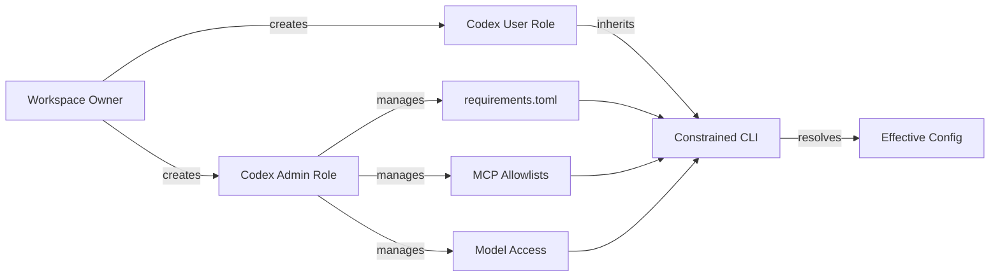

# The OpenAI Partner Network and the Codex Specialisation: What Managed Enterprise Deployments Mean for CLI Developers


On 15 June 2026 OpenAI launched the **Partner Network**, a $150 million programme to certify 300,000 consultants by year-end and channel enterprise Codex deployments through global systems integrators [^1]. Among the specialisation tracks, APIs, cybersecurity, AI agents, sits a **Codex specialisation** that validates a partner's ability to deploy, configure and govern Codex across an organisation [^2]. For CLI developers, this changes what your daily environment looks like: the constraints you work within will increasingly come not from your own `config.toml` but from centrally managed policies pushed by certified partners and enterprise administrators.

This article unpacks the announcement, maps the managed configuration architecture that underpins partner deployments, and offers practical guidance for CLI developers operating inside those constraints.

## The Partner Network at a glance

The programme launches in July 2026 with three tiers, **Select**, **Advanced** and **Elite**, with progression tied to sales performance, technical capability, deployment experience and co-selling engagement [^1]. Launch partners include Accenture, Boston Consulting Group, Capgemini, McKinsey and several boutique AI consultancies [^1][^2].

Two details matter for developers:

1. **Codex as a named specialisation.** Partners earning it must demonstrate proficiency in Codex deployment for software engineering workflows, covering CLI, IDE extension and cloud task configuration [^2].
2. **Forward Deployed Experts pilot.** A pilot programme pairs qualified partners with OpenAI's own Forward Deployed Engineering teams for complex rollouts [^1]. These are the people who will configure your organisation's `requirements.toml` and managed hooks.


## How managed configuration works

When a partner deploys Codex across an enterprise, developers do not install the CLI and authenticate freely. The admin layer imposes **requirements**, constraints you cannot override, and **managed defaults**, starting values you can adjust per session [^3].

### The configuration precedence stack

Codex resolves configuration through a strict hierarchy. Requirements, the non-negotiable constraints, merge in this order [^3]:

1. **Cloud-managed requirements** pushed from the ChatGPT Business or Enterprise admin console
2. **macOS MDM** delivered via the `com.openai.codex` preference domain as `requirements_toml_base64`
3. **System requirements.toml** at `/etc/codex/` (Unix) or `%ProgramData%\OpenAI\Codex\` (Windows)

Managed defaults follow a parallel stack, with your own `config.toml` at the bottom [^3]. The critical rule: **later sources cannot weaken allowlists set by earlier ones.** If cloud requirements restrict sandbox modes, neither MDM nor local configuration can re-enable the blocked modes.

### What partners typically lock down

Based on the official managed-configuration documentation [^3], a partner-deployed `requirements.toml` commonly enforces:

```toml
# Restrict approval policies — no fully autonomous execution
allowed_approval_policies = ["untrusted", "on-request"]

# Sandbox modes — block full filesystem access
allowed_sandbox_modes = ["read-only", "workspace-write"]

# Permission profiles — only built-in safe profiles
default_permissions = ":workspace"

[allowed_permission_profiles]
":read-only" = true
":workspace" = true
":full-access" = false

# Feature restrictions
[features]
computer_use = false
browser_use = false
```

This means CLI developers in partner-managed environments cannot use `--full-auto` or `--sandbox danger-full-access`. The `suggest` and `auto-edit` approval policies are blocked; every tool call requires explicit approval or on-request review [^3].

### Network and MCP server controls

Partners deploying Codex behind enterprise firewalls typically configure network allowlists and MCP server restrictions [^3]:

```toml
# Network access — only approved domains from sandbox
experimental_network.enabled = true
experimental_network.allowed_domains = [
    "api.openai.com",
    "*.internal.example.com",
    "registry.npmjs.org"
]
experimental_network.denied_domains = ["*"]

# MCP servers — only approved servers can connect
[[mcp_servers]]
name = "internal-jira"
identity = "sha256:abc123..."
approved = true
```

MCP server approval requires matching both name and identity hash. You cannot connect arbitrary MCP servers without admin approval [^3].

### Managed hooks

The most impactful constraint for CLI workflow is managed hooks, lifecycle hooks injected by the enterprise that execute alongside, or instead of, your personal hooks [^3]:

```toml
[hooks]
managed_dir = "/enterprise/hooks"
allow_managed_hooks_only = true

[[hooks.PreToolUse]]
matcher = "^Bash$"
[[hooks.PreToolUse.hooks]]
type = "command"
command = "python3 /enterprise/hooks/policy-gate.py"
timeout = 30
```

When `allow_managed_hooks_only = true` is set, your personal project hooks in `.codex/hooks/` are skipped entirely. Only the managed hooks run [^3]. This is how partners enforce compliance gates: every `Bash` tool call passes through a policy script before execution.

## RBAC and the two-role pattern

The enterprise admin setup documentation recommends a **two-role pattern**: `Codex Users` and `Codex Admin` [^4]. Admins manage policies, model access and governance settings; users operate within those constraints. Workspace owners can create custom roles with granular permissions through the ChatGPT admin console [^4].

For CLI developers, the practical implication is that your API key or ChatGPT login inherits whatever role your admin has assigned. If your role restricts model access, `--model gpt-5.5` will not work even if your `config.toml` requests it.



## Practical guidance for CLI developers

### 1. Audit your effective configuration

Run `codex doctor --json` to see which requirements are active and where they originate. The `requirements_sources` field shows whether constraints come from cloud, MDM or system files [^5]. If a setting is locked, `codex doctor` reports it as `enforced` rather than `default`.

### 2. Use named profiles within constraints

Even in managed environments, named profiles in your `config.toml` still work, provided they stay within the allowed ranges. If your admin permits both `read-only` and `workspace-write` sandbox modes, you can create profiles that switch between them:

```toml
[profile.review]
sandbox_mode = "read-only"
approval_policy = "on-request"

[profile.implement]
sandbox_mode = "workspace-write"
approval_policy = "on-request"
```

### 3. Understand hook precedence

If managed hooks are active, check with your Codex Admin whether personal hooks are allowed alongside managed ones. When `allow_managed_hooks_only` is `false`, both managed and personal hooks run, with managed hooks executing first [^3].

### 4. Request MCP server approvals early

If your workflow depends on specific MCP servers, Jira, Confluence or internal tooling, submit approval requests before starting a sprint. The admin must add the server's name and identity hash to the allowlist [^3].

### 5. Test locally with codex doctor

Before escalating issues to your partner or admin, run a diagnostic:

```bash
codex doctor --json | jq '.requirements'
```

This surfaces which constraints are active, their sources, and whether any conflicts exist between local and managed configuration [^5].

## What this means for the ecosystem

The Partner Network formalises what has been happening informally since Codex Enterprise launched: large organisations want governed, auditable agent deployments, and they will pay systems integrators to manage them. The $150 million investment and 300,000 certified consultant target signal that OpenAI expects most enterprise Codex usage to flow through partner-managed environments within 12 to 18 months [^1].

For CLI developers, the takeaway is pragmatic: learn the managed configuration surface now. The `requirements.toml` format, MDM integration patterns and RBAC model are not just admin concerns. They define the boundaries of what your CLI can do. Understanding those boundaries is the difference between productive development and fighting invisible constraints.

## Citations

[^1]: Pulse2, 'OpenAI Launches A Partner Network And Commits $150 Million To Accelerate Enterprise AI Adoption,' 15 June 2026. [https://pulse2.com/openai-launches-a-partner-network-and-commits-150-million-to-accelerate-enterprise-ai-adoption/](https://pulse2.com/openai-launches-a-partner-network-and-commits-150-million-to-accelerate-enterprise-ai-adoption/)

[^2]: Dataconomy, 'OpenAI Unveils First Official Partner Program With $150M Backing,' 15 June 2026. [https://dataconomy.com/2026/06/15/openai-launches-150-million-partner-network/](https://dataconomy.com/2026/06/15/openai-launches-150-million-partner-network/)

[^3]: OpenAI, 'Managed configuration — Codex,' OpenAI Developers, accessed 15 June 2026. [https://developers.openai.com/codex/enterprise/managed-configuration](https://developers.openai.com/codex/enterprise/managed-configuration)

[^4]: OpenAI, 'Admin Setup — Codex,' OpenAI Developers, accessed 15 June 2026. [https://developers.openai.com/codex/enterprise/admin-setup](https://developers.openai.com/codex/enterprise/admin-setup)

[^5]: OpenAI, 'Codex CLI Reference — codex doctor,' OpenAI Developers, accessed 15 June 2026. [https://developers.openai.com/codex/cli/reference](https://developers.openai.com/codex/cli/reference)
