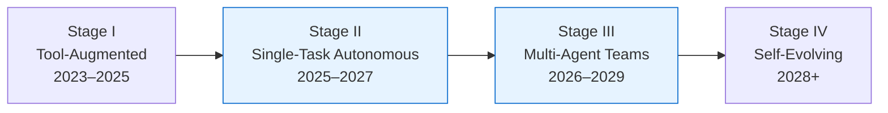

# Agentic Engineering and the Intent Architect: What the Paradigm Shift from Code Author to Outcome Auditor Means for Codex CLI Configuration


---

A paper published on arXiv on 10 June 2026 makes an argument that has been circulating informally for months: software engineering is not being accelerated by AI agents — it is being structurally replaced by something the author calls **Agentic Engineering** [^1]. The claim sits alongside LangChain's April 2026 formal definition of the term [^2], the EvoClaw benchmark exposing a 54-point performance cliff between isolated and continuous agent tasks [^3], and the emergence of dedicated "Intent Engineer" roles at consultancies like Squer [^4]. Taken together, these developments describe a discipline change, not a tool upgrade — and Codex CLI's configuration surface maps to every layer of it.

This article examines what the shift from "code author" to "intent architect" means in practice, where Codex CLI's existing primitives already implement agentic engineering principles, and where the gaps remain.

## The Core Distinction: Static Code vs. Dynamic Agent Systems

The Agentic Software paper [^1] draws a clean taxonomic line:

| Dimension | Traditional SE | Agentic Engineering |
|-----------|---------------|---------------------|
| Core artefact | Static source code | Dynamic agent system |
| Control centre | Human engineer | LLM reasoning engine |
| Decision mechanism | Pre-designed logic | Runtime-generated reasoning |
| Human role | Code author | Intent architect / outcome auditor |
| Complexity ceiling | Human cognition O(1) | Model capacity (scales with compute) |

The shift is not metaphorical. When a developer writes an `AGENTS.md` file, they are not writing code — they are encoding **intent constraints** that shape an LLM's runtime decision-making. The file declares what should happen and what must not, leaving the how to the agent's reasoning loop.

## The Four-Stage Roadmap and Where Codex CLI Sits

Cao's roadmap [^1] traces four stages of agentic software evolution:



Codex CLI in June 2026 straddles Stages II and III. The `codex exec` non-interactive mode and goal-mode loops place individual sessions firmly in Stage II — autonomous end-to-end task completion [^5]. The subagent system, with `[agents]` configuration in `config.toml` supporting `max_threads = 6` and `max_depth = 1`, pushes into Stage III's multi-agent coordination [^6].

The practical implication: **your `AGENTS.md` file is not a README for a tool — it is the specification layer for an autonomous system**. Treating it otherwise leaves intent unspecified and the agent free to make decisions you have not sanctioned.

## Intent Engineering with AGENTS.md

The Intent Engineering Framework [^7] defines six components of well-specified agent intent: objectives, outcomes, health metrics, constraints, decision authority, and stop rules. Every one of these maps to an `AGENTS.md` construct:

### Objectives and Outcomes

```markdown
## Purpose
This service handles payment processing. All changes must maintain PCI-DSS compliance.
Changes to the `payments/` directory require integration tests to pass before commit.
```

This is not a style guide — it is an **objective specification** with an implicit outcome criterion (integration tests pass) and a compliance constraint (PCI-DSS).

### Constraints and Decision Authority

```markdown
## Boundaries
- Never modify files in `infrastructure/terraform/` without explicit approval
- Do not add new npm dependencies without checking the approved-packages list
- Database migrations must be backwards-compatible
```

These lines define **decision authority boundaries**. The agent may reason freely within the permitted space but must escalate (or halt) at the boundary. In Codex CLI, this maps directly to approval policies:

```toml
# config.toml
[permissions]
default_permissions = "ask-before-running-commands"
```

### Stop Rules

Goal mode's `/goal check`, `/goal pause`, and `/goal clear` subcommands [^5] implement explicit stop rules — the agent continues its plan-act-test-review loop until either the goal criteria are met or the human intervenes. Without well-defined stop conditions in `AGENTS.md`, a goal-mode session lacks the constraints that prevent unbounded token consumption.

## Hooks as Guardrails for Autonomous Execution

If `AGENTS.md` encodes intent, hooks enforce it mechanically. The agentic engineering model requires that autonomous agent behaviour be **observable and interruptible** [^2]. Codex CLI's hook system provides both:

```toml
# .codex/config.toml
[[hooks]]
event = "PreToolUse"
pattern = "bash"
command = "scripts/block-dangerous-commands.sh"

[[hooks]]
event = "PostToolUse"
pattern = "bash"
command = "scripts/audit-file-changes.sh"
```

A `PreToolUse` hook with exit code 2 hard-blocks a tool call before execution — the agent never sees the result, only the stderr feedback [^8]. This is not defensive programming; it is **guardrail infrastructure** for an autonomous system. The distinction matters because guardrails are designed for agents that will attempt unexpected paths, whereas defensive code assumes a predictable caller.

The hook model has a known coverage limitation: hooks fire reliably for shell tool calls but coverage for `apply_patch` file edits and MCP tool calls remains incomplete as of v0.140.0 [^8]. Intent architects should be aware that the guardrail boundary is not yet total.

## The EvoClaw Gap: Why Session Management Is Agentic Infrastructure

EvoClaw's central finding [^3] quantifies what practitioners already suspect: agents that score above 80% on isolated SWE-bench tasks collapse to a maximum of 38% when required to maintain system integrity across a continuous sequence of commits. Even the strongest system plateaus at roughly 45% under saturation-based extrapolation [^3].

This 54-point gap is a **context drift and error propagation** problem. Each successive task inherits accumulated state, and agents struggle to track technical debt, dependency changes, and behavioural regressions across session boundaries.

Codex CLI's session lifecycle primitives — `codex archive`, `codex resume --last`, `/compact`, and session forking [^9] — are not convenience features in this framing. They are **context management infrastructure** that determines whether an agent maintains coherent intent across extended development arcs. The discipline of compacting at milestones, archiving completed work, and forking for exploratory branches maps directly to the EvoClaw finding that long-horizon performance depends on structured state management.

```mermaid
graph TD
    A[Start Session] --> B{Milestone<br/>Reached?}
    B -->|Yes| C[/compact]
    C --> D{Branch<br/>Needed?}
    D -->|Yes| E[Fork Session]
    D -->|No| F[Continue]
    B -->|No| F
    F --> G{Work<br/>Complete?}
    G -->|Yes| H[codex archive]
    G -->|No| B
    E --> I[Exploratory Work]
    I --> J{Keep?}
    J -->|Yes| K[Merge Back]
    J -->|No| L[Discard Fork]
```

## Named Profiles as Intent Tiers

The intent architect does not use one configuration for all tasks. Different classes of work require different levels of agent autonomy, model capability, and cost tolerance. Codex CLI's named profile system maps cleanly to intent tiers:

```toml
# ~/.codex/review.config.toml
model = "gpt-5.5"
sandbox = "read-only"
[permissions]
default_permissions = "ask-before-running-commands"
```

```toml
# ~/.codex/autonomous.config.toml
model = "gpt-5-codex"
sandbox = "networking"
[permissions]
default_permissions = "full-auto"
```

Invoking `codex --profile review` versus `codex --profile autonomous` is an **intent-level decision**, not a configuration toggle. The review profile encodes the intent "analyse but do not modify"; the autonomous profile encodes "execute the full task within sandbox constraints". This is precisely the "decision authority" component of the Intent Engineering Framework [^7].

## From Code Author to Outcome Auditor: The Practical Shift

The role change is observable in daily workflow. A code author's primary output is source code; an intent architect's primary outputs are:

1. **`AGENTS.md` files** — intent specifications per directory or service boundary
2. **`config.toml` profiles** — autonomy-tier definitions with model, sandbox, and permission settings
3. **Hook scripts** — mechanical guardrails that enforce intent boundaries
4. **Goal definitions** — outcome specifications with verifiable completion criteria
5. **Review decisions** — audit judgements on agent-generated diffs

The code itself is produced by the agent. The human's value lies in **specifying intent clearly enough that the agent produces correct code, and auditing outcomes rigorously enough to catch when it does not**.

LangChain's pilot data supports this: coordinated agent execution produced a 93% reduction in time-to-root-cause across 512 debugging sessions, saving over 200 engineering hours monthly [^2]. The gains come not from faster typing but from better intent specification and agent coordination.

## What Remains Missing

The agentic engineering paradigm exposes three gaps in the current Codex CLI surface:

**Intent validation.** There is no `codex lint-agents` command that checks whether an `AGENTS.md` file contains well-formed objectives, constraints, and stop rules. Intent specification quality is entirely unverified.

**Cross-session memory.** EvoClaw's continuous-evolution gap [^3] demands structured memory that persists across sessions. Codex CLI's session archive and resume primitives help, but there is no declarative mechanism for defining what an agent should remember between sessions beyond what `/compact` preserves.

**Guardrail coverage.** The hook system does not yet fire reliably for all tool types [^8]. An intent architect cannot fully trust that their `PreToolUse` constraints apply to every action the agent takes. ⚠️

## Conclusion

The shift from code author to intent architect is not a future prediction — it is a description of what experienced Codex CLI users already do. They spend more time writing `AGENTS.md` files, configuring profiles, and auditing diffs than writing source code directly. The Agentic Software paper [^1] and LangChain's formal definition [^2] give this practice a name and a framework. EvoClaw [^3] quantifies where it breaks down.

For Codex CLI practitioners, the actionable takeaway is straightforward: **invest in your intent specification layer**. A well-structured `AGENTS.md` with clear objectives, constraints, and stop rules produces better agent output than a better model with vague instructions. The configuration surface is the engineering surface now.

---

## Citations

[^1]: Cao, Z. (2026). "Agentic Software: How AI Agents Are Restructuring the Software Paradigm." arXiv:2606.05608. [https://arxiv.org/abs/2606.05608](https://arxiv.org/abs/2606.05608)

[^2]: LangChain. (2026). "Agentic Engineering: How Swarms of AI Agents Are Redefining Software Engineering." LangChain Blog, April 2026. [https://www.langchain.com/blog/agentic-engineering-redefining-software-engineering](https://www.langchain.com/blog/agentic-engineering-redefining-software-engineering)

[^3]: Deng, G. et al. (2026). "EvoClaw: Evaluating AI Agents on Continuous Software Evolution." arXiv:2603.13428. [https://arxiv.org/abs/2603.13428](https://arxiv.org/abs/2603.13428)

[^4]: Squer. (2026). "Why We Created the Intent Engineer." Squer Blog. [https://www.squer.io/blog/why-we-created-the-intent-engineer](https://www.squer.io/blog/why-we-created-the-intent-engineer)

[^5]: OpenAI. (2026). "Codex CLI Changelog." OpenAI Developers. [https://developers.openai.com/codex/changelog](https://developers.openai.com/codex/changelog)

[^6]: Codex CLI Documentation. (2026). "Config basics." OpenAI Developers. [https://developers.openai.com/codex/config-basic](https://developers.openai.com/codex/config-basic)

[^7]: Lazo, C. (2026). "Intent Engineering: The Missing Discipline in AI Agent Development." [https://www.connylazo.com/blog/2026-02-26-intent-engineering](https://www.connylazo.com/blog/2026-02-26-intent-engineering)

[^8]: OpenAI. (2026). "Hooks — Codex." OpenAI Developers. [https://developers.openai.com/codex/hooks](https://developers.openai.com/codex/hooks)

[^9]: Codex Knowledge Base. (2026). "Codex CLI Session Lifecycle: Archive, Resume, Fork, and Compact." [https://codex.danielvaughan.com/2026/06/05/codex-cli-session-lifecycle-archive-resume-fork-compact-management/](https://codex.danielvaughan.com/2026/06/05/codex-cli-session-lifecycle-archive-resume-fork-compact-management/)
