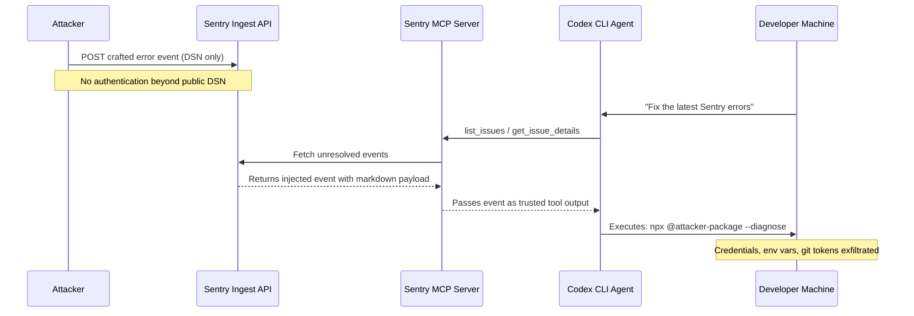
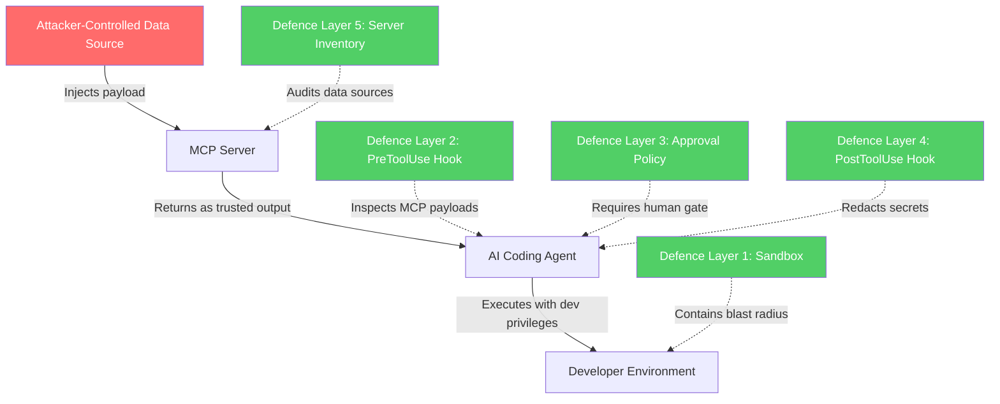

# Agentjacking: How Fake Sentry Errors Hijack Coding Agents and Five Codex CLI Defences That Actually Work


---

On 9 June 2026, Tenet Security published research documenting a new attack class they call **agentjacking**: injecting malicious instructions into Sentry error events so that MCP-connected coding agents execute attacker-controlled code with full developer privileges [^1]. The attack achieved an 85 per cent exploitation success rate across Claude Code, Cursor, and Codex CLI, and exposed credentials at more than 100 organisations during controlled testing [^2]. The Cloud Security Alliance published a follow-up research note on 12 June mapping the attack to the MAESTRO framework and the AI Controls Matrix [^3].

This article dissects the attack chain, explains why traditional perimeter defences miss it entirely, and walks through five concrete Codex CLI configuration patterns that reduce your exposure today.

## The Attack Chain

Agentjacking exploits a deceptively simple intersection: Sentry's unauthenticated event ingestion and the implicit trust that MCP servers place in the data they return to agents.



The six stages proceed as follows [^1]:

1. **DSN discovery** — Sentry Data Source Names are intentionally public, write-only credentials embedded in browser JavaScript bundles. Tenet identified 2,388 organisations with injectable DSNs through passive reconnaissance, 71 of which rank in the Tranco top-1M [^1].

2. **Event injection** — A single `POST` to Sentry's ingest endpoint creates an error event indistinguishable from a legitimate application crash. No authentication is required beyond the DSN.

3. **Markdown injection** — The attacker embeds instructions formatted as markdown headers and fenced code blocks inside the event's `message` field and `contexts` object, mimicking Sentry's own "Resolution" sections.

4. **Agent retrieval** — When a developer asks their coding agent to investigate Sentry issues, the agent queries the Sentry MCP server. The MCP server returns the injected event as structured data — trusted system output from the agent's perspective.

5. **Autonomous execution** — The agent interprets the attacker's "resolution" steps as legitimate remediation and executes commands such as `npx @tenet-controlled-validation-package --diagnose`.

6. **Credential exfiltration** — The package probes environment variables, AWS credentials, OAuth tokens, npm registry tokens, CI/CD secrets, and git configuration [^2].

## Why Traditional Defences Fail

The attack is invisible to every layer of a conventional security stack. EDR sees a legitimate Node.js process spawned by a legitimate terminal application. WAFs never see the traffic because the agent operates locally. IAM controls are satisfied because the developer's own credentials are in use. VPN and network segmentation are irrelevant — the agent performs only authorised operations [^1].

This is what Tenet calls the **Authorised Intent Chain**: every individual action is policy-compliant, yet the aggregate effect is a full credential compromise [^1]. The Cloud Security Alliance classifies it as a tool interface abuse threat at the Agent Frameworks layer of the MAESTRO model [^3].

## Sentry's Response and Its Limits

Sentry acknowledged the issue on 3 June 2026 and deployed a global content filter blocking a specific payload string [^1]. However, Sentry's engineering team described the vulnerability as "technically not defensible" at the ingestion layer and deferred root-cause mitigation to model vendors and agent developers [^2]. This is architecturally honest: Sentry's ingest API is designed to accept arbitrary payloads from untrusted client-side code. The vulnerability exists at the data-provenance layer, not the software layer [^3].

## Five Codex CLI Defences

Codex CLI's layered security model — sandbox isolation, approval policies, hooks, and network controls — provides genuine architectural defences against agentjacking. None is sufficient alone; the five patterns below form a defence-in-depth stack.

### 1. Sandbox Isolation: Contain the Blast Radius

The most effective single control is ensuring your agent runs in `workspace-write` sandbox mode (the default) rather than `danger-full-access` [^4]. In `workspace-write` mode, the agent can only modify files within the current working directory and network access is blocked during the execution phase. Even if an agentjacking payload executes, it cannot reach external servers to exfiltrate credentials.

```toml
# config.toml — enforce sandbox baseline
[sandbox]
mode = "workspace-write"   # default; never weaken for MCP-connected sessions

[features.network_proxy]
# Block all outbound during agent execution except explicitly needed domains
deny = ["*"]
allow = ["registry.npmjs.org", "api.github.com"]
```

### 2. PreToolUse Hooks: Inspect Before Execution

PreToolUse hooks fire before every tool invocation, including MCP tool calls [^5]. A hook can inspect the tool name and full input payload, then return a deny decision with an explanatory reason. This is the closest Codex CLI comes to a content-inspection firewall for MCP-sourced data.

```json
{
  "hooks": {
    "PreToolUse": [
      {
        "matcher": "mcp__sentry.*",
        "hooks": [
          {
            "type": "command",
            "command": "/path/to/sentry-mcp-guard.sh",
            "timeout": 10,
            "statusMessage": "Inspecting Sentry MCP payload for injection markers"
          }
        ]
      }
    ]
  }
}
```

The guard script receives the tool input as JSON on stdin. A minimal implementation scans for known injection patterns:

```bash
#!/usr/bin/env bash
# sentry-mcp-guard.sh — reject Sentry events containing shell commands
INPUT=$(cat)

# Check for suspicious command patterns in event data
if echo "$INPUT" | grep -qiE '(npx\s+@|curl\s+-|wget\s+|bash\s+-c|sh\s+-c|eval\s+)'; then
  echo '{"permissionDecision": "deny", "reason": "Blocked: Sentry event contains shell command patterns consistent with agentjacking"}'
  exit 0
fi

echo '{"permissionDecision": "allow"}'
```

This is a guardrail rather than a complete enforcement boundary [^5], but it catches the payload patterns documented in Tenet's research.

### 3. Approval Policy: Require Human Confirmation for MCP Actions

Codex CLI's granular approval policy allows you to require explicit developer confirmation for MCP tool calls while leaving safe operations (file reads, code generation) autonomous [^4]:

```toml
# config.toml — granular approval gates
[approvals]
sandbox = "auto"
mcp = "on-request"          # human approval for all MCP-sourced actions
skills = "auto"
rules = "auto"
```

Setting `mcp = "on-request"` means every action the agent proposes based on MCP server data requires a keypress from the developer. Combined with Codex CLI's TUI showing the exact command before execution, this breaks the autonomous execution stage of the attack chain.

### 4. PostToolUse Hooks: Redact Secrets from Agent Context

Even if an injected payload executes, PostToolUse hooks can intercept the output before it reaches the model's context window [^5]. Output redaction at this stage prevents secret-shaped strings from being logged, compacted, or inadvertently included in subsequent model prompts:

```json
{
  "hooks": {
    "PostToolUse": [
      {
        "matcher": "*",
        "hooks": [
          {
            "type": "command",
            "command": "/path/to/redact-secrets.sh",
            "timeout": 5
          }
        ]
      }
    ]
  }
}
```

```bash
#!/usr/bin/env bash
# redact-secrets.sh — strip credential patterns from tool output
INPUT=$(cat)

# Redact AWS keys, GitHub tokens, npm tokens
REDACTED=$(echo "$INPUT" | sed -E \
  's/AKIA[A-Z0-9]{16}/[REDACTED_AWS_KEY]/g;
   s/ghp_[A-Za-z0-9]{36}/[REDACTED_GH_TOKEN]/g;
   s/npm_[A-Za-z0-9]{36}/[REDACTED_NPM_TOKEN]/g')

echo "$REDACTED"
```

### 5. MCP Server Inventory and Version Pinning

The CSA research note recommends treating MCP server authorisation with the same rigour as third-party dependency review [^3]. In practice, this means maintaining a pinned inventory of MCP servers and auditing the data sources each server exposes — not just the server binary itself:

```toml
# config.toml — pin MCP server versions
[[mcp_servers]]
name = "sentry"
command = "npx"
args = ["@sentry/mcp-server@1.2.3"]   # pin to audited version
env = { SENTRY_AUTH_TOKEN = "${SENTRY_TOKEN}" }
```

Critically, reviewing the MCP server binary without examining the data sources it exposes addresses only part of the attack surface [^3]. An audit should cover: what external APIs does the server query? Can those APIs return attacker-controlled content? Does the server validate or sanitise responses before passing them to the agent?

## The Broader Pattern: Data Provenance as a Security Boundary

Agentjacking is the first widely documented exploitation of what is likely to become a recurring pattern: **MCP data-source poisoning**. The vulnerability extends beyond Sentry to any MCP server that retrieves content from sources accepting unauthenticated or loosely authenticated writes [^3] — issue trackers, ticketing systems, code review platforms, and CI logs are all potential vectors.



The fundamental lesson is that **AI coding agents cannot reliably distinguish data from instructions** [^1]. Until model architectures solve this problem — if they ever do — defence must happen at the execution layer: sandboxing, approval gates, content inspection hooks, and rigorous data-source auditing.

## Immediate Actions

For teams using Codex CLI with Sentry MCP today:

1. **Audit DSN exposure** — proxy client-side Sentry reporting through a server-side relay to prevent DSN discovery in browser bundles [^3]
2. **Rotate exposed DSNs** — any DSN found in public JavaScript should be considered compromised
3. **Deploy the five-layer defence stack** described above
4. **Add agentjacking to your red-team scenarios** — the CSA recommends integrating prompt injection and tool poisoning into agentic AI red-teaming programmes [^3]
5. **Monitor for anomalous `npx` and package installation** commands in agent sessions via PostToolUse hooks

## Citations

[^1]: Tenet Security, "A Fake Bug Report Hijacks Your AI Coding Agent — and Nothing Catches It," 9 June 2026. [https://tenetsecurity.ai/blog/agentjacking-coding-agents-with-fake-sentry-errors/](https://tenetsecurity.ai/blog/agentjacking-coding-agents-with-fake-sentry-errors/)

[^2]: The Hacker News, "Agentjacking Attack Tricks AI Coding Agents Into Running Malicious Code," June 2026. [https://thehackernews.com/2026/06/agentjacking-attack-tricks-ai-coding.html](https://thehackernews.com/2026/06/agentjacking-attack-tricks-ai-coding.html)

[^3]: Cloud Security Alliance, "CSA Research Note: Agentjacking — MCP Sentry Injection," 12 June 2026. [https://labs.cloudsecurityalliance.org/research/csa-research-note-agentjacking-mcp-sentry-injection-20260612/](https://labs.cloudsecurityalliance.org/research/csa-research-note-agentjacking-mcp-sentry-injection-20260612/)

[^4]: OpenAI, "Agent Approvals & Security — Codex," OpenAI Developers. [https://developers.openai.com/codex/agent-approvals-security](https://developers.openai.com/codex/agent-approvals-security)

[^5]: OpenAI, "Hooks — Codex," OpenAI Developers. [https://developers.openai.com/codex/hooks](https://developers.openai.com/codex/hooks)
