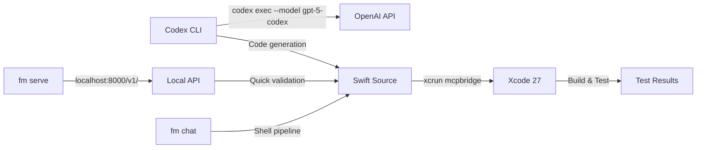

# Apple's Foundation Models Dynamic Profiles and the fm CLI: What WWDC 2026 Means for Codex CLI Swift Developers


---

## Introduction

Apple's Platforms State of the Union on 9 June 2026 transformed the Foundation Models framework from a single-model, single-session API into a full multi-agent orchestration platform[^1]. Three announcements matter most for developers already using Codex CLI for Swift work: **Dynamic Profiles** — a declarative system for swapping models, tools, and instructions mid-session; the **LanguageModel protocol** — an abstraction that lets Claude, Gemini, and Apple's own models back the same `LanguageModelSession` through a unified Swift API; and the **`fm` CLI tool**, shipping pre-installed in macOS 27, which exposes an OpenAI-compatible Chat Completions server on `localhost` with zero configuration[^2].

The existing knowledge base article on Foundation Models (8 June) covered the pre-WWDC landscape: on-device guided generation, basic tool calling, and Xcode integration via `xcrun mcpbridge`[^3]. This article picks up where that left off, covering the State of the Union additions and the practical Codex CLI workflows for building agentic Swift applications with the new primitives.

---

## Dynamic Profiles: Multi-Agent Orchestration in Swift

Dynamic Profiles replace the static session configuration from iOS 26.4 with a declarative API that re-evaluates on every model prompt[^4]. A `DynamicProfile` contains a `body` property that returns the active profile — including its instructions, tools, model selection, and reasoning level — based on current application state.

```swift
struct CraftProfile: LanguageModelSession.DynamicProfile {
    var orchestrator: CraftOrchestrator

    var body: some DynamicProfile {
        switch orchestrator.mode {
        case .brainstorming:
            Profile { BrainstormFacilitator(orchestrator: orchestrator) }
                .model(orchestrator.pccLanguageModel)
                .temperature(1)
        case .planning:
            Profile { TutorialAuthor(orchestrator: orchestrator) }
                .model(orchestrator.pccLanguageModel)
                .reasoningLevel(.deep)
        case .reviewing:
            Profile { CraftCoach() }
                .model(orchestrator.systemLanguageModel)
        }
    }
}
```

The framework defines three orchestration patterns[^4]:

### Baton-Pass Pattern

Multiple profiles share a single transcript. A tool call toggles the active profile, passing the conversational baton. The receiving profile sees the full history and produces the next response. This suits workflows where context continuity matters — a brainstorming agent hands off to a planning agent within the same session.

### Phone-a-Friend Pattern

A tool spawns an isolated child `LanguageModelSession`. The child's response becomes tool output in the parent transcript. The parent retains final response responsibility. This isolates expensive reasoning tasks (run on Private Cloud Compute) from lightweight orchestration (run on-device).

### Skills Pattern

Procedural context loads on demand through a `Skills` API. Each `Skill` declares a name, description, and prompt text. The framework activates skills as needed, keeping the context window lean — directly relevant given the on-device model's token constraints[^4].

---

## Scaffolding Dynamic Profiles with Codex CLI

These patterns contain significant boilerplate. Codex CLI connected to Xcode via `xcrun mcpbridge` can scaffold them from a prompt[^5]:

```bash
codex "Create a DynamicProfile for a code review assistant with three modes:
  1. analysis (on-device SystemLanguageModel, extract issues)
  2. explanation (PCC with .deep reasoning, explain each issue)
  3. fix-suggestion (Anthropic Claude via AnthropicLanguageModel, generate patches)
  Include a BatonPassTool that cycles through modes.
  Use DynamicInstructions for each mode's system prompt."
```

An `AGENTS.md` section tailored to Foundation Models projects prevents common agent mistakes:

```markdown
## Foundation Models Conventions

- All DynamicProfile bodies must be pure computed properties — no side effects
- Use .onResponse and .onToolCall modifiers for imperative work, never the body
- Prefer DynamicInstructions grouping over inlining Instructions blocks
- SystemLanguageModel for latency-sensitive paths; PrivateCloudComputeLanguageModel
  for reasoning-heavy paths
- Never hardcode model selection — use protocol-typed properties for testability
- History transforms must be stateless; use SessionProperty for persistent state
```

---

## The LanguageModel Protocol: One API, Every Provider

The new `LanguageModel` protocol abstracts model access behind a common interface[^2]. Four first-party conformances ship at launch:

| Conformance | Location | Context Window | Cost |
|---|---|---|---|
| `SystemLanguageModel` | On-device | ~4,096 tokens | Free |
| `PrivateCloudComputeLanguageModel` | Apple PCC servers | 32,000 tokens | Free (<2M downloads)[^6] |
| `AnthropicLanguageModel` | Anthropic API | Model-dependent | Per-token |
| `GoogleLanguageModel` | Google API | Model-dependent | Per-token |

Two open-source conformances extend this further[^2]:

- **`CoreAILanguageModel`** — runs local models on the Neural Engine
- **`MLXLanguageModel`** — runs local models on the GPU via Apple's MLX framework

Anthropic and Google ship Swift packages (`AnthropicLanguageModel`, `GoogleLanguageModel`) that conform to the protocol[^7]. The downstream code is identical:

```swift
import AnthropicLanguageModel

let model = AnthropicLanguageModel()
let session = LanguageModelSession(model: model)
let response = try await session.respond(to: "Analyse this pull request diff.")
```

This matters for Codex CLI users building apps that need provider flexibility. A Dynamic Profile can route brainstorming to the free on-device model, complex reasoning to PCC, and specialised tasks to Claude — all within the same session, selected by application state rather than hardcoded configuration.

---

## The fm CLI: Apple's Local Model on the Terminal

macOS 27 ships with `fm`, a pre-installed command-line tool that gives terminal access to the same Foundation Models powering Apple Intelligence[^8]:

```bash
# Interactive chat session
fm chat "Explain the baton-pass pattern in Foundation Models"

# Use Private Cloud Compute for deeper reasoning
fm chat --model pcc "Analyse this crash log for a race condition"

# Structured JSON output
fm chat --schema '{"type":"object","properties":{"summary":{"type":"string"},"severity":{"type":"string","enum":["low","medium","high","critical"]}}}' \
  "Classify this Swift compiler diagnostic: Cannot convert value of type..."
```

### fm serve: A Local Chat Completions Server

The transformative feature is `fm serve`, which spins up an OpenAI-compatible API server on `http://localhost:8000/v1/`[^9]:

```bash
fm serve
```

No API key. No cloud billing. No Ollama setup. Any tool that speaks the Chat Completions protocol — including Codex CLI's custom model provider mechanism — can point at this endpoint.

For Codex CLI users, this creates a powerful local development loop:



The `fm` CLI and Codex CLI serve complementary roles. Use Codex CLI for multi-file code generation, refactoring, and test authoring. Use `fm chat` for quick one-shot tasks piped through shell scripts — summarising build logs, classifying diagnostics, or generating test fixture data from the terminal without consuming API tokens.

---

## Private Cloud Compute: Free Reasoning for Small Developers

Apple's PCC model offers a 32,000-token context window with reasoning capabilities — and it is free for developers with fewer than two million first-time App Store downloads[^6]. Higher limits apply for iCloud+ subscribers.

Two reasoning levels are available[^2]:

- **`.light`** — minimal thinking, lower latency
- **`.deep`** — thorough reasoning for complex tasks

Usage tracking is built into the response object:

```swift
let response = try await session.respond(
    to: prompt,
    contextOptions: ContextOptions(reasoningLevel: .deep)
)
print("Input tokens: \(response.usage.input.totalTokenCount)")
print("Cached tokens: \(response.usage.input.cachedTokenCount)")
print("Reasoning tokens: \(response.usage.output.reasoningTokenCount)")
```

For teams building Foundation Models apps with Codex CLI, the PCC free tier eliminates the cost barrier for developing and testing reasoning-heavy Dynamic Profiles during development. Reserve Claude or Gemini integration for production paths where specific capabilities are required.

---

## Vision Capabilities and Agentic Workflows

The on-device model now accepts image input[^2], enabling vision-aware agent workflows:

```swift
let response = try await session.respond {
    "Identify the UI component in this screenshot and suggest accessibility improvements."
    Attachment(screenshotImage)
}
```

Apple also ships two built-in vision tools — `BarcodeReaderTool` and `OCRTool` — that Dynamic Profiles can include as standard tools[^2]. Combined with the Appshots feature in Codex Desktop (which captures window screenshots via the Command-Command hotkey)[^10], this creates a loop where Codex CLI generates Swift code that processes the same visual inputs it was shown during development.

---

## Xcode 27 Integration: The Complete Development Loop

The `xcrun mcpbridge` connection between Codex CLI and Xcode 27 provides the development backbone[^5]. With Xcode open on a Foundation Models project, Codex CLI can:

1. **Build the project** — triggering compilation and catching type errors in Dynamic Profile bodies
2. **Run tests** — including Apple's new Evaluations framework for measuring intelligence feature quality[^2]
3. **Query SwiftUI previews** — verifying that agentic responses render correctly in the UI
4. **Execute Swift REPL snippets** — testing individual profile configurations in isolation

Configure the MCP server in your project-scoped Codex configuration:

```toml
[mcp_servers.xcode]
command = "xcrun"
args = ["mcpbridge"]
```

A named profile keeps Foundation Models development separate from general Swift work:

```toml
[profiles.fm-dev]
model = "gpt-5-codex"
approval_policy = "unless-allow-listed"
sandbox_mode = "workspace-write"

[profiles.fm-dev.mcp_servers.xcode]
command = "xcrun"
args = ["mcpbridge"]
```

Launch with `codex --profile fm-dev` to enter a session pre-configured for Foundation Models work.

---

## Open-Source Implications

Apple confirmed the Foundation Models framework will go open source later this summer[^2]. The practical consequence: the same Swift APIs that drive on-device inference in an iOS app will run on Linux servers. Combined with the `ChatCompletionsLanguageModel` conformance in the open-source utilities package, server-side Swift applications will be able to use Dynamic Profiles for multi-agent orchestration without any Apple platform dependency.

For teams using Codex CLI to maintain both client and server Swift codebases, this means shared orchestration code — a single Dynamic Profile definition deployable to both the iOS app (backed by `SystemLanguageModel`) and the server (backed by `ChatCompletionsLanguageModel` pointing at any OpenAI-compatible endpoint).

---

## What to Build This Week

1. **Scaffold a Dynamic Profile** — use Codex CLI to generate a three-mode profile with Baton-Pass orchestration, targeting SystemLanguageModel and PCC
2. **Set up `fm serve`** — install macOS 27 beta, run `fm serve`, and configure a Codex CLI custom provider pointing at `localhost:8000` for local validation loops
3. **Add Foundation Models conventions to AGENTS.md** — encode the rules above to prevent common agent mistakes with profile bodies and history transforms
4. **Test with the Evaluations framework** — use Codex CLI to scaffold evaluation test cases that measure your Dynamic Profile's accuracy across model swaps

---

## Citations

[^1]: Apple, "Platforms State of the Union — WWDC 2026," 9 June 2026. [https://developer.apple.com/wwdc26/](https://developer.apple.com/wwdc26/)
[^2]: Apple, "What's new in the Foundation Models framework — WWDC26," 9 June 2026. [https://developer.apple.com/videos/play/wwdc2026/241/](https://developer.apple.com/videos/play/wwdc2026/241/)
[^3]: D. Vaughan, "Codex CLI and Apple's Foundation Models Framework: Agent-Assisted On-Device AI Development," Codex Knowledge Base, 8 June 2026. [https://codex.danielvaughan.com/2026/06/08/codex-cli-apple-foundation-models-framework-on-device-ai-development-xcode-26-workflows/](https://codex.danielvaughan.com/2026/06/08/codex-cli-apple-foundation-models-framework-on-device-ai-development-xcode-26-workflows/)
[^4]: Apple, "Build agentic app experiences with the Foundation Models framework — WWDC26," 9 June 2026. [https://developer.apple.com/videos/play/wwdc2026/242/](https://developer.apple.com/videos/play/wwdc2026/242/)
[^5]: D. Vaughan, "Xcode 27 and Codex CLI: Connecting Apple's MCP Bridge for Agentic iOS and macOS Development," Codex Knowledge Base, 11 June 2026. [https://codex.danielvaughan.com/2026/06/11/xcode-27-codex-cli-mcp-bridge-apple-agentic-coding-ios-macos-development/](https://codex.danielvaughan.com/2026/06/11/xcode-27-codex-cli-mcp-bridge-apple-agentic-coding-ios-macos-development/)
[^6]: Apple, "Private Cloud Compute free tier for developers," WWDC 2026. [https://developer.apple.com/wwdc26/guides/apple-intelligence/](https://developer.apple.com/wwdc26/guides/apple-intelligence/)
[^7]: TechTimes, "WWDC 2026 Developer Tools: Foundation Models Now Swaps AI Providers Without Code Changes," 9 June 2026. [https://www.techtimes.com/articles/318039/20260609/wwdc-2026-developer-tools-foundation-models-now-swaps-ai-providers-without-code-changes.htm](https://www.techtimes.com/articles/318039/20260609/wwdc-2026-developer-tools-foundation-models-now-swaps-ai-providers-without-code-changes.htm)
[^8]: Apple, "Build AI-powered scripts with the fm CLI and Python SDK — WWDC26," 9 June 2026. [https://developer.apple.com/videos/play/wwdc2026/334/](https://developer.apple.com/videos/play/wwdc2026/334/)
[^9]: ChatForest, "Apple's fm CLI Runs a Local OpenAI-Compatible Server: The PSOTU Details Most WWDC Recaps Skipped," June 2026. [https://chatforest.com/builders-log/apple-fm-cli-python-sdk-fm-serve-openai-compatible-psotu-wwdc-2026/](https://chatforest.com/builders-log/apple-fm-cli-python-sdk-fm-serve-openai-compatible-psotu-wwdc-2026/)
[^10]: 9to5Mac, "Codex for Mac updated with new Appshots feature," 21 May 2026. [https://9to5mac.com/2026/05/21/codex-for-mac-updated-with-new-appshots-feature-that-instantly-gives-chat-context/](https://9to5mac.com/2026/05/21/codex-for-mac-updated-with-new-appshots-feature-that-instantly-gives-chat-context/)
