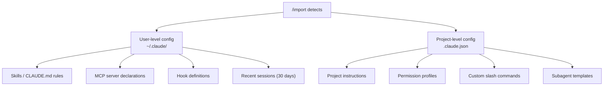
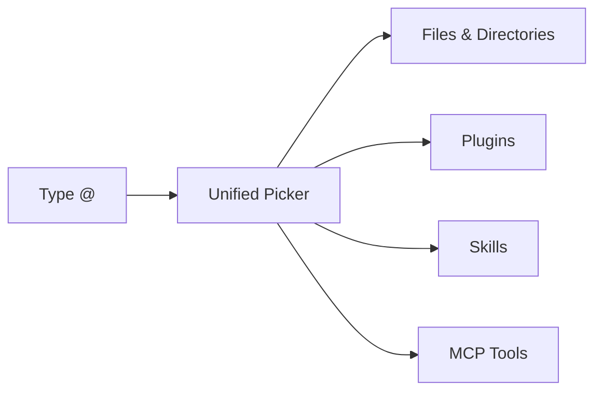

# Codex CLI v0.140.0 Stable Release Guide: Usage Tracking, Session Deletion, Claude Code Import, and Encrypted Credentials


---

Five days after the first alpha builds surfaced[^1], Codex CLI v0.140.0 landed as a stable release on 15 June 2026[^2]. Where the alpha signalled architectural ambitions — extensions unification, multi-agent v2 path tracking, Python SDK goal routing — the stable cut delivers a different class of change: six practitioner-facing features that close longstanding operational gaps. You can now track token spend without leaving the TUI, permanently delete sessions that should not persist, selectively import configuration from Claude Code, store credentials in your OS keyring rather than plaintext JSON, authenticate against Amazon Bedrock with managed API keys, and rely on the `@` picker to surface files, plugins, and skills from a single menu.

This article walks through each feature with configuration examples and the context behind why it matters.

## Installation

```bash
npm install -g @openai/codex@0.140.0
```

Verify with:

```bash
codex --version
# 0.140.0
```

## Usage Tracking with /usage

### The Problem It Solves

Until now, checking token consumption required either the `/status` command — which shows only the current session's running total — or third-party tools like ccusage, tokscale, or codextime that parse local JSONL session logs[^3]. None of these provided an in-TUI view of account-level spend across days and weeks.

### How It Works

The new `/usage` command queries the OpenAI billing API and renders three views directly in the TUI:

- **Daily** — token counts broken down by input and output for the current calendar day
- **Weekly** — rolling seven-day aggregate aligned with the billing window
- **Cumulative** — total spend since the account's first Codex session

```bash
# Inside a Codex session
/usage          # defaults to daily view
/usage weekly   # seven-day rolling window
/usage cumulative
```

The output includes a per-model breakdown, so you can see exactly how much GPT-5-Codex versus GPT-5.4-mini contributed to your daily burn rate. For teams on ChatGPT Plus or Pro plans where rate limits are metered by tokens consumed in a rolling five-hour window[^4], `/usage` replaces the mental arithmetic of "how much runway do I have left today?"

### Configuration

No configuration is required — `/usage` works with both API key and OAuth authentication flows. The data is fetched live from OpenAI's servers, not reconstructed from local logs.

## Permanent Session Deletion

### Background

Session deletion was one of the most-requested features on the Codex issue tracker. GitHub issue #13018, opened in early 2026, accumulated hundreds of upvotes requesting the ability to permanently remove threads from the sidebar[^5]. Prior to v0.140.0, the options were archiving (which hid but preserved data) or manually deleting JSONL files from `~/.codex/sessions/`.

### Three Deletion Surfaces

v0.140.0 ships deletion across three interfaces:

| Surface | Command | Scope |
|---------|---------|-------|
| CLI | `codex delete <thread_id>` | Removes from local index and remote app-server |
| TUI | `/delete` | Deletes the current active session |
| App-server | `thread/delete` API | Programmatic deletion for automation |

All three paths require confirmation before executing. The CLI prompts with a `y/N` safeguard; the TUI shows a modal with the session title and token count before proceeding.

### What Gets Removed

Deletion is comprehensive:

1. The remote thread is removed from OpenAI's servers via the app-server API
2. The local JSONL session file under `~/.codex/sessions/` is deleted
3. The entry is purged from `~/.codex/session_index.jsonl`
4. Any associated rollout data is cleaned up

⚠️ Desktop state residues have been reported in earlier builds where deletion left stale references in the desktop-state file[^6]. Monitor the issue tracker if you are running Codex Desktop alongside the CLI.

```bash
# Delete a specific session by thread ID
codex delete thread_abc123def456

# Inside a session, delete the current thread
/delete
```

## Selective Claude Code Import with /import

### From Bulk Migration to Selective Import

Codex CLI has supported Claude Code migration since v0.128.0 through the agent migration system[^7]. The v0.140.0 `/import` command refines this from a bulk detection-and-import flow into a selective picker that lets you choose exactly which artefacts to bring across.

### What /import Detects

The command scans eight categories from your Claude Code installation:



### Selective Picking

Rather than importing everything, `/import` presents each detected category with a checkbox interface. You select which items to migrate, and Codex maps them to their native equivalents:

| Claude Code Source | Codex CLI Target |
|---|---|
| `CLAUDE.md` rules | `AGENTS.md` sections |
| `.mcp.json` servers | `config.toml [mcp_servers]` |
| Claude hooks | `config.toml [[hooks]]` |
| Permission profiles | Permission profile TOML |
| Custom commands | Skills (`SKILL.md`) |

Items that cannot be automatically mapped — such as Claude Code's `/cost` tracking or Anthropic-specific API features — are flagged with a follow-up note explaining the gap.

```bash
# Inside a Codex session
/import

# The TUI presents a category picker:
# [x] Skills (3 found)
# [x] MCP servers (2 found)
# [ ] Recent sessions (12 found)
# [x] Project instructions (1 found)
# [ ] Hook definitions (0 found)
```

This is particularly relevant given that the Codex App also gained Claude Code migration flows in the 26.608 release on 9 June 2026[^8], making both App and CLI surfaces consistent for teams switching tools.

## Encrypted Credential Storage

### The Security Gap

Codex CLI has stored OAuth tokens in `~/.codex/auth.json` since its earliest releases. This file contains access tokens in plaintext — a known risk that the official documentation has long warned against committing, pasting into tickets, or sharing in chat[^9]. For enterprise environments with compliance requirements, plaintext credential files are a non-starter.

### Keyring Integration

v0.140.0 promotes encrypted credential storage from a quiet configuration option to a properly integrated feature. The `cli_auth_credentials_store` setting in `config.toml` accepts three modes:

```toml
# ~/.codex/config.toml

# Use the OS credential store (recommended)
cli_auth_credentials_store = "keyring"

# Plaintext file (legacy default)
# cli_auth_credentials_store = "file"

# Auto-detect: keyring if available, file fallback
# cli_auth_credentials_store = "auto"
```

The keyring backend uses platform-native credential stores:

| Platform | Backend | Storage Location |
|----------|---------|------------------|
| macOS | Security framework (Keychain) | Login keychain, service name "Codex Auth" |
| Linux | libsecret / GNOME Keyring / KWallet | Session keyring |
| Windows | Windows Credential Manager | Generic credentials |

Keys are hashed from the `CODEX_HOME` path, so multiple Codex installations on the same machine maintain separate credential entries[^10].

### MCP OAuth Credentials

The encrypted storage extends beyond CLI authentication to MCP server OAuth tokens. When an MCP server requires OAuth authentication (increasingly common with hosted services like GitHub, Slack, and Google Drive connectors), v0.140.0 stores those tokens in the same keyring backend rather than in separate plaintext files.

```toml
# MCP servers with OAuth now benefit from encrypted storage automatically
[mcp_servers.github]
command = "npx"
args = ["-y", "@modelcontextprotocol/server-github"]
# OAuth tokens stored in OS keyring, not ~/.codex/mcp_oauth/
```

## Amazon Bedrock Managed API Key Support

### Extended Authentication

Codex CLI has supported Amazon Bedrock since v0.124.0 through AWS SigV4 signing and the standard SDK credential chain[^11]. v0.140.0 adds a third authentication path: managed API keys issued through the Bedrock console.

```toml
# ~/.codex/config.toml
model = "us.amazon.nova-pro-v1:0"  # or any Bedrock-hosted model

[providers.bedrock]
region = "us-east-1"
```

```bash
# Environment variable for managed API key
export AWS_BEARER_TOKEN_BEDROCK="br-xxxxxxxxxxxxxxxx"
```

The managed API key approach is simpler than configuring IAM roles and credential chains, making it attractive for individual developers who want Bedrock routing without full AWS account infrastructure. For enterprise teams already using IAM, the existing SigV4 credential chain remains the recommended path[^12].

When combined with encrypted credential storage, the Bedrock bearer token can be stored in the OS keyring rather than exported as a shell environment variable — closing a security gap for developers who previously had tokens sitting in `.bashrc` or `.zshrc` files.

## Unified @ Mentions Menu

### Consolidation

v0.131.0 introduced the `@` picker for file mentions[^13]. v0.140.0 expands it into a unified menu that searches across four resource types from a single input:



Typing `@` anywhere in the composer opens the picker. As you type, results are filtered across all categories with type indicators:

```
@ deploy
  📄 deploy.sh                    (file)
  🔌 vercel-deploy                (plugin)
  📋 deployment-checklist         (skill)
  🔧 cloudflare:deploy_worker     (MCP tool)
```

This eliminates the previous workflow of using separate `/mention`, `/skills`, and `/mcp` commands to attach context. For teams with large plugin libraries, the unified search is a meaningful reduction in keystrokes.

## Additional Changes Worth Noting

### Enhanced /goal for Large Content

The `/goal` command now preserves oversized text blocks and image attachments when syncing to the remote app-server. Previously, large paste operations or image-heavy goals could be silently truncated during the sync to remote sessions[^2].

### SQLite Auto-Recovery

Corrupted SQLite databases — a recurring issue for developers who force-quit the CLI or experience disk errors — now trigger automatic backup and rebuild from rollout data rather than surfacing opaque database errors[^2].

### Removal of /realtime Voice Controls

The experimental `/realtime` command and its associated audio dependencies have been removed from the TUI. This was an alpha feature for voice-driven interactions that never reached stability[^2]. If your workflow depended on it, the Codex mobile app remains the supported surface for voice input.

### Performance

Large repository responsiveness has improved through Git filesystem monitor preservation and accelerated archive lookups. Turn-diff rendering is now cached, reducing the latency of reviewing changes in long sessions[^2].

## Upgrade Checklist

For teams planning to upgrade from v0.139.0:

1. **Enable encrypted credentials** — Add `cli_auth_credentials_store = "keyring"` to `config.toml` and re-authenticate with `codex auth login` to migrate tokens from `auth.json` to your OS keyring
2. **Review session retention** — Use `codex delete` to permanently remove any sessions containing sensitive data that were previously only archived
3. **Run /import if switching from Claude Code** — The selective picker is more granular than the bulk migration in earlier versions
4. **Test /usage** — Verify your billing visibility matches expectations, particularly if you are on a team plan with shared rate limits
5. **Update CI pipelines** — If CI scripts reference `~/.codex/auth.json` directly, migrate to environment variable authentication or keyring mode with `auto` fallback

```bash
# Quick post-upgrade verification
codex doctor
codex --version
# Inside a session:
/usage daily
```

## Citations

[^1]: Codex CLI v0.140 Alpha Signals article, Codex Knowledge Base, 10 June 2026. [https://codex.danielvaughan.com/2026/06/10/codex-cli-v0140-alpha-signals-extensions-unification-multi-agent-v2-path-tracking-python-sdk-goals/](https://codex.danielvaughan.com/2026/06/10/codex-cli-v0140-alpha-signals-extensions-unification-multi-agent-v2-path-tracking-python-sdk-goals/)

[^2]: Codex Changelog — v0.140.0, OpenAI Developers, 15 June 2026. [https://developers.openai.com/codex/changelog](https://developers.openai.com/codex/changelog)

[^3]: ccusage — Coding Agent CLI Usage Analysis. [https://ccusage.com/guide/codex/](https://ccusage.com/guide/codex/)

[^4]: "How to Check Codex Usage — Monitor Limits, Tokens & 5-Hour Window," SessionWatcher, 2026. [https://www.sessionwatcher.com/guides/how-to-check-codex-usage](https://www.sessionwatcher.com/guides/how-to-check-codex-usage)

[^5]: "Allow to delete threads in the Codex app," GitHub Issue #13018, openai/codex. [https://github.com/openai/codex/issues/13018](https://github.com/openai/codex/issues/13018)

[^6]: "Codex Desktop delete leaves local session index, logs, and desktop-state residues," GitHub Issue #23991, openai/codex. [https://github.com/openai/codex/issues/23991](https://github.com/openai/codex/issues/23991)

[^7]: "The Codex CLI Agent Migration System: Importing Sessions, Skills, and Configuration from Claude Code and Other Agents," Codex Knowledge Base, 13 May 2026. [https://codex.danielvaughan.com/2026/05/13/codex-cli-agent-migration-system-import-claude-code-sessions-skills-config/](https://codex.danielvaughan.com/2026/05/13/codex-cli-agent-migration-system-import-claude-code-sessions-skills-config/)

[^8]: Codex Changelog — Codex App 26.608, OpenAI Developers, 9 June 2026. [https://developers.openai.com/codex/changelog](https://developers.openai.com/codex/changelog)

[^9]: "Authentication — Codex CLI," OpenAI Developers. [https://developers.openai.com/codex/auth](https://developers.openai.com/codex/auth)

[^10]: "Codex CLI Authentication: OAuth, Device Code, API Keys, and CI/CD Credential Management," Codex Knowledge Base, 1 April 2026. [https://codex.danielvaughan.com/2026/04/01/codex-cli-authentication-flows-credential-management/](https://codex.danielvaughan.com/2026/04/01/codex-cli-authentication-flows-credential-management/)

[^11]: "Get started with OpenAI GPT-5.5, GPT-5.4 models, and Codex on Amazon Bedrock," AWS Blog. [https://aws.amazon.com/blogs/aws/get-started-with-openai-gpt-5-5-gpt-5-4-models-and-codex-on-amazon-bedrock/](https://aws.amazon.com/blogs/aws/get-started-with-openai-gpt-5-5-gpt-5-4-models-and-codex-on-amazon-bedrock/)

[^12]: "Use Codex with Amazon Bedrock," OpenAI Developers. [https://developers.openai.com/codex/amazon-bedrock](https://developers.openai.com/codex/amazon-bedrock)

[^13]: "Codex CLI v0.131.0 Release Guide," Codex Knowledge Base, 18 May 2026. [https://codex.danielvaughan.com/2026/05/18/codex-cli-v0131-release-guide-unified-mentions-plugin-marketplace-python-sdk-tui/](https://codex.danielvaughan.com/2026/05/18/codex-cli-v0131-release-guide-unified-mentions-plugin-marketplace-python-sdk-tui/)
