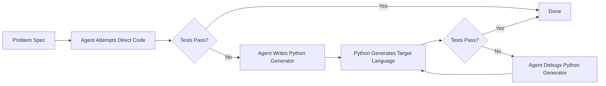
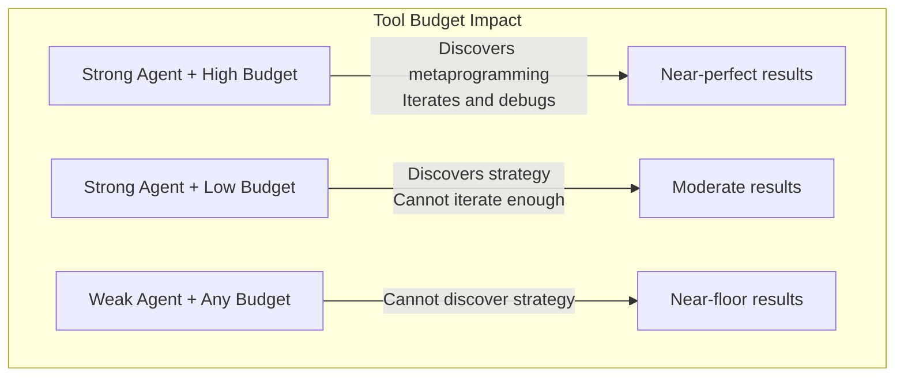

# Frontier Agents and Metaprogramming: What EsoLang-Bench Reveals About Codex CLI Reasoning Effort, Tool Budgets, and Strategy Transfer


---

A paper published on 9 June 2026 tested six coding agents on four esoteric programming languages and discovered that frontier agents do not write unfamiliar code directly — they write Python programs that *generate* unfamiliar code [^1]. The finding has immediate configuration implications for every Codex CLI team working with niche languages, proprietary DSLs, or generated APIs that are sparse in public training corpora.

## The Experiment

Aman Sharma, Sushrut Thorat, and Paras Chopra evaluated six contemporary coding agents against EsoLang-Bench, a suite of 80 problems across four esoteric languages: Brainfuck, Befunge-98, Whitespace, and Shakespeare [^1]. Each agent operated in a sequential setup with file editing, local execution, and hidden-test grading — the same agentic loop that Codex CLI provides out of the box.

The six agents tested were:

| Agent | Harness | Reasoning Config |
|-------|---------|-----------------|
| Claude Opus 4.6 | Claude Code | Default |
| Claude Sonnet 4.6 | Claude Code | Default |
| Claude Haiku 4.5 | Claude Code | Default |
| GPT-5.4 xhigh | Codex | Extended reasoning |
| GPT-5.4 mini | Codex | Medium reasoning |
| Kimi K2.5 | OpenCode | Default |

The Codex harness entries are directly relevant: GPT-5.4 xhigh ran with extended reasoning effort on the same Codex agent loop that powers `codex` and `codex exec` [^1].

## The Results: A 88-Point Spread

Mainstream benchmarks compress the performance gap between frontier models to single digits. SWE-Bench Verified shows a 6.6 percentage-point spread with a standard deviation of 2.9 [^1]. EsoLang-Bench blew the scale open:

| Agent | Whitespace | Shakespeare | Befunge-98 | Brainfuck | Mean |
|-------|-----------|-------------|-----------|-----------|------|
| Kimi K2.5 | 31.3% | 2.5% | 6.3% | 5.0% | 11.3% |
| Haiku 4.5 | 81.3% | 7.5% | 5.0% | 5.0% | 24.7% |
| GPT-5.4 mini | 88.8% | 21.3% | 13.8% | 6.3% | 32.5% |
| Sonnet 4.6 | 100% | 70.0% | 80.0% | 15.0% | 66.3% |
| Opus 4.6 | 100% | 87.5% | 80.0% | 80.0% | 86.9% |
| GPT-5.4 xhigh | 100% | 100% | 100% | 98.8% | **99.7%** |

The mean spread was 88.4 percentage points — roughly 12 times larger than SWE-Bench Verified [^1]. GPT-5.4 on the Codex harness with `xhigh` reasoning effort scored near-perfect. The same model at medium reasoning effort (GPT-5.4 mini) scored 32.5%. That is a 67.2 percentage-point gap from a single configuration knob.

## The Metaprogramming Discovery

The paper's headline finding was emergent and unprompted: strong agents avoided writing unfamiliar languages directly. Instead, they wrote Python programs that generated the target language code [^1].

On Brainfuck problem E04, Opus 4.6 first attempted 1,884 bytes of hand-written Brainfuck and failed. It then pivoted to a Python generator that produced 24,500 bytes of Brainfuck — and passed all six hidden tests [^1]. The Python code externalised state management into named variables and reusable functions for cell allocation, pointer tracking, and arithmetic patterns.

GPT-5.4 xhigh discovered the same strategy independently.



When the researchers banned metaprogramming and forced direct authoring, the results collapsed:

| Agent | Language | With Metaprogramming | Direct Only | Drop |
|-------|----------|---------------------|-------------|------|
| GPT-5.4 xhigh | Brainfuck | 98.8% | 36.0% | **−62.8pp** |
| GPT-5.4 xhigh | Befunge-98 | 100% | 51.0% | −49.0pp |
| Opus 4.6 | Brainfuck | 80.0% | 34.0% | −46.0pp |
| Opus 4.6 | Befunge-98 | 80.0% | 35.0% | −45.0pp |

Whitespace and Shakespeare were largely unaffected because their solutions remained short enough for direct authoring [^1].

## Three Codex CLI Configuration Lessons

### 1. Reasoning Effort Is the Single Highest-Leverage Knob

The gap between GPT-5.4 mini (medium reasoning) and GPT-5.4 xhigh (extended reasoning) was 67.2 percentage points. No other variable — model size, harness, prompt engineering — produced a comparable shift [^1].

For Codex CLI teams, this translates directly to `model_reasoning_effort` in `config.toml`:

```toml
# ~/.codex/config.toml — Default profile
model = "gpt-5-codex"
model_reasoning_effort = "medium"

# Named profile for hard problems
[profiles.hard]
model_reasoning_effort = "xhigh"
```

Invoke the profile when the task involves unfamiliar territory:

```bash
# Standard work
codex "refactor the auth module"

# Unfamiliar DSL, proprietary format, or complex algorithmic task
codex -p hard "generate the Terraform provider schema from the OpenAPI spec"
```

The paper's data suggests that `xhigh` is not merely "a bit better" on hard problems — it unlocks qualitatively different strategies that medium reasoning cannot discover [^1]. The cost increase from medium to xhigh is significant (roughly 3–5× token consumption [^2]), but the alternative is an agent that cannot solve the problem at all.

### 2. Tool Call Budgets Gate Strategy Discovery

The paper's interpreter-call budget experiment capped local execution calls at 3, 5, 15, 30, or unlimited per problem [^1]. The findings were sharply asymmetric:

- **Opus 4.6**: Improved consistently with more calls on both Brainfuck and Befunge-98
- **Sonnet 4.6**: Improved on Befunge-98 but plateaued on Brainfuck
- **Haiku 4.5**: Remained near floor regardless of budget



For Codex CLI, this maps to two configuration surfaces:

**Sandbox policy**: if `network_access = false` (the default) prevents the agent from fetching documentation or examples for an unfamiliar language, the agent loses a tool it might need. Consider enabling network access for exploration-heavy sessions:

```toml
[profiles.explore]
model_reasoning_effort = "xhigh"
network_access = true
```

**Execution policy**: restrictive `sandbox_mode` settings or approval policies that interrupt every shell command break the agent's iterative debug loop. For hard problems in sandboxed environments, consider `suggest` rather than `ask-every-time` approval policies to reduce loop friction whilst retaining human oversight [^3].

The paper also showed that output-token analysis revealed Opus reaching full scores with *fewer* tokens than Sonnet once it discovered metaprogramming [^1]. The implication: a well-configured agent that finds the right strategy early costs less than a cheaper model that flounders indefinitely.

### 3. Strategy Transfer via Helper Libraries Maps to Skills and AGENTS.md

The paper's most actionable experiment was the strategy transfer condition. The researchers distilled Opus 4.6's successful traces into two forms of reusable context [^1]:

- **+Text**: written guidance — "use Python generators, build reusable primitives, verify locally"
- **+Lib**: a helper library with generic code-generation primitives (cell allocator, BCD arithmetic, decimal printing, Befunge-98 simulator) — no per-problem solutions

Results on Brainfuck (pass count out of 80):

| Agent | Base | +Text | +Lib |
|-------|------|-------|------|
| Haiku 4.5 | 4 | 3 | 7 |
| Sonnet 4.6 | 12 | 12 | **64** |
| GPT-5.4 mini | 5 | 8 | **53** |

Text instructions alone (+Text) had negligible effect. But providing reusable code primitives (+Lib) transformed mid-tier agents: Sonnet jumped from 12 to 64, GPT-5.4 mini from 5 to 53 [^1]. The helper library was generic — no problem-specific solutions — yet it unlocked the same metaprogramming strategy that frontier agents discovered independently.

This result maps precisely to Codex CLI's **Skills** system [^4] and **AGENTS.md** [^5]:

```
.codex/
  skills/
    brainfuck-generators/
      SKILL.md          # "Use Python generators for Brainfuck output"
      scripts/
        bf_primitives.py  # Cell allocator, arithmetic, I/O primitives
```

```markdown
<!-- AGENTS.md -->
## Brainfuck / Esoteric Language Policy

When working with Brainfuck, Whitespace, Befunge, or other esoteric
languages, always write a Python generator rather than authoring the
target language directly. Use the primitives in
`.codex/skills/brainfuck-generators/scripts/bf_primitives.py`
for cell allocation and pointer management.
```

The lesson generalises beyond esoteric languages. Any time your team works with a niche DSL — Terraform HCL modules, Helm chart templates, Kubernetes CRDs, proprietary configuration formats — capturing proven generation patterns as Skills and referencing them from AGENTS.md gives mid-tier models access to strategies they cannot discover independently.

## When These Findings Matter Most

The EsoLang-Bench results apply most strongly when three conditions overlap:

1. **The target language is underrepresented in training data** — proprietary DSLs, internal configuration formats, generated API schemas
2. **The task requires non-trivial state management** — pointer arithmetic, stack manipulation, control flow graphs
3. **Direct authoring is error-prone even for human experts** — Brainfuck, Terraform provider blocks, complex regex patterns

In these scenarios, the paper provides quantified evidence that:

- Setting `model_reasoning_effort = "xhigh"` is worth the cost premium
- Providing reusable helper libraries as Skills outperforms written instructions by 4–10×
- Restricting the agent's tool call budget actively prevents strategy discovery

## The Benchmark Compression Problem

The paper's secondary contribution is methodological. SWE-Bench Verified compresses the frontier to a 6.6-point spread. Terminal-Bench 2.0 stretches it to 33.3 points. EsoLang-Bench reaches 88.4 points [^1]. The practical consequence: if your team selects models based solely on SWE-Bench scores, you are evaluating agents on problems they all handle similarly whilst ignoring the hard problems where configuration choices produce order-of-magnitude differences.

```mermaid
bar
    title Benchmark Spread Comparison (Percentage Points)
    x-axis ["SWE-Bench Verified", "Terminal-Bench 2.0", "LiveCodeBench v6", "EsoLang-Bench"]
    y-axis "Spread (pp)" 0 --> 100
    bar [6.6, 33.3, 43.5, 88.4]
```

Teams evaluating Codex CLI for tasks involving unfamiliar or niche languages should weight benchmarks that test adaptive capability, not just mainstream coding accuracy [^6].

## Practical Configuration Recipes

### Profile for Niche Language Work

```toml
# ~/.codex/config.toml
[profiles.niche]
model = "gpt-5-codex"
model_reasoning_effort = "xhigh"
network_access = true
```

```bash
codex -p niche "implement the parser for our internal DSL in dsl-spec.md"
```

### AGENTS.md Pattern for Metaprogramming Encouragement

```markdown
## Code Generation Strategy

For any language or format where direct authoring is error-prone
(Brainfuck, custom DSLs, complex regex, Helm templates), prefer
writing a Python or TypeScript generator that produces the target
output. Verify the generator's output against tests before submitting.

Reference helper primitives in `.codex/skills/` when available.
```

### Skill Structure for Reusable Generators

```bash
mkdir -p .codex/skills/dsl-generators/scripts
cat > .codex/skills/dsl-generators/SKILL.md << 'EOF'
# DSL Generator Skill

Use the Python primitives in `scripts/` to generate target-format
output rather than authoring it directly. Each primitive handles
a specific structural pattern (node allocation, edge wiring,
validation rule emission).
EOF
```

## Conclusion

EsoLang-Bench quantifies what many Codex CLI practitioners intuit: the gap between a well-configured agent and a default-configured agent is not 5–10% — it can be 67 percentage points on hard problems. Three configuration surfaces account for the majority of that gap: reasoning effort, tool call budget, and reusable helper context. The paper provides empirical support for investing time in Skills and AGENTS.md rather than relying on model selection alone.

## Citations

[^1]: Sharma, A., Thorat, S., & Chopra, P. (2026). "Frontier Coding Agents Use Metaprogramming to Adapt to Unfamiliar Programming Languages." arXiv:2606.10933. [https://arxiv.org/abs/2606.10933](https://arxiv.org/abs/2606.10933)

[^2]: OpenAI. "Reasoning Effort Tuning." Codex CLI Documentation. [https://developers.openai.com/codex/cli/features](https://developers.openai.com/codex/cli/features)

[^3]: OpenAI. "Agent Approvals & Security." Codex CLI Documentation. [https://developers.openai.com/codex/agent-approvals-security](https://developers.openai.com/codex/agent-approvals-security)

[^4]: OpenAI. "Agent Skills." Codex CLI Documentation. [https://developers.openai.com/codex/skills](https://developers.openai.com/codex/skills)

[^5]: OpenAI. "Customization." Codex CLI Documentation. [https://developers.openai.com/codex/concepts/customization](https://developers.openai.com/codex/concepts/customization)

[^6]: Sharma, A., Thorat, S., & Chopra, P. (2026). "Frontier Coding Agents Use Metaprogramming to Adapt to Unfamiliar Programming Languages." Table 5: Benchmark spread comparison. arXiv:2606.10933. [https://arxiv.org/html/2606.10933v1](https://arxiv.org/html/2606.10933v1)
