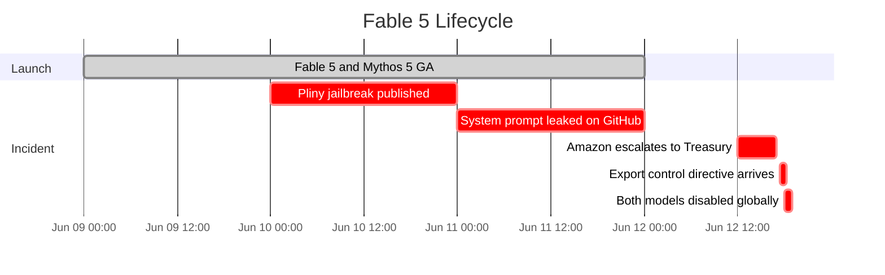
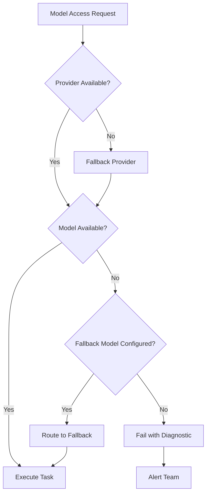

# The Fable 5 Export Control: What the 72-Hour Model Recall Teaches Codex CLI Teams About Provider Risk and Configuration Resilience


---

On 9 June 2026, Anthropic shipped Claude Fable 5 — a distilled variant of its restricted Mythos 5 tier — to immediate fanfare. At 80.3 per cent on SWE-bench Pro it was the strongest publicly available coding model ever released [^1]. Seventy-two hours later, at 5:21 p.m. ET on 12 June, the US Department of Commerce issued an export-control directive and Anthropic disabled Fable 5 and Mythos 5 worldwide [^2]. Every API call to `claude-fable-5` began returning infrastructure-level errors. No retry logic, no regional workaround, no timeline for restoration [^3].

It was the first time Washington used export-control authority to pull a commercially deployed American AI model out of service [^4]. For the tens of thousands of development teams who had already integrated Fable 5 into their workflows — including Claude Code users who had switched models within hours of launch — the result was immediate breakage.

This article examines what happened, why it matters even if you never called a single Anthropic endpoint, and what Codex CLI practitioners should configure today to ensure their agent workflows survive the next provider-level disruption.

## The 72-Hour Timeline



On 10 June, a pseudonymous red-teamer known as Pliny the Liberator published screenshots demonstrating a multi-vector jailbreak combining Unicode substitution, homoglyphs, and decomposition-reassembly techniques [^5]. The next day Pliny leaked Fable 5's full 120,000-character system prompt on GitHub — the first public disclosure of a Mythos-class safety architecture [^5]. On 12 June, Amazon escalated security findings to the Treasury Secretary, and hours later Commerce Secretary Howard Lutnick issued the directive [^6].

Anthropic explained it could not filter foreign nationals from US users in real time, so it disabled both models for all customers globally [^2]. Claude Opus 4.8, Sonnet 4.6, and Haiku 4.5 remained unaffected [^3].

## Why This Matters for Codex CLI Developers

You might reasonably ask: if I run Codex CLI against OpenAI's API, why should I care about an Anthropic model recall?

Three reasons.

### 1. Multi-Provider Routing Is Now Standard Practice

Codex CLI supports routing through OpenAI, Amazon Bedrock, Azure OpenAI, and any OpenAI-compatible endpoint including Ollama and LM Studio [^7]. Many teams route specific workloads through Anthropic endpoints via the `OPENAI_BASE_URL` override or MCP-bridged Claude Code sessions. If your `config.toml` included a named profile pointing at Claude endpoints, the Fable 5 shutdown broke that profile without warning.

### 2. The Precedent Applies to Any Provider

The Commerce Department's authority under the Export Control Reform Act is not limited to Anthropic. Any frontier model from any US provider could face the same treatment if a jailbreak creates a perceived national-security risk [^4]. OpenAI's own GPT-5.5 has faced scrutiny under the Trusted Access for Cyber programme, which already restricts certain capabilities to vetted defenders [^8]. The regulatory surface is expanding, not contracting.

### 3. Configuration Fragility Is a Silent Risk

Most Codex CLI configurations hardcode a single model identifier. When that model vanishes overnight, every automation pipeline, every CI/CD workflow, and every named profile that references it fails. The Fable 5 incident exposed how few teams had implemented graceful degradation chains.

## Building a Resilient Codex CLI Configuration

The core defence is a combination of named profiles, fallback chains, and circuit-breaker logic. Here is a practical `config.toml` pattern that survives provider-level outages.

### Named Profiles with Fallback Models

```toml
# Primary coding profile — OpenAI direct
[profiles.coding]
model = "gpt-5-codex"
reasoning_effort = "high"
approval_policy = "on-request"

# Secondary profile — Anthropic via compatible endpoint
[profiles.coding-anthropic]
model = "claude-opus-4-8"
provider = "anthropic"
reasoning_effort = "high"
approval_policy = "on-request"

# Tertiary profile — local model for air-gapped or regulatory fallback
[profiles.coding-local]
model = "qwen3.5-27b"
provider = "ollama"
reasoning_effort = "medium"
approval_policy = "on-request"
```

### Graceful Degradation in CI/CD

The `codex exec` command does not natively support fallback chains, but a shell wrapper provides the same effect:

```bash
#!/usr/bin/env bash
# codex-resilient.sh — try providers in order, fail gracefully
set -euo pipefail

PROMPT="$1"
SCHEMA="${2:-}"

PROFILES=("coding" "coding-anthropic" "coding-local")

for profile in "${PROFILES[@]}"; do
  echo "Attempting profile: ${profile}" >&2
  if output=$(codex exec \
    --profile "$profile" \
    ${SCHEMA:+--output-schema "$SCHEMA"} \
    "$PROMPT" 2>&1); then
    echo "$output"
    exit 0
  else
    echo "Profile ${profile} failed, trying next..." >&2
  fi
done

echo "All profiles exhausted" >&2
exit 1
```

This pattern ensures that a provider-level shutdown cascades to the next available endpoint rather than failing the entire pipeline.

### Health Checks with `codex doctor`

Since v0.135.0, `codex doctor` reports runtime, authentication, network, and provider diagnostics [^9]. Run it as a pre-flight check in CI:

```bash
# Fail fast if the configured provider is unreachable
codex doctor --json | jq -e '.checks[] | select(.category == "auth") | .passed' \
  || { echo "Provider health check failed"; exit 1; }
```

Since v0.139.0, `codex doctor` also includes editor and pager environment details, making it a comprehensive diagnostic surface for support cases [^10].

## The Broader Lesson: Model Access as an SLA Risk



Before June 12, most teams treated model availability as a binary: either the API is up or it is down. The Fable 5 incident introduced a third state: the API is up but a specific model has been removed by regulatory action. This state is invisible to standard HTTP health checks — the endpoint returns 200 for other models whilst the target model returns an error that no amount of retrying will resolve [^3].

The practical response is to treat model access with the same rigour as any other external dependency:

1. **Pin model versions in configuration, not in code.** Store model identifiers in `config.toml` profiles or environment variables, never as string literals scattered across a codebase [^3].

2. **Define fallback hierarchies per workload.** Hard coding tasks need the strongest available model; routine tasks can tolerate a lower-capability fallback; bulk processing can drop to a cost-optimised tier.

3. **Monitor provider status programmatically.** Subscribe to provider status pages (Anthropic's status.anthropic.com, OpenAI's status.openai.com) and integrate alerts into your incident-response workflow.

4. **Maintain at least one local model path.** Ollama with Qwen 3.5 27B or Gemma 4 31B provides a zero-dependency fallback that no export-control directive can disable [^11]. Performance will be lower, but availability is guaranteed.

5. **Audit your dependency graph quarterly.** Run `grep -rn "claude-fable\|claude-mythos" .` across your repositories — the same pattern that bit teams on 12 June [^3]. Replace any model that has been recalled.

## What Happened to Developers Who Were Prepared

Teams that had already implemented multi-provider routing in Codex CLI experienced the Fable 5 shutdown as a configuration event, not an outage. Their CI pipelines fell through to the next profile. Their interactive sessions continued with a different model. Their on-call engineers received an alert rather than a page.

The developer backlash from 12-14 June drove a viral pivot toward local model hosting and multi-provider API routing [^12]. The phrase "run local models" trended on developer forums as teams sought insulation from what one founder called "regulatory volatility" [^12]. Kimi K2.7 Code, an open-weight model scoring 81.1 per cent on MCPMark tool-use, became a popular comparison baseline for local-first workflows [^12].

## Configuration Checklist

For teams that have not yet hardened their Codex CLI configuration against provider-level disruptions:

- [ ] Define at least two named profiles in `config.toml` targeting different providers
- [ ] Wrap `codex exec` in CI/CD with a fallback loop script
- [ ] Add `codex doctor --json` as a pipeline pre-flight check
- [ ] Store model identifiers in environment variables or profiles, not inline
- [ ] Test the fallback path monthly — disable the primary profile and confirm the secondary activates
- [ ] Subscribe to provider status-page webhooks
- [ ] Maintain one local model (Ollama/LM Studio) as an air-gapped fallback
- [ ] Audit repositories quarterly for references to recalled or deprecated models

## Looking Ahead

The Fable 5 export control will not be the last regulatory intervention in the AI model market. The Commerce Department's precedent, combined with the expanding Trusted Access for Cyber programme [^8] and the upcoming GPT-5.3-Codex API deadline on 30 June [^13], creates a landscape where model availability is no longer a given.

Codex CLI's architecture — provider-agnostic routing, named profiles, local model support, and the `codex doctor` diagnostic surface — provides the tools to build resilient configurations. The Fable 5 incident is the motivation to actually use them.

---

## Citations

[^1]: Anthropic, "Introducing Claude Fable 5 and Claude Mythos 5," 9 June 2026.
[^2]: Quartz, "Anthropic disables Claude Fable 5 and Mythos 5 after U.S. export order," 12 June 2026. [https://qz.com/anthropic-fable-5-mythos-5-export-control-directive-061226](https://qz.com/anthropic-fable-5-mythos-5-export-control-directive-061226)
[^3]: DevToolLab, "Claude Fable 5 Shutdown: US Export Control Order Explained for Developers," June 2026. [https://devtoollab.com/blog/claude-fable-5-shutdown](https://devtoollab.com/blog/claude-fable-5-shutdown)
[^4]: Heise Online, "US government forces shutdown of Anthropic's AI Fable 5 and Mythos 5," June 2026. [https://www.heise.de/en/news/US-government-forces-shutdown-of-Anthropic-s-AI-Fable-5-and-Mythos-5-11331146.html](https://www.heise.de/en/news/US-government-forces-shutdown-of-Anthropic-s-AI-Fable-5-and-Mythos-5-11331146.html)
[^5]: BuildFastWithAI, "AI News Today - June 15, 2026: 16 Biggest Stories," 15 June 2026. [https://www.buildfastwithai.com/blogs/ai-news-today-june-15-2026](https://www.buildfastwithai.com/blogs/ai-news-today-june-15-2026)
[^6]: Tom's Hardware, "US government warned Anthropic that Fable 5 had been jailbroken," June 2026. [https://www.tomshardware.com/tech-industry/artificial-intelligence/trump-adviser-david-sacks-says-anthropic-refused-to-fix-fable-5-jailbreak-before-us-export-controls](https://www.tomshardware.com/tech-industry/artificial-intelligence/trump-adviser-david-sacks-says-anthropic-refused-to-fix-fable-5-jailbreak-before-us-export-controls)
[^7]: OpenAI Developers, "Codex CLI Configuration," 2026. [https://developers.openai.com/codex/cli/reference](https://developers.openai.com/codex/cli/reference)
[^8]: OpenAI, "Scaling Trusted Access for Cyber with GPT-5.5 and GPT-5.5-Cyber," 2026. [https://openai.com/index/gpt-5-5-with-trusted-access-for-cyber/](https://openai.com/index/gpt-5-5-with-trusted-access-for-cyber/)
[^9]: OpenAI Developers, "Codex CLI Changelog — v0.135.0," 28 May 2026. [https://developers.openai.com/codex/changelog](https://developers.openai.com/codex/changelog)
[^10]: Releasebot, "Codex Updates by OpenAI - June 2026," June 2026. [https://releasebot.io/updates/openai/codex](https://releasebot.io/updates/openai/codex)
[^11]: MorphLLM, "Open Source AI Coding Assistants (2026)," June 2026. [https://www.morphllm.com/ai-coding-assistant-open-source](https://www.morphllm.com/ai-coding-assistant-open-source)
[^12]: BuildFastWithAI, "AI News Today - June 15, 2026," 15 June 2026. [https://www.buildfastwithai.com/blogs/ai-news-today-june-15-2026](https://www.buildfastwithai.com/blogs/ai-news-today-june-15-2026)
[^13]: OpenAI Developers, "Codex Pricing — GPT-5.3-Codex deprecation," 2026. [https://developers.openai.com/codex/pricing](https://developers.openai.com/codex/pricing)
