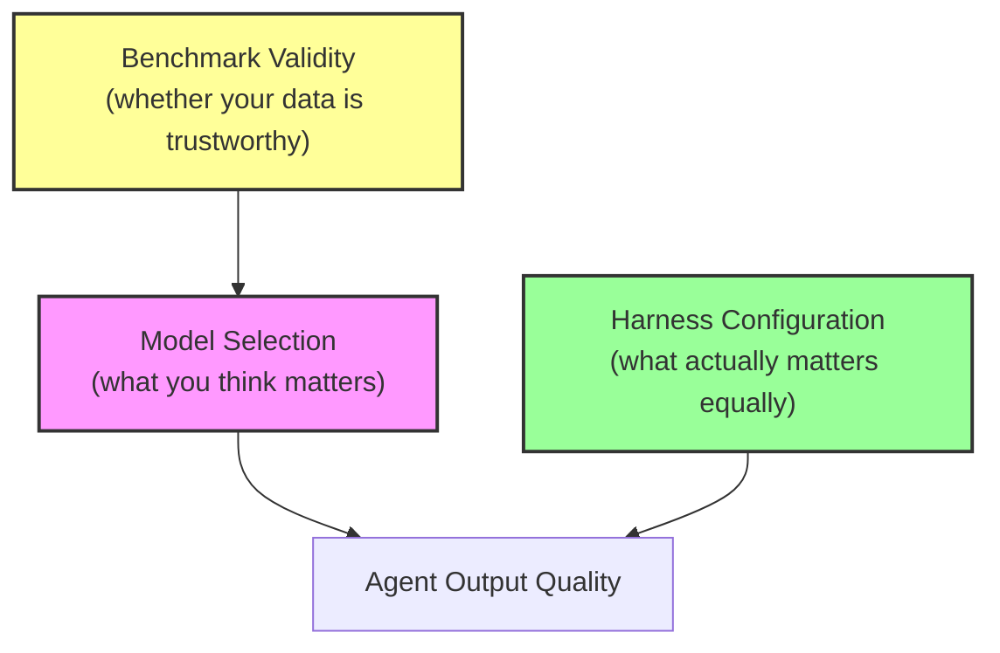
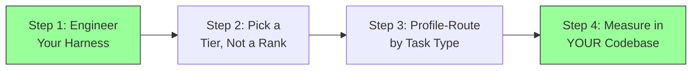

# When the Harness Outweighs the Model: What Claw-SWE-Bench, Harness-Bench, and UTBoost Mean for Codex CLI Configuration Strategy


---

The SWE-bench leaderboard has become the default yardstick for evaluating coding agents. Teams pick models by scanning the top-ten list, reasoning that the model with the highest pass rate will produce the best results in their codebase. Three papers published between May and June 2026 independently demolish that assumption. Their collective finding: **the agent harness — the scaffolding of tools, prompts, retry logic, context management, and execution policies wrapped around a model — is at least as important as the model itself, and sometimes dramatically more so**.

For Codex CLI users, this is not abstract. Codex CLI *is* a harness. Every `config.toml` setting, every AGENTS.md directive, every PreToolUse hook, and every approval policy shapes the harness your model operates within. The research reviewed here makes a quantitative case that investing in harness configuration yields returns comparable to — or exceeding — a model upgrade.

## The Three Papers

### Claw-SWE-Bench: The Harness as a Controlled Variable

Published on 10 June 2026 by Zheng, Han, Li et al., Claw-SWE-Bench is the first benchmark to make the agent harness (which the authors call a "claw") a first-class experimental variable [^1]. Previous SWE-bench evaluations confound model capability with harness design because each submission uses its own proprietary scaffolding. You cannot tell whether a model scored 75% because the model is brilliant or because the harness retries failures, manages context windows skilfully, and extracts patches cleanly.

Claw-SWE-Bench fixes the evaluation stack — prompt template, task set, execution container, timeout, patch extraction, and evaluator — and makes only the harness slot replaceable [^1]. The workload spans 350 real GitHub issue-resolution instances across eight programming languages and 43 repositories [^1].

The headline result: **harness choice produced a 27.4 percentage-point spread on Qwen 3.6-flash under identical conditions** [^1]. On GLM 5.1, swapping from OpenClaw's minimal direct-diff adapter to its full adapter moved pass@1 from 19.1% to 73.4% — a 54.3 percentage-point gap attributable entirely to harness design [^1].

To put that in perspective, the difference between the worst and best model on a fixed harness was 29.4 percentage points [^1]. The harness effect (27.4 pp) is nearly as large as the model effect (29.4 pp), and in some configurations it dominates.

### Harness-Bench: 5,194 Trajectories Prove the Pattern Holds

Published on 27 May 2026 by Yao, Tan, Liu et al., Harness-Bench takes a different approach [^2]. Rather than coding-only tasks, it evaluates 106 sandboxed offline agent tasks drawn from realistic agent-use patterns — file manipulation, API integration, data transformation, and multi-step workflows [^2]. Across 5,194 execution trajectories spanning multiple model-harness pairings, the authors found **substantial variation in completion rate, process quality, efficiency, and failure behaviour that could not be attributed to the model alone** [^2].

The paper introduces the concept of "execution-alignment failures" — situations where the model's reasoning is plausible but becomes decoupled from tool feedback, workspace state, or verifiable output contracts [^2]. These failures are harness-level defects: the model reasons correctly, but the harness fails to ground that reasoning in reality.

Their recommendation is unambiguous: **agent capability should be reported at the model-harness configuration level, not attributed to the base model alone** [^2].

### UTBoost: The Leaderboard Itself Was Wrong

Published at ACL 2025 by Yu, Zhu, He, and Kang, UTBoost addresses a different angle of the same problem: what if the tests used to validate benchmark solutions are themselves insufficient [^3]? Using UTGenerator, an LLM-driven test case generator, the authors revalidated SWE-bench submissions and found **345 erroneous patches that had been incorrectly labelled as passing** [^3].

The impact is staggering: corrections affected **40.9% of SWE-Bench Lite leaderboard entries and 24.4% of SWE-Bench Verified entries** [^3]. Concrete example: Amazon-Q-Developer-Agent dropped from a solo first place at 55% to a shared first at 53.6% after seven of its patches were identified as erroneous, while devlo lost only three, equalising the ranking [^3].

The implication for model selection: if the benchmark you use to choose your model has a 24–41% error rate in its validation layer, your model choice may be based on noise rather than signal.

## The Convergent Thesis

Taken together, these three papers establish a single thesis from three angles:



1. **Claw-SWE-Bench**: Harness design is a first-order factor, not a confound to be ignored.
2. **Harness-Bench**: The pattern holds across realistic tasks, not just SWE-bench coding.
3. **UTBoost**: The leaderboard data guiding model selection is unreliable.

The practical conclusion: **stop chasing leaderboard positions and start engineering your harness**.

## What This Means for Codex CLI Configuration

Codex CLI's architecture maps directly onto the harness components these papers identify as critical. Here is how each research finding translates to configuration action.

### 1. Context Management: AGENTS.md as Your Prompt Template

Claw-SWE-Bench showed that the prompt template is a primary harness variable [^1]. In Codex CLI, your prompt template is AGENTS.md — the instruction chain loaded from `~/.codex/AGENTS.md` through every directory-level override down to your working directory [^4].

A sparse AGENTS.md is the equivalent of Claw-SWE-Bench's minimal adapter. A well-structured AGENTS.md — with build commands, test invocations, style constraints, and architectural boundaries — is the full adapter.

```toml
# config.toml — ensure AGENTS.md loading isn't truncated
[context]
agents_md_max_bytes = 32768   # default; increase for monorepos
```

Invest time in AGENTS.md before you invest money in a more expensive model. The Claw-SWE-Bench data suggests this alone can deliver a double-digit percentage-point improvement in task completion [^1].

### 2. Execution Alignment: Hooks as Grounding Mechanisms

Harness-Bench's "execution-alignment failures" — where reasoning decouples from workspace state — are precisely what Codex CLI's hook system was designed to prevent [^2]. A PreToolUse hook that validates file paths before writes, or a PostToolUse hook that runs the test suite after every edit, acts as a grounding mechanism that keeps the model's reasoning aligned with reality [^5].

```toml
# config.toml — grounding hooks
[[hooks.post_tool_use]]
event = "post_tool_use"
command = "make test-fast 2>&1 | tail -20"
description = "Run fast tests after every file modification"

[[hooks.pre_tool_use]]
event = "pre_tool_use"
command = "test -f \"$CODEX_FILE_PATH\" || echo 'BLOCK: file does not exist'"
description = "Prevent writes to non-existent paths"
```

Without these hooks, even a frontier model will accumulate execution-alignment drift across a multi-step task. The hooks cost nothing in API spend but fundamentally change the harness's error-correction behaviour.

### 3. Retry and Recovery: Approval Policies as Circuit Breakers

Claw-SWE-Bench's full adapter includes retry logic that the minimal adapter lacks [^1]. In Codex CLI, your approval policy and sandbox configuration serve an analogous function. A `suggest` policy forces human review at every tool call — effectively a manual retry gate. An `auto-edit` policy with PostToolUse test hooks creates an automated retry loop: edit, test, fix, repeat [^6].

```toml
# config.toml — automated retry via policy + hooks
[policy]
approval = "auto-edit"

[sandbox]
mode = "workspace-write"
writable_roots = ["/workspace"]
```

The 54.3 percentage-point gap between minimal and full adapters in Claw-SWE-Bench was not because the full adapter used a different model — it was because the full adapter could recover from failures the minimal adapter could not [^1].

### 4. Model Selection After the Leaderboard Correction

UTBoost's 345 erroneous patches collapse meaningful distinctions between models in the top tier [^3]. After correction, the practical difference between first and fifth place on SWE-bench Verified is often within the margin of error. Combined with Claw-SWE-Bench's finding that harness choice can swing results by 27.4 points, the rational model-selection strategy shifts:



Use Codex CLI named profiles to route by task type rather than chasing the single "best" model [^7]:

```toml
# config.toml — task-routed profiles
[profiles.review]
model = "o4-mini"
approval = "suggest"

[profiles.implement]
model = "gpt-5-codex"
approval = "auto-edit"

[profiles.goal]
model = "gpt-5.5"
approval = "auto-edit"
```

The difference between `o4-mini` and `gpt-5.5` on a well-configured harness may be smaller than the difference between `gpt-5.5` on a bare harness versus `gpt-5.5` on a fully instrumented one.

### 5. Patch Extraction: Output Schema as the Evaluator Contract

Claw-SWE-Bench's adapter protocol includes a patch extraction procedure as a critical harness component [^1]. In Codex CLI's non-interactive mode, the `--output-schema` flag serves the same function: it forces structured output that downstream tooling can reliably parse [^8].

```bash
# Structured output extraction for CI pipelines
codex exec \
  --model gpt-5-codex \
  --output-schema '{"type":"object","properties":{"patch":{"type":"string"},"confidence":{"type":"number"},"tests_added":{"type":"array","items":{"type":"string"}}}}' \
  "Fix issue #1234 and list the tests you added"
```

Without structured extraction, you are running a minimal adapter. With it, you are running a full adapter. The research suggests the gap is enormous.

## The Harness Engineering Checklist

Based on the three papers, here is a priority-ordered checklist for Codex CLI harness optimisation:

| Priority | Harness Layer | Codex CLI Mechanism | Paper Evidence |
|----------|--------------|---------------------|---------------|
| 1 | Context management | AGENTS.md hierarchy | Claw-SWE-Bench: prompt template is primary variable [^1] |
| 2 | Execution grounding | PostToolUse test hooks | Harness-Bench: execution-alignment failures are harness defects [^2] |
| 3 | Error recovery | Approval policy + retry hooks | Claw-SWE-Bench: 54.3 pp gap from adapter completeness [^1] |
| 4 | Output extraction | `--output-schema` in codex exec | Claw-SWE-Bench: patch extraction is a critical harness component [^1] |
| 5 | Validation depth | Stop hooks running full test suite | UTBoost: shallow validation misses 345 erroneous patches [^3] |
| 6 | Model routing | Named profiles by task type | All three: model choice matters less than harness quality |

## Limitations and Caveats

These papers have limitations worth acknowledging:

- **Claw-SWE-Bench** evaluates primarily on SWE-bench-derived tasks. Enterprise codebases with proprietary frameworks may show different harness-model dynamics ⚠️
- **Harness-Bench** uses 106 tasks — substantial but not exhaustive. The 5,194 trajectories are strong evidence but come from a constructed task set, not production logs ⚠️
- **UTBoost** addressed SWE-Bench Lite and Verified specifically. Other benchmarks (Terminal-Bench, ProdCodeBench, KiloBench) may have different validation error rates ⚠️
- None of the papers evaluated Codex CLI specifically as a harness. The mapping from their findings to Codex CLI configuration is inferential, not measured ⚠️

## Conclusion

The SWE-bench leaderboard is not a model ranking. It is a model-harness-evaluation-suite composite score where the harness contributes as much variance as the model, and the evaluation suite itself contains a non-trivial error rate. The three papers reviewed here — Claw-SWE-Bench, Harness-Bench, and UTBoost — make the case with independent methodologies and converging evidence.

For Codex CLI practitioners, the implication is liberating. You do not need the top-ranked model. You need a well-engineered harness: structured AGENTS.md files, grounding hooks, appropriate approval policies, and output extraction contracts. Get the harness right, and any model in the top tier will deliver strong results. Get the harness wrong, and even the best model will underperform a cheaper competitor running on a better-configured Codex CLI instance.

The leaderboard told you which model to buy. The research tells you which `config.toml` to write.

## Citations

[^1]: Zheng, M., Han, K., Li, B. et al. "Claw-SWE-Bench: A Benchmark for Evaluating OpenClaw-style Agent Harnesses on Coding Tasks." arXiv:2606.12344, 10 June 2026. [https://arxiv.org/abs/2606.12344](https://arxiv.org/abs/2606.12344)

[^2]: Yao, Y., Tan, X., Liu, C.-H. et al. "Harness-Bench: Measuring Harness Effects across Models in Realistic Agent Workflows." arXiv:2605.27922, 27 May 2026. [https://arxiv.org/abs/2605.27922](https://arxiv.org/abs/2605.27922)

[^3]: Yu, B., Zhu, Y., He, P. & Kang, D. "UTBoost: Rigorous Evaluation of Coding Agents on SWE-Bench." ACL 2025 Long Paper; arXiv:2506.09289. [https://arxiv.org/abs/2506.09289](https://arxiv.org/abs/2506.09289)

[^4]: OpenAI. "AGENTS.md — Codex CLI Documentation." [https://developers.openai.com/codex/cli/agents-md](https://developers.openai.com/codex/cli/agents-md)

[^5]: OpenAI. "Hooks — Codex CLI Documentation." [https://developers.openai.com/codex/cli/hooks](https://developers.openai.com/codex/cli/hooks)

[^6]: OpenAI. "Configuration — Codex CLI Documentation." [https://developers.openai.com/codex/cli/configuration](https://developers.openai.com/codex/cli/configuration)

[^7]: OpenAI. "Named Profiles — Codex CLI Documentation." [https://developers.openai.com/codex/cli/configuration#profiles](https://developers.openai.com/codex/cli/configuration#profiles)

[^8]: OpenAI. "codex exec — Codex CLI Documentation." [https://developers.openai.com/codex/cli/reference#exec](https://developers.openai.com/codex/cli/reference#exec)
