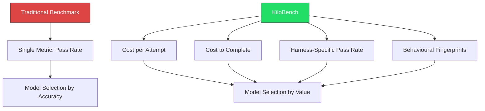
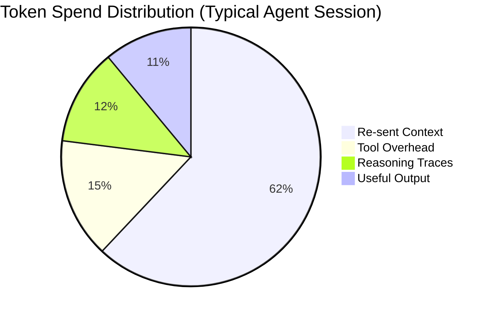

# KiloBench and the Cost-per-Task Revolution: What Harness-Aware Efficiency Benchmarks Mean for Codex CLI Model Selection


---

The coding agent benchmark landscape has quietly fractured. SWE-bench Verified scores now cluster within 1.3 percentage points across frontier models [^1], making the leaderboard functionally useless for procurement decisions. Terminal-Bench 2.1 added terminal-native task diversity but still reports a single pass-rate number [^2]. Neither answers the question that actually matters to engineering teams running Codex CLI in production: *which model delivers the most value per pound spent inside my specific agent harness?*

KiloBench, published on 8 June 2026 by the Kilo Code team, is the first benchmark designed to answer that question [^3]. This article unpacks what it measures, why its findings diverge sharply from accuracy-only leaderboards, and how to translate its insights into concrete Codex CLI configuration patterns.

## Why Accuracy-Only Benchmarks Mislead

The standard benchmark loop — run a model against a task set, report pass@1 — implicitly assumes that all successful completions cost the same. They do not. A model that explores extensively before acting, reading dozens of files and running speculative commands, burns context tokens that never appear in the final diff. A model that retries three times at $0.10 per attempt costs more than one that succeeds once at $0.40.

KiloBench's own analysis of production Kilo Code sessions found that re-sent context accounts for 62% of the total bill, with actual useful reasoning output comprising just 11% [^3]. That ratio holds across harnesses. Codex CLI sessions exhibit the same pattern: system prompts, tool definitions, MCP server schemas, reasoning traces, and context compaction all burn tokens invisibly [^4].

If your model selection strategy optimises for SWE-bench pass-rate alone, you are optimising for the 11% and ignoring the 62%.

## What KiloBench Actually Measures

KiloBench evaluates models across four dimensions that traditional benchmarks ignore [^3]:

### Cost per Attempt

The complete financial cost of a single task run, including reasoning tokens, context re-sending, tool-call overhead, and retries. This is not the headline per-token rate from the pricing page — it is the actual invoice line item.

### Cost to Complete

The total spend required to get one successful completion. A model with a 50% pass-rate at $0.10 per attempt has a cost-to-complete of $0.20 on average. A model with a 90% pass-rate at $0.40 per attempt has a cost-to-complete of $0.44. The cheaper-per-attempt model is not cheaper.

### Harness-Specific Pass Rate

The same model produces different results depending on the agent framework orchestrating it — the "harness effect" documented extensively in April 2026 [^5]. KiloBench runs every model through the Kilo Code harness specifically, rather than reporting model-only scores.

### Behavioural Fingerprints

Models exhibit distinct operational patterns. Some read extensively before writing, discovering more bugs but consuming additional tokens. Others act immediately with fewer reads. These behavioural traits only emerge through framework-specific testing and directly affect cost [^3].



## KiloBench Results: The Efficiency Surprise

The initial KiloBench leaderboard, drawn from 89 real-world Terminal-Bench tasks, reveals a striking inversion of the accuracy-only rankings [^6]:

| Model | Pass Rate | Cost per Attempt | Cost Efficiency Ratio |
|-------|-----------|-----------------|----------------------|
| GPT-5.5 | 74.2% | $72.63 | 1.0x (baseline) |
| Claude Opus 4.7 | 70.1% | $100.51 | 0.7x |
| Claude Opus 4.8 | 67.6% | $85.19 | 0.8x |
| Grok Build 0.1 | 50.6% | $30.70 | 1.6x |
| MiMo-V2.5-Pro | 47.6% | $4.92 | 9.5x |
| MiniMax M3 | 47.6% | $10.35 | 4.5x |

GPT-5.5 leads on raw accuracy, but MiMo-V2.5-Pro delivers nearly ten times the efficiency when measured by cost per percentage point of pass-rate [^6]. For tasks where a 47.6% first-attempt success rate is acceptable — lint passes, documentation generation, straightforward refactors — the open-weight model is an order of magnitude cheaper.

The Kilo leaderboard also tracks real developer usage patterns across 3 million users [^6]. Free and low-cost models like Laguna M.1 dominate actual usage across code, planning, and debugging modes despite lower benchmark scores. Developers vote with their wallets, and the votes do not align with SWE-bench rankings.

## Mapping KiloBench Insights to Codex CLI

Codex CLI's named profiles and model routing make it straightforward to apply cost-tiered model selection. The principle: **route by task economics, not by headline accuracy**.

### Profile Configuration for Cost-Tiered Routing

```toml
# ~/.codex/config.toml

# Tier 1: High-stakes tasks where first-attempt success matters
[profile.precision]
model = "gpt-5-codex"
reasoning_effort = "high"
# Cost per attempt: high, but cost-to-complete is lower for complex tasks

# Tier 2: Standard development — balance of cost and capability
[profile.standard]
model = "gpt-5.4-mini"
reasoning_effort = "medium"
# Good pass rate at moderate cost

# Tier 3: Bulk operations — lint, formatting, docs, simple refactors
[profile.bulk]
model = "o4-mini"
reasoning_effort = "low"
# Maximise throughput, accept retries
```

### Applying Profiles to Common Workflows

```bash
# Complex architecture review — use the precision tier
codex --profile precision "Review the authentication module for OWASP Top 10 vulnerabilities"

# Standard feature development — balance cost and quality
codex --profile standard "Add pagination to the /api/users endpoint with cursor-based navigation"

# Bulk formatting pass — cheap model, accept occasional retries
codex exec --profile bulk "Run biome check and fix all lint violations in src/"
```

### The codex exec Budget Envelope

For non-interactive automation, pair cost-tiered profiles with the `--max-turns` flag to cap runaway sessions:

```bash
# CI lint pass: bulk tier, hard stop after 5 turns
codex exec --profile bulk --max-turns 5 \
  "Fix all TypeScript strict-mode errors in src/"

# Code review: precision tier, structured output, budget-bounded
codex exec --profile precision --max-turns 10 \
  --output-schema ./review-schema.json \
  -o ./review-results.json \
  "Review the PR diff for security and correctness issues"
```

## Reducing the 62%: Context Waste Mitigation

KiloBench's finding that 62% of token spend is re-sent context [^3] maps directly to three Codex CLI configuration levers:

### 1. Prompt Caching

Codex CLI's exact-prefix prompt caching keeps cached input tokens at roughly 10% of the uncached rate [^7]. Structuring sessions so the system prompt, AGENTS.md content, and tool definitions remain stable across turns maximises cache hits:

```toml
# Stable prefix = higher cache hit rate
[profile.standard]
model = "gpt-5.4-mini"
reasoning_effort = "medium"
# Avoid changing system instructions mid-session
```

### 2. Context Compaction Thresholds

Long sessions trigger automatic context compaction, which reduces the carried context but costs a compaction turn. A compaction from 350K to 80K tokens saves approximately $1.35 per subsequent turn at standard rates [^8]. For bulk tasks, start fresh sessions rather than accumulating context:

```bash
# Prefer: fresh session per task in CI
for file in src/modules/*.ts; do
  codex exec --profile bulk "Add JSDoc comments to all exported functions in $file"
done

# Avoid: single session processing 50 files sequentially
```

### 3. Output Token Discipline

Output tokens cost 6–10x more than input tokens [^4]. Sessions generating verbose explanations burn credits faster than those returning targeted patches. AGENTS.md can enforce conciseness:

```markdown
<!-- AGENTS.md -->
## Response Style
- Return code changes as minimal diffs, not full file rewrites
- Skip explanations unless explicitly asked
- Never echo back the task description in your response
```



## The Harness Effect: Why Codex CLI Scores Differ

KiloBench measures models inside the Kilo Code harness. Codex CLI is a different harness with different orchestration patterns — its agent loop, sandbox model, tool pipeline, and context management all affect how a model performs [^5]. A model that scores 74% in Kilo Code will not necessarily score 74% in Codex CLI.

This means KiloBench results are directionally useful for Codex CLI users but not directly transferable. The relative cost-efficiency patterns — that cheaper models can deliver comparable value for simpler tasks — hold across harnesses. The absolute scores do not.

For Codex CLI-specific efficiency data, the `/usage` command introduced in v0.140.0 provides daily, weekly, and cumulative token tracking [^9]. Teams can build their own cost-per-task metrics by combining `/usage` data with task categorisation:

```bash
# Check current usage before and after a task
codex
# In session:
# /usage
# ... perform task ...
# /usage
# Delta = cost of that task
```

## Building a Team Cost Dashboard

For teams running Codex CLI at scale, combine the v0.140 `/usage` views with `codex exec --output-schema` to build automated cost tracking:

```json
{
  "type": "object",
  "properties": {
    "task_category": { "type": "string", "enum": ["review", "feature", "bugfix", "lint", "docs"] },
    "files_changed": { "type": "integer" },
    "estimated_complexity": { "type": "string", "enum": ["low", "medium", "high"] }
  },
  "required": ["task_category", "files_changed", "estimated_complexity"]
}
```

Over time, this produces the Codex CLI equivalent of KiloBench data: cost-per-task-category metrics specific to your harness, your codebase, and your team's usage patterns.

## Practical Recommendations

1. **Stop selecting models by SWE-bench score alone.** The top five models are within 1.3 points of each other. Cost-to-complete varies by 10x.

2. **Implement at least two named profiles** — one for high-stakes tasks (complex reviews, architecture decisions) and one for bulk operations (linting, formatting, documentation).

3. **Use `--max-turns` in all `codex exec` invocations.** Unbounded automation sessions are the primary source of cost overruns.

4. **Monitor with `/usage` weekly.** The v0.140 tracking views make token spend visible. What gets measured gets managed.

5. **Structure sessions for cache hits.** Stable system prompts and AGENTS.md content maximise prompt caching discounts of up to 90%.

6. **Prefer fresh sessions for independent tasks.** The 62% re-sent context overhead compounds in long sessions. Short, focused sessions waste less.

## What Comes Next

KiloBench is the first harness-aware efficiency benchmark, but it will not be the last. As FinOps practices mature for AI infrastructure, expect Codex CLI to surface cost-per-task metrics natively — the `/usage` views in v0.140 are the foundation. The teams that build cost-awareness into their model routing today will have a structural advantage when token budgets tighten.

The benchmark wars are over. The efficiency wars are just beginning.

## Citations

[^1]: KiloBench blog post, "Top SWE-bench Verified models score within 1.3 percentage points of each other (80.0%–80.9%)", [https://blog.kilo.ai/p/kilobench-because-your-benchmark](https://blog.kilo.ai/p/kilobench-because-your-benchmark)

[^2]: Terminal-Bench 2.1 results, Codex CLI on GPT-5.5 at 83.4%, [https://www.morphllm.com/best-ai-coding-agents-2026](https://www.morphllm.com/best-ai-coding-agents-2026)

[^3]: Brendan O'Leary, "KiloBench: Because Your Benchmark Score Doesn't Pay the Bill", Kilo Code Blog, 8 June 2026, [https://blog.kilo.ai/p/kilobench-because-your-benchmark](https://blog.kilo.ai/p/kilobench-because-your-benchmark)

[^4]: Codex CLI Performance Optimisation guide, token overhead analysis, [https://codex.danielvaughan.com/2026/04/08/codex-cli-performance-optimization/](https://codex.danielvaughan.com/2026/04/08/codex-cli-performance-optimization/)

[^5]: "The Harness Effect: Same Model, Different Tool, Different Score", Codex Knowledge Base, April 2026, [https://codex.danielvaughan.com/2026/04/19/the-harness-effect-same-model-different-tool-different-score/](https://codex.danielvaughan.com/2026/04/19/the-harness-effect-same-model-different-tool-different-score/)

[^6]: Kilo AI Leaderboard, live model rankings by real developer usage across 3M+ users, [https://kilo.ai/leaderboard](https://kilo.ai/leaderboard)

[^7]: Codex CLI prompt caching documentation, cached tokens at ~10% of uncached rate, [https://codex.danielvaughan.com/2026/04/21/codex-cli-prompt-caching-maximise-cache-hits-cost-reduction/](https://codex.danielvaughan.com/2026/04/21/codex-cli-prompt-caching-maximise-cache-hits-cost-reduction/)

[^8]: Codex CLI context compaction architecture, 350K-to-80K compaction saving ~$1.35/turn, [https://codex.danielvaughan.com/2026/03/31/codex-cli-context-compaction-architecture/](https://codex.danielvaughan.com/2026/03/31/codex-cli-context-compaction-architecture/)

[^9]: Codex CLI v0.140.0 release, `/usage` tracking views, [https://releasebot.io/updates/openai/codex](https://releasebot.io/updates/openai/codex)

[^10]: Mike Vizard, "Kilo Adds Benchmark to Identify Most Efficient AI Models for Coding", DevOps.com, June 2026, [https://devops.com/kilo-adds-benchmark-to-identify-most-efficient-ai-models-for-coding/](https://devops.com/kilo-adds-benchmark-to-identify-most-efficient-ai-models-for-coding/)
