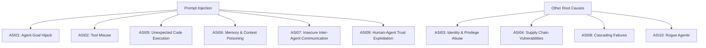
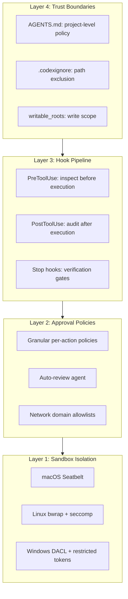

# The Prompt Injection Impossibility: What Two Formal Proofs and the OWASP Agentic Report Mean for Codex CLI's Defence Architecture


---

Within six weeks of each other, two independent research teams published formal proofs that prompt injection in AI agents cannot be fully solved. Abdelnabi and Bagdasarian's "AI Agents May Always Fall for Prompt Injections" (arXiv:2605.17634, May 2026) demonstrated that any defence tight enough to block all attacks will inevitably break legitimate agentic workflows[^1]. Bhatt et al.'s "Defense Trilemma" (arXiv:2604.06436, April 2026) proved — and mechanically verified in Lean 4 — that no continuous, utility-preserving wrapper defence can make all outputs strictly safe[^2]. Then, on 11 June 2026, the OWASP GenAI Security Project published its State of Agentic AI Security and Governance 2.01 report, documenting that prompt injection maps to six of the ten OWASP Top 10 risks for Agentic Applications[^3].

The message is stark: prompt injection is not a bug waiting for a patch. It is an architectural property of systems where instructions and data share the same token stream. This article examines what these results mean for practitioners running Codex CLI in production, and why Codex CLI's layered defence architecture is the correct response to an unfixable flaw.

## The Impossibility Results

### Contextual Integrity and the Abdelnabi–Bagdasarian Proof

The prevailing defence paradigm — data-instruction separation — assumes that a system can reliably distinguish between "follow this instruction" and "process this data." Abdelnabi and Bagdasarian reframe the problem through Helen Nissenbaum's Contextual Integrity (CI) theory, which judges information flows against contextual norms rather than fixed categories[^1].

Their core result: an agent's operating context inherently contains instructions everywhere. Memory retrieval is instructional. Tool invocation is instructional. Skill loading is instructional. A defender who tightens norms to block a malicious flow will always find that an adversary can construct a context under which the blocked flow appears legitimate — or that the tighter norms break genuinely acceptable flows[^1].

The paper identifies three attack mechanisms that exploit this:

1. **Misrepresenting information flow** — making malicious instructions appear to originate from a trusted source
2. **Manipulating norms** — exploiting ambiguity in what counts as acceptable behaviour in a given context
3. **Mixing multiple flows** — combining legitimate and malicious instructions so that blocking one disrupts the other

### The Defense Trilemma

Bhatt et al. approach the same problem from a different angle: mathematical topology. They prove that three desirable properties of any defence wrapper — continuity (small input changes produce small output changes), utility preservation (the defence does not degrade legitimate outputs), and completeness (all unsafe outputs are blocked) — cannot coexist[^2].

This is not a conjecture. The result was mechanically verified in Lean 4 and empirically validated across three production LLMs[^2]. It extends to multi-turn interactions, stochastic defences, and capacity-parity settings — ruling out the possibility that a sufficiently clever wrapper will eventually solve the problem.

### What Microsoft Found in Practice

Microsoft's "When Prompts Become Shells" research (May 2026) provided the practitioner's version of these theoretical results. Two Critical-severity CVEs (CVE-2026-25592 and CVE-2026-26030) in Semantic Kernel demonstrated that once an LLM connects to tools, prompt injection escalates from a content security problem to a direct path to remote code execution[^4]. A single crafted prompt launched `calc.exe` on the host running the agent[^4].

## The OWASP Data: Prompt Injection Drives Most Failures

The OWASP State of Agentic AI Security 2.01 report quantifies the production impact. Of the ten OWASP Top 10 risks for Agentic Applications (ASI01–ASI10), prompt injection maps to six[^3]:



The report also notes that 28 of 53 tracked agentic projects are coding agents, and the five fastest-growing tools — Claude Code, Gemini CLI, Codex, Cline, and Aider — are all in this category[^3]. Coding agents present the sharpest attack surface because they combine all three elements of Simon Willison's "lethal trifecta": access to private data (source code, credentials), exposure to untrusted content (dependencies, issues, web search results), and the ability to take external action (file writes, shell commands, network calls)[^3].

## Why Defence-in-Depth Is the Only Viable Architecture

If prompt injection cannot be eliminated, the engineering question becomes: how do you build a system that remains safe despite successful injections? The answer is defence-in-depth — multiple independent layers, each of which limits the blast radius of a breach in any other layer.

Codex CLI's architecture maps directly to this principle:



### Layer 1: Sandbox Isolation

The sandbox is the layer of last resort — it constrains what a compromised agent can physically do, regardless of what it has been instructed to do. Codex CLI's default `workspace-write` mode limits file writes to the active workspace and disables network access entirely[^5]. On macOS, this uses Apple's Seatbelt sandbox; on Linux, bubblewrap with seccomp filters; on Windows, restricted tokens under dedicated `CodexSandboxOffline` and `CodexSandboxOnline` accounts with firewall rules denying outbound traffic[^6].

This directly mitigates the Microsoft "prompts become shells" scenario: even if prompt injection achieves code execution, the sandbox prevents that code from reaching the network or writing outside the workspace.

### Layer 2: Approval Policies

Approval policies enforce human oversight at the points where the impossibility results predict failures will concentrate — tool invocations and state-mutating operations. The granular policy system allows selective auto-approval for read-only operations while requiring human confirmation for writes, shell commands, and network access[^5].

The optional auto-review agent adds a second LLM pass that evaluates approval requests for data exfiltration, credential probing, persistent security weakening, and destructive actions[^5]. This is not a prompt injection defence per se — the impossibility results tell us it cannot be one — but it raises the bar for exploitation significantly.

### Layer 3: Hook Pipeline

Hooks provide programmable inspection points that execute synchronously before and after tool calls. A `PreToolUse` hook can inspect the tool name, arguments, and context, then approve, reject, or modify the call[^7]. A `PostToolUse` hook can audit the result, inject system messages, or halt the session[^7].

```json
{
  "hooks": {
    "PreToolUse": [{
      "matcher": "Bash",
      "hooks": [{
        "type": "command",
        "command": "python3 ~/.codex/hooks/block_exfil.py",
        "statusMessage": "Checking for data exfiltration patterns",
        "timeout": 30
      }]
    }],
    "PostToolUse": [{
      "matcher": "*",
      "hooks": [{
        "type": "command",
        "command": "python3 ~/.codex/hooks/audit_output.py",
        "statusMessage": "Auditing tool output"
      }]
    }]
  }
}
```

Hooks are the most direct application of the contextual integrity framework. Rather than trying to separate data from instructions (which the impossibility results show cannot work), hooks enforce contextual norms: "regardless of what instructions the model received, a Bash command must not curl to an external domain" or "regardless of context, no tool call may write to `.env` files."

### Layer 4: Trust Boundaries

AGENTS.md files, `.codexignore` patterns, and `writable_roots` configuration establish project-level trust boundaries that constrain the agent's understanding of what is acceptable[^5]. These are soft defences — they operate at the instruction level, which the impossibility results tell us can be subverted — but they reduce the attack surface by limiting what the agent considers in scope.

## The Practical Takeaway: Accept the Impossibility, Engineer the Layers

The two impossibility proofs do not mean security is hopeless. They mean that any single-layer defence — whether it is a prompt filter, an instruction-data separator, or a fine-tuned classifier — will eventually fail. The correct engineering response is:

1. **Never rely on a single layer.** The sandbox must assume hooks will fail. Hooks must assume approval policies will be bypassed. Approval policies must assume the sandbox is the last line.

2. **Prefer hard constraints over soft ones.** Sandbox restrictions (filesystem ACLs, network firewall rules, seccomp filters) cannot be subverted by prompt injection. Favour these over instruction-level defences wherever possible.

3. **Audit rather than prevent.** PostToolUse hooks and session transcripts provide forensic capability even when prevention fails. The OWASP report notes that only 37% of organisations have policies to detect shadow AI[^3] — structured audit trails close this gap.

4. **Apply Meta's Rule of Two.** Autonomous agents without human approval can safely have access to private data and exposure to untrusted content, but not the ability to take external action — or any two of the three, but never all three simultaneously[^3]. Map your Codex CLI approval policies accordingly.

A minimal hardened `config.toml` profile that applies these principles:

```toml
[profile.hardened]
model = "o4-mini"
approval_policy = "on-request"
sandbox = "workspace-write"
disable_network = true

[profile.hardened.hooks]
enabled = true
```

## Conclusion

The prompt injection impossibility is not a failure of current defences — it is a fundamental property of systems where natural language serves as both the control plane and the data plane. Abdelnabi and Bagdasarian proved it through contextual integrity theory. Bhatt et al. proved it through mathematical topology. Microsoft demonstrated it in production.

Codex CLI's four-layer defence architecture — sandbox isolation, approval policies, hook pipelines, and trust boundaries — is the correct engineering response. Not because any single layer is unbreakable, but because the combination ensures that a successful prompt injection must simultaneously defeat filesystem ACLs, human oversight, programmatic inspection, and project-level policy to cause harm. That is a vastly harder problem than defeating any one of them.

The impossibility results tell us to stop searching for a silver bullet and start engineering resilient systems. Codex CLI's architecture already does this. The practitioner's job is to configure every layer.

## Citations

[^1]: Abdelnabi, S. and Bagdasarian, E. (2026) "AI Agents May Always Fall for Prompt Injections." arXiv:2605.17634. Available at: [https://arxiv.org/abs/2605.17634](https://arxiv.org/abs/2605.17634)

[^2]: Bhatt, M. et al. (2026) "The Defense Trilemma: Why Prompt Injection Defense Wrappers Fail?" arXiv:2604.06436. Available at: [https://arxiv.org/abs/2604.06436](https://arxiv.org/abs/2604.06436)

[^3]: OWASP GenAI Security Project (2026) "State of Agentic AI Security and Governance 2.01." Published 11 June 2026. As reported by Help Net Security: [https://www.helpnetsecurity.com/2026/06/11/owasp-prompt-injection-ai-security-failures/](https://www.helpnetsecurity.com/2026/06/11/owasp-prompt-injection-ai-security-failures/)

[^4]: Microsoft Security Blog (2026) "When prompts become shells: RCE vulnerabilities in AI agent frameworks." Published 7 May 2026. Available at: [https://www.microsoft.com/en-us/security/blog/2026/05/07/prompts-become-shells-rce-vulnerabilities-ai-agent-frameworks/](https://www.microsoft.com/en-us/security/blog/2026/05/07/prompts-become-shells-rce-vulnerabilities-ai-agent-frameworks/)

[^5]: OpenAI (2026) "Agent approvals & security — Codex CLI." Available at: [https://developers.openai.com/codex/agent-approvals-security](https://developers.openai.com/codex/agent-approvals-security)

[^6]: InfoQ (2026) "How OpenAI Built a Secure Windows Sandbox for Codex Agents." Published June 2026. Available at: [https://www.infoq.com/news/2026/06/codex-windows-sandbox-design/](https://www.infoq.com/news/2026/06/codex-windows-sandbox-design/)

[^7]: OpenAI (2026) "Hooks — Codex CLI." Available at: [https://developers.openai.com/codex/hooks](https://developers.openai.com/codex/hooks)
