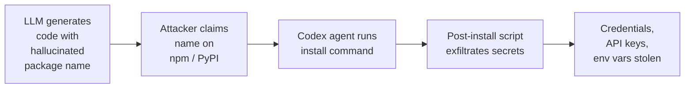
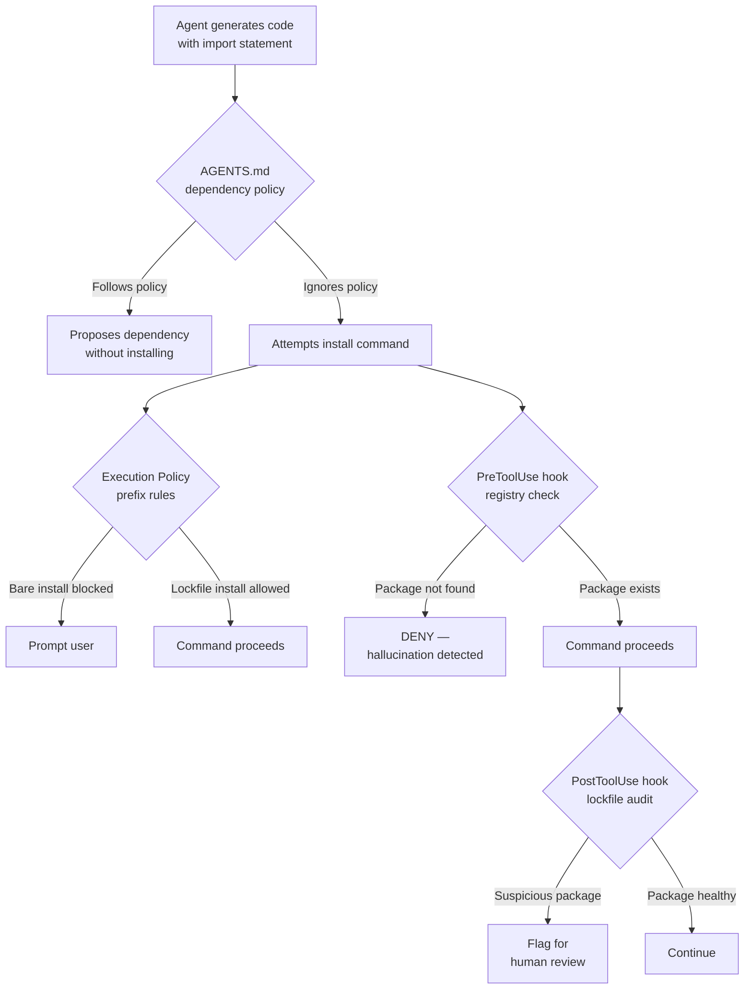

# Slopsquatting: How Hallucinated Packages Become Supply Chain Weapons and Five Codex CLI Defences That Stop Them


---

## The Threat That Ships With Every AI-Generated Import Statement

Every code-generating language model hallucinates package names. Not occasionally — routinely. A May 2026 study testing five frontier models (Claude Sonnet 4.6, Claude Haiku 4.5, GPT-5.4-mini, Gemini 2.5 Pro, and DeepSeek V3.2) found hallucination rates between 4.62% and 6.10% of suggested packages [^1]. An earlier large-scale analysis of 2.23 million code samples identified 440,445 samples (19.7%) containing at least one fabricated package name, yielding 205,474 unique phantom dependencies [^2].

Attackers noticed. **Slopsquatting** — registering the package names that LLMs repeatedly hallucinate — has moved from theoretical risk to confirmed supply chain attack vector [^3]. Unlike traditional typosquatting, which preys on fat-finger keyboard mistakes, slopsquatting exploits the model's confident but fabricated recommendations. The hallucinated names look nothing like legitimate packages, yet they appear with alarming consistency: researchers found 43% of hallucinated names reappeared on every single re-run of identical prompts [^2].

For teams using Codex CLI, the attack surface compounds. An agent running in `workspace-write` or `full-access` mode can execute `npm install` or `pip install` commands autonomously. If the model hallucinates a dependency and an attacker has already claimed that name on the relevant registry, the malicious payload lands in your `node_modules` or site-packages before any human reviews the change.

This article documents the slopsquatting kill chain, quantifies the current threat landscape, and provides five concrete Codex CLI defence patterns that intercept hallucinated packages before they execute.

---

## The Slopsquatting Kill Chain



The attack unfolds in three phases:

1. **Hallucination**: The model suggests a plausible but non-existent package — often a conflation of two real packages (38% of cases), a typo variant (13%), or a pure fabrication (51%) [^3].
2. **Claim**: The attacker registers the hallucinated name on the target registry. The May 2026 frontier-model study identified 127 package names that all five tested models hallucinated identically; after coordinated disclosure, 53 remained registrable (41 on PyPI, 12 on npm) [^1].
3. **Execution**: When the coding agent or developer installs the package, a post-install script exfiltrates environment variables, API keys, cloud tokens, and Git credentials.

### Real-World Incidents

The `huggingface-cli` package — a hallucinated name conflating `huggingface_hub` with its CLI interface — accumulated over 30,000 downloads in three months before being flagged [^3]. The `react-codeshift` package (a conflation of `jscodeshift` and `react-codemod`) propagated through 237 repositories via AI-generated agent skills, driven by autonomous agents executing their own outputs [^3]. The `unused-imports` package maintained 233 weekly downloads by mimicking the legitimate `eslint-plugin-unused-imports` [^3].

### Cross-Registry Confusion

The threat extends beyond single registries. Research found 8.7% of hallucinated Python package names actually exist as legitimate JavaScript packages on npm [^1], creating opportunities for cross-ecosystem confusion where a model trained on polyglot codebases suggests the wrong ecosystem's package.

---

## Why Coding Agents Amplify the Risk

Traditional slopsquatting requires a human developer to blindly trust the suggestion. Coding agents remove that friction entirely:

- **Autonomous execution**: In permissive sandbox modes, Codex CLI can run `npm install phantom-package` without prompting.
- **Chained hallucinations**: A model may hallucinate a package in generated code, then immediately install it in a follow-up shell command.
- **Agent-to-agent propagation**: When agents generate skills, templates, or starter projects, hallucinated dependencies propagate to downstream consumers — the `react-codeshift` pattern [^3].
- **CI/CD amplification**: `codex exec` pipelines running in CI may install dependencies headlessly, bypassing the approval prompt entirely.

The CSA research quantified the enterprise impact: AI-assisted developers at Fortune 50 companies saw security findings surge from approximately 1,000 to over 10,000 per month, with privilege escalation paths increasing 322% [^4].

---

## Five Codex CLI Defences

### Defence 1: PreToolUse Hook — Package Install Gate

The most direct defence intercepts `npm install`, `pip install`, `go get`, and similar commands before they execute. A PreToolUse hook receives the proposed command as JSON, validates the package names against a registry check, and returns `deny` if any package appears suspicious.

```python
#!/usr/bin/env python3
"""PreToolUse hook: blocks install commands containing unverifiable packages."""

import json
import re
import subprocess
import sys

INSTALL_PATTERNS = [
    (r"^npm\s+install\s+", "npm"),
    (r"^yarn\s+add\s+", "npm"),
    (r"^pnpm\s+add\s+", "npm"),
    (r"^pip\s+install\s+", "pypi"),
    (r"^pip3\s+install\s+", "pypi"),
    (r"^uv\s+pip\s+install\s+", "pypi"),
]

def check_npm_exists(pkg: str) -> bool:
    """Check whether an npm package exists on the registry."""
    result = subprocess.run(
        ["npm", "view", pkg, "name"],
        capture_output=True, timeout=10
    )
    return result.returncode == 0

def check_pypi_exists(pkg: str) -> bool:
    """Check whether a PyPI package exists."""
    result = subprocess.run(
        ["pip", "index", "versions", pkg],
        capture_output=True, timeout=10
    )
    return result.returncode == 0

CHECKERS = {"npm": check_npm_exists, "pypi": check_pypi_exists}

def main():
    payload = json.load(sys.stdin)
    command = payload.get("tool_input", {}).get("command", "")

    for pattern, registry in INSTALL_PATTERNS:
        match = re.search(pattern, command)
        if not match:
            continue
        # Extract package names (strip flags starting with -)
        remainder = command[match.end():]
        packages = [t for t in remainder.split() if not t.startswith("-")]
        checker = CHECKERS.get(registry)
        if not checker:
            continue
        for pkg in packages:
            pkg_name = re.split(r"[@>=<~^]", pkg)[0]
            if not pkg_name:
                continue
            if not checker(pkg_name):
                output = {
                    "hookSpecificOutput": {
                        "hookEventName": "PreToolUse",
                        "permissionDecision": "deny",
                        "permissionDecisionReason":
                            f"Package '{pkg_name}' not found on {registry}. "
                            f"Possible hallucinated dependency (slopsquatting risk)."
                    }
                }
                json.dump(output, sys.stdout)
                return

    # Allow if no install commands or all packages verified
    output = {
        "hookSpecificOutput": {
            "hookEventName": "PreToolUse",
            "permissionDecision": "allow"
        }
    }
    json.dump(output, sys.stdout)

if __name__ == "__main__":
    main()
```

Register the hook in your project's `.codex/config.toml`:

```toml
[[hooks.PreToolUse]]
matcher = "^Bash$"

[[hooks.PreToolUse.hooks]]
type = "command"
command = 'python3 .codex/hooks/package_install_gate.py'
timeout = 30
statusMessage = "Verifying package names against registry"
```

⚠️ Note: The registry check adds latency (up to 10 seconds per package). For faster feedback in CI, consider maintaining a local allowlist instead.

### Defence 2: Execution Policy Prefix Rules — Lockfile-Only Installs

Codex CLI's Starlark-based execution policy can enforce that install commands always use lockfile-frozen versions, blocking bare `npm install <package>` while allowing `npm ci`:

```python
# ~/.codex/rules/dependency-install.rules

# Allow lockfile-based installs (frozen dependencies)
prefix_rule(
    pattern=["npm", "ci"],
    decision="allow"
)

prefix_rule(
    pattern=["pip", "install", "-r", "requirements.txt", "--no-deps"],
    decision="allow"
)

# Block ad-hoc package installation
prefix_rule(
    pattern=["npm", "install"],
    decision="prompt"
)

prefix_rule(
    pattern=["pip", "install"],
    decision="prompt"
)

prefix_rule(
    pattern=["yarn", "add"],
    decision="prompt"
)
```

This forces the agent to prompt before adding any new dependency, whilst allowing lockfile-based installs to proceed automatically [^5].

### Defence 3: AGENTS.md Dependency Policy

Encode your project's dependency governance directly in `AGENTS.md` so the model understands the constraints before generating code:

```markdown
## Dependency Policy

- NEVER suggest or install packages not already in package.json / requirements.txt
- When a new dependency is genuinely needed, ADD it to a "proposed dependencies"
  section in your response — do NOT run the install command
- For npm: use ONLY packages with >1,000 weekly downloads and >6 months of history
- For Python: use ONLY packages listed on https://pypi.org with a verified publisher
- When suggesting imports, VERIFY the exact package name matches the registry
- NEVER conflate package names (e.g., do not suggest "huggingface-cli" when
  you mean "huggingface_hub")
```

This leverages the model's instruction-following to reduce hallucinations at source. It does not eliminate the risk — models can still hallucinate despite instructions — but it materially reduces the probability [^6].

### Defence 4: PostToolUse Hook — Lockfile Diff Auditor

Even if an install command passes the PreToolUse gate (perhaps the hallucinated name was already claimed on the registry), a PostToolUse hook can audit the lockfile diff to flag newly introduced packages with suspicious characteristics:

```toml
[[hooks.PostToolUse]]
matcher = "^Bash$"

[[hooks.PostToolUse.hooks]]
type = "command"
command = 'python3 .codex/hooks/lockfile_audit.py'
timeout = 60
statusMessage = "Auditing lockfile changes"
```

The audit script inspects `git diff` on lockfiles (`package-lock.json`, `yarn.lock`, `poetry.lock`, `uv.lock`) and flags packages that:

- Were published in the last 30 days
- Have fewer than 100 weekly downloads
- Lack a verified publisher badge
- Have a single maintainer account created recently

### Defence 5: Sandbox Network Isolation

The most robust defence prevents the attack entirely by denying network access during code generation phases:

```toml
[sandbox]
mode = "workspace-write"
network = false
```

With `network = false`, any `npm install` or `pip install` command fails immediately [^7]. The workflow becomes:

1. Agent generates code and proposes dependencies (no network)
2. Human reviews the dependency list
3. Human or a separate approved CI step installs dependencies

This is the highest-friction option but eliminates the autonomous-install attack vector completely.

---

## Defence Architecture



The five defences form concentric layers. No single layer is sufficient — models can hallucinate names that happen to exist on the registry, and existing packages can be malicious. Defence in depth is the only reliable strategy.

---

## Quantifying the Residual Risk

Even with all five defences active, residual risk remains:

| Scenario | Defence that catches it |
|---|---|
| Model hallucinates a name not on any registry | PreToolUse hook (Defence 1) |
| Model hallucinates a name already claimed by attacker | PostToolUse lockfile audit (Defence 4) |
| Attacker publishes a plausible package with healthy-looking metadata | AGENTS.md policy + human review (Defence 3 + 5) |
| Agent bypasses AGENTS.md and runs install in a subshell | Execution policy prefix rules (Defence 2) |
| CI pipeline runs `codex exec` headlessly | Network isolation (Defence 5) in CI profile |

The combination of all five layers reduces the attack surface to a narrow window: a hallucinated name that has been proactively claimed by an attacker, maintained long enough to pass age checks, and accumulated enough downloads to evade the PostToolUse audit. This is a significantly more expensive attack to sustain.

---

## Configuration Checklist

1. **Deploy the PreToolUse package gate hook** in `.codex/hooks/` and register it in `config.toml`
2. **Add execution policy prefix rules** that require lockfile-based installs (`npm ci`, `pip install --no-deps`)
3. **Encode dependency policy in AGENTS.md** — no ad-hoc installs, verify names before suggesting
4. **Deploy the PostToolUse lockfile auditor** to catch packages that pass the registry check but have suspicious metadata
5. **Use network isolation** (`sandbox.network = false`) for `codex exec` CI profiles where dependencies are pre-installed
6. **Pin your lockfiles** — ensure `package-lock.json`, `poetry.lock`, or `uv.lock` is committed and any modification triggers a review
7. **Run SCA scanning** (Snyk, Grype, or `npm audit`) as a PostToolUse hook or CI gate

---

## Citations

[^1]: Churilov, A. (2026). "The Range Shrinks, the Threat Remains: Re-evaluating LLM Package Hallucinations on the 2026 Frontier-Model Cohort." arXiv:2605.17062. [https://arxiv.org/abs/2605.17062](https://arxiv.org/abs/2605.17062)

[^2]: Lanyado, B. et al. (2025). "We Have a Package for You! A Comprehensive Analysis of Package Hallucinations by Code Generating LLMs." arXiv:2406.10279. Cited in CSA Research Note, April 2026. [https://labs.cloudsecurityalliance.org/research/csa-research-note-slopsquatting-ai-supply-chain-20260419-csa/](https://labs.cloudsecurityalliance.org/research/csa-research-note-slopsquatting-ai-supply-chain-20260419-csa/)

[^3]: Aikido Security. (2026). "Slopsquatting: The AI Package Hallucination Attack Already Happening." [https://www.aikido.dev/blog/slopsquatting-ai-package-hallucination-attacks](https://www.aikido.dev/blog/slopsquatting-ai-package-hallucination-attacks)

[^4]: Cloud Security Alliance. (2026). "Vibe Coding's Security Debt: The AI-Generated CVE Surge." CSA Research Note, April 2026. [https://labs.cloudsecurityalliance.org/research/csa-research-note-ai-generated-code-vulnerability-surge-2026/](https://labs.cloudsecurityalliance.org/research/csa-research-note-ai-generated-code-vulnerability-surge-2026/)

[^5]: OpenAI. (2026). "Agent approvals & security — Codex CLI." OpenAI Developers Documentation. [https://developers.openai.com/codex/agent-approvals-security](https://developers.openai.com/codex/agent-approvals-security)

[^6]: OpenAI. (2026). "Hooks — Codex CLI." OpenAI Developers Documentation. [https://developers.openai.com/codex/hooks](https://developers.openai.com/codex/hooks)

[^7]: OpenAI. (2026). "Sandbox — Codex CLI." OpenAI Developers Documentation. [https://developers.openai.com/codex/concepts/sandboxing](https://developers.openai.com/codex/concepts/sandboxing)
