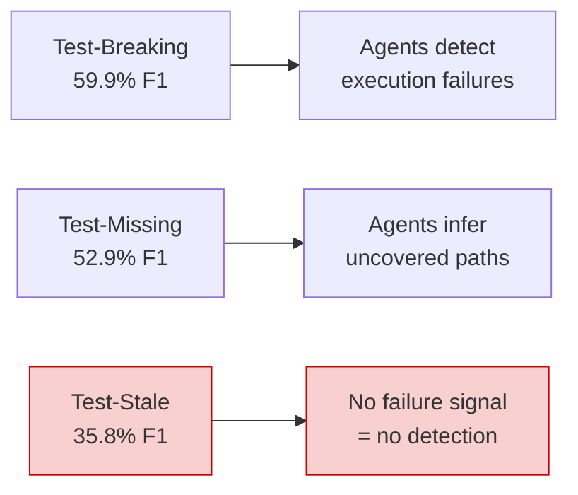
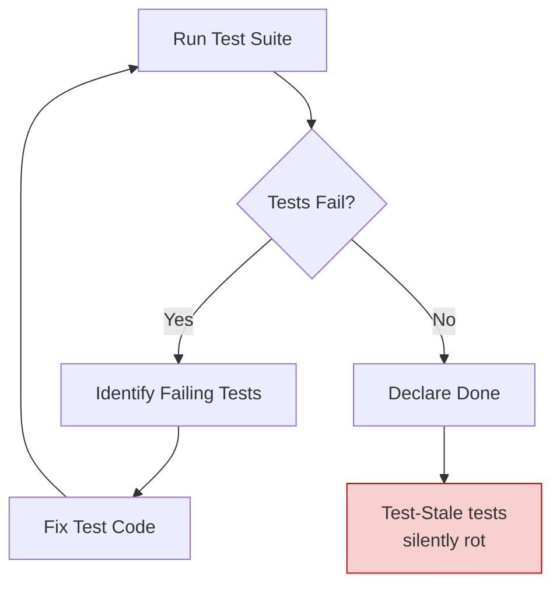

# TEBench and the Test-Stale Blind Spot: What the First Test Evolution Benchmark Means for Codex CLI Test Maintenance


---

Production code changes. Tests must follow. This has always been one of the least glamorous responsibilities in software engineering, and the arrival of coding agents promised to automate it. TEBench, the first project-level benchmark for test evolution published on 7 May 2026, tested that promise rigorously — and found a structural blind spot that every Codex CLI team should understand before trusting an agent with test maintenance [^1].

## What TEBench Measures

TEBench (arXiv:2605.06125) evaluates whether coding agents can autonomously manage the three ways a test suite must evolve after production code changes [^1]:

- **Test-Breaking** — tests that now fail because the code they exercise has changed.
- **Test-Stale** — tests that still pass but no longer meaningfully validate the updated behaviour. The assertions are outdated, yet execution produces no failure signal.
- **Test-Missing** — new tests required for introduced behaviour that the existing suite never covered.

The benchmark curates 314 task instances from 10 Defects4J projects, each annotated with developer-written ground truth [^1]. Unlike method-level test generation benchmarks such as EvoSuite or Randoop, TEBench requires agents to start from a full repository, identify *which* tests are affected, and produce the correct patch — the same workflow a human developer follows after merging a feature branch.

## How the Agents Performed

Shang et al. evaluated three industrial coding agent frameworks — Claude Code, Codex CLI, and OpenCode — across six base model variants plus a heuristic baseline [^1]. The headline results expose both a ceiling and a blind spot.

### Identification: Finding Which Tests Need Work



All seven configurations converged within a 3.7 percentage-point band (45.7–49.4% overall F1), with Codex CLI achieving the highest identification F1 at 49.4% [^1]. The convergence itself is the finding: the bottleneck is not the framework or the model but the *inherent difficulty of project-level test identification* [^1].

**By evolution type:**

| Evolution Type | Average F1 | Best | Notes |
|---------------|-----------|------|-------|
| Test-Breaking | 59.9% | 60.7% (OpenCode GLM) | Execution failures guide the agent |
| Test-Missing | 52.9% | 54.3% (OpenCode Qwen) | Partial coverage inference works |
| Test-Stale | 35.8% | 37.4% (Codex CLI) | No failure signal — agents are nearly blind |

Every configuration exhibited a recall-over-precision imbalance of 9.1–17.8 percentage points, systematically over-predicting the set of affected tests [^1]. On single-method tasks, this collapsed precision to 13.6% as agents predicted roughly 3.6 methods against a ground truth of one [^1].

### Update Quality: Generating the Correct Patch

Codex CLI posted the highest composite update score at 72.3%, driven by near-perfect executability (99.2%) and strong coverage overlap [^1]:

| Metric | Codex CLI | Claude Code | Best OpenCode |
|--------|----------|------------|--------------|
| Executability | 99.2% | 96.4% | 98.7% (Qwen) |
| Coverage Overlap | 87.1% | 90.2% | 85.5% (Sonnet) |
| Modification Similarity | 42.1% | 39.8% | 70.9% (Kimi) |
| Composite | **72.3%** | 69.1% | 68.4% (Qwen) |

The gap between executability and modification similarity (33.7–48.9 percentage points within each configuration) is the critical insight: *high executability masks substantial divergence from developer intent* [^1]. A generated test can compile and pass whilst testing something subtly different from what the developer intended.

## The Reactive Execute-Fail-Fix Loop

TEBench's analysis reveals the fundamental failure mode. Current coding agents operate in a reactive **execute-fail-fix** loop [^1]:



This loop works well for Test-Breaking (59.9% F1) because execution failures provide a direct signal. It partially works for Test-Missing because coverage analysis can reveal gaps. But it *structurally cannot address* Test-Stale because stale tests still pass — no failure signal means no trigger for the loop [^1].

The jsoup case study (Task 293) in the paper illustrates this precisely: a 12-line production change affected 5 test methods across 3 files. All three frameworks fixed the breaking tests correctly. **None identified the stale test** — an `unwrap` method test that passed but no longer validated the updated semantics. Only Codex CLI attempted the missing tests, covering just one of three required scenarios [^1].

## What This Means for Codex CLI Configuration

TEBench's findings map directly to five Codex CLI configuration patterns that address the identified gaps.

### 1. AGENTS.md: Declare a Test Evolution Policy

The default agent behaviour is reactive because the default instructions say nothing about proactive test review. Add an explicit test evolution section to your project's `AGENTS.md`:

```markdown
## Test Evolution Policy

When modifying production code:

1. **Before running tests**, identify all test files that reference changed
   modules, classes, or methods — including transitive dependants.
2. **After tests pass**, review each identified test for staleness: does
   every assertion still validate the *current* intended behaviour, not
   just the previous behaviour that happens to produce the same output?
3. **Check coverage** for new branches, paths, or public API surface
   introduced by the change. Write tests for uncovered behaviour.
4. Flag any test you cannot confidently classify as current, stale, or
   missing — do not silently skip it.
```

This transforms the agent's approach from "run tests and fix failures" to "identify, review, then run" — exactly the proactive reasoning TEBench found missing [^1].

### 2. PostToolUse Hook: Enforce Coverage Delta Checks

TEBench showed that coverage overlap is a useful but insufficient signal [^1]. A PostToolUse hook can enforce coverage delta analysis after every test run:

```toml
# .codex/config.toml
[[hooks]]
event = "PostToolUse"
command = ".codex/hooks/coverage-delta.sh"
```

```bash
#!/usr/bin/env bash
# .codex/hooks/coverage-delta.sh
# Runs after tool execution; checks coverage delta on test commands

INPUT=$(cat)
TOOL=$(echo "$INPUT" | jq -r '.tool_name // empty')
CMD=$(echo "$INPUT" | jq -r '.input.command // empty')

# Only trigger on test commands
if [[ "$TOOL" != "shell" ]] || [[ "$CMD" != *"test"* && "$CMD" != *"pytest"* && "$CMD" != *"mvn verify"* ]]; then
  echo '{"decision":"approve"}'
  exit 0
fi

# Check for coverage report
if [[ -f "target/site/jacoco/jacoco.csv" ]]; then
  UNCOVERED=$(awk -F, 'NR>1 && $4+$5>0 && $5/($4+$5)<0.8 {print $2"."$3}' \
    target/site/jacoco/jacoco.csv | head -10)
  if [[ -n "$UNCOVERED" ]]; then
    echo "{\"decision\":\"approve\",\"message\":\"Coverage gaps detected in: ${UNCOVERED}. Review for Test-Missing scenarios before completing.\"}"
    exit 0
  fi
fi

echo '{"decision":"approve"}'
exit 0
```

### 3. Named Profiles: Separate Test Maintenance from Feature Work

TEBench found that medium-scale changes (20–55 lines) achieved the highest identification F1 (52.1%), forming an inverted-U pattern [^1]. Small diffs provide insufficient context; large diffs create information overload. Use a dedicated profile with higher reasoning effort for test maintenance:

```toml
# .codex/config.toml
[profiles.test-maintenance]
model = "gpt-5.4"
model_reasoning_effort = "high"
sandbox_mode = "workspace-write"

[profiles.test-maintenance.instructions]
developer = """
You are performing test evolution review. For every production code change:
1. Map all test files with direct or transitive dependencies on changed code.
2. Classify each as Breaking, Stale, or Missing per TEBench taxonomy.
3. Stale tests pass but test outdated behaviour — reason about semantic
   correctness, not just execution status.
4. Generate minimal, targeted patches. Avoid over-prediction.
"""
```

Invoke it explicitly:

```bash
codex --profile test-maintenance \
  "Review the test suite impact of changes in src/main/java/com/example/parser/"
```

### 4. Subagent Delegation: Static Analysis + Semantic Review

TEBench's heuristic baseline achieved 66.1% recall through static dependency analysis but only 2.0% precision [^1]. The paper recommends integrating static analysis with LLM semantic reasoning [^1]. A two-subagent pattern maps this directly:

```toml
# .codex/agents/test-mapper.toml
name = "test_mapper"
description = "Static dependency mapper for test evolution analysis."
model = "gpt-5.4-mini"
model_reasoning_effort = "medium"
sandbox_mode = "read-only"
developer_instructions = """
Analyse import graphs and call chains to map all test files with direct
or transitive dependencies on the changed production code. Output a JSON
list of {file, method, dependency_type} entries. Do NOT assess correctness
— only map structural dependencies.
"""
```

```toml
# .codex/agents/test-reviewer.toml
name = "test_reviewer"
description = "Semantic test evolution reviewer."
model = "gpt-5.4"
model_reasoning_effort = "high"
sandbox_mode = "workspace-write"
developer_instructions = """
Given a dependency map and production diff, classify each test as:
- CURRENT: assertions correctly validate updated behaviour
- STALE: test passes but assertions validate outdated behaviour
- BREAKING: test fails due to production changes
- MISSING: new behaviour lacks test coverage
For STALE tests, explain specifically which assertion is outdated and why.
Generate patches for BREAKING, STALE, and MISSING tests.
"""
```

### 5. PreToolUse Hook: Scope Calibration Guard

TEBench's most counter-intuitive finding: single-method tasks had the *lowest* identification F1 (22.7%) because agents over-predicted scope [^1]. A PreToolUse hook can catch this:

```toml
[[hooks]]
event = "PreToolUse"
command = ".codex/hooks/scope-guard.sh"
```

```bash
#!/usr/bin/env bash
# .codex/hooks/scope-guard.sh
# Warns when test modifications exceed a threshold relative to production changes

INPUT=$(cat)
TOOL=$(echo "$INPUT" | jq -r '.tool_name // empty')

if [[ "$TOOL" != "apply_patch" ]]; then
  echo '{"decision":"approve"}'
  exit 0
fi

PATCH=$(echo "$INPUT" | jq -r '.input.patch // empty')
TEST_FILES=$(echo "$PATCH" | grep -c '^\+\+\+ .*[Tt]est.*')
PROD_CHANGES=$(git diff --stat HEAD~1 -- 'src/main/' 2>/dev/null | tail -1 | \
  grep -oP '\d+ insertion' | grep -oP '\d+')

if [[ "$TEST_FILES" -gt 5 && "${PROD_CHANGES:-0}" -lt 20 ]]; then
  echo "{\"decision\":\"approve\",\"message\":\"Warning: ${TEST_FILES} test files modified for only ${PROD_CHANGES:-unknown} lines of production changes. TEBench data shows over-prediction on small diffs collapses precision to 13.6%. Verify each test file is genuinely affected.\"}"
  exit 0
fi

echo '{"decision":"approve"}'
exit 0
```

## The Bigger Picture: Why High Executability Is Not Enough

The most important takeaway from TEBench is that *a passing test suite is not evidence of correct test evolution*. Codex CLI's 99.2% executability score sounds impressive until you note the 42.1% modification similarity [^1]. More than half the generated test modifications diverged substantially from what the developer intended, even though they compiled and passed.

This has direct implications for how teams review agent-generated test patches:

1. **Do not merge test changes on green alone.** Review the semantic intent of each assertion, not just the CI status.
2. **Mutation testing** (e.g., PIT for Java, mutmut for Python) provides an execution-independent quality signal that can catch stale tests where standard coverage cannot [^2].
3. **Coverage overlap** (the percentage of production branches exercised by both generated and reference tests) is a better proxy than line coverage for test evolution quality [^1].

## Conclusion

TEBench demonstrates that Codex CLI leads the current generation of coding agents on test evolution tasks — but "leads" still means missing two-thirds of stale tests and over-predicting scope on small changes. The reactive execute-fail-fix loop that powers today's agents is architecturally unable to detect tests that pass but no longer validate the right behaviour.

The five configuration patterns above — explicit AGENTS.md test evolution policy, PostToolUse coverage hooks, dedicated test-maintenance profiles, static-analysis subagent delegation, and scope calibration guards — address each of TEBench's identified failure modes through Codex CLI's existing extension points. None requires waiting for a model upgrade. All can be committed to your repository today.

The benchmark's authors put it plainly: the bottleneck is not the model but the *approach* [^1]. For Codex CLI teams, that means the configuration layer — AGENTS.md, hooks, profiles, and subagents — is where the gains are.

---

## Citations

[^1]: Shang, Y., Zhang, Q., Hu, H., Fang, C., Xiao, L., & Chen, Z. (2026). "Breaking, Stale, or Missing? Benchmarking Coding Agents on Project-Level Test Evolution." arXiv:2605.06125. [https://arxiv.org/abs/2605.06125](https://arxiv.org/abs/2605.06125)

[^2]: Coles, H. et al. (2016). "PIT Mutation Testing." [https://pitest.org/](https://pitest.org/)

[^3]: OpenAI. (2026). "Hooks — Codex CLI." OpenAI Developers. [https://developers.openai.com/codex/hooks](https://developers.openai.com/codex/hooks)

[^4]: OpenAI. (2026). "Subagents — Codex CLI." OpenAI Developers. [https://developers.openai.com/codex/subagents](https://developers.openai.com/codex/subagents)

[^5]: OpenAI. (2026). "Non-interactive mode — Codex CLI." OpenAI Developers. [https://developers.openai.com/codex/noninteractive](https://developers.openai.com/codex/noninteractive)

[^6]: Just, R., Jalali, D., & Ernst, M. D. (2014). "Defects4J: A Database of Existing Faults to Enable Controlled Testing Studies for Java Programs." ISSTA. [https://defects4j.org/](https://defects4j.org/)
