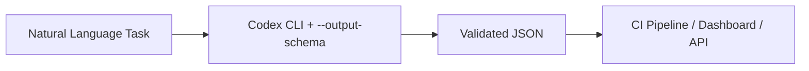
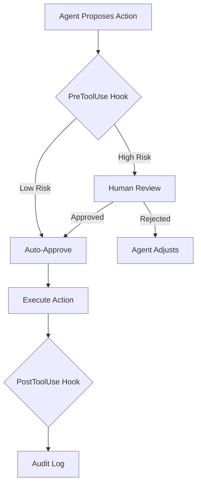
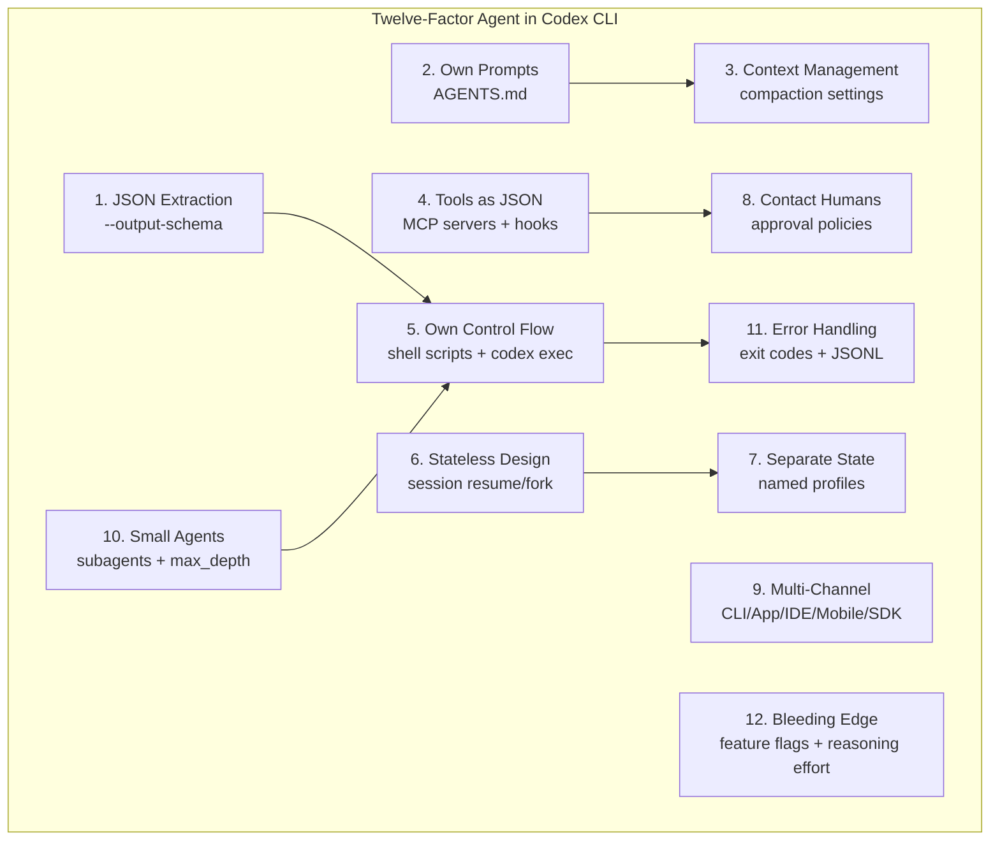

# The Twelve-Factor Agent Mapped to Codex CLI: Production Principles and Configuration Patterns for June 2026


---

The Twelve-Factor Agent methodology, unveiled by Dex Horthy at the AI Engineer World's Fair in 2025 and since adopted by thousands of engineering teams[^1], applies the spirit of Heroku's Twelve-Factor App to LLM-powered systems. Its twelve vendor-neutral principles address the specific failure modes that surface when probabilistic models meet deterministic business requirements[^2]. With Codex CLI now serving over five million weekly users[^3] and the post-subsidy billing era sharpening the cost of sloppy agent architecture, mapping each factor to concrete Codex CLI configuration has become a practical necessity.

This article walks through all twelve factors and shows exactly where each one lands in `config.toml`, `AGENTS.md`, shell scripts, and CI pipelines.

## Factor 1 — JSON Extraction as Foundation

The first factor treats structured output as the core LLM capability: converting natural language into validated JSON[^2]. Codex CLI supports this natively through the `--output-schema` flag in non-interactive mode:

```bash
codex exec --output-schema review-schema.json \
  "Review the auth module for security issues"
```

The schema file is a standard JSON Schema document. Codex constrains the model's final response to match the schema exactly, producing machine-parseable output that downstream tools can consume without brittle regex extraction[^4].

As of v0.140.0, `codex exec resume --output-schema` also works, meaning resumed sessions — with their accumulated context — can still produce structured output[^5].



## Factor 2 — Own Your Prompts

Factor 2 insists on hand-crafted prompts rather than framework abstractions that obscure what the model actually sees[^2]. Codex CLI enforces this through `AGENTS.md` — a plain-text file checked into the repository root that becomes part of every session's system context[^6].

```markdown
# AGENTS.md
## Code Style
- Use British English in all comments and documentation
- Prefer named exports over default exports
- Every public function requires a JSDoc comment

## Security
- Never install packages outside the lockfile
- Flag any use of eval() or Function() constructor
```

Because `AGENTS.md` is version-controlled, prompt changes go through the same review process as code changes. There is no hidden prompt layer — what you read in the file is what the model reads[^6].

## Factor 3 — Manage Context Windows Explicitly

Rather than blindly appending messages, Factor 3 demands active curation of the context window[^2]. Codex CLI provides two levers:

```toml
# config.toml
model_auto_compact_token_limit = 150000
```

This triggers automatic compaction when the session reaches the threshold — Codex summarises earlier turns and reclaims token space[^7]. The ceiling is clamped at 90% of the effective context window; setting a higher value is silently ignored[^7].

For manual control, the `/compact` slash command fires compaction on demand. In long sessions — particularly Goal Mode runs that span hours — explicit compaction management prevents the subtle context drift that causes agents to forget earlier constraints[^8].

## Factor 4 — Tools Are Just JSON and Code

Factor 4 treats tool invocation as structured output followed by deterministic code, not as magic function calls[^2]. Codex CLI's MCP server integration embodies this directly. Each MCP server exposes tools as JSON Schema definitions, and the model emits structured JSON to invoke them:

```toml
# config.toml
[mcp_servers.github]
command = "npx"
args = ["-y", "@modelcontextprotocol/server-github"]
```

The tool definition is JSON. The invocation is JSON. The approval hook that gates it is code. PreToolUse hooks inspect the structured tool call before execution; PostToolUse hooks validate the result after[^9]:

```toml
[features.hooks]
pre_tool_use = "node .codex/hooks/pre-tool-gate.js"
post_tool_use = "node .codex/hooks/post-tool-audit.js"
```

## Factor 5 — Own Your Control Flow

This factor argues that the application — not the LLM — should own the execution loop[^2]. In Codex CLI, this means wrapping `codex exec` in shell scripts or CI pipelines that make the decisions:

```bash
#!/usr/bin/env bash
set -euo pipefail

# Step 1: Agent analyses the diff
REVIEW=$(codex exec --output-schema review.json \
  "Review the changes on branch $BRANCH")

# Step 2: Deterministic code decides
SEVERITY=$(echo "$REVIEW" | jq -r '.max_severity')
if [[ "$SEVERITY" == "critical" ]]; then
  gh pr comment "$PR" --body "$(echo "$REVIEW" | jq -r '.summary')"
  exit 1
fi

# Step 3: Agent generates tests
codex exec "Write tests for the new functions in $BRANCH"
```

The shell script owns the control flow. The LLM handles the creative analysis. Branching, error handling, and sequencing remain deterministic[^10].

## Factor 6 — Stateless Agent Design

Factor 6 advocates designing agents as stateless reducers that can pause, resume, and scale horizontally[^2]. Codex CLI sessions are persisted locally as JSONL transcripts under `$CODEX_HOME/sessions/`, and any session can be resumed with full context:

```bash
# Resume the most recent session
codex resume --last

# Resume a specific session by ID
codex resume abc-123-def

# Resume in non-interactive mode with new instructions
codex exec resume --last "now add error handling"
```

The session transcript is the single source of truth. Context is reconstructed from the transcript, not from in-memory model state[^11]. This means sessions survive process crashes, machine reboots, and even migration between machines if the session directory is synced.

## Factor 7 — Separate Business from Execution State

Factor 7 distinguishes between the business state (what the user cares about) and the execution state (where the agent is in its workflow)[^2]. Codex CLI's named profiles separate these concerns:

```toml
# config.toml — business context via profiles
[profiles.security-review]
model = "gpt-5.5"
sandbox_mode = "read-only"
approval_policy = "always"

[profiles.rapid-prototype]
model = "gpt-5.5"
sandbox_mode = "workspace-write"
approval_policy = "unless-allow-listed"
```

```bash
# Business context selects the profile
codex --profile security-review "audit the payment module"
codex --profile rapid-prototype "scaffold a REST endpoint for /users"
```

The profile encodes the business intent (security review vs. prototyping). The execution state (session progress, tool call history, compaction state) lives in the session transcript[^12].

## Factor 8 — Contact Humans as First-Class Operations

Factor 8 elevates human escalation from edge case to core capability[^2]. Codex CLI's approval modes make this explicit:

| Mode | Behaviour |
|------|-----------|
| `read-only` | Agent reads files; every edit or command requires approval |
| `workspace-write` | Agent edits files in the working directory; commands need approval |
| `danger-full-access` | Agent operates freely across the machine |

The `approval_policy` setting in `config.toml` provides granular control:

```toml
approval_policy = "always"  # Human approves every action
```

PreToolUse hooks can implement conditional escalation — approving routine operations automatically while routing sensitive ones (database writes, production deployments) to a human via Slack, PagerDuty, or a custom webhook[^9].



## Factor 9 — Meet Users Where They Are

Factor 9 requires multi-channel support by design[^2]. Codex delivers this through five distinct surfaces:

1. **CLI** — terminal-native TUI for developers who live in tmux and SSH[^13]
2. **Desktop App** — macOS and Windows GUI with worktree management[^13]
3. **IDE Extension** — VS Code integration for inline agent assistance[^13]
4. **Mobile** — ChatGPT iOS app as remote control for Mac-hosted sessions[^14]
5. **SDK** — Python and TypeScript libraries for programmatic embedding[^15]

All five surfaces share the same underlying session format, model routing, and approval policies. A session started in the CLI can be handed off to the Desktop App with `/app`[^13]. ⚠️ Session continuity between CLI and Mobile requires the Mac to be running the Codex Desktop App.

## Factor 10 — Small, Focused Agents Beat Monoliths

Factor 10 limits agents to 3–10 steps for improved reliability[^2]. Codex CLI's subagent system supports this through configuration:

```toml
# config.toml
[agents]
max_threads = 6     # concurrent subagent threads
max_depth = 1       # prevent deep nesting
```

Each subagent receives a focused brief, operates in its own context window, and reports results back to the parent[^16]. The `max_depth = 1` default prevents recursive agent spawning — a common failure mode where agents create agents that create agents until the token budget is exhausted.

For larger decompositions, detached subagent patterns using `codex exec` provide full process isolation:

```bash
# Three focused agents, each with a clear scope
codex exec --cd ./auth "fix the JWT validation edge cases" &
codex exec --cd ./api "add pagination to the /users endpoint" &
codex exec --cd ./tests "update snapshot tests for the new UI" &
wait
```

## Factor 11 — Explicit Error Handling

Factor 11 processes errors intelligently rather than silently retrying[^2]. Codex CLI exposes errors through three channels:

**Exit codes** — `0` for success, `1` for agent failure, `2` for configuration or auth errors[^10].

**JSONL event stream** — `codex exec --json` emits structured events including `turn.failed` and `error` types with token usage metadata[^10]:

```bash
codex exec --json "fix the failing test" 2>/dev/null | \
  jq 'select(.type == "turn.failed")'
```

**Stop hooks** — fire at session end to validate the final state:

```toml
[features.hooks]
stop = "bash .codex/hooks/verify-tests.sh"
```

A well-designed wrapper script uses all three: checks exit codes for flow control, parses JSONL for cost tracking, and runs stop hooks for correctness verification[^10].

## Factor 12 — Find the Bleeding Edge

The final factor encourages engineering reliability at the boundary of model capabilities[^2]. Codex CLI's feature flags and reasoning effort controls let teams push boundaries safely:

```toml
# config.toml — enable experimental features
[features]
memories = true          # cross-session memory persistence

# Tune reasoning effort per profile
[profiles.deep-analysis]
model = "gpt-5.5"
# Use higher reasoning effort for complex tasks
```

The `codex features list` command shows available flags. Each flag can be enabled, tested, and rolled back without changing the core configuration[^17].

The reasoning effort ladder — from `low` through `medium` to `high` — lets teams trade cost for capability on a per-task basis, pushing the bleeding edge only when the task demands it[^18].

## Bringing It All Together



The mapping is not coincidental. Codex CLI's architecture — open-source, configuration-driven, with clear separation between the agent runtime and the model — naturally aligns with the Twelve-Factor Agent principles. The configuration surface (`config.toml`, `AGENTS.md`, hooks, profiles) provides the deterministic scaffolding that the methodology demands, while the model handles the creative, probabilistic work.

For teams moving from ad hoc agent usage to production-grade deployments, the twelve factors provide a checklist. For teams already running Codex CLI at scale, they provide a vocabulary for discussing architectural decisions that would otherwise remain implicit.

## Citations

[^1]: [12-Factor Agents: Principles for Building Reliable LLM Applications — Priyanka Vergadia](https://priyankavergadia.substack.com/p/12-factor-agents-principles-for-building)
[^2]: [12-Factor Agent Methodology (12FA) — Agentic Design Patterns](https://agentic-design.ai/patterns/evaluation-monitoring/twelve-factor-agent)
[^3]: [OpenAI named a Leader in enterprise coding agents by Gartner — OpenAI](https://openai.com/index/gartner-2026-agentic-coding-leader/)
[^4]: [Non-interactive mode — Codex CLI — OpenAI Developers](https://developers.openai.com/codex/noninteractive)
[^5]: [Codex Updates — June 2026 — Releasebot](https://releasebot.io/updates/openai/codex)
[^6]: [AGENTS.md — Codex CLI — OpenAI Developers](https://developers.openai.com/codex/cli/features)
[^7]: [Configuration Reference — Codex CLI — OpenAI Developers](https://developers.openai.com/codex/config-reference)
[^8]: [Codex CLI Context Compaction Architecture — Codex Knowledge Base](https://codex.danielvaughan.com/2026/03/31/codex-cli-context-compaction-architecture/)
[^9]: [Codex CLI Hooks Lifecycle: PreToolUse and PostToolUse — Codex Knowledge Base](https://codex.danielvaughan.com/2026/05/17/codex-cli-hooks-lifecycle-pretooluse-posttooluse-governance-enforcement/)
[^10]: [Codex CLI Exit Codes and Error Handling — Codex Knowledge Base](https://codex.danielvaughan.com/2026/06/12/codex-cli-exit-codes-error-handling-resilient-shell-scripts-ci-pipeline-automation/)
[^11]: [Codex CLI Session Lifecycle — Codex Knowledge Base](https://codex.danielvaughan.com/2026/06/05/codex-cli-session-lifecycle-archive-resume-fork-compact-management/)
[^12]: [Codex CLI Named Profiles Cookbook — Codex Knowledge Base](https://codex.danielvaughan.com/2026/04/30/codex-cli-named-profiles-cookbook-configuration-templates/)
[^13]: [Features — Codex CLI — OpenAI Developers](https://developers.openai.com/codex/cli/features)
[^14]: [Codex Mobile — ChatGPT iOS as Remote Control — Codex Knowledge Base](https://codex.danielvaughan.com/2026/05/10/codex-android-remote-control-chatgpt-mobile-desktop-agent-sessions/)
[^15]: [Codex Python SDK — Codex Knowledge Base](https://codex.danielvaughan.com/2026/03/30/codex-python-sdk-embedding-agents/)
[^16]: [Subagents — Codex CLI — OpenAI Developers](https://developers.openai.com/codex/subagents)
[^17]: [Codex CLI Changelog — Gradually.ai](https://www.gradually.ai/en/changelogs/codex-cli/)
[^18]: [Codex CLI Speed Stack: Reasoning Effort Tuning — Codex Knowledge Base](https://codex.danielvaughan.com/2026/04/24/codex-cli-speed-stack-fast-mode-reasoning-effort-spark-performance-tuning/)
