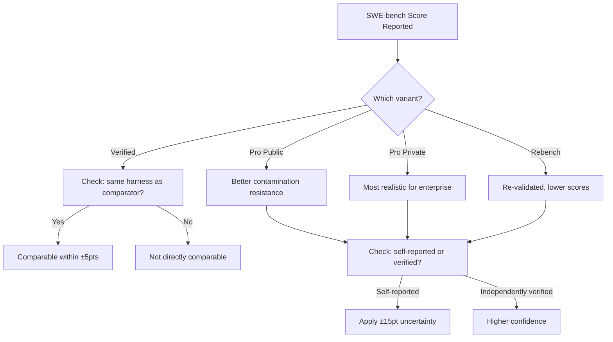

# Benchmark Literacy: A Practitioner's Guide to Reading Coding Agent Benchmarks Critically


---

Every week brings a new headline: "Model X achieves 95% on SWE-bench." The number enters Slack threads, procurement decks, and sprint retrospectives within hours. But what does it actually mean for the code you ship? Less than you think — and more than you fear, if you know how to read it.

This guide equips senior developers with the critical apparatus to interpret the four benchmarks that dominate coding agent evaluation in mid-2026: **SWE-bench** (and its variants), **Terminal-Bench**, **KiloBench**, and **CodeScaleBench**. It covers what each measures, where each misleads, and how to run your own evaluation using Codex CLI.

## The Self-Reported Score Problem

Of the 100 models listed on the llm-stats SWE-bench Verified leaderboard as of 16 June 2026, only **one** carries an independent verification badge — Claude Fable 5's 95.0%, verified by vals.ai [^1]. The other 99 entries are vendor-submitted. Each vendor runs its own evaluation harness: its own scaffold of tool definitions, retry logic, context management, and prompting around the raw model. The leaderboard is closer to a self-attested press-release aggregator than a controlled experiment.

This matters because scaffolding moves scores by **10–20 percentage points** without changing the model [^2]. Scale AI's analysis found that three agent systems running identical Claude Opus 4.5 weights produced scores spanning 50.2–55.4% on SWE-bench Pro — a 5.2-point gap from scaffolding alone [^1]. OpenAI's Frontier Evaluations team stopped reporting SWE-bench Verified scores entirely in early 2026, citing contamination and scaffolding confounds [^3].

> **Rule of thumb:** When you see a SWE-bench Verified score, mentally apply a ±15-point uncertainty band. Compare only scores produced by the same harness.

## The Four Benchmarks

### SWE-bench and Its Variants

The SWE-bench family has fragmented into four distinct measurements [^1]:

| Variant | Tasks | Key Feature | Top Score (June 2026) |
|---------|-------|-------------|----------------------|
| **Verified** | 500 | Curated subset of SWE-bench Lite | ~88.6% (Claude Opus 4.8) [^4] |
| **Pro (Public)** | 1,865 | GPL repos, multi-language | ~80.3% (Claude Fable 5) [^5] |
| **Pro (Private)** | Undisclosed | Proprietary startup codebases | ~47.1% (best) [^1] |
| **Rebench** | Varies | Re-validated tasks | Lower scores across the board [^6] |

The private commercial subset deserves particular attention. At 47.1%, it is the most realistic proxy for proprietary enterprise codebases — yet it receives the least publicity [^1]. When evaluating an agent for your team, ask: "Which variant produced this score?"

**Contamination** remains a structural concern. Independent research identified solution leakage in 32.67% of successful patches, with models recalling correct file paths from training data up to 76% of the time [^1]. SWE-bench Pro mitigates this by using GPL-licensed repositories and private proprietary codebases, creating legal and access barriers that reduce training data contamination [^5].



### Terminal-Bench

Terminal-Bench 2.0 evaluates agents driving a real terminal to complete 89 tasks spanning software engineering, machine learning, security, data science, and system administration [^7]. Tasks include building Linux kernels, configuring git servers, cracking encrypted archives, and creating TLS certificates.

**What it captures that SWE-bench misses:** Shell proficiency, system administration, infrastructure tasks, and the ability to chain multiple commands in sequence. This is directly relevant to Codex CLI's `codex exec` mode, which operates entirely within a terminal sandbox [^8].

**Current leaders** (June 2026): NexAU-AHE (GPT-5.5) at ~84.7%, LemonHarness (Gemini 3.1 Pro + GPT-5.3) at ~84.5%, Capy (GPT-5.5) at ~83.1% [^7].

**Where it misleads:** The 89-task corpus is small enough that a few lucky solves can shift rankings meaningfully. Standard error bars on the leaderboard routinely overlap between adjacent entries. Check the error bars before concluding that Model A outperforms Model B.

### KiloBench

KiloBench, from the Kilo open-source agent project, directly addresses the cost dimension that other benchmarks ignore [^9]. It measures four axes:

1. **Cost per attempt** — actual API expense including reasoning tokens, context resending, and tool overhead
2. **Cost to completion** — total expense accounting for retries
3. **Harness-specific pass rate** — success within Kilo's framework
4. **Behavioural fingerprints** — exploration patterns, command style, token consumption

The critical insight: re-sent context accounts for **62% of the total bill** in agent loops [^9]. A model scoring 80% at \$2 per task may deliver worse value than one scoring 75% at \$0.20. One developer reported \$4,200 in API fees over a single weekend of autonomous refactoring [^9].

**For Codex CLI users**, KiloBench's cost-to-completion metric maps directly to the `/usage` command and `--max-cost` flag. If you are choosing between `o4-mini` and a larger model for a refactoring sprint, KiloBench-style cost-per-task analysis tells you more than raw SWE-bench scores.

### CodeScaleBench

Sourcegraph's CodeScaleBench targets the gap between benchmark tasks and enterprise reality [^10]. Its 370 tasks span two categories:

- **CodeScaleBench-SDLC** (150 tasks): Full software development lifecycle across repositories exceeding 1 million lines of code — Kubernetes, Django, Linux, VSCode
- **CodeScaleBench-Org** (220 tasks): Organisation-level scenarios including incident debugging, vulnerability remediation, framework migration, and cross-repository discovery

Key findings: MCP-augmented agents complete tasks **38% faster** with a **30% reduction** in per-task cost [^10]. File recall improved from 0.127 to 0.277 with retrieval tooling. Agents overwhelmingly prefer keyword search (4,813 calls) over semantic approaches (587 calls), suggesting that tool availability alone does not guarantee optimal usage [^10].

**For Codex CLI users**, CodeScaleBench validates the importance of MCP server configuration. An agent with a well-configured code search MCP server will outperform one relying solely on `grep` and `find`, even if the underlying model is identical.

## Reading a Benchmark Score: A Checklist

Before citing any benchmark score in a decision, run through this checklist:

1. **Which variant?** SWE-bench Verified ≠ SWE-bench Pro ≠ SWE-bench Pro Private
2. **Who ran it?** Self-reported vendor score or independently verified?
3. **Which harness?** Scores from different scaffolds are not comparable
4. **What's the error bar?** On small task sets, overlapping confidence intervals mean no real difference
5. **What's the cost?** A 5-point accuracy gain that triples your API bill may not be worth it
6. **How old is it?** Benchmark scores from three months ago may reflect a model version that no longer exists
7. **Does it match your codebase?** Pro Private (47.1%) better reflects enterprise reality than Verified (88.6%)

## Running Your Own Evaluation with Codex CLI

The most reliable benchmark is the one you run against your own codebase. Codex CLI v0.140.0 [^8] provides the primitives to build a lightweight evaluation harness:

```bash
# Create a task file with known-good patches
cat > eval-tasks.jsonl << 'EOF'
{"id": "fix-auth-bug", "prompt": "Fix the authentication bypass in src/auth/session.ts", "expected_files": ["src/auth/session.ts"], "test_cmd": "npm test -- --grep auth"}
{"id": "add-rate-limit", "prompt": "Add rate limiting to the /api/upload endpoint", "expected_files": ["src/api/upload.ts", "src/middleware/rateLimit.ts"], "test_cmd": "npm test -- --grep rate"}
EOF
```

```bash
# Run each task in a fresh sandbox and capture results
while IFS= read -r task; do
  id=$(echo "$task" | jq -r '.id')
  prompt=$(echo "$task" | jq -r '.prompt')
  test_cmd=$(echo "$task" | jq -r '.test_cmd')

  echo "=== Running: $id ==="
  codex exec --model o4-mini --approval-mode full-auto "$prompt" 2>&1 | tee "results/$id.log"

  # Verify with the test command
  eval "$test_cmd" > "results/$id.test.log" 2>&1
  echo "Test exit code: $?" >> "results/$id.test.log"
done < eval-tasks.jsonl
```

```toml
# config.toml — evaluation profile
[profile.eval]
model = "o4-mini"
approval_mode = "full-auto"
sandbox = "container"
```

```bash
# Run with the eval profile
codex --profile eval exec "Fix the authentication bypass in src/auth/session.ts"
```

This approach gives you scores that directly predict performance on **your** codebase, with **your** dependencies, in **your** sandbox configuration. No contamination. No scaffolding variance. No self-reporting bias.

## What the Benchmarks Collectively Tell Us

Despite their individual limitations, the four benchmarks triangulate a consistent picture in mid-2026:

1. **Model capability is converging.** The top six models on SWE-bench Verified are separated by 1.3 percentage points [^9]. Scaffolding, context management, and tool configuration now drive more variance than raw model selection.

2. **Cost varies by 10×.** KiloBench shows that two models with similar accuracy can differ tenfold in cost-to-completion. The `/usage` command in Codex CLI is your best friend.

3. **Enterprise codebases are harder.** SWE-bench Pro Private (47.1%) versus Verified (88.6%) shows a 41-point reality gap. CodeScaleBench confirms that multi-repo, million-line tasks remain substantially harder than isolated bug fixes.

4. **Tooling matters more than models.** CodeScaleBench's 38% speed improvement from MCP tooling and Terminal-Bench's emphasis on shell proficiency both point to the same conclusion: invest in your agent's environment, not just its model subscription.

## Practical Recommendations for Codex CLI Users

| Decision | Use This Benchmark | Why |
|----------|-------------------|-----|
| Choosing between o4-mini and a larger model | KiloBench cost-to-completion | Accuracy gaps are small; cost gaps are large |
| Evaluating MCP server ROI | CodeScaleBench retrieval metrics | Quantifies the tooling advantage |
| Assessing terminal automation | Terminal-Bench 2.0 | Directly tests `codex exec` scenarios |
| Benchmarking against your codebase | Your own eval harness | Eliminates contamination and scaffold bias |
| Comparing vendor claims | SWE-bench Pro Private | Most contamination-resistant variant |

## Citations

[^1]: "SWE-bench in 2026: Benchmarks vs Scaffolding Reality," Digital Applied, June 2026. [https://www.digitalapplied.com/blog/swe-bench-verified-june-2026-benchmark-vs-scaffolding-analysis](https://www.digitalapplied.com/blog/swe-bench-verified-june-2026-benchmark-vs-scaffolding-analysis)

[^2]: Scale AI, "SWE-Bench Pro Leaderboard," 2026. [https://labs.scale.com/leaderboard/swe_bench_pro_public](https://labs.scale.com/leaderboard/swe_bench_pro_public)

[^3]: "Why SWE-bench Verified No Longer Measures Frontier Coding Capabilities," OpenAI, 2026. [https://openai.com/index/why-we-no-longer-evaluate-swe-bench-verified/](https://openai.com/index/why-we-no-longer-evaluate-swe-bench-verified/)

[^4]: "SWE-bench Verified Benchmark 2026: 53 LLM Scores," BenchLM. [https://benchlm.ai/benchmarks/sweVerified](https://benchlm.ai/benchmarks/sweVerified)

[^5]: "SWE-bench Pro Leaderboard (2026)," MorphLLM. [https://www.morphllm.com/swe-bench-pro](https://www.morphllm.com/swe-bench-pro)

[^6]: "SWE-Rebench Benchmark 2026," BenchLM. [https://benchlm.ai/benchmarks/sweRebench](https://benchlm.ai/benchmarks/sweRebench)

[^7]: Terminal-Bench 2.0 Leaderboard. [https://www.tbench.ai/](https://www.tbench.ai/)

[^8]: OpenAI Codex CLI Releases, v0.140.0, June 2026. [https://github.com/openai/codex/releases](https://github.com/openai/codex/releases)

[^9]: "KiloBench — Because Your Benchmark Score Doesn't Pay the Bill," Kilo Blog, 2026. [https://blog.kilo.ai/p/kilobench-because-your-benchmark](https://blog.kilo.ai/p/kilobench-because-your-benchmark)

[^10]: "CodeScaleBench: Testing Coding Agents on Large Codebases," Sourcegraph Blog, 2026. [https://sourcegraph.com/blog/codescalebench-testing-coding-agents-on-large-codebases-and-multi-repo-software-engineering-tasks](https://sourcegraph.com/blog/codescalebench-testing-coding-agents-on-large-codebases-and-multi-repo-software-engineering-tasks)
