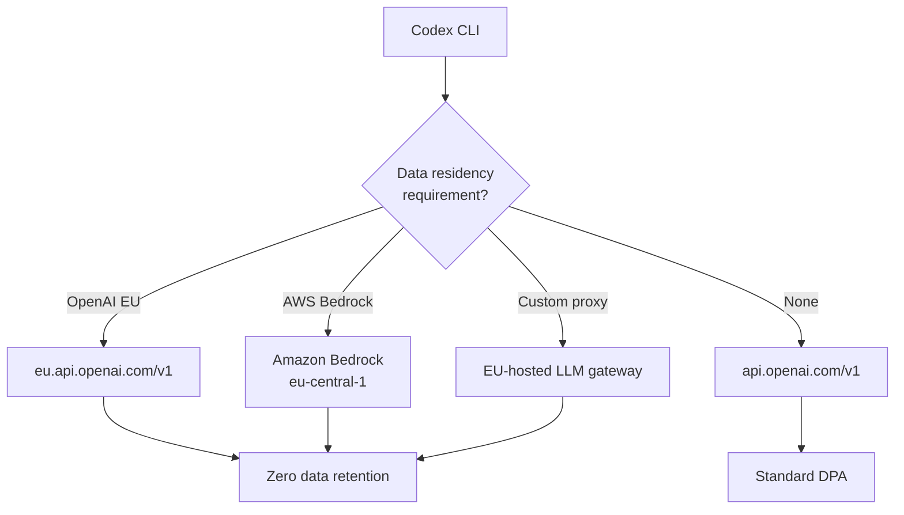

# Codex CLI in Europe: Data Residency, Bedrock Routing, and GDPR-Compliant Agent Configuration After the EEA Expansion


---

On 16 June 2026 OpenAI expanded Codex's desktop features — Computer Use, the Chrome extension, Memories, and the Chronicle audit preview — to the European Economic Area, the United Kingdom, and Switzerland [^1]. For CLI users the headline is less about desktop automation and more about what it signals: European developers now have first-class platform support, and the tooling to keep agent traffic inside EU boundaries has matured significantly since Codex CLI v0.140.0 shipped the day before [^2].

This article maps the three routing strategies available to Codex CLI users who need to satisfy GDPR, EU AI Act, or internal data-sovereignty policies, and provides concrete `config.toml` patterns you can drop into your workflow today.

## Why Data Residency Matters for Agent Traffic

A single Codex CLI session can generate dozens of API round-trips — prompts containing source code, shell output, file contents, and tool results. Under GDPR Chapter V, every one of those requests constitutes a cross-border transfer if the API endpoint resolves to US infrastructure [^3]. The CLOUD Act (18 U.S.C. § 2713) compounds the concern: US-hosted data is subject to compelled disclosure regardless of where the data subject resides [^4].

Three mechanisms now exist to keep Codex CLI traffic within European boundaries:

1. **OpenAI EU API endpoint** — route all requests through `eu.api.openai.com`
2. **Amazon Bedrock EU regions** — route through `eu-central-1` or `eu-west-1` with the native Bedrock provider
3. **Custom proxy** — run an EU-hosted reverse proxy or LLM gateway



## Strategy 1: OpenAI EU API Endpoint

The simplest approach. OpenAI's data residency programme lets API customers process requests through European infrastructure with zero data retention — model inputs and outputs are not stored at rest on OpenAI servers [^5].

### Configuration

For the built-in OpenAI provider, override the base URL without creating a new provider:

```toml
# ~/.codex/config.toml
openai_base_url = "https://eu.api.openai.com/v1"
```

Alternatively, create a named provider for clearer intent:

```toml
model_provider = "openai-eu"

[model_providers.openai-eu]
name = "OpenAI EU Data Residency"
base_url = "https://eu.api.openai.com/v1"
env_key = "OPENAI_API_KEY"
```

### Prerequisites

Data residency must be enabled at the project level in the OpenAI Platform dashboard: **Settings → Project → Data Residency → Europe** [^5]. The API key you use must belong to that project — keys from non-EU projects will be rejected by the EU endpoint.

### Named Profile Pattern

Create a dedicated profile so developers can switch contexts without editing the base config:

```toml
# ~/.codex/eu-compliant.config.toml
model_provider = "openai-eu"
model = "o3"

[model_providers.openai-eu]
name = "OpenAI EU Data Residency"
base_url = "https://eu.api.openai.com/v1"
env_key = "OPENAI_API_KEY"
```

```bash
codex --profile eu-compliant "refactor the auth module"
```

This pattern lets teams enforce residency per-project without modifying global configuration.

## Strategy 2: Amazon Bedrock EU Regions

Codex CLI v0.140.0 added managed Bedrock API-key authentication with encrypted local credential storage [^2]. Combined with Bedrock's EU regional availability, this provides a fully AWS-native compliance path.

### Configuration

```toml
# ~/.codex/config.toml
model_provider = "amazon-bedrock"
model = "openai.gpt-5.5"

[model_providers.amazon-bedrock.aws]
region = "eu-central-1"
profile = "codex-eu"
```

Authentication follows the standard AWS SDK credential chain [^6]:

1. `AWS_BEARER_TOKEN_BEDROCK` environment variable (Bedrock API key)
2. AWS SSO / named profiles (`aws configure sso`)
3. IAM role credentials via `credential_process`
4. Environment variables (`AWS_ACCESS_KEY_ID`, `AWS_SECRET_ACCESS_KEY`)

For desktop and IDE contexts where shell variables may not propagate, store credentials in `~/.codex/.env`:

```bash
# ~/.codex/.env
AWS_BEARER_TOKEN_BEDROCK=your-bedrock-api-key
AWS_REGION=eu-central-1
```

### Encrypted Credential Storage

v0.140.0 introduced separate encrypted namespaces for credentials: `local.age`, `cli_auth.age`, and `mcp_oauth.age`, all backed by the OS keyring [^7]. This means Bedrock API keys stored through the CLI's credential flow are encrypted at rest — a meaningful improvement over plaintext `.env` files for regulated environments.

### Limitations

Bedrock's OpenAI model availability varies by region — verify that your target model is available in your chosen EU region before committing to this path [^6]. Fast Mode is unavailable because Bedrock currently supports on-demand inference only [^6]. ⚠️ At time of writing, `openai.gpt-5.5` availability in `eu-central-1` and `eu-west-1` should be confirmed against the current Bedrock regional availability matrix.

## Strategy 3: Custom EU Proxy

For organisations running their own LLM gateway (LiteLLM, OpenRouter, or a bespoke reverse proxy), Codex CLI's custom provider support handles this cleanly:

```toml
model_provider = "eu-gateway"

[model_providers.eu-gateway]
name = "Internal EU LLM Gateway"
base_url = "https://llm-gateway.internal.eu.example.com/v1"
env_key = "EU_GATEWAY_TOKEN"
```

This approach isolates CLOUD Act exposure to the gateway's outbound calls and lets the organisation control logging, retention, and audit trails independently [^4].

## AGENTS.md: Encoding Data Handling Constraints

Beyond routing, European compliance often requires constraints on what the agent *does* with data. Encode these in `AGENTS.md` at the repository root:

```markdown
# Data Handling Constraints

- NEVER include personally identifiable information (PII) in commit messages
- NEVER log API responses containing user data to shell output
- When processing files in `data/`, treat all content as GDPR-sensitive
- Strip email addresses and names from test fixtures before committing
- Use pseudonymised identifiers in all generated test data
```

These constraints are read by Codex CLI at session start and influence the agent's behaviour throughout the session [^8]. While they are not executable guards (see the ContextCov research on enforcement gaps [^9]), they provide a documented compliance baseline that audit teams can review.

## PreToolUse Hooks for PII Defence

For stronger enforcement, add a PreToolUse hook that screens shell commands before execution:

```toml
# ~/.codex/config.toml
[[hooks.pre_tool_use]]
command = "python3 /opt/codex-hooks/pii-screen.py"
```

The hook receives the proposed tool call as JSON on stdin and can reject commands that would, for example, `curl` user data to a non-EU endpoint or `cat` a file known to contain PII into the session context. This maps to the executable constraint pattern validated by the ContextCov research, which found 88.3% compliance with executable checks versus 67% with prompt-only constraints [^9].

## EU AI Act: What Changes on 2 August 2026

The EU AI Act's Article 50 transparency obligations take effect on 2 August 2026 [^10]. For Codex CLI users building customer-facing applications, this means:

- **Disclosure**: applications must inform users when AI-generated content is present
- **Content marking**: AI-generated code in public-facing outputs should be identifiable where feasible
- **High-risk classification**: if your Codex-assisted workflow touches employment, education, credit scoring, or biometric decisions, Article 26 obligations apply — including human oversight, impact assessments, and monitoring logs [^10]

Chronicle, the audit-trail feature launched alongside the EEA expansion, provides the timestamped action logs that Article 26 monitoring requires [^1]. CLI users can approximate this with session transcripts (`codex resume` exposes full JSONL histories) and `codex doctor --json` for environment auditing.

## Putting It Together: A Compliance Configuration Template

```toml
# ~/.codex/eu-compliant.config.toml
# European data residency profile

model = "o3"
model_provider = "openai-eu"

# EU API endpoint — zero data retention
[model_providers.openai-eu]
name = "OpenAI EU Data Residency"
base_url = "https://eu.api.openai.com/v1"
env_key = "OPENAI_API_KEY_EU"

# PII screening hook
[[hooks.pre_tool_use]]
command = "python3 /opt/codex-hooks/pii-screen.py"

# Fallback: Bedrock EU for resilience
[model_providers.amazon-bedrock.aws]
region = "eu-central-1"
profile = "codex-eu-fallback"
```

```bash
# Launch with the EU profile
codex --profile eu-compliant "add GDPR consent flow to the user registration module"
```

## Key Takeaways

The June 2026 EEA expansion is not just a desktop feature rollout — it marks the point where Codex's European infrastructure story became complete enough for regulated enterprise use. CLI developers have three concrete routing strategies, encrypted credential storage, and the AGENTS.md + hooks pattern for encoding data-handling constraints directly into the development workflow.

The remaining gap is model availability: not all models are available in all EU Bedrock regions, and the OpenAI EU endpoint's model roster should be verified per-project. But the configuration surface is there, and the compliance patterns are well-defined.

---

## Citations

[^1]: OpenAI. "Codex app features expand to EEA, UK, and Switzerland." Codex Changelog, 16 June 2026. [https://developers.openai.com/codex/changelog](https://developers.openai.com/codex/changelog)

[^2]: OpenAI. "Codex CLI 0.140.0 release notes." Codex Changelog, 15 June 2026. [https://developers.openai.com/codex/changelog](https://developers.openai.com/codex/changelog)

[^3]: European Parliament and Council. "General Data Protection Regulation (GDPR), Chapter V — Transfers of personal data to third countries or international organisations." 2016. [https://gdpr-info.eu/chapter-5/](https://gdpr-info.eu/chapter-5/)

[^4]: Sota.io. "Using the OpenAI API in 2026: GDPR, CLOUD Act and EU AI Act compliance developer guide." 2026. [https://sota.io/blog/openai-api-gdpr-cloud-act-eu-ai-act-compliance-developer-guide-2026](https://sota.io/blog/openai-api-gdpr-cloud-act-eu-ai-act-compliance-developer-guide-2026)

[^5]: OpenAI. "Data residency for the OpenAI API." OpenAI Help Center. [https://help.openai.com/en/articles/10503543-data-residency-for-the-openai-api](https://help.openai.com/en/articles/10503543-data-residency-for-the-openai-api)

[^6]: OpenAI. "Use Codex with Amazon Bedrock." OpenAI Developers. [https://developers.openai.com/codex/amazon-bedrock](https://developers.openai.com/codex/amazon-bedrock)

[^7]: Celia (OpenAI). "feat: use encrypted local secrets for MCP OAuth." GitHub PR #27541, 12 June 2026. [https://github.com/openai/codex/pull/27541](https://github.com/openai/codex/pull/27541)

[^8]: OpenAI. "Advanced Configuration — Codex CLI." OpenAI Developers. [https://developers.openai.com/codex/config-advanced](https://developers.openai.com/codex/config-advanced)

[^9]: Sharma, A. "ContextCov: Turning Agent Instructions into Executable Constraints." arXiv:2603.00822, February 2026 (revised May 2026). [https://arxiv.org/abs/2603.00822](https://arxiv.org/abs/2603.00822)

[^10]: European Parliament and Council. "Regulation (EU) 2024/1689 — Artificial Intelligence Act, Articles 26 and 50." Official Journal of the European Union, 2024. [https://eur-lex.europa.eu/eli/reg/2024/1689](https://eur-lex.europa.eu/eli/reg/2024/1689)
