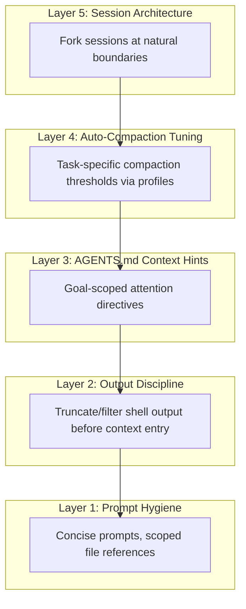

# Context Pruning for Coding Agents: What SWE-Pruner, Pichay, and ContextBudget Mean for Codex CLI Token Management


---

Three independent research efforts published between January and April 2026 converge on the same conclusion: the way coding agents manage context is at least as important as the model they run. SWE-Pruner demonstrates that task-aware line-level pruning can cut token consumption by 23–54% without sacrificing solve rates [^1]. Pichay reveals that 21.8% of tokens in production agent sessions are structural waste and builds a demand-paging system that reduces context consumption by up to 93% [^2]. ContextBudget formalises context management as a sequential decision problem under budget constraints, achieving 1.6× gains over strong baselines in high-complexity settings [^3]. Together, these papers reframe context management from a background concern into a first-class engineering discipline — and Codex CLI already ships the primitives to apply their findings.

## The Problem: Context Is Cache, Not Memory

The Pichay paper makes the sharpest statement of the underlying issue: an LLM's context window is not memory but L1 cache — a small, fast, expensive resource that the field treats as the entire memory system [^2]. There is no L2, no virtual memory, no paging. Every tool definition, system prompt, and stale shell output occupies context for the lifetime of the session.

Mason's analysis of 857 production sessions totalling 4.45 million effective input tokens found that 21.8% is structural waste: tool schemas that never fire, system instructions the model has already internalised, and stale tool results that will never be referenced again [^2]. For Codex CLI users paying per input token, that waste compounds on every turn.

The three papers attack this problem from different angles:

```mermaid
graph TD
    A[Context Bloat Problem] --> B[SWE-Pruner]
    A --> C[Pichay]
    A --> D[ContextBudget]
    B -->|Task-aware pruning| E[23-54% token reduction]
    C -->|Demand paging + eviction| F[Up to 93% reduction]
    D -->|Budget-aware RL compression| G[1.6x gains under pressure]
    E --> H[Codex CLI Patterns]
    F --> H
    G --> H
    H --> I[/compact timing]
    H --> J[Auto-compaction threshold]
    H --> K[AGENTS.md context hints]
    H --> L[Shell output discipline]
```

## SWE-Pruner: Task-Aware Selective Skimming

Wang et al. draw inspiration from how human programmers selectively skim source code [^1]. Rather than compressing everything uniformly, SWE-Pruner trains a 0.6B-parameter neural skimmer that dynamically selects relevant lines given an explicit goal — for example, "focus on error handling in the authentication module."

The key insight is that generic compression methods like LongLLMLingua rely on fixed metrics such as perplexity, ignoring the task-specific nature of code understanding [^1]. They frequently disrupt syntactic and logical structure, stripping exactly the implementation details an agent needs to reason about a bug fix.

Results across four benchmarks and multiple models [^1]:

| Benchmark | Token Reduction | Performance Impact |
|---|---|---|
| SWE-Bench Verified | 23–54% | Maintained or improved solve rate |
| LongCodeQA | Up to 14.84× compression | Minimal degradation |

The practical implication for Codex CLI: **what you include in context matters more than how much context you have.** SWE-Pruner's success with task-specific goals maps directly to how you structure your AGENTS.md instructions and prompt phrasing.

### Codex CLI Pattern: Goal-Scoped Context via AGENTS.md

SWE-Pruner formulates an explicit goal to guide its skimmer. You can achieve the same effect by scoping your AGENTS.md to declare what categories of information the agent should prioritise:

```markdown
# AGENTS.md — Context Priority Hints

## When Debugging
Focus on: error messages, stack traces, recent git diff output, and test failures.
Deprioritise: unchanged configuration files, passing test output, and build artefact listings.

## When Refactoring
Focus on: type signatures, public interfaces, import graphs, and call sites.
Deprioritise: implementation details of unrelated modules, CI logs, and deployment configuration.
```

This does not trigger SWE-Pruner's neural skimmer, but it achieves the same goal-directed attention: the model spends fewer tokens reasoning about irrelevant material and is less likely to include unnecessary file reads that bloat the context window.

## Pichay: Demand Paging for Agent Sessions

Mason's Pichay system treats context management as a classic operating systems problem [^2]. The system interposes as a transparent proxy between client and inference API, implementing three memory hierarchy levels:

1. **L1 eviction** — stale tool results and consumed system instructions are evicted from the active context
2. **L2 fault-driven pinning** — when the model re-requests evicted material (a "page fault"), Pichay restores and pins it
3. **L3 model-initiated compaction** — full conversation summarisation when the working set exceeds capacity

In offline replay across 1.4 million simulated evictions, the fault rate was just 0.0254% [^2]. In live production deployment over 681 turns, context consumption dropped from 5,038 KB to 339 KB — a 93% reduction [^2].

### Mapping Pichay's Hierarchy to Codex CLI

Codex CLI does not implement demand paging, but its existing primitives map onto Pichay's three levels:

```mermaid
graph LR
    subgraph "Pichay Hierarchy"
        P1[L1: Eviction]
        P2[L2: Fault-driven pinning]
        P3[L3: Compaction]
    end
    subgraph "Codex CLI Primitives"
        C1[Shell output truncation]
        C2[File re-reads on demand]
        C3[/compact + auto-compaction]
    end
    P1 -.->|analogous| C1
    P2 -.->|analogous| C2
    P3 -.->|analogous| C3
```

**L1 equivalent — shell output discipline.** Pichay's 21.8% structural waste figure should alarm any Codex CLI user who lets `cat` dump entire files or `npm test` stream thousands of lines of passing test output into context. Each byte persists for the session's lifetime. Pipe verbose commands through `head`, `tail`, or `grep` before they enter the agent's view:

```bash
# Bad: entire test suite output enters context
npm test

# Better: only failures enter context
npm test 2>&1 | grep -A 5 "FAIL\|Error"
```

**L2 equivalent — re-reads as page faults.** When Codex CLI needs a file it previously read but has since been compacted away, it issues another file read. This is Pichay's page fault pattern. The cost is one additional tool call rather than persistent context occupation. Accept this trade-off — it is cheaper than carrying every file read for the entire session.

**L3 equivalent — /compact.** Codex CLI's `/compact` command and auto-compaction threshold directly implement Pichay's L3. The key configuration:

```toml
# ~/.codex/config.toml
# Trigger compaction at 60% of context window for aggressive savings
model_auto_compact_token_limit = 120000
```

The default threshold is 200,000 tokens [^4]. Lowering it trades context fidelity for cost reduction — Pichay's data suggests the trade-off is overwhelmingly favourable, with a 0.025% fault rate even under aggressive eviction [^2].

## ContextBudget: Learning When to Compress

Wu et al. formalise what the other two papers treat empirically [^3]. Their Budget-Aware Context Management (BACM) framework introduces two mechanisms:

1. **Budget-conditioned inference** — before appending new observations, the agent checks remaining context headroom and decides whether to defer loading
2. **Commit-block aggregation** — the agent adaptively controls when and how much to compress based on current budget pressure

Their BACM-RL variant uses curriculum-based reinforcement learning to learn compression strategies under varying context budgets, consistently outperforming prior methods across model scales [^3]. The critical finding: performance degrades gracefully under tighter budgets when the agent is trained to manage them, but collapses when compression is applied uniformly without budget awareness.

### Codex CLI Pattern: Budget-Aware Session Planning

ContextBudget's insight translates to a practical Codex CLI workflow: plan your session's context budget before starting, not after you hit the wall.

```toml
# Profile for large refactoring tasks — aggressive compaction
[profile.refactor]
model = "o3"
model_auto_compact_token_limit = 100000
```

```toml
# Profile for debugging — preserve more context
[profile.debug]
model = "o3"
model_auto_compact_token_limit = 180000
```

The reasoning: debugging sessions need to retain error messages, stack traces, and reproduction steps across many turns. Refactoring sessions generate large volumes of file reads and diffs that compress well because the structural patterns repeat. ContextBudget's data confirms that one-size-fits-all compression policies leave performance on the table [^3].

## Practical Integration: A Five-Layer Context Hygiene Stack

Drawing from all three papers, Codex CLI practitioners can implement a layered context management strategy:



**Layer 1 — Prompt hygiene.** Reference specific files and line ranges rather than asking the agent to "look at the codebase." Each unnecessary file read adds hundreds to thousands of tokens that persist until compaction.

**Layer 2 — Output discipline.** Pichay's 21.8% structural waste largely comes from tool outputs that are never referenced again [^2]. Use shell pipelines to filter output before it enters context. Configure PostToolUse hooks to truncate excessively long outputs:

```toml
# Truncate shell output exceeding 200 lines
[hooks.post_tool_use.shell]
command = "head -200"
```

**Layer 3 — AGENTS.md context hints.** Following SWE-Pruner's goal-directed approach [^1], declare what categories of information matter for different task types. The model uses these hints to self-regulate which files it reads and which tool outputs it requests.

**Layer 4 — Auto-compaction tuning.** Use named profiles to set task-appropriate compaction thresholds. ContextBudget's research confirms that budget-aware compression outperforms fixed policies [^3].

**Layer 5 — Session architecture.** When a task has natural boundaries (e.g., "implement feature X, then write tests for feature X"), use `codex fork` to start a fresh session that inherits the compact summary but not the raw history. This is Pichay's L3 compaction applied manually at architectural boundaries [^2].

## What the Numbers Mean for Your Token Bill

Combining the three papers' findings with Codex CLI's pricing model:

| Strategy | Token Reduction | Source |
|---|---|---|
| Shell output filtering | ~22% (structural waste) | Pichay [^2] |
| Task-aware context scoping | 23–54% (on remaining) | SWE-Pruner [^1] |
| Budget-aware compaction timing | 1.6× effective throughput | ContextBudget [^3] |
| Aggressive compaction + fork | Up to 93% (peak) | Pichay [^2] |

These figures are not directly additive — shell output filtering and task-aware scoping overlap — but the directional message is clear. A Codex CLI user who applies none of these techniques pays two to three times more per session than one who applies all of them, for equivalent task completion rates.

## Limitations and Open Questions

SWE-Pruner's neural skimmer requires training data and a separate inference call [^1]. Codex CLI cannot run it natively — the technique works only via external preprocessing or future platform integration. ⚠️ The 23–54% reduction figures are benchmark results; production variance on proprietary codebases is unknown.

Pichay's 93% reduction is a peak figure under optimal conditions [^2]. Real sessions with high information density — debugging sessions where every tool output matters — will see lower reductions. ⚠️ The 0.025% fault rate was measured on the author's production workload; fault rates on coding-specific sessions with frequent file re-references may differ.

ContextBudget's BACM-RL requires reinforcement learning training per task distribution [^3]. The approach is not directly deployable but informs how practitioners should think about threshold tuning.

None of the three papers address Codex CLI's encrypted compaction pathway for Codex-native models, where the compact blob is opaque to the client [^4]. Whether demand paging or task-aware pruning can be applied to encrypted compaction is an open question for OpenAI's platform team.

## Citations

[^1]: Wang, Y., Shi, Y., Yang, M., Zhang, R., He, S., Lian, H., Chen, Y., Ye, S., Cai, K., & Gu, X. (2026). "SWE-Pruner: Self-Adaptive Context Pruning for Coding Agents." arXiv:2601.16746. [https://arxiv.org/abs/2601.16746](https://arxiv.org/abs/2601.16746)

[^2]: Mason, T. (2026). "The Missing Memory Hierarchy: Demand Paging for LLM Context Windows." arXiv:2603.09023. [https://arxiv.org/abs/2603.09023](https://arxiv.org/abs/2603.09023)

[^3]: Wu, Y., Zheng, Y., Xu, T., Zhang, Z., Yu, Y., Zhu, J., Ma, C., Lin, B., Dong, B., Zhu, H., Huang, R., & Yu, G. (2026). "ContextBudget: Budget-Aware Context Management for Long-Horizon Search Agents." arXiv:2604.01664. [https://arxiv.org/abs/2604.01664](https://arxiv.org/abs/2604.01664)

[^4]: Codex CLI Context Compaction Architecture Documentation. [https://codex.danielvaughan.com/2026/03/31/codex-cli-context-compaction-architecture/](https://codex.danielvaughan.com/2026/03/31/codex-cli-context-compaction-architecture/)
