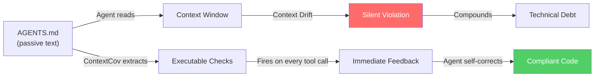
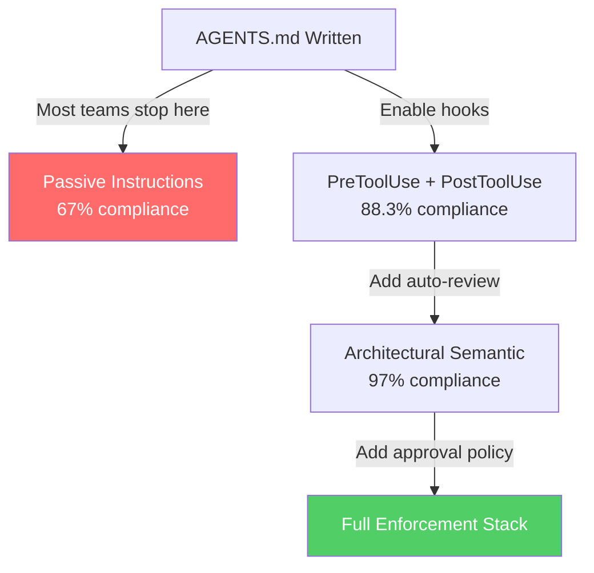

# ContextCov: Turning AGENTS.md into Executable Constraints — What It Means for Codex CLI Hook and Enforcement Strategy


---

Every team that has shipped an AGENTS.md file has experienced the same disquieting pattern: the agent reads the instructions, appears to understand them, and then quietly violates them three tool calls later. ContextCov, a framework published by Reshabh K Sharma (arXiv:2603.00822, February 2026, revised May 2026), puts hard numbers on the problem and proposes a concrete solution: transform passive natural-language constraints into executable checks that fire automatically during agent operation[^1]. The findings map directly onto Codex CLI's hook system, AGENTS.md loading, and approval policies — and they expose a structural gap that most Codex CLI configurations leave wide open.

## The Reality Gap: Why Passive Instructions Fail

ContextCov introduces the term **Context Drift** to describe the phenomenon where agents deviate from documented constraints due to context window limitations, conflicting legacy code, or simple model fallibility[^1]. Across 723 open-source repositories containing Agent Instruction files, the study found that **81% of repositories contained at least one constraint violation**, and **24% of all synthesised checks detected active violations**[^1]. More than 500,000 individual violations were catalogued across the dataset.

A companion study by Lulla et al. (arXiv:2601.20404, January 2026) provides the counterpoint: when AGENTS.md *is* present, OpenAI Codex (gpt-5.2-codex) completes tasks **28.64% faster** with **16.58% fewer output tokens**[^2]. The instructions help — they just don't *enforce*.



The core insight is that natural-language instructions occupy a fundamentally different enforcement plane from executable checks. An AGENTS.md file that says "always use pnpm, never npm" is a suggestion. A PATH shim that intercepts `npm` and returns an error is a constraint.

## How ContextCov Works: Three Enforcement Domains

ContextCov parses Agent Instruction files and synthesises checks across three distinct enforcement domains[^1]:

### 1. Source Constraints (28% of checks)

Tree-sitter AST queries that detect code-pattern violations. For example, a constraint like "prefer async/await over .then() chains" becomes a Tree-sitter query matching `call_expression` nodes where the method property identifier matches `^then$`[^1]. The system supports any language with a Tree-sitter grammar — the same universal parser that powers most modern code intelligence tooling[^3].

**32% of source constraint checks detected violations** across the 723-repository dataset.

### 2. Process Constraints (26% of checks)

Runtime shell shims that intercept prohibited commands before they execute. ContextCov prepends `.contextcov/bin/` to the PATH, placing wrapper scripts that execute validation logic before delegating to the real binary[^1]. A constraint like "use pnpm, never npm" becomes a shim at `.contextcov/bin/npm` that blocks invocation and returns an error message.

**31% of process constraint checks detected violations** — nearly identical to source constraints, confirming that command-level drift is as prevalent as code-level drift.

### 3. Architectural Constraints (46% of checks)

Split into two subcategories:

- **Deterministic (20%):** Module-dependency and layer-restriction enforcement using NetworkX graph analysis. For example, "the `api` module must not import from `ui`" becomes a dependency-graph query[^1]. 29% of deterministic checks found violations.
- **Semantic (26%):** Structural rules requiring LLM judgement for ambiguous constraints. Only **3% of semantic checks found violations**, suggesting that agents handle high-level architectural intent more reliably than mechanical coding conventions.

### The Numbers That Matter

| Domain | Share of Checks | Violation Rate |
|--------|----------------|----------------|
| Source (AST) | 28% | 32% |
| Process (shims) | 26% | 31% |
| Architectural Deterministic | 20% | 29% |
| Architectural Semantic | 26% | 3% |

The total extraction pipeline processed 51,490 AST leaf nodes from instruction files, yielding 48,921 non-empty constraint segments and 46,316 executable checks with **99.997% syntax validity**[^1].

## Mapping ContextCov to Codex CLI's Enforcement Stack

Codex CLI already provides the hook infrastructure that ContextCov's architecture demands. The mapping is remarkably direct:

### PreToolUse Hooks ↔ Process Constraints

ContextCov's shell shims intercept commands *before* execution — precisely the semantics of Codex CLI's `PreToolUse` hook event[^4]. A PreToolUse hook receives `tool_name` and `tool_input` on stdin and returns a `decision` of `"allow"` or `"block"` on stdout.

```toml
# ~/.codex/config.toml
[features]
hooks = true

[[hooks.PreToolUse]]
[[hooks.PreToolUse.hooks]]
command = "python3 .contextcov/bin/check_process.py"
```

The hook script reads the JSON payload, inspects `tool_input.command`, and blocks prohibited operations:

```python
#!/usr/bin/env python3
import json, sys

payload = json.load(sys.stdin)
cmd = payload.get("tool_input", {}).get("command", "")

BLOCKED = ["npm install", "npm ci", "yarn add"]
if any(cmd.startswith(b) for b in BLOCKED):
    json.dump({
        "decision": "block",
        "reason": "AGENTS.md requires pnpm. Use 'pnpm install' instead."
    }, sys.stdout)
else:
    json.dump({"decision": "allow"}, sys.stdout)
```

### PostToolUse Hooks ↔ Source Constraints

ContextCov's AST checks run *after* code is written — mapping to `PostToolUse` events that fire after tool execution[^4]. A PostToolUse hook cannot undo the write, but it provides immediate feedback that the agent uses for self-correction:

```toml
[[hooks.PostToolUse]]
[[hooks.PostToolUse.hooks]]
command = "python3 .contextcov/bin/check_source.py"
```

The ContextCov study found that this feedback loop achieved **88.3% constraint compliance**, compared to 67.0% for prompt-only enforcement and 50.3% for LLM reflection[^1]. The feedback cost was **3.4× lower** than alternative approaches whilst maintaining functional correctness.

### AGENTS.md + Auto-Review ↔ Architectural Constraints

Codex CLI's auto-review subagent provides the LLM-judgement layer that ContextCov uses for semantic architectural constraints[^4]:

```toml
[auto_review]
policy = """
Verify all changes respect the layered architecture:
- api/ must not import from ui/
- core/ must not import from api/ or ui/
- Shared types live in types/ only
Flag any cross-layer imports as violations.
"""
```

This maps to ContextCov's architectural-semantic domain, where only 3% of checks found violations — suggesting that auto-review is well-suited to this particular enforcement tier.

## The Configuration Gap: What Most Teams Miss

The ContextCov data reveals a structural blind spot in typical Codex CLI deployments. Most teams write an AGENTS.md file and assume compliance. The 81% violation rate across repositories with Agent Instructions proves this assumption is wrong[^1].

The gap exists because Codex CLI's enforcement stack is **opt-in at every layer**:



The compliance escalation from 67% (prompt-only) to 88.3% (executable checks) to 97% (adding semantic review for architectural constraints) suggests a clear configuration progression that teams should adopt deliberately.

## A Practical Three-Tier Enforcement Configuration

Based on the ContextCov findings and Codex CLI's hook capabilities, here is a production-ready enforcement configuration:

### Tier 1: Process Guards (PreToolUse)

Block prohibited commands before they execute. Zero false positives — these are deterministic binary checks.

```toml
[[hooks.PreToolUse]]
[[hooks.PreToolUse.hooks]]
command = "bash -c 'python3 scripts/enforce-process-constraints.py'"
```

### Tier 2: Source Validators (PostToolUse)

Run Tree-sitter AST checks after every file write. Provide violation feedback to the agent for self-correction.

```bash
# scripts/enforce-source-constraints.sh
#!/bin/bash
# Uses tree-sitter CLI to check modified files against constraint queries
CHANGED=$(git diff --name-only HEAD)
for file in $CHANGED; do
    tree-sitter query .contextcov/queries/ "$file" 2>/dev/null
done
```

### Tier 3: Architectural Review (Auto-Review)

Reserve LLM judgement for semantic constraints where deterministic checks are insufficient.

```toml
[auto_review]
policy = """
Check for architectural constraint violations per AGENTS.md:
1. Module boundary crossings
2. Prohibited dependency directions
3. Naming convention drift
Report violations with file:line references.
"""
```

## ContextCov's Recommendations for Instruction File Authors

The paper's conclusions carry direct implications for how teams write AGENTS.md files for Codex CLI[^1]:

1. **Treat instructions as executable specifications.** If a constraint cannot be mechanically verified, it will be violated. Write constraints that *could* be converted into AST queries or shell shims, even if you don't implement them immediately.

2. **Adopt fail-closed interpretation.** Ambiguous constraints should trigger strict enforcement rather than permissive defaults. In Codex CLI terms, this means `approval_policy = "on-request"` rather than `"never"` for projects with significant architectural constraints.

3. **Implement instruction tests.** Before merging changes to AGENTS.md, verify that the existing codebase complies with the new constraints. ContextCov's check-generation pipeline can serve as a template for this practice.

4. **Co-evolve instructions with code.** The 81% violation rate partly reflects instruction drift — AGENTS.md files that describe the *intended* architecture rather than the *actual* architecture. Regular reconciliation is essential.

## Limitations and Open Questions

ContextCov's 88.3% compliance figure, whilst significantly better than prompt-only enforcement, still leaves a **11.7% violation rate** even with executable checks in place[^1]. The remaining violations likely fall into categories where:

- The constraint is inherently ambiguous and requires human judgement
- The violation occurs across multiple files in a way that single-file AST queries cannot detect
- The agent deliberately chooses a different approach and provides reasoning (which may be valid)

Codex CLI's current hook system also has known limitations: hooks fire reliably for shell tool calls but coverage for `apply_patch` file edits and MCP tool calls remains inconsistent[^5]. ⚠️ Teams relying on PostToolUse hooks for source constraint enforcement should verify that hooks fire for their specific file-editing workflow.

## Conclusion

ContextCov's contribution is not the framework itself — it is the empirical proof that passive Agent Instructions fail at scale. The 81% violation rate across 723 repositories, the 21-percentage-point compliance improvement from executable checks, and the 3.4× cost reduction compared to LLM reflection all point to the same conclusion: **AGENTS.md without hooks is a suggestion; AGENTS.md with hooks is a policy**.

For Codex CLI practitioners, the path is clear: enable hooks, map your most critical constraints to PreToolUse (process) and PostToolUse (source) checks, reserve auto-review for architectural semantics, and test your instruction files the same way you test your code.

---

## Citations

[^1]: Sharma, R.K. (2026). "ContextCov: Deriving and Enforcing Executable Constraints from Agent Instruction Files." arXiv:2603.00822v2. [https://arxiv.org/abs/2603.00822](https://arxiv.org/abs/2603.00822)

[^2]: Lulla, J.L., Mohsenimofidi, S., Galster, M., Zhang, J.M., Baltes, S., Treude, C. (2026). "On the Impact of AGENTS.md Files on the Efficiency of AI Coding Agents." arXiv:2601.20404v2. [https://arxiv.org/abs/2601.20404](https://arxiv.org/abs/2601.20404)

[^3]: Tree-sitter. "Tree-sitter — An incremental parsing system for programming tools." [https://tree-sitter.github.io/tree-sitter/](https://tree-sitter.github.io/tree-sitter/)

[^4]: OpenAI. "Configuration Reference — Codex CLI." [https://developers.openai.com/codex/config-reference](https://developers.openai.com/codex/config-reference)

[^5]: OpenAI. "Codex CLI Hooks — PreToolUse and PostToolUse Events." GitHub Issue #14754. [https://github.com/openai/codex/issues/14754](https://github.com/openai/codex/issues/14754)
