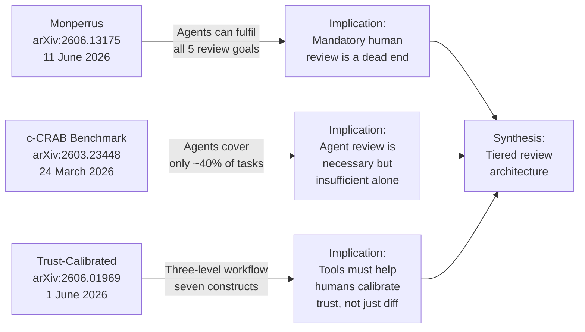
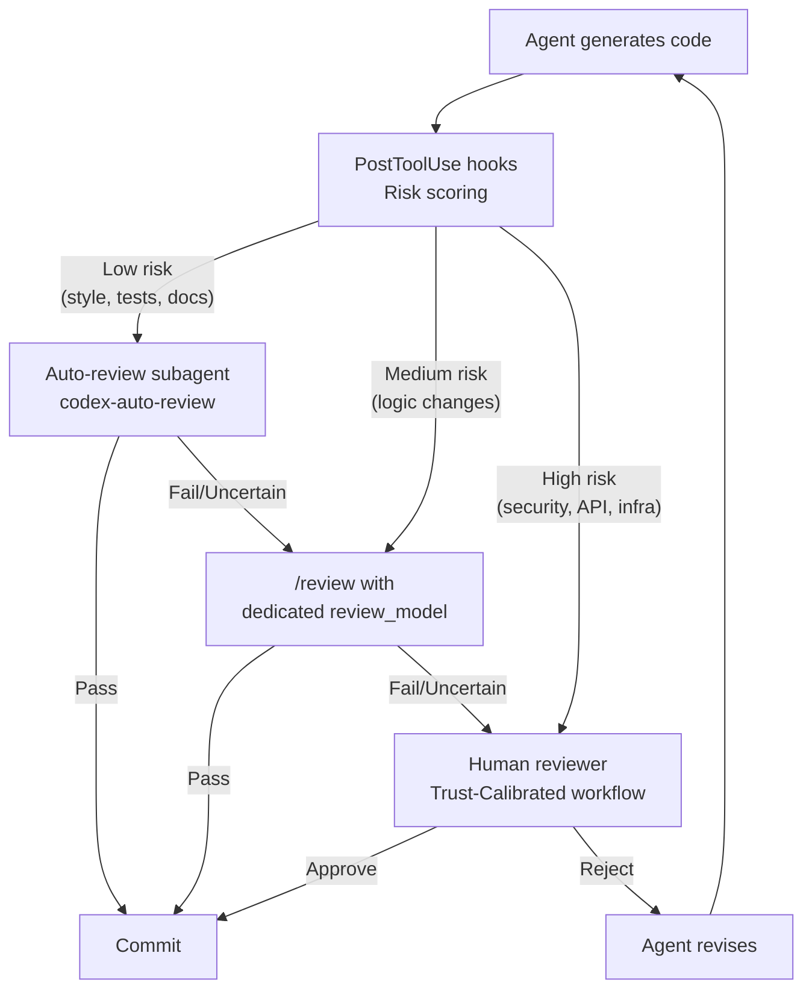

# The End of Code Review? What Three June 2026 Papers Mean for Codex CLI Review Workflows


---

Code review has been the primary quality gate in software engineering since Fagan formalised code inspection in 1976[^1]. Within a single month — June 2026 — three independent research papers arrived that collectively challenge, benchmark, and redesign that fifty-year practice for the age of coding agents. Martin Monperrus argues that agents have crossed the threshold where mandatory human review is neither effective nor scalable[^1]. The c-CRAB benchmark from the National University of Singapore reveals that today's review agents collectively address only ~40% of real-world review tasks[^2]. And a JetBrains-backed participatory design study reframes the entire problem: reviewing agent-generated code is a trust-calibration exercise, not a diffing exercise[^3].

This article synthesises all three, maps their findings to Codex CLI's existing review infrastructure, and identifies the configuration patterns that let practitioners act on the research today.

## The Three Papers at a Glance



### Monperrus: The Obsolescence Thesis

Monperrus identifies the five classical goals of code review — defect detection, style enforcement, knowledge transfer, team awareness, and security review — drawn from Bacchelli and Bird's foundational study[^1]. His central claim is that every one of these goals "can be served by agents at lower cost and higher throughput"[^1]. The most provocative argument is what he calls the "dead end" thesis: pairing agent-generated code with mandatory human review fails because humans cannot reliably catch subtle semantic errors in AI output, and human review capacity cannot scale with agent productivity[^1].

He cites the trajectory from SWE-bench resolution rates — under 2% with GPT-4 baseline, 12.5% with SWE-agent, to over 70% with late-2025 frontier systems[^1] — as evidence that agents now surpass the defect-detection capability of median human reviewers. At large organisations, human review consumes 10–15% of developer hours with typical latency spanning 24 hours to days[^1].

### c-CRAB: The Reality Check

Zhang et al. constructed c-CRAB, a code review benchmark for AI agents working with real pull requests[^2]. They evaluated PR-agent, Devin, Claude Code, and Codex against it. The headline finding is sobering: current review agents collectively address only approximately 40% of benchmark tasks[^2]. More nuanced is the observation that "agent reviews often consider different aspects from the human reviews"[^2] — agents excel at pattern-matching and dataflow analysis but miss contextual architectural decisions that human reviewers catch naturally.

This 40% coverage figure directly contradicts a naïve reading of Monperrus. Agents are not yet complete replacements for human review; they are powerful complements with predictable blind spots.

### Trust-Calibrated Code Review: The Design Response

Heander et al. conducted a participatory design study with JetBrains involving 17 practitioners in discovery and 43 in validation[^3]. Their central finding reframes the problem: reviewing LLM-generated multi-file changes is a trust-calibration problem, not a diffing problem[^3].

They propose a three-level review workflow:

1. **Overview level** — assess overall change scope and risk
2. **File-analysis level** — evaluate per-file risk signals
3. **Code snippet level** — deep-dive into flagged sections

Seven design constructs support this workflow: Chunk, Risk-per-line, Risk-per-file, Judge, Walk-through, Zooming in/out, and Security cage[^3]. In validation, 63% of practitioners expected reduced overall review effort, and 52% anticipated reduced trust-assessment burden compared to current tools[^3].

## Where Codex CLI Already Meets the Research

Codex CLI's review infrastructure, built incrementally from v0.122 through v0.140, maps surprisingly well to these three papers' recommendations. Here is how.

### The /review Command and review_model

The `/review` command launches a read-only sub-turn — architecturally separate from the coding agent — that evaluates changes without modifying the working tree[^4]. By default it uses the session's primary model, but `review_model` in `config.toml` lets you pin a dedicated model:

```toml
# config.toml
[review]
review_model = "o3"           # High-reasoning model for reviews
review_effort = "high"        # Controls depth of analysis
```

This separation maps directly to the Trust-Calibrated study's "Judge" construct — an independent evaluator that provides risk signals without being the same entity that produced the code[^3].

### The Auto-Review Subagent

Since v0.122, Codex CLI has shipped a dual mechanism: granular approval policies control which action categories surface for review, while the auto-review subagent controls who evaluates those prompts[^5]. The default routes every boundary-crossing action to the human operator:

```toml
# Default: human reviews everything
approvals_reviewer = "user"
```

Setting it to `auto_review` interposes a purpose-built agent — running the specialised `codex-auto-review` model since PR #18169 replaced the hardcoded GPT-5.4 slug[^6] — that evaluates each request against a security policy before deciding to approve, deny, or escalate:

```toml
# Agent reviews autonomously, escalates uncertain cases
approvals_reviewer = "auto_review"
```

This is precisely Monperrus's architecture made concrete: agent-generated code reviewed by a separate, specialised agent, with human escalation reserved for genuinely ambiguous cases.

### PostToolUse Hooks as Risk-per-File Signals

The Trust-Calibrated study's "Risk-per-file" and "Risk-per-line" constructs find their Codex CLI analogue in PostToolUse hooks[^7]. A hook that runs after every file write can compute complexity deltas, flag security-sensitive paths, or enforce architectural boundaries:

```json
{
  "hooks": {
    "PostToolUse": [
      {
        "command": "python3 scripts/review-risk.py ${FILE}",
        "on_failure": "ask_user"
      }
    ]
  }
}
```

When the hook fails — indicating elevated risk — `on_failure: "ask_user"` escalates to the human reviewer. This implements the Trust-Calibrated study's "Security cage" construct: a hard boundary that prevents low-trust changes from proceeding without human judgement[^3].

## A Tiered Review Architecture for Codex CLI

Synthesising all three papers, the optimal configuration is neither full-human review (Monperrus's "dead end") nor full-agent review (c-CRAB's 40% coverage gap). It is a tiered architecture:



### Tier 1: Automated Gating (Low Risk)

For style enforcement, formatting, documentation updates, and test additions — categories where c-CRAB shows agents perform well[^2] — the auto-review subagent handles review autonomously. This addresses Monperrus's throughput argument without exposing the organisation to the 60% gap.

```toml
[profiles.low-risk]
model = "gpt-5.4-mini"
approvals_reviewer = "auto_review"
approval_policy = "unless-allow-listed"
```

### Tier 2: Agent-Assisted Review (Medium Risk)

For logic changes, refactoring, and feature additions, the `/review` command with a high-reasoning model provides the "Judge" construct from the Trust-Calibrated study[^3]. The reviewer agent operates read-only and produces risk annotations that guide the developer's attention:

```toml
[profiles.standard]
model = "o4-mini"
review_model = "o3"
review_effort = "high"
approvals_reviewer = "user"
```

### Tier 3: Human-Led Review with Agent Support (High Risk)

For security-sensitive changes, API contract modifications, and infrastructure mutations, human review remains essential — but augmented by agent-produced risk signals. PostToolUse hooks flag files touching authentication, payment, or infrastructure paths, and the Trust-Calibrated three-level workflow guides the reviewer's attention from overview to file-level to snippet-level analysis[^3].

```toml
[profiles.security]
model = "o3"
review_model = "o3"
review_effort = "high"
approval_policy = "full-auto-deny"
approvals_reviewer = "user"
```

## The 40% Gap: What Agents Miss

The c-CRAB benchmark reveals that agent reviews "consider different aspects from the human reviews"[^2]. Based on the benchmark's failure patterns, these are the categories where human review remains critical:

- **Architectural coherence** — agents optimise locally but miss system-wide design intent
- **Requirement alignment** — verifying that code satisfies the unstated business context
- **Cross-repository implications** — changes that ripple through service boundaries
- **Regulatory compliance** — domain-specific constraints not captured in code patterns

Monperrus acknowledges these counterarguments but argues they represent a shrinking frontier[^1]. The pragmatic response is to encode as many of these constraints as possible into AGENTS.md and hook scripts, narrowing the gap over time.

## Practical AGENTS.md Pattern

An AGENTS.md file can encode review expectations that bridge the 40% gap:

```markdown
## Code Review Policy

### Automated Review Scope
- Style, formatting, and linting: auto-review permitted
- Test additions and modifications: auto-review permitted
- Documentation updates: auto-review permitted

### Human Review Required
- Changes to authentication or authorisation logic
- Database schema migrations
- API contract changes (OpenAPI spec modifications)
- Infrastructure-as-code modifications
- Any file matching patterns: `**/security/**`, `**/auth/**`, `**/payment/**`

### Review Escalation Triggers
- Complexity delta exceeds 15 points (McCabe)
- More than 5 files modified in a single change
- Any deletion of test files without corresponding feature removal
```

## The Decision Fatigue Dimension

Stack Overflow's May 2026 analysis documents the downstream effect: coding agents give everyone decision fatigue[^8]. When multiple agents run in parallel producing code faster than humans can review it, the quality of review decisions degrades. The tiered architecture directly addresses this by routing the majority of low-risk changes through automated review, preserving human cognitive capacity for the genuinely difficult decisions.

CircleCI's 2026 data reinforces this: feature branch throughput is up 59% year-over-year, while main branch throughput for the median team has actually fallen[^8]. The review layer, not the code-generation layer, is the bottleneck.

## Implications for the Codex CLI Roadmap

The convergence of these three papers points to several likely developments:

1. **Risk-scored diffs** — the Trust-Calibrated study's "Risk-per-line" construct is a natural extension of `/review` output
2. **Review coverage metrics** — c-CRAB-style benchmarking of the auto-review subagent's blind spots
3. **Tiered approval policy presets** — codifying the three-tier architecture into named profile templates
4. **Escalation analytics** — tracking which categories most frequently escalate from agent to human review, enabling progressive automation

## Conclusion

Monperrus is directionally correct: mandatory human review of every agent-generated change is unsustainable. But c-CRAB demonstrates that agent-only review leaves a 60% gap. The Trust-Calibrated study provides the design framework for navigating between these poles. Codex CLI's existing review infrastructure — `/review`, `review_model`, `auto_review`, PostToolUse hooks, and named profiles — already implements the key architectural primitives. The configuration patterns in this article let practitioners build the tiered review architecture that the research demands, today.

## Citations

[^1]: M. Monperrus, "The End of Code Review: Coding Agents Supersede Human Inspection," arXiv:2606.13175, 11 June 2026. [https://arxiv.org/abs/2606.13175](https://arxiv.org/abs/2606.13175)

[^2]: Y. Zhang, Z. Pan, I. N. B. Yusuf, H. Ruan, R. Shariffdeen, A. Roychoudhury, "Code Review Agent Benchmark," arXiv:2603.23448, 24 March 2026 (revised 7 April 2026). [https://arxiv.org/abs/2603.23448](https://arxiv.org/abs/2603.23448)

[^3]: L. G. Heander, A. Sergeyuk, I. Zakharov, E. Söderberg, N. Mukhortov, "Trust-Calibrated Code Review: A Participatory Design Study of Review Workflows for LLM-Generated Multi-File Changes," arXiv:2606.01969, 1 June 2026. [https://arxiv.org/abs/2606.01969](https://arxiv.org/abs/2606.01969)

[^4]: OpenAI, "Codex CLI Code Review Workflows: /review, review_model, and the MCP Extension," Codex Documentation, 2026. [https://developers.openai.com/codex/cli](https://developers.openai.com/codex/cli)

[^5]: OpenAI, "Codex CLI Granular Approval Policies and the Auto-Review Subagent," Codex Documentation, 2026. [https://developers.openai.com/codex/cli](https://developers.openai.com/codex/cli)

[^6]: OpenAI, "Purpose-Built Agent Models: codex-auto-review," openai/codex PR #18169, 2026. [https://github.com/openai/codex](https://github.com/openai/codex)

[^7]: OpenAI, "Configuration Reference — Codex," OpenAI Developers, 2026. [https://developers.openai.com/codex/config-reference](https://developers.openai.com/codex/config-reference)

[^8]: Stack Overflow, "Coding agents are giving everyone decision fatigue," Stack Overflow Blog, 21 May 2026. [https://stackoverflow.blog/2026/05/21/coding-agents-are-giving-everyone-decision-fatigue/](https://stackoverflow.blog/2026/05/21/coding-agents-are-giving-everyone-decision-fatigue/)
