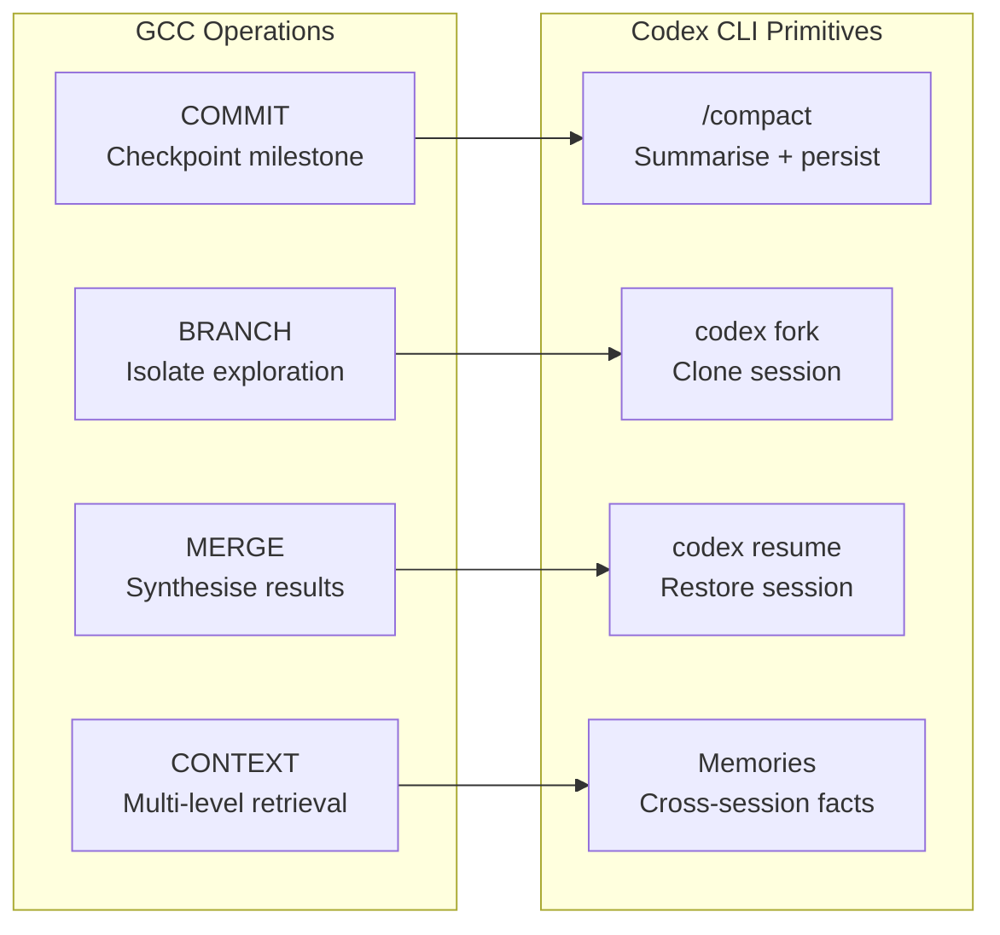
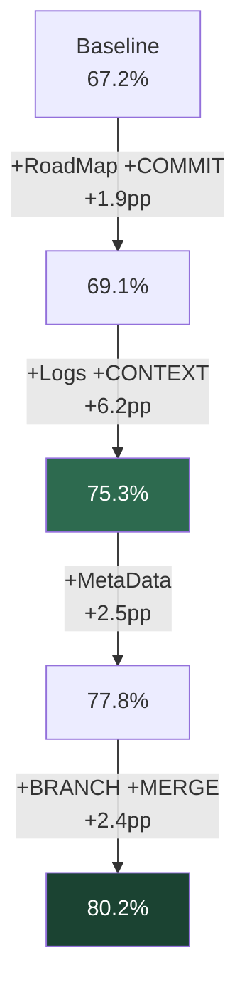

# Git Context Controller: What Versioned Agent Memory Means for Codex CLI Session Management


---

The Git Context Controller paper (arXiv:2508.00031, Wu et al., revised March 2026) achieved 80.2% on SWE-Bench Verified by treating agent memory not as a disposable token stream but as a versioned file system with COMMIT, BRANCH, MERGE, and CONTEXT operations[^1]. That result — beating 26 open and commercial systems — did not come from a larger model or a longer context window. It came from structured context engineering.

Codex CLI already ships four session primitives that map, imperfectly but usefully, to GCC's four operations: `/compact`, `codex fork`, `codex resume`, and the built-in memory system. This article examines what GCC's ablation data reveals about which context strategies deliver the largest gains, and how practitioners can configure Codex CLI to capture those gains today.

## The Problem: Summarisation Makes Agents Dumber

Every coding agent that runs long enough hits the context ceiling. The standard mitigation — summarise and truncate — is well understood, but GCC's authors make a sharper claim: "agents become 'dumber' each time their context is compressed"[^1]. Summarisation discards the fine-grained execution traces that agents need for backtracking, error recovery, and cross-step reasoning.

LOCA-bench (arXiv:2602.07962, Zeng et al., February 2026) quantified this: frontier models achieve roughly two to three times the accuracy of open-source models in longer context settings, but all models degrade predictably as environment states grow more complex[^2]. The bottleneck is not raw context length but *context quality* — whether the agent can retrieve the right detail at the right abstraction level.

GCC's solution is to replace lossy compression with structured persistence. Instead of summarising away history, GCC commits checkpoints, branches for exploration, merges results, and retrieves at multiple granularities.

## GCC's Four Operations and Codex CLI Equivalents



### COMMIT → `/compact` and Session Persistence

GCC's COMMIT transforms transient reasoning into persistent memory records with intent, summaries, and detailed descriptions[^1]. Codex CLI's `/compact` command calls `POST /v1/responses/compact`, which returns an AES-encrypted compressed representation of the conversation[^3]. The server decrypts it on resume, prepending a handoff message to the model.

The key difference: GCC commits are *additive* — they create named checkpoints without destroying the original trace. Codex CLI's compaction is *lossy* — it replaces the full transcript with a compressed representation. GCC's ablation shows COMMIT alone contributes a 1.9 percentage point lift (67.2% → 69.1%)[^1], but the larger gains come from layering CONTEXT retrieval on top.

**Practical configuration:**

```toml
# config.toml — trigger compaction before context pressure forces lossy truncation
model_auto_compact_token_limit = 150000  # tokens before auto-compaction triggers
```

Setting a conservative `model_auto_compact_token_limit` ensures compaction runs whilst enough context remains to produce a high-quality summary, rather than waiting until the model is already degrading[^4].

### BRANCH → `codex fork` and Git Worktrees

GCC's BRANCH creates isolated execution states for exploring alternative strategies without affecting the main trajectory[^1]. Codex CLI offers two isolation mechanisms:

1. **`codex fork`** — clones an existing session's transcript into a new session, preserving the original and giving the fork a fresh context window[^5].
2. **Git worktrees** — each subagent runs in its own worktree, providing filesystem-level isolation for parallel exploration[^6].

GCC's ablation shows BRANCH and MERGE together contribute the final 2.4 percentage point lift (77.8% → 80.2%)[^1]. This is the strongest evidence that *parallel exploration with controlled synthesis* is not a luxury feature — it is a measurable performance driver.

**Practical pattern — speculative branching with subagents:**

```bash
# Fork the current session to explore an alternative approach
codex fork --name "refactor-approach-b"

# Or use subagents for parallel exploration in isolated worktrees
codex --profile explore "Try approach B for the auth module"
```

The `codex fork` command preserves the full transcript in the original session[^5]. Unlike GCC's BRANCH, Codex CLI does not currently support automatic MERGE of forked sessions — the developer must manually compare outcomes and choose the winner.

### MERGE → Manual Synthesis (Gap)

GCC's MERGE synthesises branch results back into the main planning state, updating execution traces with origin annotations and refreshing the global roadmap[^1]. Codex CLI has no automatic merge primitive for session transcripts.

This is the most significant architectural gap. Workaround patterns:

```markdown
<!-- AGENTS.md — instruct the agent to compare fork outcomes -->
## Session Fork Policy
When exploring alternative approaches:
1. Fork the session with `codex fork --name <approach>`
2. Document the outcome in a `## Fork Summary` section at the end
3. The primary session should review fork summaries before committing
```

### CONTEXT → Memories and Multi-Level Retrieval

GCC's CONTEXT operation provides hierarchical retrieval — from project overviews down to fine-grained execution traces — with windowed access for long histories[^1]. Codex CLI's memory system (GA since v0.100.0) extracts facts, preferences, and project context from sessions and persists them in SQLite for cross-session retrieval[^7].

The gap is granularity. GCC supports retrieval at multiple abstraction levels within a single session. Codex CLI's memories are coarse-grained cross-session facts, whilst in-session context is either fully present or compacted away. GCC's ablation shows detailed logs plus CONTEXT retrieval contributes a 6.2 percentage point lift (69.1% → 75.3%) — the single largest component gain[^1].

## The Ablation Data: Where the Gains Actually Are

GCC's component-by-component ablation on SWE-Bench Verified tells a clear story about which context strategies matter most:



The largest single gain — 6.2 percentage points — comes from structured logging combined with multi-level retrieval[^1]. This suggests that Codex CLI users would benefit most from:

1. **Richer session logging** — using PostToolUse hooks to capture structured metadata about each tool invocation, not just the result.
2. **Granular retrieval** — configuring memories with more specific extraction rather than relying on automatic summarisation.

The second-largest combined gain — BRANCH and MERGE at 2.4 percentage points — validates the fork-and-compare workflow that Codex CLI supports manually but does not automate[^1].

## Configuring Codex CLI for GCC-Style Context Management

### 1. Structured Checkpointing with PostToolUse Hooks

GCC's COMMIT creates structured records. Codex CLI's hooks can approximate this by logging tool outcomes in a machine-readable format:

```bash
#!/bin/bash
# .codex/hooks/post-tool-use.sh
# Log structured metadata after each tool use
TOOL_NAME="$1"
RESULT_FILE="$2"

echo "$(date -u +%Y-%m-%dT%H:%M:%SZ) | $TOOL_NAME | $(wc -c < "$RESULT_FILE") bytes" \
  >> .codex/session-log.tsv
```

### 2. RoadMap as AGENTS.md

GCC's RoadMap — stored in `main.md` — records high-level goals, milestones, and the task backlog[^1]. This maps directly to `AGENTS.md`:

```markdown
<!-- AGENTS.md — GCC-style roadmap section -->
## Project Roadmap
- **Goal:** Migrate auth module from REST to gRPC
- **Milestones:**
  1. ✅ Define protobuf schemas
  2. 🔄 Implement server stubs
  3. ⬜ Update client SDK
  4. ⬜ Integration tests

## Context Policy
- Compact at 150K tokens, not at failure
- Fork sessions for architectural alternatives
- Document fork outcomes in ## Fork Summary sections
```

### 3. Proactive Compaction Thresholds

GCC avoids lossy compression entirely by using structured persistence. Codex CLI cannot avoid compaction, but it can compact *early* — before context pressure degrades output quality:

```toml
# config.toml
[profiles.long-session]
model = "gpt-5.4"
model_auto_compact_token_limit = 120000  # compact well before the 1M ceiling
```

Research from agent context engineering practitioners suggests that the cost of proactive summarisation is far lower than the cost of recovering from a context-driven failure[^8].

### 4. Fork-Based Exploration for Complex Tasks

For tasks where multiple approaches are viable, the fork-and-compare pattern approximates GCC's BRANCH/MERGE:

```bash
# Create two exploration forks
codex fork --name "approach-sql-migration"
codex fork --name "approach-orm-rewrite"

# After both complete, resume the original and compare
codex resume --last
```

## What GCC Gets Right That Codex CLI Should Adopt

Three capabilities from GCC are currently missing from Codex CLI and would deliver measurable gains based on the ablation data:

1. **Multi-level retrieval within sessions** — the ability to query session history at different abstraction levels (overview, milestone, detailed trace) rather than all-or-nothing compaction. This is GCC's largest single contributor at +6.2pp[^1].

2. **Automatic fork merging** — synthesising outcomes from parallel exploration branches with origin annotations, rather than requiring manual comparison. Worth +2.4pp in GCC's ablation[^1].

3. **Non-destructive checkpointing** — creating named restore points that preserve the full trace, unlike compaction which replaces it. GCC's COMMIT is additive; Codex CLI's `/compact` is lossy[^1].

## Cross-Agent Memory: The Bigger Picture

GCC's framework "naturally supports cross-agent and cross-session continuity: a new agent does not need to be re-instructed from scratch, and even an agent running on a different LLM or machine can seamlessly resume from the exact state left by its predecessor"[^1].

Codex CLI's `/import` command (GA since v0.130.0) already supports importing sessions from Claude Code[^9], and the memory system persists across sessions. But GCC's vision is more ambitious: a shared, versioned memory workspace that any agent — regardless of vendor or model — can read from and write to.

The Lore protocol (arXiv:2603.15566) pursues a similar idea, repurposing git commit messages as a structured knowledge protocol for coding agents[^10]. Together, these papers point towards a future where agent memory is a first-class, portable artefact — not locked into a single vendor's session format.

## Conclusion

GCC's 80.2% on SWE-Bench Verified is not a model result — it is a *harness* result. The same Claude 4 Sonnet model scores 67.2% without GCC's context management and 80.2% with it[^1]. That 13 percentage point gap is entirely attributable to how memory is structured, persisted, and retrieved.

Codex CLI practitioners can capture a portion of these gains today through disciplined use of `/compact` thresholds, `codex fork` for exploration, structured AGENTS.md roadmaps, and PostToolUse logging hooks. The remaining gap — multi-level retrieval, automatic merge, and non-destructive checkpoints — represents the clearest feature roadmap for Codex CLI's session management layer.

---

## Citations

[^1]: Wu, J., Hu, M., Zhu, J., Pan, J., Liu, Y., Xu, M., & Jin, Y. (2026). "Git Context Controller: Manage the Context of LLM-based Agents like Git." arXiv:2508.00031v2. [https://arxiv.org/abs/2508.00031](https://arxiv.org/abs/2508.00031)

[^2]: Zeng, W., et al. (2026). "LOCA-bench: Benchmarking Language Agents Under Controllable and Extreme Context Growth." arXiv:2602.07962. [https://arxiv.org/abs/2602.07962](https://arxiv.org/abs/2602.07962)

[^3]: "Codex CLI Context Compaction: Architecture, Configuration, and Managing Long Sessions." Codex Knowledge Base, March 2026. [https://codex.danielvaughan.com/2026/03/31/codex-cli-context-compaction-architecture/](https://codex.danielvaughan.com/2026/03/31/codex-cli-context-compaction-architecture/)

[^4]: "Context Engineering for Codex CLI: Write, Select, Compress, Isolate." Codex Knowledge Base, June 2026. [https://codex.danielvaughan.com/2026/06/10/context-engineering-codex-cli-write-select-compress-isolate-june-2026/](https://codex.danielvaughan.com/2026/06/10/context-engineering-codex-cli-write-select-compress-isolate-june-2026/)

[^5]: "Codex CLI Session Lifecycle: Archive, Resume, Fork, and Compact." Codex Knowledge Base, June 2026. [https://codex.danielvaughan.com/2026/06/05/codex-cli-session-lifecycle-archive-resume-fork-compact-management/](https://codex.danielvaughan.com/2026/06/05/codex-cli-session-lifecycle-archive-resume-fork-compact-management/)

[^6]: "Worktree-Based Parallel Development with Codex CLI." Codex Knowledge Base, March 2026. [https://codex.danielvaughan.com/2026/03/26/codex-cli-worktree-parallel-development/](https://codex.danielvaughan.com/2026/03/26/codex-cli-worktree-parallel-development/)

[^7]: "Codex CLI Memories: Native Session Persistence, Third-Party Memory MCP Servers, and Cross-Session Context Strategies." Codex Knowledge Base, May 2026. [https://codex.danielvaughan.com/2026/05/01/codex-cli-memories-persistent-context-session-memory-ecosystem/](https://codex.danielvaughan.com/2026/05/01/codex-cli-memories-persistent-context-session-memory-ecosystem/)

[^8]: "Agent Context Engineering 2026: Sliding Windows, Hierarchical Summarization, and Memory Offloading for Long-Running Production Tasks." AgentMarketCap, April 2026. [https://agentmarketcap.ai/blog/2026/04/11/agent-context-engineering-sliding-windows-memory-2026](https://agentmarketcap.ai/blog/2026/04/11/agent-context-engineering-sliding-windows-memory-2026)

[^9]: "Codex CLI v0.140 Stable Release Guide." Codex Knowledge Base, June 2026. [https://codex.danielvaughan.com/2026/06/16/codex-cli-v0140-stable-release-guide-usage-tracking-session-deletion-claude-import-encrypted-credentials/](https://codex.danielvaughan.com/2026/06/16/codex-cli-v0140-stable-release-guide-usage-tracking-session-deletion-claude-import-encrypted-credentials/)

[^10]: "Lore: Repurposing Git Commit Messages as a Structured Knowledge Protocol for AI Coding Agents." arXiv:2603.15566. [https://arxiv.org/abs/2603.15566](https://arxiv.org/abs/2603.15566)
