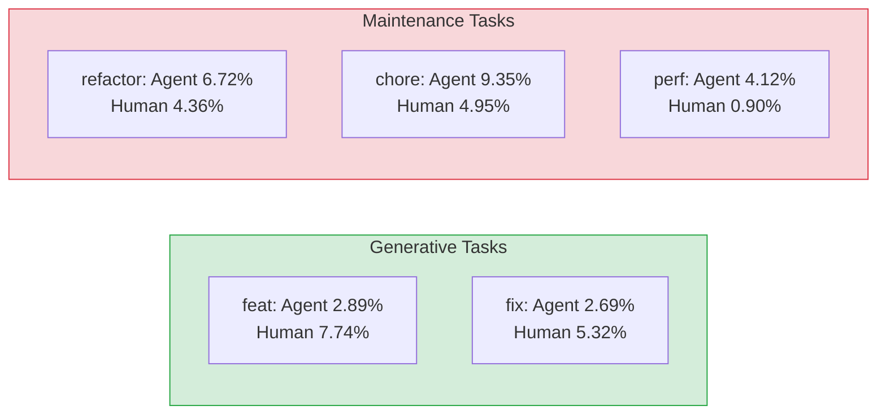
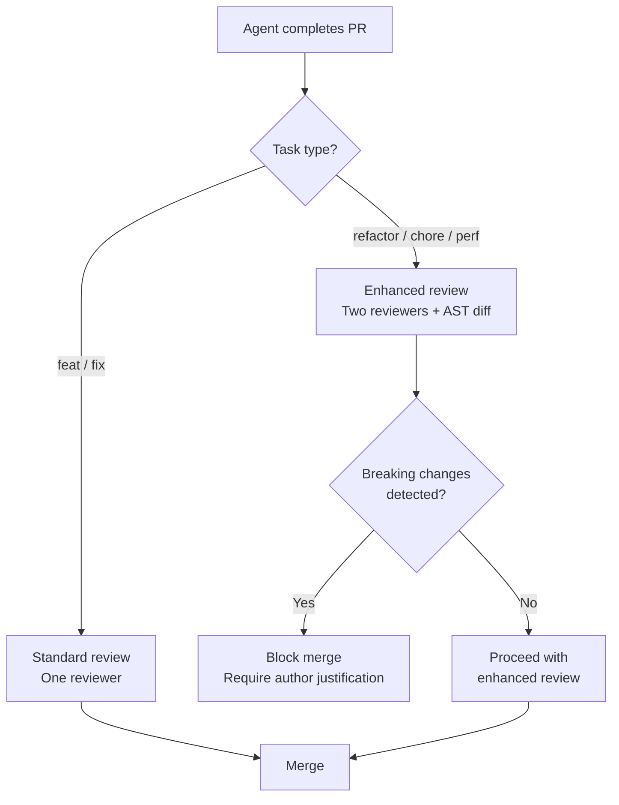

# Safer Builders, Risky Maintainers: What the MSR 2026 Breaking Changes Study Means for Codex CLI Refactoring and Maintenance Configuration


---

The headline number is reassuring: AI coding agents introduce breaking changes at half the rate of human developers — 3.45% versus 7.40%[^1]. If you stopped reading there, you might conclude that delegating more work to Codex CLI is a net safety win.

You would be wrong — or at least dangerously incomplete.

A closer look at the MSR 2026 paper *Safer Builders, Risky Maintainers* reveals that the safety advantage exists only for generative tasks. When agents tackle refactoring or chore work, the breaking change rate doubles or triples past the human baseline[^1]. This article unpacks the data, explains why the asymmetry exists, and provides five Codex CLI configuration patterns that defend against it.

## The Data: Task Type Changes Everything

Researchers analysed 7,191 agent-authored and 1,402 human-authored pull requests from the AIDev dataset, covering 60,324 patches across Python repositories[^1]. They built an AST-based breaking change detector — validated at 95.7% and 93.6% accuracy by human reviewers (Cohen's κ = 0.79) — and classified each patch by conventional commit type[^1].

The results split cleanly into two regimes:

### Generative Tasks: Agents Are Safer

| Task type | Agent rate | Human rate |
|-----------|-----------|-----------|
| Feature (`feat`) | 2.89% | 7.74% |
| Bug fix (`fix`) | 2.69% | 5.32% |

For code creation and bug fixing, agents outperform humans on breaking change avoidance by a wide margin[^1].

### Maintenance Tasks: Agents Are Riskier

| Task type | Agent rate | Human rate |
|-----------|-----------|-----------|
| Refactor | 6.72% | 4.36% |
| Chore | 9.35% | 4.95% |
| Performance (`perf`) | 4.12% | 0.90% |

The reversal is stark. Agents introduce refactoring breaking changes at 1.5× the human rate and chore breaking changes at nearly 2× the human rate[^1]. Performance optimisations show the most dramatic gap — agents break things at 4.6× the human rate[^1].



### The Agent Comparison

Not all agents carry equal risk. OpenAI Codex showed the lowest overall breaking change rate at 2.62%, followed by GitHub Copilot at 3.04%, Devin at 4.09%, Cursor at 4.20%, and Claude Code at 5.10%[^1]. However, the study did not break these per-agent figures down by task type, so one cannot assume that Codex's lower overall rate means it is safe on maintenance tasks specifically.

## Why Maintenance Tasks Are Harder for Agents

The asymmetry has structural causes that matter for configuration decisions.

**Generative tasks have clear success signals.** Write a new function, run the tests, they pass. The agent's execute-fail-fix loop works well because test failures provide unambiguous feedback[^2].

**Maintenance tasks require understanding what must not change.** Refactoring, by definition, means preserving external behaviour while restructuring internals. That requires understanding API contracts, downstream consumers, and implicit invariants — precisely the kind of contextual knowledge that agents lack unless explicitly provided[^3].

**Chore tasks touch cross-cutting infrastructure.** Build configuration, dependency management, CI pipeline definitions — these files have wide blast radii and sparse test coverage. An agent optimising a `pyproject.toml` has no test to tell it that a downstream package relied on a specific version constraint[^1].

## The Confidence Trap

Perhaps the most concerning finding: breaking changes occurred at every confidence level the agents reported[^1]. At confidence 10/10, agents still introduced breaking changes in 3.16% of patches. At confidence 8/10, the rate was 3.94%[^1].

This demolishes any workflow that uses agent-reported confidence as a merge gate. The agent does not know what it does not know — and its self-assessment provides no usable signal for breaking change risk.

## Five Codex CLI Configuration Patterns for Maintenance Safety

### 1. Task-Specific Approval Policies via Named Profiles

Create a `refactor` profile that tightens approval policy for maintenance work:

```toml
# ~/.codex/config.toml

[profile.build]
model = "gpt-5-codex"
approval_policy = "auto-edit"
reasoning_effort = "medium"

[profile.refactor]
model = "gpt-5-codex"
approval_policy = "suggest"
reasoning_effort = "high"
```

The `suggest` policy forces Codex to propose every change for human review rather than applying edits autonomously[^4]. The `high` reasoning effort gives the model more time to consider invariants. Launch refactoring sessions explicitly:

```bash
codex --profile refactor "Refactor the authentication module to use the new middleware pattern"
```

For generative work where agents are demonstrably safer, `auto-edit` or even `full-auto` remains defensible[^4].

### 2. PostToolUse Breaking Change Detection Hooks

Wire an AST-based breaking change detector into the PostToolUse hook pipeline. This runs after every file edit, catching breaking changes before they compound:

```toml
# .codex/config.toml

[[hooks]]
event = "PostToolUse"
tool = "edit_file"
command = "python .codex/scripts/detect_breaking_changes.py $CODEX_FILE_PATH"
on_failure = "stop"
```

The hook script compares the AST of the modified file against its pre-edit state, flagging removed public functions, changed function signatures, deleted class attributes, or altered return types. Semgrep's AST-based matching can serve as the analysis engine[^5]:

```bash
# .codex/scripts/detect_breaking_changes.py (simplified)
#!/usr/bin/env python3
import ast, sys, subprocess

filepath = sys.argv[1]

# Run semgrep rules for breaking change patterns
result = subprocess.run(
    ["semgrep", "--config", ".codex/rules/breaking-changes.yml",
     "--json", "--quiet", filepath],
    capture_output=True, text=True
)

if result.returncode != 0:
    print(f"BREAKING CHANGE DETECTED in {filepath}", file=sys.stderr)
    print(result.stdout, file=sys.stderr)
    sys.exit(1)
```

### 3. AGENTS.md Maintenance Task Instructions

Add explicit maintenance-task guardrails to your project's AGENTS.md:

```markdown
## Maintenance and Refactoring Rules

When performing refactoring, chore, or performance tasks:

1. **Never remove or rename public API functions, classes, or constants**
   without explicit human approval, even if they appear unused.
2. **Run the full test suite** after every structural change, not just
   affected module tests.
3. **Check downstream consumers** before modifying shared utilities.
   Search for all import sites with `grep -r "from module import"`.
4. **Preserve all function signatures** including parameter names,
   defaults, and type annotations. Internal restructuring must not
   change the external contract.
5. **For dependency changes**, verify that pinned versions in
   requirements.txt and pyproject.toml remain compatible with all
   consuming packages in the monorepo.
```

This addresses the root cause directly: agents break maintenance tasks because they lack implicit knowledge about what must not change. Making that knowledge explicit in AGENTS.md converts invisible constraints into enforceable instructions[^6].

### 4. Stop Hook Test Gate for Refactoring Sessions

The MSR 2026 data shows that the test suite is your primary defence against breaking changes — but only if it actually runs before the agent declares "done". Configure a Stop hook that enforces this:

```toml
[[hooks]]
event = "Stop"
command = "make test-full 2>&1 | tail -20"
on_failure = "prevent"
```

The `prevent` action blocks the session from completing if tests fail[^4]. This is particularly critical for refactoring sessions where the agent may believe the restructuring is complete but has not verified behavioural equivalence.

For maintenance tasks touching build configuration or CI, extend the gate:

```toml
[[hooks]]
event = "Stop"
command = ".codex/scripts/maintenance-gate.sh"
on_failure = "prevent"
```

```bash
#!/bin/bash
# .codex/scripts/maintenance-gate.sh
set -e

echo "Running full test suite..."
make test-full

echo "Checking for breaking API changes..."
python .codex/scripts/detect_breaking_changes.py --diff HEAD~1

echo "Validating dependency constraints..."
pip check

echo "All maintenance gates passed."
```

### 5. Confidence Score Scepticism in Review Workflows

Given that confidence scores provide no breaking change signal, do not surface them as merge criteria in automated review pipelines. Instead, use task-type classification as the review routing signal:



When using `codex exec` in CI pipelines, classify the task type from the commit message or PR labels and route accordingly:

```bash
#!/bin/bash
TASK_TYPE=$(echo "$PR_TITLE" | grep -oP '^(feat|fix|refactor|chore|perf)')

case "$TASK_TYPE" in
  refactor|chore|perf)
    echo "Maintenance task detected — requiring enhanced review"
    gh pr edit "$PR_NUMBER" --add-label "enhanced-review"
    codex exec --profile refactor \
      --output-schema .codex/schemas/breaking-change-report.json \
      "Analyse the diff in this PR for potential breaking changes. Check all modified function signatures, removed exports, and changed return types."
    ;;
  *)
    echo "Generative task — standard review"
    ;;
esac
```

## The Broader Pattern

The MSR 2026 findings join a growing body of evidence that agent performance varies dramatically by task type. The earlier AIDev analysis found that documentation, CI, and build update tasks achieve the highest merge rates, while performance and bug-fix tasks perform worst[^7]. The "Behind Agentic Pull Requests" study found that 58% of human intervention effort goes to guidance-level corrections — restricting agent actions and enforcing project conventions — rather than fixing code[^8].

These are not model quality problems. They are configuration problems. The agent performs differently on different task types because different tasks require different amounts of context, different approval thresholds, and different verification strategies. Treating all agent work identically — same profile, same approval policy, same review process — is the configuration equivalent of running production and development on the same infrastructure.

## Practical Recommendations

1. **Audit your current usage split.** If your team delegates maintenance and refactoring to Codex CLI with the same configuration as feature work, you are operating in the high-risk regime without knowing it.

2. **Create task-specific profiles.** At minimum, separate `build` and `refactor` profiles with different approval policies and reasoning effort levels.

3. **Add AST-based breaking change hooks.** The MSR 2026 researchers' detection approach — comparing pre- and post-edit ASTs — is straightforward to implement as a PostToolUse hook.

4. **Ignore confidence scores for merge decisions.** Use task-type classification and automated breaking change detection instead.

5. **Update AGENTS.md with maintenance constraints.** The agent cannot preserve invariants it does not know about. Make implicit knowledge explicit.

The data is clear: AI coding agents are safer builders and riskier maintainers. Configure accordingly.

## Citations

[^1]: Khalil, R., Osman, M., & El-Ramly, M. (2026). "Safer Builders, Risky Maintainers: A Comparative Study of Breaking Changes in Human vs Agentic PRs." *Proceedings of the 23rd International Conference on Mining Software Repositories (MSR 2026)*. arXiv:2603.27524. [https://arxiv.org/abs/2603.27524](https://arxiv.org/abs/2603.27524)

[^2]: Shang, Y. et al. (2026). "TEBench: A Test Evolution Benchmark for Coding Agents." arXiv:2605.06125. [https://arxiv.org/abs/2605.06125](https://arxiv.org/abs/2605.06125)

[^3]: Horthy, D. (2025). "The Twelve-Factor Agent." AI Engineer World's Fair 2025. [https://www.deeplearning.ai/the-batch/the-twelve-factor-agent/](https://www.deeplearning.ai/the-batch/the-twelve-factor-agent/)

[^4]: OpenAI. (2026). "Codex CLI Reference: Command Line Options." [https://developers.openai.com/codex/cli/reference](https://developers.openai.com/codex/cli/reference)

[^5]: Semgrep. (2026). "Semgrep Autofix Public Beta: Breaking Change Analysis and AI-Assisted Fix Suggestions." [https://semgrep.dev/blog/2026/semgrep-autofix-public-beta/](https://semgrep.dev/blog/2026/semgrep-autofix-public-beta/)

[^6]: OpenAI. (2026). "Best Practices — Codex." [https://developers.openai.com/codex/learn/best-practices](https://developers.openai.com/codex/learn/best-practices)

[^7]: Alami, A. et al. (2026). "Where Do AI Coding Agents Fail? An Empirical Study of Failed Agentic Pull Requests in GitHub." *MSR 2026 Mining Challenge*. arXiv:2601.15195. [https://arxiv.org/abs/2601.15195](https://arxiv.org/abs/2601.15195)

[^8]: Li, Z. et al. (2026). "Behind Agentic Pull Requests: An Empirical Study on Developer Interventions in AI Agent-Authored Pull Requests." *MSR 2026 Mining Challenge*. [https://2026.msrconf.org/details/msr-2026-mining-challenge/26/](https://2026.msrconf.org/details/msr-2026-mining-challenge/26/)
