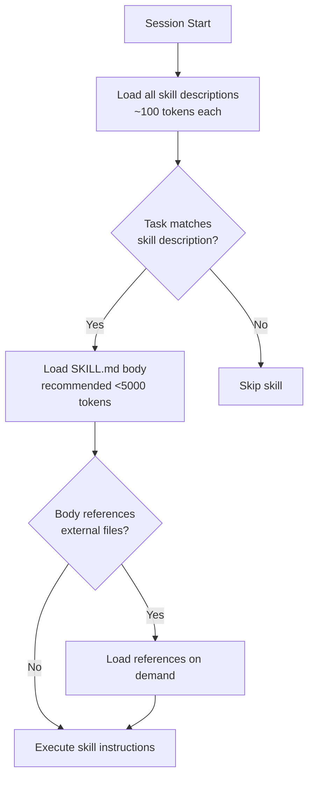
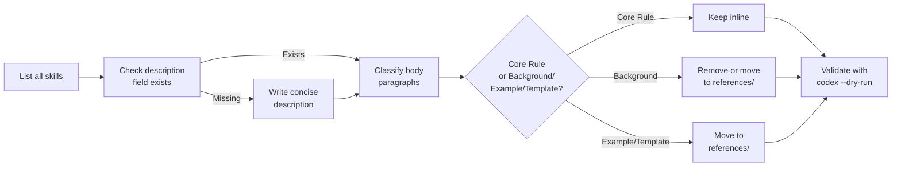

# SkillReducer: What the First Large-Scale Skill Bloat Study Means for Codex CLI Token Efficiency


---

## The Problem: Skills That Cost More Than They Contribute

Agent skills — the SKILL.md instruction files that Codex CLI loads contextually to guide behaviour on specific tasks — are one of the most powerful configuration surfaces available to practitioners [^1]. They let you encode repeatable workflows, coding standards, and domain expertise into reusable packages that any agent can consume.

But how efficient are they? A March 2026 study by Gao et al. titled *SkillReducer: Optimizing LLM Agent Skills for Token Efficiency* (arXiv:2603.29919) analysed 55,315 publicly available skills and found systemic waste: 26.4% lack routing descriptions entirely, over 60% of body content is non-actionable, and reference-heavy skills can inject tens of thousands of tokens per invocation [^2]. Every surplus token costs money and dilutes the model's attention.

This article maps SkillReducer's findings to practical Codex CLI skill authoring and configuration, showing where bloat hides and how to eliminate it.

## What SkillReducer Found

### The Content Taxonomy

SkillReducer classifies skill body content into five categories based on analysis of 15,107 paragraph-level items [^2]:

| Category | Proportion | Actionable? |
|----------|-----------|-------------|
| Core Rule | 38.5% | Yes |
| Background | 40.7% | No |
| Example | 12.9% | Conditionally |
| Template | 7.6% | Conditionally |
| Redundant | 0.3% | No |

The headline finding: **only 38.5% of skill body content consists of actionable core rules**. The remaining 61.5% — background rationale, illustrative examples, boilerplate templates, and outright duplication — is injected into the context window regardless of task relevance.

### The Cost of Bloat

A typical 10,000-token skill costs \$0.03–\$0.15 per invocation depending on the model [^2]. At scale, this adds up rapidly. The study found that 100 skills from the SkillHub marketplace collectively contained 1.67 million tokens across 505 files [^2] — a significant context budget even for models with large windows.

### Compression Without Regression

SkillReducer achieved 48% description compression and 39% body compression while *improving* functional quality by 2.8% [^2]. This "less-is-more" effect confirms that stripping non-essential content reduces cognitive load in the context window. Cross-model validation across five models from four families showed a mean retention rate of 0.965, and independent framework testing (OpenCode) achieved 0.944 retention [^2].

Against baselines at equivalent token budgets, SkillReducer significantly outperformed alternatives [^2]:

| Method | Retention Score |
|--------|----------------|
| SkillReducer | 0.949 |
| LLM direct compression | 0.918 |
| Truncation | 0.845 |
| LLMLingua | 0.820 |

## How Codex CLI Loads Skills

Understanding where SkillReducer's findings bite requires knowing how Codex CLI handles skills. The SKILL.md format follows the Agent Skills open standard — the same files work across Codex CLI, Claude Code, Cursor, and Gemini CLI [^3]. Skills live in either `~/.codex/skills/` (personal) or `.codex/skills/` (project-level), and Codex loads them at startup [^4].

The loading model uses progressive disclosure [^5]:



This three-tier architecture — description always in context, body loaded on activation, references loaded on demand — already mitigates some bloat. But SkillReducer's findings reveal that each tier has its own efficiency problems.

## Mapping SkillReducer to Codex CLI Practice

### Tier 1: Fix Missing and Bloated Descriptions

SkillReducer found that 26.4% of skills lack routing descriptions entirely [^2]. In Codex CLI terms, a missing `description` field in SKILL.md frontmatter forces the agent to evaluate the full body to determine relevance — paying the token cost even when the skill is irrelevant to the current task.

The fix is straightforward. Every SKILL.md must have a concise `description` that covers what the skill does and when to activate it:

```yaml
---
name: api-test-generator
description: >
  Generates API integration tests from OpenAPI specs.
  Use when creating or updating test suites for REST endpoints.
  Do NOT use for unit tests or UI tests.
---
```

SkillReducer's adversarial delta debugging technique for descriptions works by segmenting descriptions into semantic clauses, then applying binary partitioning to find the minimal sufficient set that still enables correct skill selection against distractors [^2]. The practical lesson: include trigger phrases and exclusion boundaries, but cut explanatory padding.

### Tier 2: Restructure Bodies for Progressive Disclosure

The 61.5% of non-actionable body content is the primary cost driver. SkillReducer's taxonomy-driven restructuring separates content into an always-loaded core module and on-demand reference modules [^2].

For Codex CLI skills, this maps directly to the `references/` subdirectory in the skill folder structure [^5]. Rather than embedding examples inline:

**Before (monolithic, ~3,200 tokens):**

```markdown
## API Test Generator

### Rules
1. Generate one test file per endpoint
2. Use pytest-httpx for mocking
3. Assert status codes, response schemas, and error cases

### Background
API testing ensures contract compliance between services...
[400 words of rationale]

### Examples
Here is a complete example for a GET /users endpoint:
```python
# [80 lines of example code]
```

### Templates
```python
# [60 lines of template boilerplate]
```
```

**After (progressive disclosure, ~800 tokens core):**

```markdown
## API Test Generator

### Rules
1. Generate one test file per endpoint
2. Use pytest-httpx for mocking
3. Assert status codes, response schemas, and error cases
4. For examples, read references/get-users-example.py
5. For templates, read references/test-template.py
```

The examples and templates still exist as files in `references/`, loaded only when the agent determines they are needed for the current task. SkillReducer's analysis predicts optimal token cost at 0.426 × |original body tokens| under this model [^2].

### Tier 3: Deduplicate Reference Files

SkillReducer implements three-stage reference optimisation: deduplication (removing overlap between body and external files), retention filtering (discarding references below 30 tokens), and annotation with trigger conditions and topic keywords [^2].

For Codex CLI practitioners, this means:

1. **Audit overlap** — if your SKILL.md body restates content from a reference file, remove the inline version
2. **Tag references** — add a one-line comment at the top of each reference file explaining when to load it
3. **Prune small files** — references under 30 tokens are better inlined than stored separately

### Applying `effort` and `model` Fields

The SKILL.md format supports an `effort` field (low/medium/high) that controls reasoning depth [^5]. For skills where SkillReducer's analysis shows high background-to-rule ratios, setting `effort: low` can compound the token savings by reducing the model's tendency to over-elaborate on non-actionable content.

Similarly, the `allowed-tools` field can restrict a skill to read-only operations, preventing unnecessary tool calls that expand the context window further [^5].

## A Practical Audit Workflow

Based on SkillReducer's methodology, here is a workflow for auditing your existing Codex CLI skills:



Run this against your `.codex/skills/` directory. The SkillReducer study suggests you should expect roughly 39% body compression with zero functional regression in the majority of cases [^2].

## Cost Projection

For a team running 50 Codex CLI sessions per day with 10 active skills averaging 5,000 tokens each:

- **Before optimisation:** 50 sessions × 10 skills × 5,000 tokens = 2.5M input tokens/day
- **After 39% body compression:** 50 × 10 × 3,050 = 1.525M input tokens/day
- **Daily saving:** ~975,000 input tokens

At gpt-5-codex input pricing, that reduction translates directly to lower API costs and — perhaps more importantly — less attention dilution across every task [^6].

## The Less-Is-More Principle

SkillReducer's most counterintuitive finding is that compressed skills *improve* performance. The 2.8% quality gain from compression [^2] aligns with broader context management research: SWE-Pruner achieved 23–54% token reduction with maintained or improved resolve rates, and Pichay found 21.8% structural waste in production sessions [^7]. The pattern is consistent — models perform better when context is lean and relevant.

For Codex CLI, this means skill authoring should prioritise density over completeness. A skill that injects 800 tokens of precise, actionable rules will outperform one that injects 3,000 tokens of rules padded with background and examples.

## Key Takeaways

1. **Audit your descriptions** — the 26.4% of skills lacking routing descriptions force unnecessary body evaluation on every session
2. **Classify your body content** — use SkillReducer's five-category taxonomy to identify what is actually actionable
3. **Move examples and templates to `references/`** — exploit Codex CLI's progressive disclosure architecture
4. **Expect ~39% compression** — with functional quality preserved or improved
5. **Compound savings with `effort` and `allowed-tools`** — reduce reasoning depth and tool call surface for lean skills

The skills ecosystem is growing rapidly — the Vercel Skills CLI and community marketplaces now offer thousands of installable skills [^8]. As skill libraries expand, the token cost of bloat scales linearly. SkillReducer provides both the diagnosis and the cure.

---

## Citations

[^1]: OpenAI, "Skills — Codex CLI," OpenAI Developers, 2026. [https://developers.openai.com/codex/skills](https://developers.openai.com/codex/skills)

[^2]: Y. Gao, Z. Li, Y. Yuan, Z. Ji, P. Ma, and S. Wang, "SkillReducer: Optimizing LLM Agent Skills for Token Efficiency," arXiv:2603.29919, March 2026. [https://arxiv.org/abs/2603.29919](https://arxiv.org/abs/2603.29919)

[^3]: Agensi, "SKILL.md Format Reference: Every Field Explained with Examples (2026)," 2026. [https://www.agensi.io/learn/skill-md-format-reference](https://www.agensi.io/learn/skill-md-format-reference)

[^4]: Agensi, "Codex CLI Skills: Install & Use SKILL.md (2026 Guide)," 2026. [https://www.agensi.io/learn/codex-cli-skills-install-skill-md](https://www.agensi.io/learn/codex-cli-skills-install-skill-md)

[^5]: Agensi, "SKILL.md Format Reference," 2026. Fields include `effort`, `allowed-tools`, `context`, and `references/` directory support. [https://www.agensi.io/learn/skill-md-format-reference](https://www.agensi.io/learn/skill-md-format-reference)

[^6]: OpenAI, "Pricing — OpenAI API," 2026. [https://openai.com/api/pricing/](https://openai.com/api/pricing/)

[^7]: J. Zhou et al., "SWE-Pruner," arXiv:2601.16746, January 2026; T. Pichay, "Demand Paging for LLM Context," arXiv:2603.09023, March 2026. Context pruning research synthesis.

[^8]: D. Vaughan, "The Vercel Skills CLI and the Open Agent Skills Ecosystem," Codex Knowledge Base, May 2026. [https://codex.danielvaughan.com/2026/05/31/codex-cli-vercel-skills-cli-npx-skills-open-agent-skills-ecosystem/](https://codex.danielvaughan.com/2026/05/31/codex-cli-vercel-skills-cli-npx-skills-open-agent-skills-ecosystem/)
