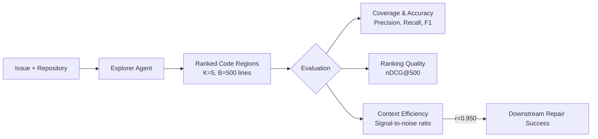
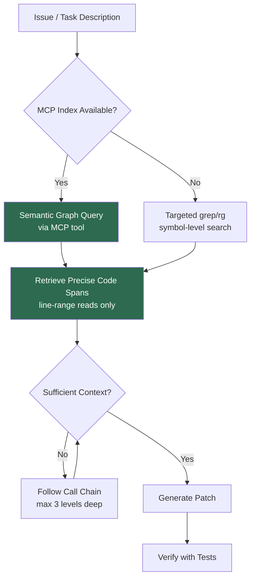

# SWE-Explore: What the Repository Exploration Benchmark Means for Codex CLI Search Strategy


---

Repository-level coding benchmarks like SWE-bench have driven rapid improvement in coding agents, but they treat tasks as binary — resolved or unresolved — and tell us nothing about *how* an agent finds the right code in the first place. SWE-Explore, published on 5 June 2026 by Zhang et al., isolates repository exploration as a standalone capability and benchmarks it across 848 issues, 203 repositories, and 10 programming languages [^1]. The results carry direct implications for how Codex CLI practitioners should configure search, structure AGENTS.md, and choose MCP-based indexing tools.

## Why Exploration Deserves Its Own Benchmark

Every coding agent follows roughly the same loop: explore the codebase, identify relevant code, then generate a patch. SWE-bench conflates all three stages into a single pass/fail metric. SWE-Explore decouples exploration by asking agents to return a ranked list of code regions under a fixed line budget (B=500 lines, K=5 regions), then scoring that list against ground-truth evidence extracted from independent successful solution trajectories [^1].

This matters because context efficiency — the fraction of lines an agent surfaces that actually contribute to solving the issue — correlates with downstream repair success at Pearson r=0.950 [^1]. In plain terms: the agent that wastes the fewest lines on irrelevant code is overwhelmingly likely to be the agent that fixes the bug.



## The Leaderboard: Where Codex CLI Stands

SWE-Explore tested general coding agents (Codex, Claude Code, OpenHands, Mini-SWE-Agent, AweAgent), specialised localisers (AutoCodeRover, LocAgent, OrcaLoca, CoSIL), and classical retrieval baselines (BM25, TF-IDF, Potion) [^1].

### Downstream Resolve Rates (Restricted-Context Validation)

| Agent | Resolve Rate |
|---|---|
| Oracle | 59.7% |
| CoSIL | 59.3% |
| Codex | 50.3% |
| Mini-SWE-Agent | 50.0% |
| Claude Code | 48.0% |
| OpenHands | 47.7% |
| OrcaLoca | 45.3% |
| AutoCodeRover | 44.7% |
| LocAgent | 44.7% |
| AweAgent | 41.3% |
| Random | 4.7% |

Codex's 50.3% resolve rate edges out Claude Code (48.0%) and OpenHands (47.7%), but the gap to CoSIL's 59.3% — only 0.4 points below the oracle ceiling — reveals that specialised localisation significantly outperforms general-purpose agents at the exploration stage [^1].

### File-Level vs Line-Level Performance

At the file level, agentic explorers perform well: HitFile@5 scores range from 0.640 to 0.682, dwarfing sparse retrievers at 0.079–0.140 [^1]. But line-level recall remains the bottleneck, with most agents managing only 0.14–0.19 [^1]. Agents find the right files but miss the specific code spans within them.

This is the exploration gap that Codex CLI users can address through configuration.

## Three Findings That Change Codex CLI Configuration

### 1. Context Efficiency Trumps Coverage Breadth

The paper's strongest finding is the near-perfect correlation between context efficiency and repair success (r=0.950) [^1]. Dumping entire files into context is actively harmful — it exhausts the line budget with noise.

For Codex CLI, this translates to disciplined shell output and targeted search patterns in AGENTS.md:

```toml
# codex.toml — enforce compact output
[model]
reasoning_effort = "high"

[sandbox]
max_output_lines = 200
```

```markdown
<!-- AGENTS.md — exploration discipline -->
## Search Strategy

When exploring this repository:
1. Use `grep -rn` with specific symbol names, never broad patterns
2. Read only the function/class containing the match, not the entire file
3. Prefer language-server symbol lookup over file-level grep when available
4. Stop exploring once you have identified the entry point AND its direct dependencies
5. Never cat entire files — use line-range reads (e.g., `sed -n '50,80p'`)
```

### 2. Multi-Step Exploration Beats One-Shot Retrieval

Classical retrieval (BM25, TF-IDF) scored file-level hit rates of just 0.079–0.140, compared to 0.640–0.682 for agentic explorers [^1]. The paper concludes that "multi-step interaction with the repository is already necessary" [^1]. One-shot embedding lookups cannot replace iterative, tool-using exploration.

This validates Codex CLI's agent loop architecture but also highlights the cost: each exploration step consumes tokens. The practical trade-off is controlling exploration depth without cutting it short:

```markdown
<!-- AGENTS.md — exploration budget -->
## Exploration Budget

For bug fixes: explore up to 3 levels of call-chain depth before proposing a fix.
For feature additions: map the module boundary first, then explore internal implementation.
If you have not found relevant code after 5 search iterations, summarise what you've found and ask for guidance.
```

### 3. Specialised Localisers Close the Gap to Oracle

CoSIL's 59.3% resolve rate — within 0.4 points of the oracle — demonstrates that dedicated code localisation dramatically outperforms general exploration [^1]. For Codex CLI users, this points to MCP-based indexing tools as force multipliers.

Several open-source MCP servers now provide exactly this specialised localisation layer:

- **codebase-memory-mcp** indexes repositories into persistent knowledge graphs using tree-sitter, supporting 158 languages with sub-millisecond queries and ~120x fewer tokens than raw file reads [^2]
- **CocoIndex Code** provides AST-based semantic search with 70% fewer tokens per turn and 80–90% cache hit rates on re-index [^3]
- **Code Context Engine** combines vector and keyword search via MCP, letting agents search semantic chunks rather than reading entire files [^4]

Configuring one of these as an MCP server in Codex CLI bridges the gap between general-purpose exploration (50.3%) and specialised localisation (59.3%):

```toml
# codex.toml — add a code-intelligence MCP server
[[mcp]]
name = "codebase-memory"
command = "codebase-memory-mcp"
args = ["--repo", "."]
```

```markdown
<!-- AGENTS.md — prefer indexed search -->
## Code Navigation

This project has a codebase-memory MCP server configured.
When searching for code:
1. FIRST use the `query_graph` tool to find relevant symbols and their relationships
2. ONLY fall back to grep if the graph query returns no results
3. Use `get_context` to retrieve precise code spans rather than reading full files
```

## The Exploration-Efficiency Pipeline

Combining SWE-Explore's three findings into a coherent Codex CLI configuration produces a layered exploration pipeline:



The key insight from SWE-Explore is that this pipeline's value comes not from finding *more* code but from finding *less irrelevant* code. Context efficiency at r=0.950 is the strongest predictor the paper measured.

## Line-Level Recall: The Remaining Bottleneck

Even the best agents achieve only 0.14–0.19 line-level recall [^1]. They locate the right file but overshoot or undershoot the specific lines that matter. This has two practical implications for Codex CLI:

**First**, AGENTS.md should include structural hints about where logic concentrates in the codebase:

```markdown
## Repository Structure

- Business logic lives in `src/domain/` — each file exports a single aggregate
- Database queries are in `src/infrastructure/repositories/` — never in domain files
- API validation happens in `src/api/validators/` — controllers delegate to these
- Test fixtures are co-located with tests in `__fixtures__/` directories
```

These hints act as a localisation prior, biasing the agent towards high-probability regions before it runs any search.

**Second**, PostToolUse hooks can enforce line-level discipline by rejecting overly broad reads:

```toml
# codex.toml — reject full-file reads in exploration phase
[[hooks.post_tool_use]]
event = "file_read"
command = "python3 scripts/check-read-span.py"
# Fails if more than 100 lines were read in a single operation
```

## Implications for Model Selection

SWE-Explore's results show general-purpose agents clustering between 41.3% and 50.3%, with specialised localisers pulling ahead to 59.3% [^1]. This suggests that for large, unfamiliar codebases, the exploration stage benefits more from better tooling (MCP indexers) than from a more capable model. A mid-tier model with a knowledge graph MCP server may outperform a frontier model navigating with grep alone.

For Codex CLI's model selection, this means:

```toml
# codex.toml — exploration-optimised profile
[profiles.explore]
model = "o4-mini"  # Cheaper model for exploration-heavy tasks
reasoning_effort = "medium"

[profiles.patch]
model = "o3"  # Frontier model for the actual repair
reasoning_effort = "high"
```

⚠️ Whether this two-model strategy yields consistent gains in practice has not been independently validated; the SWE-Explore paper tested single-model configurations only.

## Comparison with Prior Benchmarks

| Benchmark | Focus | Codex CLI Relevance |
|---|---|---|
| SWE-bench [^5] | End-to-end resolve rate | Overall agent capability |
| SWE-Explore [^1] | Exploration quality | Search/navigation configuration |
| SWE-EVO [^6] | Long-horizon evolution | Session management, multi-file changes |
| KiloBench [^7] | Cost per task | Token budget, model selection |

SWE-Explore fills a gap the others leave open: it tells you *why* your agent fails before it ever generates a patch. If your Codex CLI sessions frequently stall during exploration — characterised by repeated grep calls returning hundreds of matches, or full-file reads followed by backtracking — the benchmark's metrics provide a diagnostic framework.

## Practical Checklist

For Codex CLI users wanting to apply SWE-Explore's findings immediately:

1. **Audit your AGENTS.md** for structural hints — repository maps, module boundaries, and naming conventions reduce exploration steps
2. **Add an MCP indexing server** — codebase-memory-mcp, CocoIndex Code, or Code Context Engine all provide the specialised localisation that general agents lack
3. **Enforce line-range reads** — configure hooks or AGENTS.md instructions that prevent full-file reads during exploration
4. **Set exploration budgets** — cap search iterations in AGENTS.md to prevent unbounded context accumulation
5. **Monitor context efficiency** — track the ratio of useful-to-total lines in agent sessions; the closer to 1.0, the better your exploration configuration

## Citations

[^1]: Zhang, S. et al. (2026). *SWE-Explore: Benchmarking How Coding Agents Explore Repositories*. arXiv:2606.07297. [https://arxiv.org/abs/2606.07297](https://arxiv.org/abs/2606.07297)

[^2]: DeusData. (2026). *codebase-memory-mcp: High-performance code intelligence MCP server*. GitHub. [https://github.com/DeusData/codebase-memory-mcp](https://github.com/DeusData/codebase-memory-mcp)

[^3]: CocoIndex. (2026). *CocoIndex Code: AST-based semantic code search*. [https://cocoindex.io/cocoindex-code/](https://cocoindex.io/cocoindex-code/)

[^4]: Elara Labs. (2026). *Code Context Engine: Save 94% on AI Coding Tokens*. [https://elara-labs.github.io/code-context-engine/](https://elara-labs.github.io/code-context-engine/)

[^5]: Jimenez, C. E. et al. (2024). *SWE-bench: Can Language Models Resolve Real-World GitHub Issues?*. ICLR 2024. [https://www.swebench.com/](https://www.swebench.com/)

[^6]: Chen, J. et al. (2025). *SWE-EVO: Benchmarking Coding Agents in Long-Horizon Software Evolution Scenarios*. arXiv:2512.18470. [https://arxiv.org/abs/2512.18470](https://arxiv.org/abs/2512.18470)

[^7]: ⚠️ KiloBench referenced from prior coverage in this knowledge base; original paper URL not independently re-verified for this article.
